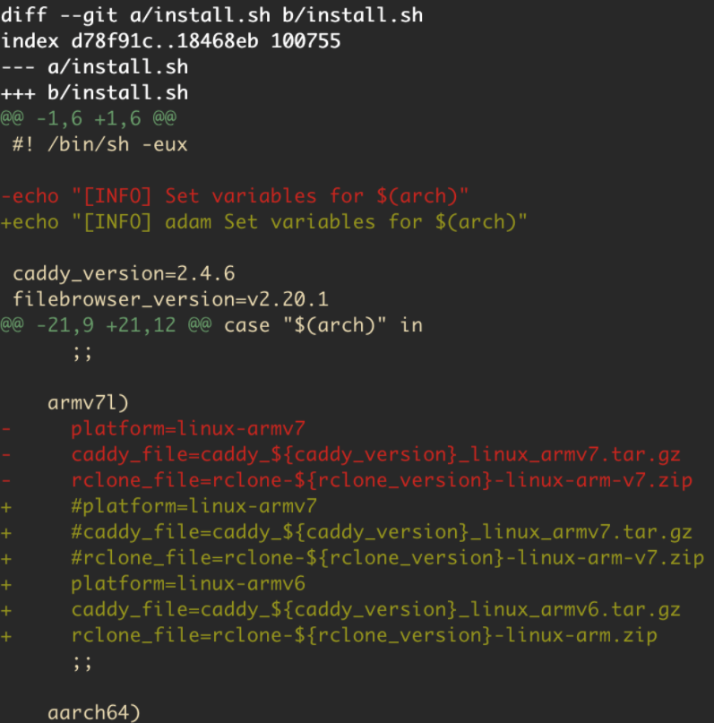

# aria2-ui编译armv6版本

我的树莓派是armv6l的cpu，需要编译出来

```bash
docker buildx build  \
  --platform=linux/arm/v6 \
  --build-arg http_proxy=http://proxy.iefcu.cn:20172 \
  --build-arg https_proxy=http://10.20.3.29:20172 \
  -t hub.iefcu.cn/xiaoyun/aria2-ui:armv6 . --push \
```


源码：
https://github.com/wahyd4/aria2-ariang-docker

a8db9193f813b780681c9322f70352e4e220b61e

源码改动点如下：



运行时，
max-upload-limit
dir=/data
file-allocation=prealloc
disable-ipv6=true
/var/log/aria2.log
Ok，不会segment

```bash
podman run -d --name aria2-ui2 \
  -p 80:80 \
  --env ENABLE_RCLONE=false \
  -v /data/aria2-data/:/data \
  localhost/aria2-ui
```