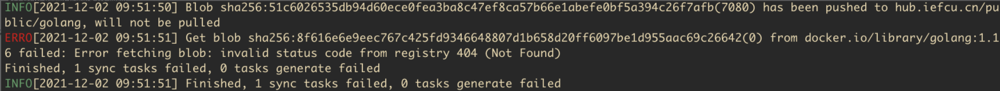

# docker多架构镜像编译方法

## buildx一键构建

## manifest合并方法

分别在x86, arm64上构建镜像，并上传镜像仓库，然后再合并manifest
(XXX:需要高版本的docker才支持manifest功能)

参考: https://github.com/lwolf/docker-multiarch/blob/master/heketi/build.sh

例如golang 1.16镜像manifest的创建，直接同步manifest失败，所以使用这种方式。
(需要先构建并上传xxx-amd64和xxx-arm64的镜像)



```bash
DOCKER_REPO=hub.iefcu.cn/public/golang
VERSION=1.16

docker manifest create --amend \
    ${DOCKER_REPO}:${VERSION} \
    ${DOCKER_REPO}:${VERSION}-amd64 \
    ${DOCKER_REPO}:${VERSION}-arm64

for OS_ARCH in linux_amd64 linux_arm64
do
    ARCH=${OS_ARCH#*_}
    OS=${OS_ARCH%%_*}

    docker manifest annotate \
        ${DOCKER_REPO}:${VERSION} \
        ${DOCKER_REPO}:${VERSION}-${ARCH} \
        --os ${OS} --arch ${ARCH}

done

docker manifest push ${DOCKER_REPO}:${VERSION}
```