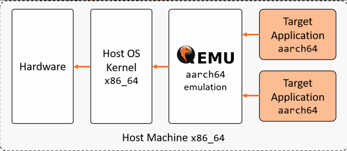
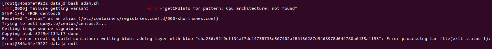

# docker多架构镜像编译方法

## buildx一键构建

### 原理架构

x86机器运行arm64程序


### ubuntu 20.04使用buildx编译构建多架构镜像

ubuntu对docker buildx多架构编译支持比较好，目前我在ubuntu x86机器下构建了不少arm64架构的镜像。

#### 前提条件

* 安装ubuntu 20.04
* 安装最新版本docker


#### 安装配置buildx
关键字《docker buildx gcc did not complete successfully: exit code: 1》

参考： https://github.com/docker/buildx/issues/138

* 1.ubuntu 20.04开启qemu-user-static

```bash
sudo apt-get install qemu-user-static
systemctl status binfmt-support
```

* 2.创建buildx多架构构建器

```bash
# create the builder
docker buildx create  --name test --platform linux/amd64,linux/arm64

# start the buildx
docker buildx inspect test --bootstrap

# set current buidler instance
docker buildx use test

# 列举buildx构建器
docker buildx ls
```

* 3.构建arm64镜像

```bash
# build the multi images
docker buildx build \
  --platform linux/arm64 \
  -t hub.iefcu.cn/public/centos8:1.5 . --load
```

参数解析
* -t 指定编译出来的镜像名称
* --platform 指定编译arm64架构的镜像
* --load 编译出来的镜像保存到docker本地镜像中
* --push 编译出来的镜像push到远端镜像仓库中

## docker运行arm64 podman编译arm64镜像（验证失败）

x86机器运行docker服务，然后通过qemu-user-static运行arm64 podman容器，然后再这个容器里面构建arm64容器镜像，验证暂时失败。

```bash
docker run -it --name podman-arm64 --privileged \
  -v $PWD:/data -w /data \
  hub.iefcu.cn/public/podman-arm64 bash
```



## manifest合并方法

分别在x86, arm64上构建镜像，并上传镜像仓库，然后再合并manifest
(XXX:需要高版本的docker才支持manifest功能)

参考: https://github.com/lwolf/docker-multiarch/blob/master/heketi/build.sh

例如golang 1.16镜像manifest的创建，直接同步manifest失败，所以使用这种方式。
(需要先构建并上传xxx-amd64和xxx-arm64的镜像)


```bash
DOCKER_REPO=hub.iefcu.cn/public/golang
VERSION=1.16

docker manifest create --amend \
    ${DOCKER_REPO}:${VERSION} \
    ${DOCKER_REPO}:${VERSION}-amd64 \
    ${DOCKER_REPO}:${VERSION}-arm64

for OS_ARCH in linux_amd64 linux_arm64
do
    ARCH=${OS_ARCH#*_}
    OS=${OS_ARCH%%_*}

    docker manifest annotate \
        ${DOCKER_REPO}:${VERSION} \
        ${DOCKER_REPO}:${VERSION}-${ARCH} \
        --os ${OS} --arch ${ARCH}

done

docker manifest push ${DOCKER_REPO}:${VERSION}
```
