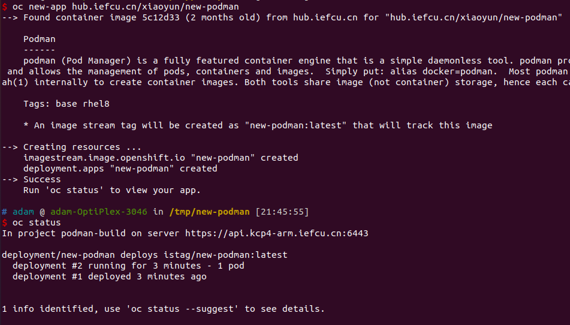

# 使用podman镜像编译构建镜像

## 1. 首先构建一个podman daemon镜像, 就是sleep

创建Dockerfile内容如下
```dockerfile
# FROM registry.redhat.io/rhel8/podman
FROM hub.iefcu.cn/public/podman
RUN yum makecache && yum install -y git && yum clean all
CMD ["/bin/bash", "-c", "sleep infinity"]
```

构建一个new-podman镜像
```bash
docker build -t hub.iefcu.cn/xiaoyun/new-podman .
```

或者构建多架构new-podman镜像
```bash
docker buildx build \
	--platform=linux/arm64,linux/amd64 \
	-t hub.iefcu.cn/xiaoyun/new-podman . --push
```

## 2. 然后部署这个podman镜像为一个应用

使用CLI部署这个podman镜像
```bash
oc new-project podman-build
# 给anyuid权限, 以及privileged权限
oc adm policy add-scc-to-user anyuid -n podman-build -z default
oc adm policy add-scc-to-user privileged -n podman-build -z default
oc new-app hub.iefcu.cn/xiaoyun/new-podman
```



## 3. 最后在这个podman容器里面进行构建镜像

```
oc rsh xxx
# 然后执行podman进行编译?
```
