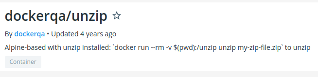
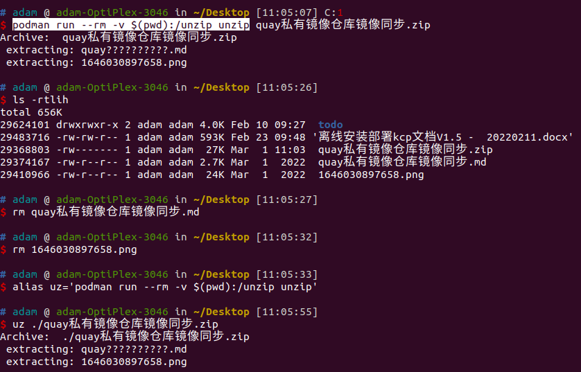
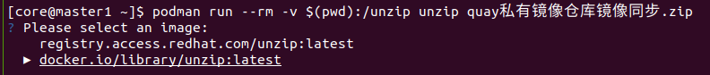

# 使用容器unzip解压文件

## 使用方法

```bash
podman run --rm -v $(pwd):/unzip unzip quay私有镜像仓库镜像同步.zip
alias uz='podman run --rm -v $(pwd):/unzip unzip'
uz ./quay私有镜像仓库镜像同步.zip

# 需要注意的是，在selinux环境下，要配置selinux
podman run --rm -v $(pwd):/unzip:Z unzip quay私有镜像仓库镜像同步.zip
```




这个命令没有指定镜像，到底用的是哪个镜像呢？



## 构建unzip镜像方法

创建Dockerfile, 内容如下

```dockerfile
#FROM alpine:latest
FROM hub.iefcu.cn/public/alpine:latest

RUN apk --no-cache add unzip

WORKDIR /unzip

#CMD ["unzip"]
ENTRYPOINT ["unzip"]
```

```bash
# 使用docker buildx构建多架构镜像
docker buildx build \
    --build-arg http_proxy=http://proxy.iefcu.cn:20172 \
    --build-arg https_proxy=http://proxy.iefcu.cn:20172 \
    --build-arg no_proxy=yumrepo.unikylin.com.cn,192.0.0.0/8 \
    --platform=linux/arm64,linux/amd64,linux/arm/v6 \
    -t hub.iefcu.cn/xiaoyun/unzip . --push

# 或者使用docker直接构建
docker build \
    --build-arg http_proxy=http://proxy.iefcu.cn:20172 \
    --build-arg https_proxy=http://proxy.iefcu.cn:20172 \
    --build-arg no_proxy=yumrepo.unikylin.com.cn,192.0.0.0/8 \
    -t hub.iefcu.cn/xiaoyun/unzip .
```

## 7zip分段压缩

https://www.cnblogs.com/ritte/p/11783020.html

```
7z a name.7z filename -v10m

7z e data.7z   #不保持目录结构
7z x data2.7z  #保持目录结构
# 分段的只需要指定第一个就行了
```

rar
```
rar a -v10m 压缩包文件名 要压缩的文件
这里的是限制一个文件大小为10m，然后进行分块压缩

解压的话直接
rar e 压缩包文件名.part1
```

tar
```
tar cf - xxx | split -b 2000m -
```

split 分片, 例如平均分3片, 以数字结尾, 取xxx前缀名称
```
cat xxx | split -n 3 -d
split -n 3 -d xxx xxx-
```

## unzip中文乱码


[Linux下使用unzip解压缩中文乱码问题](https://blog.csdn.net/gatieme/article/details/44807105)

使用python来处理
```python
#!/usr/bin/env python
# -*- coding: utf-8 -*-
# uzip.py

import os
import sys
import zipfile

print "Processing File " + sys.argv[1]

file=zipfile.ZipFile(sys.argv[1],"r");
for name in file.namelist():
    utf8name=name.decode('gbk')
    print "Extracting " + utf8name
    pathname = os.path.dirname(utf8name)
    if not os.path.exists(pathname) and pathname!= "":
        os.makedirs(pathname)
    data = file.read(name)
    if not os.path.exists(utf8name):
        fo = open(utf8name, "w")
        fo.write(data)
        fo.close
file.close()
```
