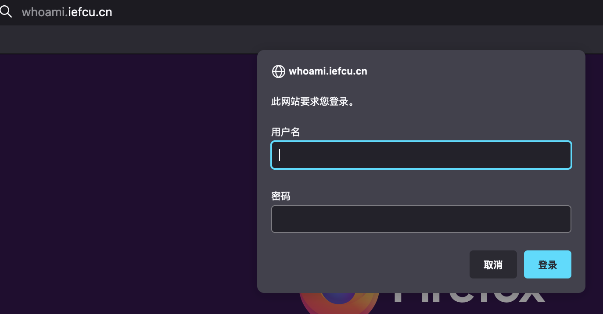
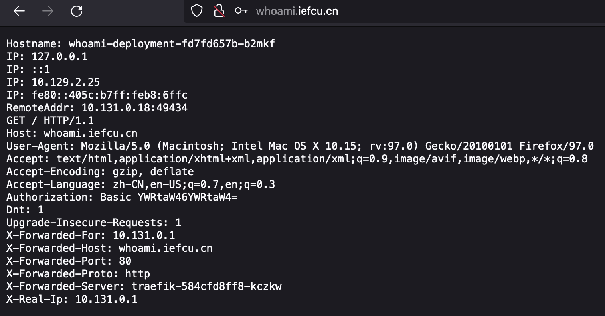
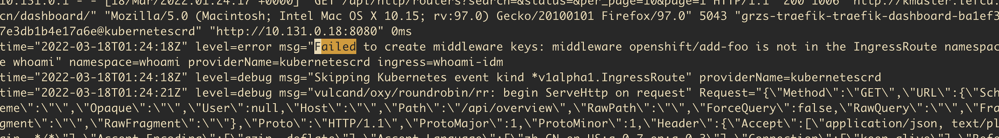
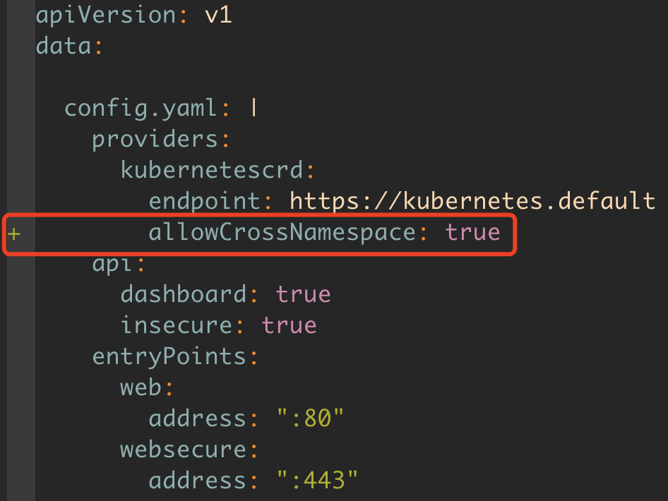
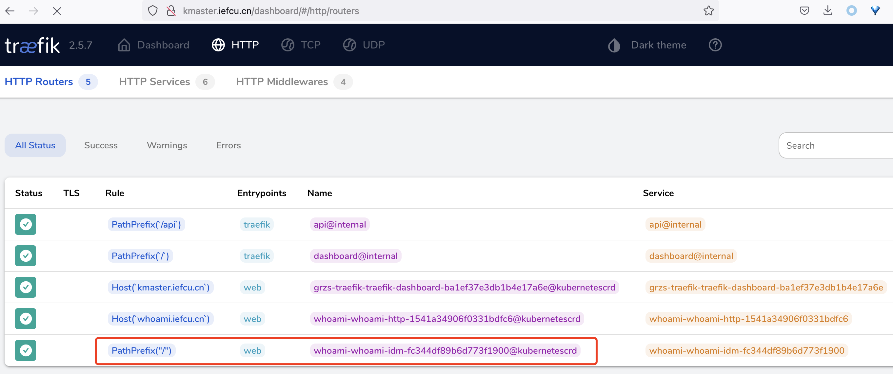

# traefik使用whoami配置基本middleware认证

需要先安装traefik，请参考其他资料

## 部署whoami应用

准备工作
```bash
oc new-project whoami
oc adm policy add-scc-to-user anyuid -n whoami -z default
```

部署whoami
```yaml
apiVersion: v1
kind: Service
metadata:
  name: whoami
spec:
  ports:
    - port: 80
      targetPort: 80
  selector:
    app: whoami
---
apiVersion: apps/v1
kind: Deployment
metadata:
  name: whoami-deployment
spec:
  replicas: 2
  selector:
    matchLabels:
      app: whoami
  template:
    metadata:
      labels:
        app: whoami
    spec:
      containers:
      - name: whoami
        #image: containous/whoami
        image: hub.iefcu.cn/public/containous-whoami
        ports:
        - containerPort: 80
```

## 配置base auth认证

创建基本认证数据
```
# 新增admin用户
htpasswd -bc basic-auth-secret admin admin

admin:$apr1$eMTB837X$BOu6zRCJ2q/4/H9vsG/5/0
```

创建secret
```
oc -n whoami create secret generic basic-auth --from-file=basic-auth-secret
```

创建中间件
```yaml
# Declaring the user list
apiVersion: traefik.containo.us/v1alpha1
kind: Middleware
metadata:
  name: whoami-auth
  namespace: whoami
spec:
  basicAuth:
    secret: basic-auth
```

## 创建ingressRoute

```yaml
apiVersion: traefik.containo.us/v1alpha1
kind: IngressRoute
metadata:
  name: whoami-http
  namespace: whoami
spec:
  entryPoints:
    - web
  routes:
    - match: Host(`whoami.iefcu.cn`)
      kind: Rule
      services:
        - name: whoami
          port: 80
      middlewares:
        - name: whoami-auth
          namespace: whoami
```

## 效果展示



登录成功，可以访问应用



## ingress使用其他namespace的middleware

关键字《traefik ingressroute use middleware in other namespaces》
《traefik middleware different namespace》

找到相应解决方法，配置全局参数 providers.kubernetescrd.allowCrossNamespace=true

以下来测试和验证这个过程， 最终jit他们需要配置add-prefix，跨域和身份认证的middleware

#### 配置add-prefix middleware

参考 https://doc.traefik.io/traefik/middlewares/http/addprefix/
```yaml
# Prefixing with /foo
apiVersion: traefik.containo.us/v1alpha1
kind: Middleware
metadata:
  name: add-foo
  namespace: openshift
spec:
  addPrefix:
    prefix: /foo
```

#### 配置ingressroute使用middleware

```yaml
apiVersion: traefik.containo.us/v1alpha1
kind: IngressRoute
metadata:
  name: whoami-idm
  namespace: whoami
spec:
  entryPoints:
    - web
  routes:
    - match: PathPrefix("/")
      kind: Rule
      services:
        - name: whoami
          port: 80
      middlewares:
        - name: add-foo
          namespace: openshift
```

结果查看traefik日志，发现创建ingressroute报错:

time="2021-09-13T16:23:16Z" level=error msg="Failed to create middleware keys: middleware traefik-2/redirect-to-https-temp is not in the IngressRoute namespace registry" ingress=app-public-http namespace=registry providerName=kubernetescrd



#### 更新traefik全局配置

参考 https://doc.traefik.io/traefik/v2.5/providers/kubernetes-crd/#allowcrossnamespace

修改了traefik启动configmap配置文件 /etc/traefik/config.yaml
添加参数 allowCrossNamespace: true

具体如何更新traefik的configmap配置，参考其他文档。


#### 效果展示

最后能够在traefik dashboard上看到这个ingressroute成功创建了。


## 参考资料

* [TRAEFIK的INGRESS用法和INGRESSROUTE用法](https://www.teanote.pub/archives/238)
