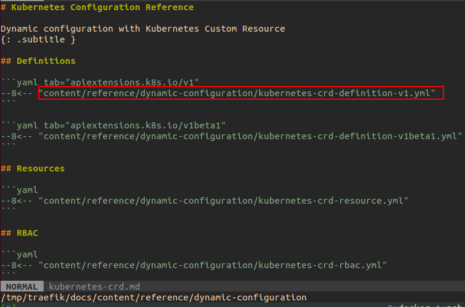
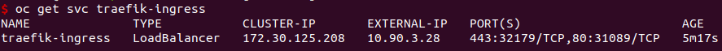
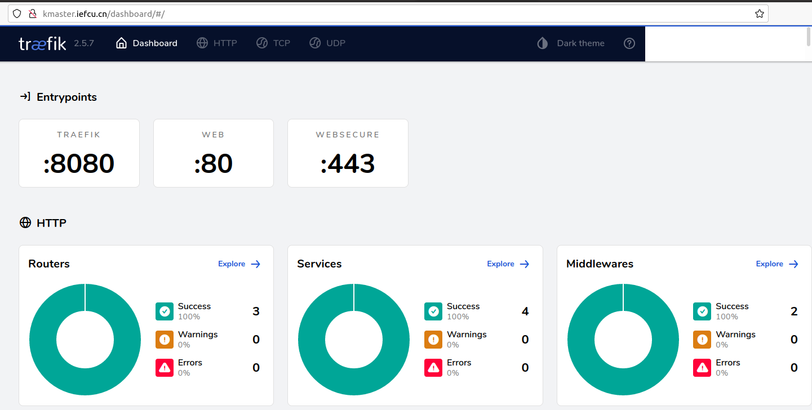

# openshift安装部署traefik

## 安装部署traefik

有traefik operator，但是目前不用，先手动通过yaml部署traefik

#### 同步traefik镜像

目前我使用[image-syncer](https://github.com/AliyunContainerService/image-syncer)这个工具来同步镜像

```bash
cat > image-sync.json << EOF
{
    "hub.iefcu.cn": {
        "username": "xiaoyun",
        "password": "TODO:passwd"
    }
}
EOF

cat > image-sync-list.json << EOF
{
"hub.iefcu.cn/library/traefik:v2.5": "hub.iefcu.cn/public/traefik"
}
EOF 
    
image-syncer --proc=6 --auth=./image-sync.json --images=./image-sync-list.json \
  --namespace=public --registry=hub.iefcu.cn --retries=3
```

也可以使用一行命令简单同步镜像

```bash
skopeo --override-arch arm64 copy \
  docker://docker.io/traefik:v2.5 \
  docker://hub.iefcu.cn/public/traefik:v2.5-arm64
```

#### 首先安装traefik CRD

计划使用版本v2.5

```bash
# traefik-crd.yaml要自己生成!!! 
# https://github.com/traefik/traefik/
oc apply -f traefik-crd.yaml
```

traefik yaml官方文档配置
https://doc.traefik.io/traefik/reference/dynamic-configuration/kubernetes-crd/


#### 然后安装traefik部署svc等配置

```bash
oc apply -f traefik2.5.yaml
# 给grzs-traefik项目的traefik服务帐号anyuid权限
oc adm policy add-scc-to-user anyuid -n grzs-traefik -z traefik
```

#### 最后配置一下traefik管理页面的IngressRoute使用

```bash
cat << EOF | oc apply -f -
apiVersion: traefik.containo.us/v1alpha1
kind: IngressRoute
metadata:
  name: traefik-dashboard
  namespace: grzs-traefik
spec:
  entryPoints:
    - web
  routes:
  - match: Host(`kmaster.iefcu.cn`)
    kind: Rule
    services:
    - name: traefik-admin
      port: 8080
EOF
```

先手动配置ip域名映射，就可以访问

（前提条件，配置traefik-ingress这个服务使用负载均衡浮动ip，可以使用metallb）






## 参考文档

* https://doc.traefik.io/traefik/getting-started/install-traefik/

* [通过 Traefik 使用 Kubernetes Service APIs 进行流量路由 (http,https,金丝雀发布)](https://www.1024sou.com/article/604750.html)
