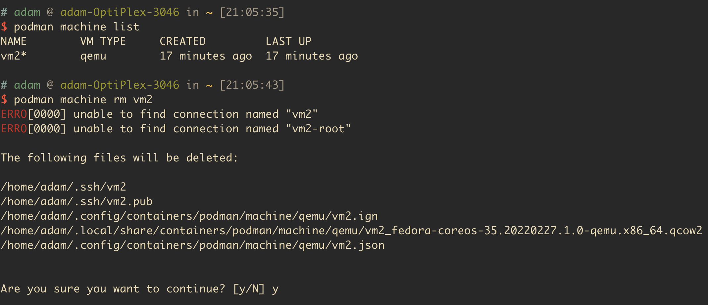

# 20220311星期五

安装es集群有问题，一直卡着。后来发现是monitor接口有问题

unable to create new content in namespace ingress-nginx because it is being terminated

Unable to retrieve the complete list of server APIs: metrics.k8s.io/v1beta1 

21环境镜像有点问题，修复。
  -> openshift-monitor中有一个pod image pull error
     oc get pods -n openshift-monitoring
  -> machine-config clusteroperator不正常，暂没修复
     oc describe clusteroperator machine-config

# 20220310星期四

* 31安装好，确认。41不着急
  => 已装好，后续还有事情要处理
    kylin-logo
    registry, dns

* ES集群安装
* 监控页面更新 => 简单，已更新
  => 最新监控容器镜像id是 registry.kcp.local:5000/kcp/openshift4-aarch64@sha256:19e748566d666b786b919714ec66f4b16fc1d6d1c37d0a11a4aebb6e2c2f9b23
* promethues？


curl => curl
cmake => cmake
mysql-client => mysql-devel mariadb-devel


https://blog.crazytaxii.com/posts/openshift_router/

```
 # if the connection is SNI and the route is a passthrough don't use the termination backend, just use the tcp backend
  # for the SNI case, we also need to compare it in case-insensitive mode (by converting it to lowercase) as RFC 4343 says
  acl sni req.ssl_sni -m found
  acl sni_passthrough req.ssl_sni,lower,map_reg(/var/lib/haproxy/conf/os_sni_passthrough.map) -m found
  use_backend %[req.ssl_sni,lower,map_reg(/var/lib/haproxy/conf/os_tcp_be.map)] if sni sni_passthrough

  # if the route is SNI and NOT passthrough enter the termination flow
  use_backend be_sni if sni

  # non SNI requests should enter a default termination backend rather than the custom cert SNI backend since it
  # will not be able to match a cert to an SNI host
  default_backend be_no_sni
```


# 20220309星期三

brew install ag ，使用ag进行搜索，可以过滤掉.gitignore的文件

* 修改21的ip地址
* 修改dns怎么即时生效
  => 修改/etc/resolv.conf配置文件
  => 重启openshift-dns中的dns容器
     => 如何重启，可以修改daemonset环境变量？

# 20220308星期二

TODO:
haproxy指定容器运行。
如何在Openshift中让Router Pod独占Router节点
https://www.jianshu.com/p/9fc2f34966ce

关键字《ingress.config.openshift.io/cluster 修改》
https://access.redhat.com/documentation/zh-cn/openshift_container_platform/4.4/html/networking/nw-ingress-controller-configuration-parameters_configuring-ingress

nodePlacement 启用对 Ingress 控制器调度的明确控制。
```yaml
nodePlacement:
 nodeSelector:
   matchLabels:
     beta.kubernetes.io/os: linux
 tolerations:
 - effect: NoSchedule
   operator: Exists
```

Openshift 4 infra node setup best practices
https://chowdera.com/2021/04/20210416155434157y.html


后续自动化部署。李野光提出来的。
nextcloud部署，配置使用存储卷

修正0308的计划
* 31安装收尾
  得花上一点时间
* 修复24
* registry镜像等安装
* crio-wipe处理
* gbase数据库 => 不用管了
* promethues和redis确认。


# 20220307星期一

https://access.redhat.com/documentation/zh-cn/openshift_container_platform/4.9/html/virtualization/installing-virt-web

openshift+虚拟机？

直接使用podman machine init vm2 创建虚拟机，缺少qemu二进制程序


或者安装virt-manager相关组件？

或者virt-manager相关容器镜像？

## 计划

#### 0307
* 修复31 => ok
  简单修复，使用livecd修改一下grub参数配置就行，使用second.sh脚本
  => second.sh脚本需要略做修改，删除一点内容。
* 尝试一下使用kylin coreos？
* 修复24
  导入registry, 自己恢复。
* 考虑研究一下数据库安装
* 处理一下241的dns服务
  => 21上安装了一个dns服务。
* crio-wipe服务修正，不清理镜像。

#### 需要准备的材料

1. docker镜像
* arm64 dnsmasq, haproxy, registry, keepalived镜像
* x86 同上？ => 不需要

2. 镜像数据
额外就带一个就行。今天不带也行

3. second.sh脚本

4. 文档?
打包adamxiao目录即可
* crio文档
* 安装部署文档
* dns内置文档


#### 0308
* 数据库服务部署配合
* promethues, redis确认

#### 0309

* 监控问题
* 修改ip地址


## 罗列需要处理的问题

* 恢复服务器31，24
  31就是上次安装unzip rpm包grub出错起不来了；
  24就是之前镜像丢失了，需要处理一下；
  确定是否找个人跟一下，学习一下解决这中问题的方法？
* 241的dns服务
  把dns服务合到云平台里面去
* 装虚拟机，装数据库，或者在实体机上安装数据库。 =》 41， 31
  31和41都是一个单master的节点。
  =》了解一下数据库是怎么安装的。
  现在暂时为了节省机器，想要把数据库服务安装到master节点上去。
  今天数据库厂商的人到，明天约。
* promethues 
  跟苗确认一下怎么用
* redis， 苗
  redis集群
* 修改ip地址。
  后续他们要调整一下ip地址
* 问题解决，监控，升级，跨域
  之前他们提的监控问题等。


## 其他自己

* 沟通需求
* ES集群

* kylin coreos安装
* MetalLB operator
