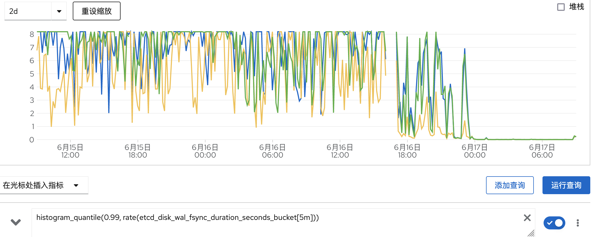

# etcd使用入门

## 入门使用

```bash
etcdctl endpoint status -w table
```

问题: etcd member list 和endpoint的区别?
```
[root@master1 /]# etcdctl member list -w table
+------------------+---------+--------------------+-------------------------+-------------------------+------------+
|        ID        | STATUS  |        NAME        |       PEER ADDRS        |      CLIENT ADDRS       | IS LEARNER |
+------------------+---------+--------------------+-------------------------+-------------------------+------------+
| 141adac8c067b6dd | started | master1.kcp.xxx.cn | https://10.90.4.98:2380 | https://10.90.4.98:2379 |      false |
| 63b75c3d731594fc | started |     etcd-bootstrap | https://10.90.4.97:2380 | https://10.90.4.97:2379 |      false |
+------------------+---------+--------------------+-------------------------+-------------------------+------------+
[root@master1 /]# etcdctl endpoint status -w table
+-------------------------+------------------+---------+---------+-----------+------------+-----------+------------+--------------------+--------+
|        ENDPOINT         |        ID        | VERSION | DB SIZE | IS LEADER | IS LEARNER | RAFT TERM | RAFT INDEX | RAFT APPLIED INDEX | ERRORS |
+-------------------------+------------------+---------+---------+-----------+------------+-----------+------------+--------------------+--------+
| https://10.90.4.98:2379 | 141adac8c067b6dd |   3.5.0 |   40 MB |      true |      false |       113 |      47587 |              47587 |        |
+-------------------------+------------------+---------+---------+-----------+------------+-----------+------------+--------------------+--------+
```

原来使用环境变量控制endpoint的输出
```
ETCDCTL_ENDPOINTS=https://10.90.4.98:2379,https://10.90.4.97:2379 etcdctl endpoint status -w table
```

learner测试
```
# 增加一个节点作为learner
member add --learner

# 当learner的日志赶上了leader的进度时，将learner提升为有投票权的成员，然后该成员将计入法定人数
member promote

etcd server 会验证 promote 请求以确保真实
```

输出示例
```
etcdctl endpoint status -w table
{"level":"warn","ts":"2022-03-16T14:49:04.034Z","logger":"etcd-client","caller":"v3/retry_interceptor.go:62","msg":"retrying of unary invoker failed","target":"etcd-endpoints://0x40001568c0/#initially=[https://10.90.3.21:2379;https://10.90.3.22:2379;https://10.90.3.23:2379]","attempt":0,"error":"rpc error: code = DeadlineExceeded desc = latest balancer error: last connection error: connection error: desc = \"transport: Error while dialing dial tcp 10.90.3.21:2379: connect: connection refused\""}
Failed to get the status of endpoint https://10.90.3.21:2379 (context deadline exceeded)
+-------------------------+------------------+---------+---------+-----------+------------+-----------+------------+--------------------+-----------------------+
|        ENDPOINT         |        ID        | VERSION | DB SIZE | IS LEADER | IS LEARNER | RAFT TERM | RAFT INDEX | RAFT APPLIED INDEX |        ERRORS         |
+-------------------------+------------------+---------+---------+-----------+------------+-----------+------------+--------------------+-----------------------+
| https://10.90.3.22:2379 | 29df313a73c25e0f |   3.5.0 |  212 MB |      true |      false |       372 |   14085303 |           14085303 |                       |
| https://10.90.3.23:2379 | c418a034547ed46f |   3.5.0 |  212 MB |     false |      false |       372 |   14085303 |           14085303 | etcdserver: no leader |
+-------------------------+------------------+---------+---------+-----------+------------+-----------+------------+--------------------+-----------------------+
```

查询集群节点健康状态
etcdctl endpoint health

非健康状态
```
[root@master1 /]# etcdctl endpoint health
{"level":"warn","ts":1655360847.135724,"logger":"client","caller":"v3/retry_interceptor.go:62","msg":"retrying of unary invoker failed","target":"etcd-endpoints://0x40001e6000/#initially=[https://192.168.100.31:2379]","attempt":0,"error":"rpc error: code = DeadlineExceeded desc = context deadline exceeded"}
https://192.168.100.32:2379 is healthy: successfully committed proposal: took = 2.045380327s
https://192.168.100.33:2379 is healthy: successfully committed proposal: took = 2.641609222s
https://192.168.100.31:2379 is unhealthy: failed to commit proposal: context deadline exceeded
Error: unhealthy cluster
```

查询节点状态, 确实不正常
```
[root@master1 /]# etcdctl endpoint status -w table
+-----------------------------+------------------+---------+---------+-----------+------------+-----------+------------+--------------------+--------+
|          ENDPOINT           |        ID        | VERSION | DB SIZE | IS LEADER | IS LEARNER | RAFT TERM | RAFT INDEX | RAFT APPLIED INDEX | ERRORS |
+-----------------------------+------------------+---------+---------+-----------+------------+-----------+------------+--------------------+--------+
| https://192.168.100.31:2379 | 7ee5e324e63b7f43 |   3.5.0 |  191 MB |      true |      false |     12082 |   11034524 |           11034524 |        |
| https://192.168.100.32:2379 | 52f67964bdfdc9a6 |   3.5.0 |  191 MB |      true |      false |     12083 |   11034526 |           11034526 |        |
| https://192.168.100.33:2379 | 74c0cdf6be645384 |   3.5.0 |  193 MB |     false |      false |     12083 |   11034526 |           11034526 |        |
+-----------------------------+------------------+---------+---------+-----------+------------+-----------+------------+--------------------+--------+
```

过了一会儿，居然自己恢复了
```
[root@master1 /]# etcdctl endpoint status -w table
+-----------------------------+------------------+---------+---------+-----------+------------+-----------+------------+--------------------+--------+
|          ENDPOINT           |        ID        | VERSION | DB SIZE | IS LEADER | IS LEARNER | RAFT TERM | RAFT INDEX | RAFT APPLIED INDEX | ERRORS |
+-----------------------------+------------------+---------+---------+-----------+------------+-----------+------------+--------------------+--------+
| https://192.168.100.31:2379 | 7ee5e324e63b7f43 |   3.5.0 |  208 MB |      true |      false |     12131 |   11035905 |           11035905 |        |
| https://192.168.100.32:2379 | 52f67964bdfdc9a6 |   3.5.0 |  209 MB |     false |      false |     12131 |   11035905 |           11035905 |        |
| https://192.168.100.33:2379 | 74c0cdf6be645384 |   3.5.0 |  207 MB |     false |      false |     12131 |   11035905 |           11035905 |        |
+-----------------------------+------------------+---------+---------+-----------+------------+-----------+------------+--------------------+--------+
[root@master1 /]# etcdctl endpoint health
https://192.168.100.32:2379 is healthy: successfully committed proposal: took = 11.483591ms
https://192.168.100.33:2379 is healthy: successfully committed proposal: took = 13.441501ms
https://192.168.100.31:2379 is healthy: successfully committed proposal: took = 1.577794361s
```

=> etcd落盘太慢了！

https://kubernetes.io/docs/tasks/debug/debug-cluster/crictl/
查询etcd的日志，发现确实落盘太慢
crictl logs --tail=1 87d3992f84f74

关键字《etcd集群不健康》
https://chanjarster.github.io/post/slow-disk-etcd-troubleshooting/
docker logs --since '2021-04-26T16:00:00' --until '2021-04-26T16:30:00' etcd 2>&1 | less
存在大量落磁盘太慢的错误，以及请求超时的错误（etcd响应慢）。

同时根据 这篇文章 查询 wal_fsync 和 disk_commit 两个指标的P99值正常情况应该是在 25毫秒以内的。

查询wal_fsync，发现P99高达8秒：：
```
histogram_quantile(0.99, rate(etcd_disk_wal_fsync_duration_seconds_bucket[5m]))
```


可以测试磁盘IO， 发现也确实不快
```
fio -filename=/var/test.file -direct=1 \
 -iodepth 1 -thread -rw=write \
 -ioengine=psync -bs=16k -size=2G -numjobs=10 \
 -runtime=60 -group_reporting -name=test_w
```

#### 【深入浅出etcd系列】2. 心跳和选举

[【深入浅出etcd系列】2. 心跳和选举](https://bbs.huaweicloud.com/blogs/110887)

2. leader的任务：发送心跳
当集群已经产生了leader，则leader会在固定间隔内给所有节点发送心跳。其他节点收到心跳以后重置心跳等待时间，只要心跳等待不超时，follower的状态就不会改变。

etcd日志显示leader发送心跳失败！！！因为低速磁盘: overloaded likely from slow disk","
```
{"level":"warn","ts":"2022-08-30T09:19:17.672Z","caller":"wal/wal.go:802","msg":"slow fdatasync","took":"1.263337456s","expected-duration":"1s"}
{"level":"warn","ts":"2022-08-30T09:17:30.387Z","caller":"etcdserver/raft.go:369","msg":"leader failed to send out heartbeat on time; took too long, leader is overloaded likely from slow disk","to":"63b75c3d731594fc","heartbeat-interval":"100ms","expected-duration":"200ms","exceeded-duration":"61.150187ms"}
```

etcd显示太慢，切主: leader 63b75c3d731594fc at term 154
丢弃读请求: dropping index reading msg
```
{"level":"warn","ts":"2022-08-30T09:19:19.245Z","logger":"raft","caller":"etcdserver/zap_raft.go:85","msg":"141adac8c067b6dd stepped down to follower since quorum is not active"}
{"level":"info","ts":"2022-08-30T09:19:19.245Z","logger":"raft","caller":"etcdserver/zap_raft.go:77","msg":"141adac8c067b6dd became follower at term 152"}

{"level":"warn","ts":"2022-08-30T09:19:24.521Z","caller":"etcdserver/v3_server.go:815","msg":"waiting for ReadIndex response took too long, retrying","sent-request-id":13176832041700219758,"retry-timeout":"500ms"}
{"level":"info","ts":"2022-08-30T09:19:24.521Z","logger":"raft","caller":"etcdserver/zap_raft.go:77","msg":"141adac8c067b6dd no leader at term 153; dropping index reading msg"}
{"level":"info","ts":"2022-08-30T09:19:24.595Z","logger":"raft","caller":"etcdserver/zap_raft.go:77","msg":"141adac8c067b6dd [term: 153] received a MsgVote message with higher term from 63b75c3d731594fc [term: 154]"}
{"level":"info","ts":"2022-08-30T09:19:24.595Z","logger":"raft","caller":"etcdserver/zap_raft.go:77","msg":"141adac8c067b6dd became follower at term 154"}
{"level":"info","ts":"2022-08-30T09:19:24.595Z","logger":"raft","caller":"etcdserver/zap_raft.go:77","msg":"141adac8c067b6dd [logterm: 152, index: 48930, vote: 0] cast MsgVote for 63b75c3d731594fc [logterm: 152, index: 48930] at term 154"}
{"level":"warn","ts":"2022-08-30T09:19:25.021Z","caller":"etcdserver/v3_server.go:815","msg":"waiting for ReadIndex response took too long, retrying","sent-request-id":13176832041700219758,"retry-timeout":"500ms"}
{"level":"info","ts":"2022-08-30T09:19:25.021Z","logger":"raft","caller":"etcdserver/zap_raft.go:77","msg":"141adac8c067b6dd no leader at term 154; dropping index reading msg"}
{"level":"info","ts":"2022-08-30T09:19:25.273Z","logger":"raft","caller":"etcdserver/zap_raft.go:77","msg":"raft.node: 141adac8c067b6dd elected leader 63b75c3d731594fc at term 154"}
```

https://juejin.cn/post/7035179267918938119

## FAQ

#### failed to publish local member to cluster through raft

error: etcdserver: request timed out

最后发现是100M交换机，查看netstat -antp发现send-Q,recv-Q有问题

#### etcd坏了一个

```
oc[core@master1 ~]$ oc -n openshift-etcd get pods
NAME                                    READY   STATUS             RESTARTS          AGE
etcd-master1.kcp2-arm.iefcu.cn          4/4     Running            112 (3d20h ago)   72d
etcd-master2.kcp2-arm.iefcu.cn          4/4     Running            53 (3d20h ago)    72d
etcd-master3.kcp2-arm.iefcu.cn          3/4     CrashLoopBackOff   1787 (51s ago)    25s
```

```
{"level":"info","ts":"2022-08-30T03:04:44.183Z","caller":"embed/etcd.go:598","msg":"pprof is enabled","path":"/debug/pprof"}
{"level":"info","ts":"2022-08-30T03:04:44.184Z","caller":"embed/etcd.go:307","msg":"starting an etcd server","etcd-version":"3.5.0","git-sha":"GitNotFound","go-version":"go1.16.6","go-os":"linux","go-arch":"arm64","max-cpu-set":16,"max-cpu-available":16,"member-initialized":true,"name":"master3.kcp2-arm.iefcu.cn","data-dir":"/var/lib/etcd","wal-dir":"","wal-dir-dedicated":"","member-dir":"/var/lib/etcd/member","force-new-cluster":false,"heartbeat-interval":"100ms","election-timeout":"1s","initial-election-tick-advance":true,"snapshot-count":100000,"snapshot-catchup-entries":5000,"initial-advertise-peer-urls":["https://192.168.100.33:2380"],"listen-peer-urls":["https://0.0.0.0:2380"],"advertise-client-urls":["https://192.168.100.33:2379"],"listen-client-urls":["https://0.0.0.0:2379","unixs://192.168.100.33:0"],"listen-metrics-urls":["https://0.0.0.0:9978"],"cors":["*"],"host-whitelist":["*"],"initial-cluster":"","initial-cluster-state":"existing","initial-cluster-token":"","quota-size-bytes":8589934592,"pre-vote":true,"initial-corrupt-check":false,"corrupt-check-time-interval":"0s","auto-compaction-mode":"periodic","auto-compaction-retention":"0s","auto-compaction-interval":"0s","discovery-url":"","discovery-proxy":"","downgrade-check-interval":"5s"}
{"level":"warn","ts":1661828684.1843698,"caller":"fileutil/fileutil.go:57","msg":"check file permission","error":"directory \"/var/lib/etcd\" exist, but the permission is \"drwxr-xr-x\". The recommended permission is \"-rwx------\" to prevent possible unprivileged access to the data"}
panic: freepages: failed to get all reachable pages (page 4517: multiple references)

goroutine 78 [running]:
go.etcd.io/bbolt.(*DB).freepages.func2(0x400004e5a0)
        /remote-source/cachito-gomod-with-deps/deps/gomod/pkg/mod/go.etcd.io/bbolt@v1.3.6/db.go:1056 +0xc4
created by go.etcd.io/bbolt.(*DB).freepages
        /remote-source/cachito-gomod-with-deps/deps/gomod/pkg/mod/go.etcd.io/bbolt@v1.3.6/db.go:1054 +0x134
```

搜索发现还是移除不健康的节点，然后再回复把!
[Replacing an unhealthy etcd member](https://docs.openshift.com/container-platform/4.9/backup_and_restore/control_plane_backup_and_restore/replacing-unhealthy-etcd-member.html)

首先备份etcd数据库, 然后检查unhealthy节点
```
[core@master1 ~]$ oc get etcd -o=jsonpath='{range .items[0].status.conditions[?(@.type=="EtcdMembersAvailable")]}{.message}{"\n"}'
2 of 3 members are available, master3.kcp2-arm.iefcu.cn is unhealthy
```

目前发现etcd运行crash, 所以用如下方法修复
* 停止crash etcd pod
```
mkdir /var/lib/etcd-backup
mv /etc/kubernetes/manifests/etcd-pod.yaml /var/lib/etcd-backup/
# 移动数据到临时目录(最终要删除掉的)
mv /var/lib/etcd/ /tmp
```
* 移除非健康的etcd pod
```
oc -n openshift-etcd rsh etcd-master1.kcp2-arm.iefcu.cn
etcdctl member list -w table
etcdctl member remove 62bcf33650a7170a
# 移除相关secret
oc get secrets -n openshift-etcd | grep master3.kcp2-arm.iefcu.cn
```
* 强制etcd重新部署
```
oc patch etcd cluster -p='{"spec": {"forceRedeploymentReason": "single-master-recovery-'"$( date --rfc-3339=ns )"'"}}' --type=merge 
```

## 参考资料

* https://www.kubernetes.org.cn/7569.html
* [etcd 问题、调优、监控](http://www.xuyasong.com/?p=1983)

