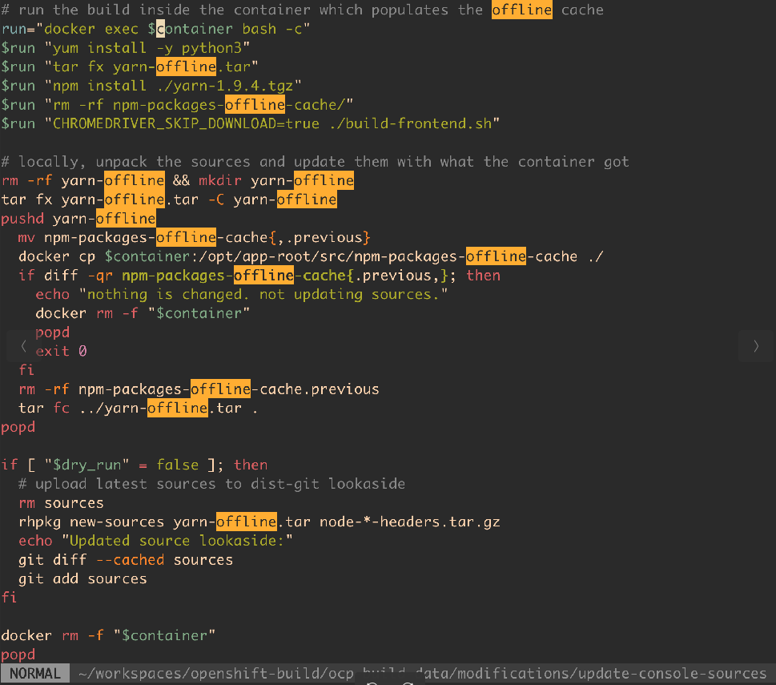

# console镜像构建方法

## 从源码一键构建镜像

console源码中有Dockerfile，但是都是基于外部的一些基础镜像，以及构建镜像，还有其他的一些依赖。
在我们的内网环境中无法正常构建，我修改了一部分逻辑，使得可以轻松构建。

基于源码 http://192.168.120.13/xiaoyun/kcp-console
(分支 test-build-release-4.9 )
我修改了如下文件

* M Dockerfile => 修改使用内部编译构建镜像，以及修正部分网络依赖逻辑
* M frontend/yarn.lock => 修改使用内部私有npm仓库源
* A node-v14.18.0-headers.tar.gz => 编译npm模块需要
* M build-frontend.sh  => yarn install --network-timeout 1000000 (网络磁盘慢导致yarn install总失败)

编译构建console镜像，只需要一行命令即可

```bash
git clone -b test-build-release-4.9 http://192.168.120.13/xiaoyun/kcp-console
cd kcp-console

docker build -t hub.iefcu.cn/xiaoyun/xiaoyun-console:20220301 .
```

修改逻辑，主要是使用自己的内部镜像进行编译，以及去除网络下载依赖

* 1.Dockerfile中，使用私有镜像仓库的镜像来构建
* 2.修改yarn.lock，配置为使用私有npm镜像仓库
* 3.新增node-v14.18.0-headers.tar.gz代码，构建npm某个包需要
* 4.修改yarn install增加超时时间, 因为网络磁盘慢导致yarn install总报网络失败

还可以通过openshift平台，基于S2I自动构建部署console镜像

目前还有一点小问题, 需要配置放开crio的pids limit限制，从1024增大为4096

```bash
oc new-project console-test
oc new-app http://192.168.120.13/xiaoyun/kcp-console.git#test-build-release-4.9
```

## 从二进制手动构建镜像

console镜像主要包括两个程序：
1. bridge二进制文件
2. dist前端打包文件

可以先手动构建出这两个文件，然后再基于原始console镜像，简单构建新的console镜像

编写Dockerfile.adam如下:
```dockerfile
FROM hub.iefcu.cn/xiaoyun/openshift4-aarch64:4.9.0-rc.6-arm64-console

USER 0
COPY ./bridge /opt/bridge/bin/bridge
COPY ./oc /opt/bridge/bin/oc
COPY ./get_token.sh /opt/bridge/bin/get_token.sh
RUN rm -rf /opt/bridge/static/ && mkdir /opt/bridge/static/
ADD ./dist.tgz /opt/bridge/static/

USER 1001
```

然后通过构建命令构建
```bash
docker build -f ./Dockerfile.adam -t hub.iefcu.cn/xiaoyun/ocp-build:4.9.0-rc.6-arm64-console-0125 .
```

#### 构建dist前端文件的方法

```bash
# 到console源码目录
docker run -it -v $PWD:/opt/app-root/src -w /opt/app-root/src --entrypoint bash hub.iefcu.cn/public/node:14
# 进入容器后，执行./build-frontend.sh
# 编译完成可以找到前端打包dist文件: /opt/app-root/src/frontend/public/dist
```

配置如下环境变量，能够节省一些不必要的资源下载
```
export CHROMEDRIVER_SKIP_DOWNLOAD=true
export GECKODRIVER_SKIP_DOWNLOAD=true
export SKIP_SASS_BINARY_DOWNLOAD_FOR_CI=true
export CYPRESS_INSTALL_BINARY=0
export NPM_CONFIG_TARBALL=/opt/app-root/src/node-v14.18.0-headers.tar.gz
```


## 其他资料

发现官网另外一个项目对console项目做的离线包处理。

