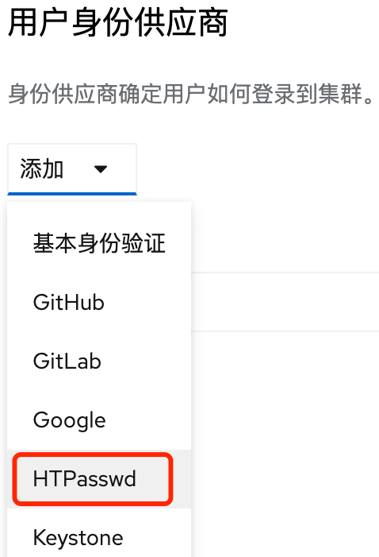
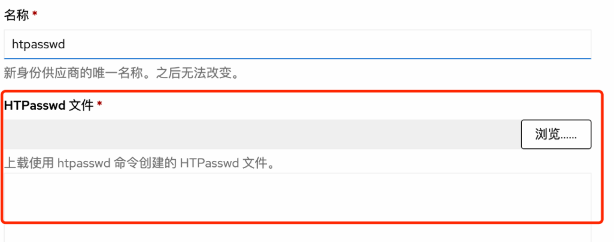
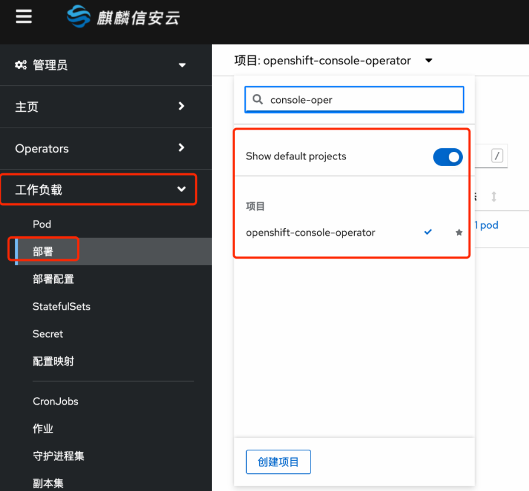
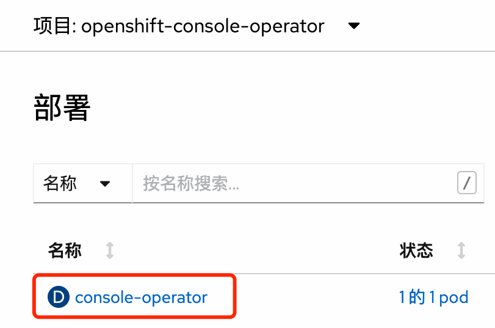
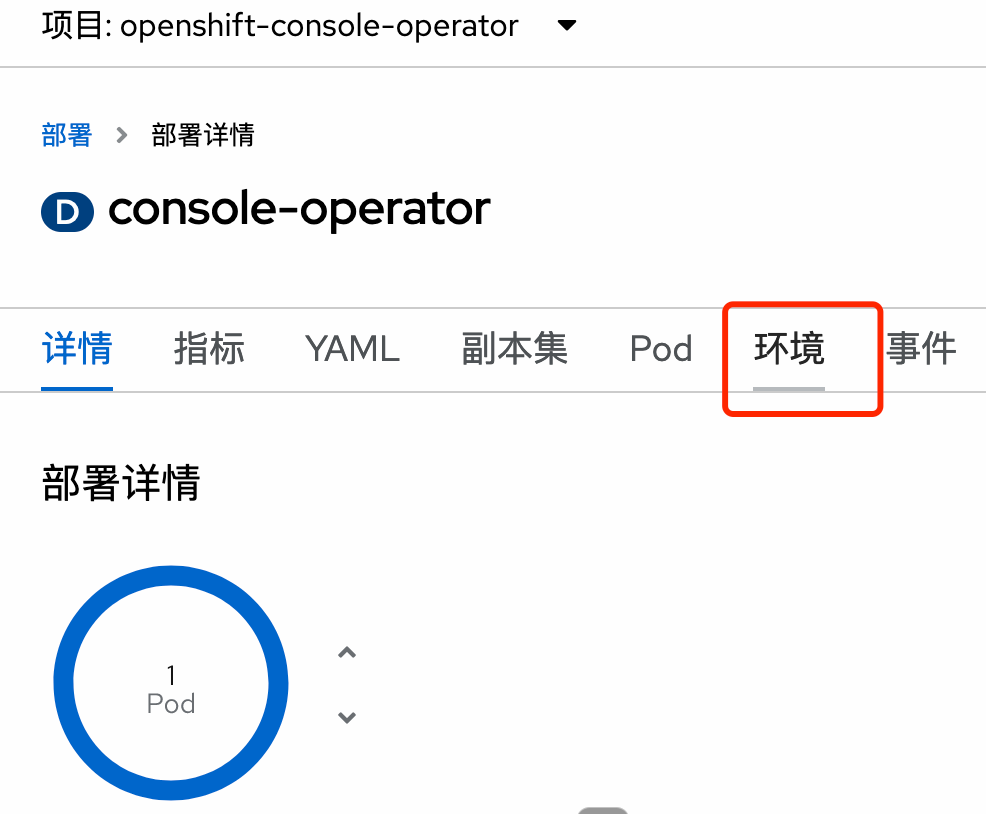
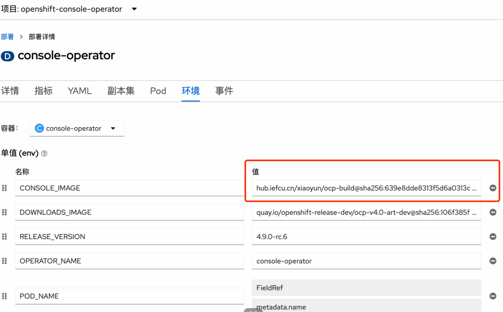

# console镜像修改 - 监控相关修改


## 创建kylin-monitor用户

建立一个用户kylin-monitor，只给这个用户查看监控的权限

#### 1. 创建用户kylin-monitor密码信息

目前用户名和密码是固定写死的
```bash
htpasswd -c -B -b users.htpasswd kylin-monitor jit@2021
# 获取到如下信息
kylin-monitor:$2y$05$IzGbG9RbAEX577z7RKeVEOl3V0AgfeIoCNq8yDiO9GZ8rnYly5Tlu
```

#### 2. 在页面上操作新增这个用户

到管理员，管理，集群设置，配置，OAuth，添加，HTPasswd认证



**注意名称改为kylin-monitor**



#### 3. 给这个用户查看监控的权限

```bash
oc adm policy add-cluster-role-to-user cluster-monitoring-view kylin-monitor
```

## 修改镜像步骤

#### 1. 给一个镜像

构建好这个console镜像

#### 2. 上传到内部镜像仓库

略，也可以传到其他镜像仓库中，例如 hub.iefcu.cn/xiaoyun/new-console:20220125

#### 3. 禁止自动升级恢复组件
```bash
oc scale --replicas=0 deployments/cluster-version-operator -n openshift-cluster-version
```

#### 4. 修改console的镜像id

进入项目openshift-console-operator，
进入环境中，修改CONSOLE_IMAGE

```bash
TODO: 通过命令行修改，简单一点，一行命令解决
```









## 使用方法

#### 1. 访问获取token链接

通过访问url链接 https://console-openshift-console.apps.kcp1-arm.iefcu.cn/kylintoken获取到token

#### 2. 然后就可以直接访问监控页面。

类似都加上flag=ture

https://console-openshift-console.apps.kcp1-arm.iefcu.cn/monitoring/dashboards/grafana-dashboard-api-performance?period=5m&apiserver=kube-apiserver&flag=true
