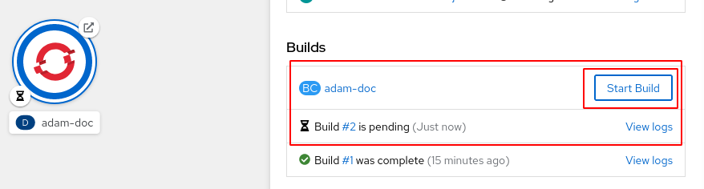
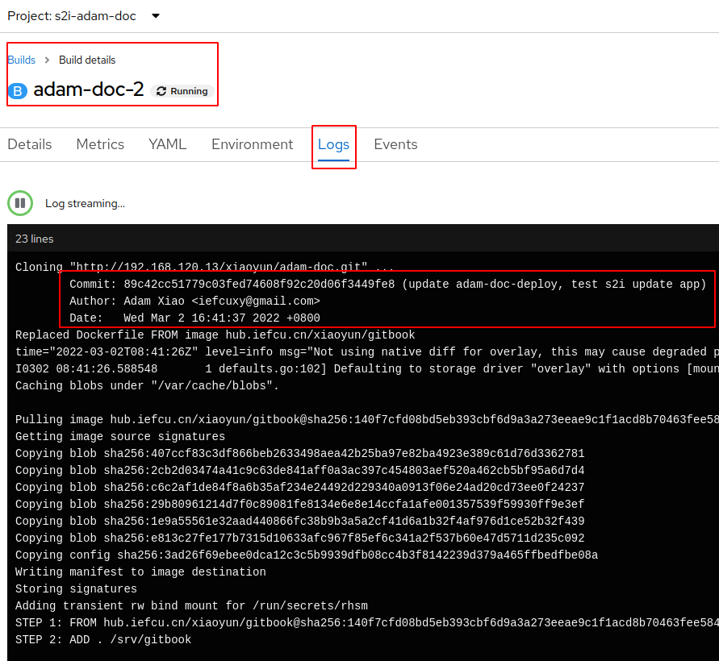
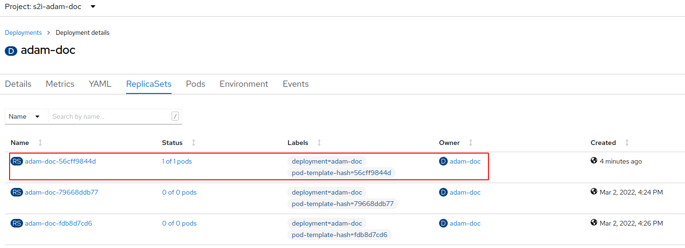
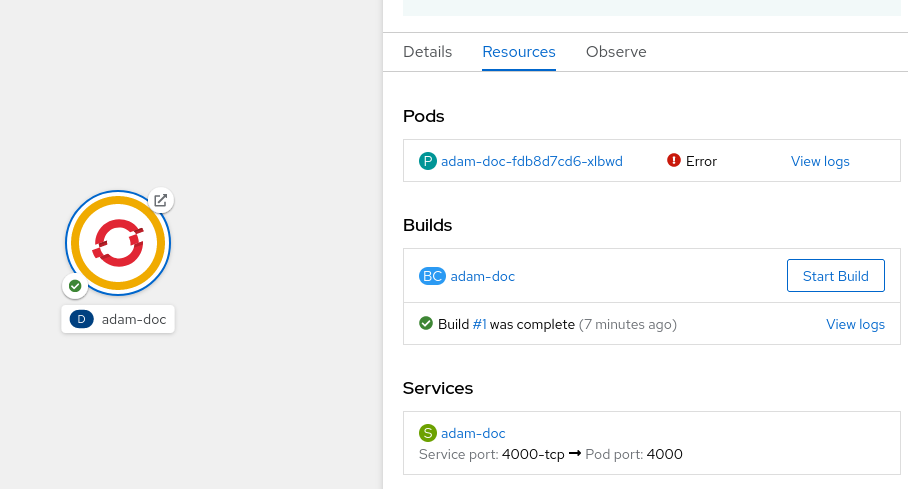

# 部署adam-doc这个文档应用

## 镜像部署

## s2i部署

目前通过web页面的方式有点问题，待解决

先通过CLI的方式部署

```bash
# 可以看到新建应用都做了些什么事情
# oc new-app http://192.168.120.13/xiaoyun/adam-doc.git -o yaml > adam.yaml
# 新建项目，部署应用到这个项目中去
oc new-project s2i-adam-doc
oc new-app http://192.168.120.13/xiaoyun/adam-doc.git
# 创建route, 暴露service
oc expose service adam-doc
```


#### 更新应用

简单重新部署一下

(TODO: 灰度发布等情况就麻烦一些了)

* 进入构建配置，然后点击开始构建，最后应用会自动更新


* 查看构建过程的日志


* 最后可以看到新构建的pod成功运行了


## FAQ

#### 1. 拓扑图上去看，发现adam-doc运行有问题



原因是这个镜像需要anyuid权限，在容器里创建文件了，给它权限
```bash
# 给s2i-adam-doc项目的default服务帐号anyuid权限
oc adm policy add-scc-to-user anyuid -n s2i-adam-doc -z default
```
