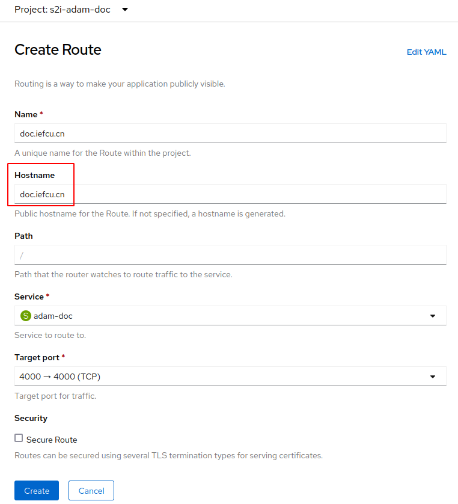
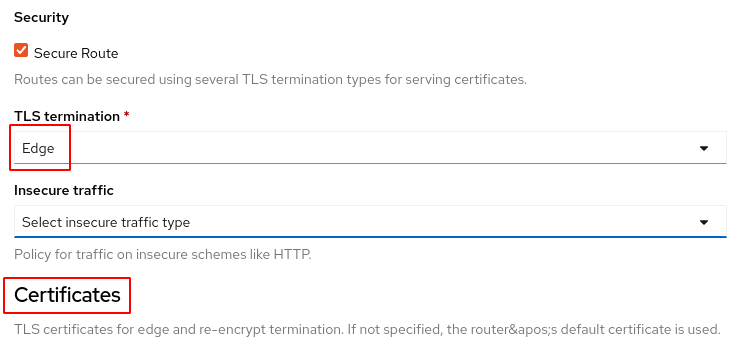

# 创建自定义域名的路由

## 配置方法

使用web控制台处理， 创建安全路由，使用域名**doc.iefcu.cn**

由于内部service是http类型的，所以选择Edge终结https的方式。

然后关键就是证书的配置，需要配置
* Certificate - 证书pem文件
* Private key - 证书密钥
* CA certificate - CA证书链

## 创建自信任签名证书

TODO: 记录相应文档

## 参考文档

[暴露内部镜像仓库 - ocp官方文档](https://docs.openshift.com/container-platform/4.8/registry/securing-exposing-registry.html)