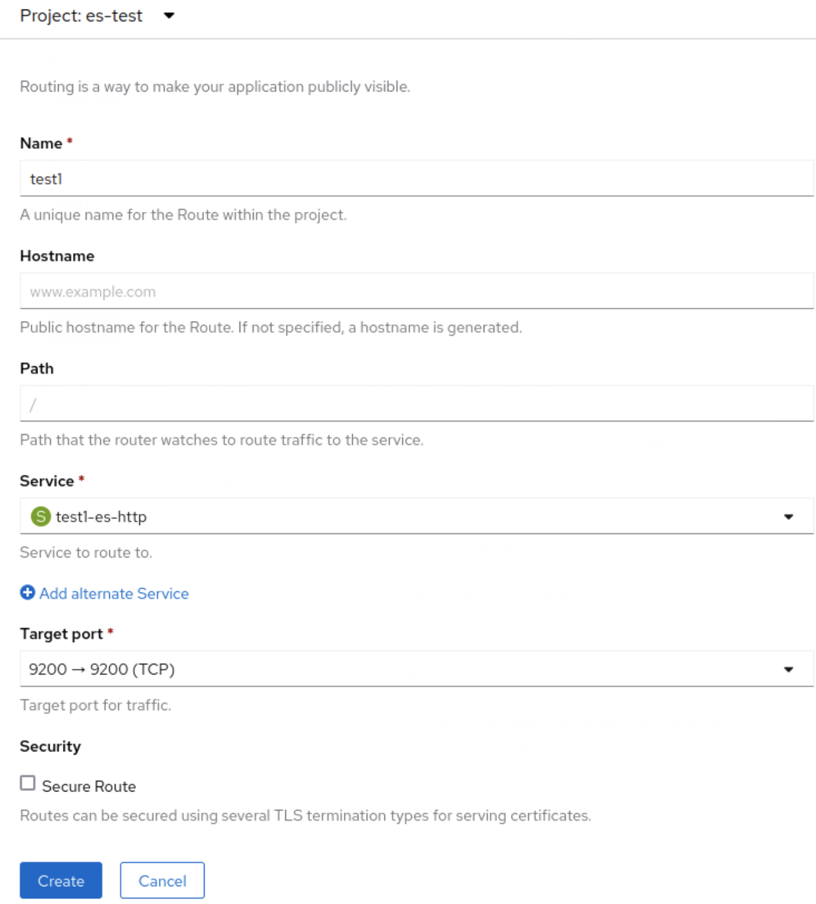
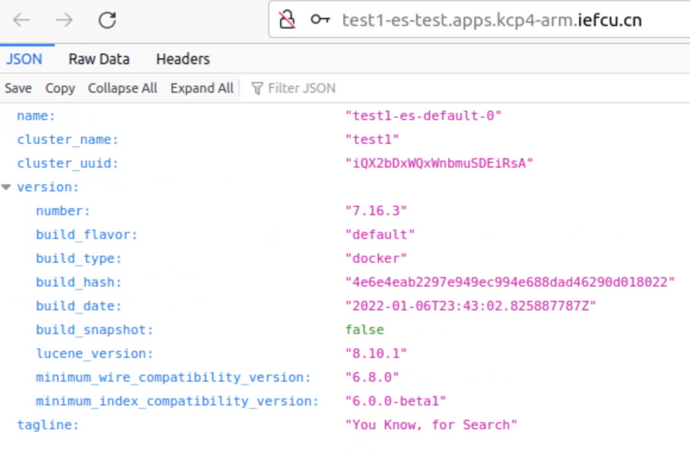

# 使用operator部署ES集群

elasticSearch集群使用operator搭建(ECK)

## 部署步骤

* 使用ECK，版本1.9.1
* 部署ES版本7.16.3（docker.elastic.co/elasticsearch/elasticsearch:7.16.3）

#### 1. 首先部署ECK operator

注意：修改operator.yaml中的operator的镜像，改成自己的私有镜像仓库的镜像

```
kubectl create -f https://download.elastic.co/downloads/eck/1.9.1/crds.yaml
kubectl apply -f https://download.elastic.co/downloads/eck/1.9.1/operator.yaml
```

检查opertor日志
```
kubectl -n elastic-system logs -f statefulset.apps/elastic-operator
```

#### 2. 然后部署3节点es集群

(注意：可能需要新建项目es-test, oc new-project es-test)
注意: 镜像使用自己的私有镜像仓库中的镜像，修改image字段

```
cat <<EOF | kubectl apply -f -
apiVersion: elasticsearch.k8s.elastic.co/v1
kind: Elasticsearch
metadata:
  name: test1
  namespace: es-test
spec:
  version: 7.16.3
  image: hub.iefcu.cn/public/elasticsearch:7.16.3
  http:
    tls:
      selfSignedCertificate:
        disabled: true # 关闭tls
  nodeSets:
  - name: default 
    count: 3 # 部署集群节点数
    config:
      node.store.allow_mmap: false
    volumeClaimTemplates:
    - metadata:
        name: elasticsearch-data # Do not change this name unless you set up a volume mount for the data path.
      spec:
        accessModes:
        - ReadWriteOnce
        resources:
          requests:
            storage: 5Gi
        storageClassName: slow
EOF
```

ES集群参数详见官方文档：https://www.elastic.co/guide/en/cloud-on-k8s/1.9/k8s-elasticsearch-specification.html


#### 3. 验证ES集群

首先获取到ES集群密码
（用户名固定为elastic）

```
PASSWORD=$(kubectl get secret test1-es-elastic-user -o go-template='{{.data.elastic | base64decode}}')
echo $PASSWORD
```

然后做一个端口转发
```
kubectl port-forward service/test1-es-http 9200
```

最后使用restful api访问es集群
```
curl -v -u "elastic:$PASSWORD" -k "http://localhost:9200"
```

建立路由访问es集群api


使用路由链接直接访问http://test1-es-test.apps.kcp4-arm.iefcu.cn/


更多ES api访问验证，参考ES官方api文档

## 参考文档

* [ECK官方部署文档](https://www.elastic.co/guide/en/cloud-on-k8s/1.9/k8s-deploy-elasticsearch.html)
