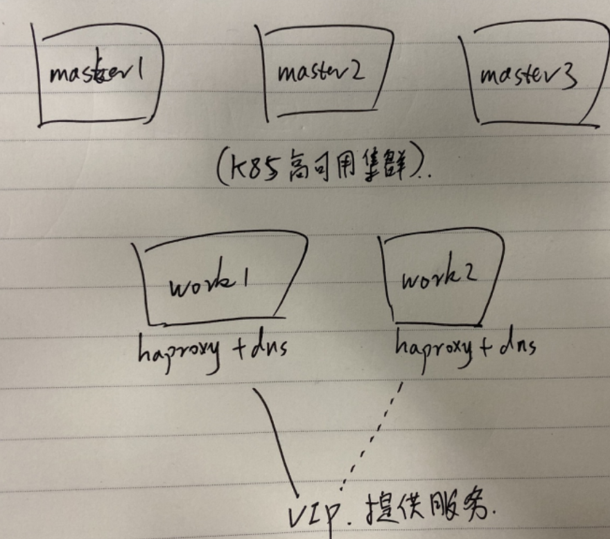
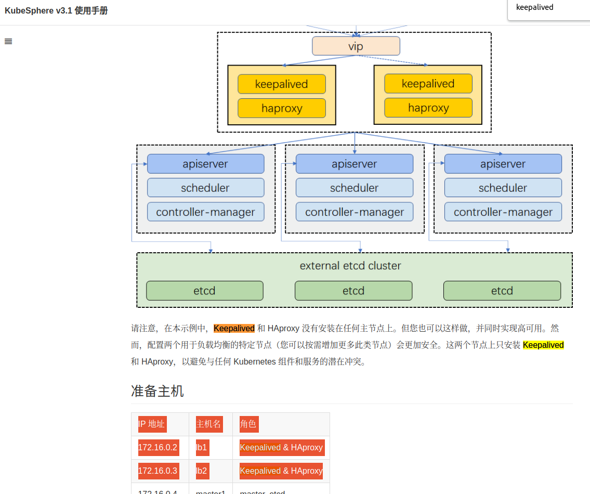

# openshift集群计算节点部署dns,haproxy,keepalived容器等

master节点少于3个，就不需要部署haproxy和keepalived服务

## 部署架构





## 安装部署说明

* 1. 安装部署openshift集群，至少有2个worker节点来部署dns，haproxy，keepalived容器
首先配置点火配置文件，首先安装3个master，
然后依次添加两个worker节点进去，需要手动执行命令来通过节点加入集群的请求

```bash
oc get csr | grep pending -i | awk '{print $1}' | sed 's/^/kubectl certificate approve /' | bash
```

* 2. 然后在2个worker节点上部署运行haproxy, dns, keepalived容器，并验证功能正常生效

* 3. 然后修改每个节点的dns配置，重启每一台节点即可。

### 部署运行keepalived容器

#### keepalived容器制作

我已经制作好了，这里说明一下怎么做这个容器的，
参考[sealyun](https://cloud.tencent.com/developer/article/1472255)的容器制作，比较简单

```dockerfile
#FROM alpine:latest
FROM hub.iefcu.cn/public/alpine:latest

RUN apk --no-cache add keepalived

#VOLUME ["/etc/keepalived"]

CMD ["keepalived", "-n","--all", "-d", "-D",  "-f", "/etc/keepalived/keepalived.conf"]
```

构建多架构arm64和amd64的keepalived容器
```bash
docker buildx build \
    --build-arg http_proxy=http://proxy.iefcu.cn:20172 \
    --build-arg https_proxy=http://proxy.iefcu.cn:20172 \
    --build-arg no_proxy=yumrepo.unikylin.com.cn,192.0.0.0/8 \
    --platform=linux/arm64,linux/amd64 \
    -t hub.iefcu.cn/xiaoyun/keepalived . --push
```

#### 运行keepalived容器

```bash
sudo mkdir -p /etc/keepalived
# generate /etc/keepalived/keepalived.conf

# openshift 环境，为什么不需要处理selinux的问题呢？
# unconfined_u:object_r:etc_t:s0 keepalived.conf
sudo podman run -d --name keepalived \
    --net host --cap-add=NET_ADMIN \
    --cap-add=NET_BROADCAST \
    --cap-add=NET_RAW \
    -v /etc/keepalived/keepalived.conf:/etc/keepalived/keepalived.conf \
    hub.iefcu.cn/xiaoyun/keepalived

sudo podman generate systemd \
    --new --name keepalived \
    > /etc/systemd/system/kcp-keepalived.service
sudo systemctl enable kcp-keepalived
```

keepalived配置文件示例，需要修改一些参数：

* 修改interface参数，选择一个接口提供vip服务
* 修改vip地址
* 修改virtual_router_id，不同的vrrp服务，router id不能一样


主keepalived配置文件如下
```conf
vrrp_instance  VI_1 {
  state  MASTER
  interface  enp3s0
  virtual_router_id  100
  priority  100
  advert_int  1
  authentication {
      auth_type  PASS
      auth_pass  1qazXSW@
  }
  virtual_ipaddress {
      10.90.3.26
  }
}
```

备keepalived配置文件如下
```conf
vrrp_instance  VI_1 {
  state  BACKUP
  interface  enp3s0
  virtual_router_id  100
  priority  90
  advert_int  1
  authentication {
      auth_type  PASS
      auth_pass  1qazXSW@
  }
  virtual_ipaddress {
      10.90.3.26
  }
}
```

vip验证，ping 10.90.3.26，停止主keepalived容器，继续ping 10.90.3.26


### 部署运行dns容器

#### 制作dns容器

参考https://github.com/Storytel/dnsmasq.git
```dockerfile
#FROM alpine:latest
FROM hub.iefcu.cn/public/alpine:latest

RUN apk --no-cache add dnsmasq \
    && echo -e "conf-dir=/etc/dnsmasq,*.conf\nkeep-in-foreground" > /etc/dnsmasq.conf

EXPOSE 53/tcp 53/udp

VOLUME ["/etc/dnsmasq"]

CMD ["dnsmasq"]
```

构建多架构dns容器
```bash
docker buildx build \
    --build-arg http_proxy=http://proxy.iefcu.cn:20172 \
    --build-arg https_proxy=http://proxy.iefcu.cn:20172 \
    --build-arg no_proxy=yumrepo.unikylin.com.cn,192.0.0.0/8 \
    --platform=linux/arm64,linux/amd64,linux/arm/v6 \
    -t hub.iefcu.cn/xiaoyun/dnsmasq . --push
```

#### 部署运行dns容器

```bash
# 发现使用目录/etc/dnsmasq，不需要配置selinux权限，反正只读就行
sudo mkdir /etc/dnsmasq/
# generate /etc/dnsmasq.d/dnsmasq.conf

# 发现使用目录/etc/dnsmasq，不需要配置selinux权限，反正只读就行
sudo podman run -d --name dns --restart=always \
    -p 53:53 -p 53:53/udp \
    -v /etc/dnsmasq/:/etc/dnsmasq:ro \
    hub.iefcu.cn/xiaoyun/dnsmasq

sudo podman generate systemd \
    --new --name dns \
    | sudo tee /etc/systemd/system/kcp-dns.service
sudo systemctl enable kcp-dns
```

dns配置文件，就使用堡垒机上的dns配置就可以了

配置额外一个base.conf配置
```conf
# 配置上游dns
server=8.8.8.8
no-resolv

# 注意这个值可以修改
address=/registry.kcp.local/10.90.3.35
```

dns验证
```bash
dig +short master1.kcp4-arm.iefcu.cn @10.90.3.35
dig +short api.kcp4-arm.iefcu.cn @10.90.3.35
dig +short -t SRV _etcd-server-ssl._tcp.kcp4-arm.iefcu.cn @10.90.3.35
```

#### 修改节点的dns配置

* 1. 需要修改/boot/loader/entries/ostree-2-rhcos.conf文件，把grub的ip，dns配置删除
(需要把这个分区挂载为可写)
```bash
 mount -o remount,rw /dev/vda3 /boot
```
* 2. 需要修改/etc/NetworkManager/system-connections/ens3.nmconnection
注意，其他配置文件不生效，如/etc/NetworkManager/systemConnectionsMerged/ens3.nmconnection
使用nmcli命令修改dns，也不行，一定要修改上面的配置文件


### 部署运行haproxy容器

直接使用现成的haproxy容器
"docker.io/library/haproxy:lts":"hub.iefcu.cn/public/haproxy"

```bash
sudo mkdir -p /etc/haproxy/
# generate /etc/haproxy/haproxy.cfg

sudo podman run -d --name ha \
    -p 9000:9000 -p 80:80 -p 443:443 -p 22623:22623 -p 6443:6443 \
    -v /etc/haproxy:/usr/local/etc/haproxy:Z \
    -v /etc/localtime:/etc/localtime:ro \
    --sysctl net.ipv4.ip_unprivileged_port_start=0 \
    hub.iefcu.cn/public/haproxy:lts

sudo podman generate systemd \
     --new --name ha \
     > /etc/systemd/system/kcp-ha.service
sudo systemctl enable kcp-ha
```

haproxy配置文件参考堡垒机的配置

发现在计算节点上不能访问其他节点的machine-config服务22623端口

[core@master1 ~]$ curl -k https://10.90.3.23:22623
curl: (7) Failed to connect to 10.90.3.23 port 22623: Connection refused

后来发现是有一个防火墙阻止了

 101K 6034K REJECT     tcp  --  *      *       0.0.0.0/0            0.0.0.0/0            tcp dpt:22623 flags:0x17/0x02 reject-with icmp-port-unreachable

影响不大，只会导致计算不能提供machine-config服务，但是这个服务只有在添加新节点时才会使用。

可以通过临时放开这个防火墙解决。

sudo iptables -I OPENSHIFT-BLOCK-OUTPUT -p tcp --dport 22623 -j ACCEPT


### 部署运行registry容器

#### 部署运行registry容器

直接使用现成的registry镜像
```
sudo mkdir -p /var/lib/registry

sudo podman  run -d --name registry \
    -p 5000:5000 \
    -v /var/lib/registry:/var/lib/registry:Z \
    hub.iefcu.cn/public/registry:2

sudo podman generate systemd \
    --new --name registry \
    | sudo tee /etc/systemd/system/kcp-registry.service
sudo systemctl enable kcp-registry
```

#### 导入镜像

```bash
sudo tar -xf registry-data.tar -C /var/lib/registry

# 对应的打包方法就是
sudo tar -cf /data/registry-data.tar -C /var/lib/registry *
```

#### 配置使用这个私有镜像仓库

```bash
oc edit image.config.openshift.io/cluster

spec:
  registrySources:
    insecureRegistries:
    - registry.kcp.local:5000
    allowedRegistries:
    - registry.kcp.local:5000
```

或者使用一行命令处理，参考 https://openshift.tips/registries/
```bash
oc patch image.config.openshift.io/cluster -p \
'{"spec":{"registrySources":{"insecureRegistries":["registry.kcp.local:5000"]}}}' --type='merge'
```

配置镜像mirror策略（安装时配置好，现在就不用配置了）
TODO: 使用machine config配置更多mirror策略？
```bash
cat << EOF | oc create -f -
apiVersion: operator.openshift.io/v1alpha1
kind: ImageContentSourcePolicy
metadata:
  name: kcp-registry
spec:
  repositoryDigestMirrors:
  - mirrors:
    - registry.kcp.local:5000/xiaoyun/openshift4-aarch64
    source: hub.iefcu.cn/xiaoyun/openshift4-aarch64
  - mirrors:
    - registry.kcp.local:5000/kcp/openshift4-aarch64
    source: hub.iefcu.cn/xiaoyun/openshift4-aarch64
EOF
```

验证拉取mirror仓库
```bash
# 验证ok，即便原始镜像仓库连接不上也可以下载镜像！
podman pull --log-level=debug hub.iefcu.cn/xiaoyun/openshift4-aarch64@sha256:1b26826f602946860c279fce658f31050cff2c596583af237d971f4629b57792
```
