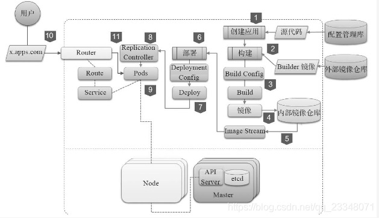
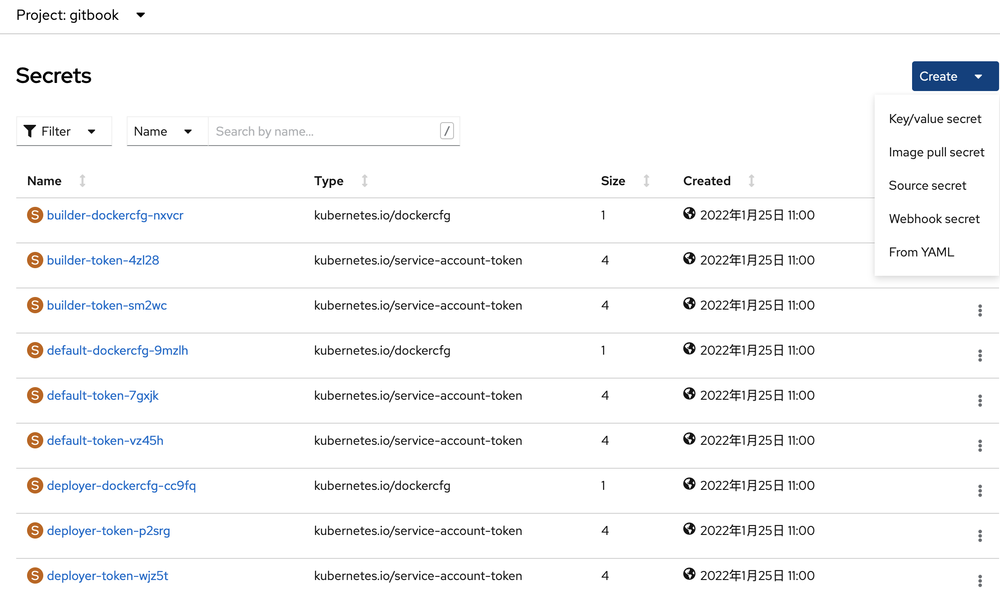
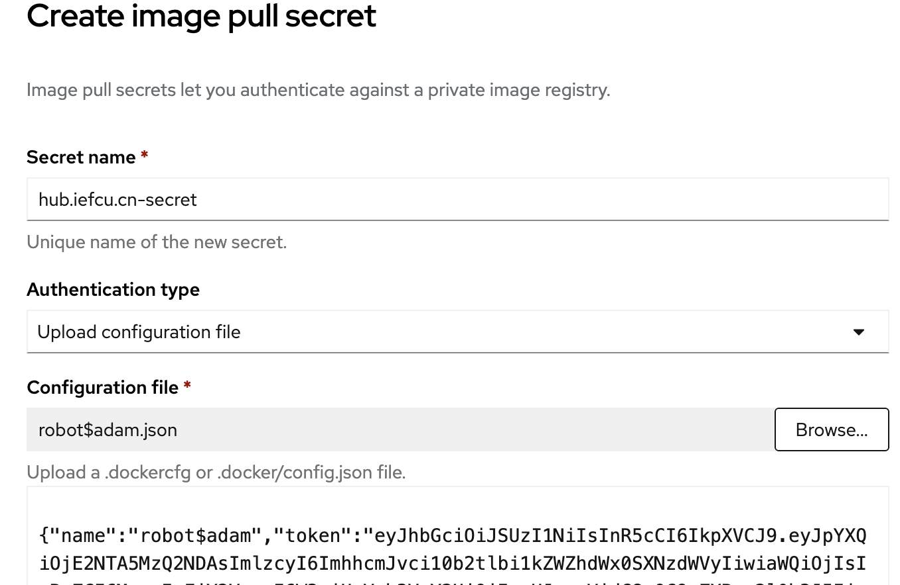

# devops相关调研

TODO:
* 如何从catalog中提取出bundle镜像?

=> openshift pipelines, gitops这两个operator，不支持arm64架构

调研jenkins环境如何上云，使用一个sample来实现CI/CD过程

分解目标:
* xxx
* openshift从源码构建镜像并推送到指定镜像仓库
  https://blog.csdn.net/networken/article/details/124020418
* 以console镜像作为CI/CD的示例

其他:
jenkins需要存储卷好像

## openshift构建策略

[openshift提供三种build策略](https://blog.css8.cn/post/15323025.html)

1. S2I（source to image）build：一个为重复build产生的docker格式的container工具，它将application source装进一个容器镜像并组合生产出一个read-to-run的新镜像。这个新镜像随时准备好接收docker run指令，同时支持增量build，也就是对之前版本的image再build操作。

2. Customer build：自定义的build策略允许开发者定义一个特殊的build image来完成整个build过程。

3. Pipeline build：通过定义一个Jenkins pipeline来执行插件，Pipeline的workflows定义在Jenkins file里，也可以直接嵌套在build configuration里。

#### S2I镜像制作

https://www.51know.info/openshift/application/s2i_custom/

S2I(Source-to-Image) 说明


1. 开发人员完成代码开发
2. S2I过程负责将代码和运行环境(比如 python 或者 Java)整合构建,生成应用docker镜像
3. 应用镜像构建完成并推送至openshift集群内部的docker镜像仓库,再由openshift进行各个环境的部署

Source to Image S2I的步骤如下：

1、用户输入源代码仓库地址

2、用户选择S2I构建的基础镜像(又称Builder镜像)，Builder镜像中包含了操作系统、操作语言，软件及配置。

3、用户或系统触发S2I构建，OpenShift将实例化S2I构建执行器

4、S2I构建执行器将从用户指定的代码仓库下载源代码

5、S2I构建执行器实例化Builder镜像。代码将会被注入Builder镜像中

6、Builder奖项将根据预定义的逻辑(assemble脚本)执行源代码的编译、购进并完成部署。

7、S2I构建执行器将完成操作的Builder镜像生成新的Docker镜像

8、S2I构建执行器将新的镜像推送到OpenShift内部的镜像仓库

9、S2I构建执行器更新该次构建相关的Image Stream信息

除了接受源代码仓库地址作为输入外，S2I还接受Dockerfile以及二进制文件作为构建的输入

核心流程详解：
OpenShift项目，最核心的流程就是将应用从静态的源代码变成动态的应用服务的过程。



#### Pipeline Build

Pipeline build 策略允许开发人员定义一个由Jenkins pipeline 插件执行的Jenkins pipeline。OpenShift Container Platform可以以任何其他构建类型的方式启动，监视和管理构建。

Pipeline工作流程在Jenkins文件中定义，可直接嵌入到构建配置中，或者在Git存储库中提供，并由构建配置引用。

OpenShift Container Platform首次使用Pipeline 策略定义构建配置时，会实例化Jenkins服务器以执行Pipeline。项目中的后续管道构建配置共享此Jenkins服务器。

有关如何部署Jenkins服务器以及如何配置或禁用自动设置行为的更多详细信息，请参阅配置Pipeline的执行。

> @提示：即使删除了所有pipeline build配置，Jenkins服务器也不会自动删除，必须由用户手动删除。

有关Jenkins pipeline的更多信息，请参阅Jenkins文档。

## push镜像到外部镜像仓库

1. 给buildconfig配置push secret
2. 给builder sa配置push secret
  这个做法比较合理

#### 创建push secret

通过页面，发现有如下种类的secret可以创建，
计划创建pull secret(kubernetes.io/dockercfg)


##### 通过密码创建

=> 验证build push image ok

https://blog.csdn.net/weixin_43902588/article/details/120814851

这种方式不推荐!会暴露密码
创建出来的类型为 kubernetes.io/dockerconfigjson
```bash
oc create secret docker-registry hub.iefcu.cn-xiaoyun-secret \
  --docker-server=hub.iefcu.cn \
  --docker-username=user \
  --docker-password=*** \
  --docker-email=xiaoyun@kylinos.com.cn \
  -n gitbook

oc secret link builder hub.iefcu.cn-xiaoyun-secret --for=pull,mount -n gitbook
```

##### 通过token创建

=> 参数配置不对！验证失败，没有权限push镜像?

在harbor中可以创建机器人账号，导出token, 内容大概如下
```json
{"name":"robot$adam","token":"eyJhbGc ..."}
```

通过界面创建，比较方便, 最后确实创建出了pull image类型的secret(kubernetes.io/dockercfg)



#### 给builder sa配置push secret

参考: [OpenShift 4 - 用Pull Secret访问红帽官方或其他外部Registry的Image](https://blog.csdn.net/weixin_43902588/article/details/109353571)

使用方法
```bash
$ oc secret link --help

Link secrets to a service account.

 Linking a secret enables a service account to automatically use that secret for some forms of authentication.

Usage:
  oc secrets link serviceaccounts-name secret-name [another-secret-name]... [flags]

Examples:
  # Add an image pull secret to a service account to automatically use it for pulling pod images
  oc secrets link serviceaccount-name pull-secret --for=pull

  # Add an image pull secret to a service account to automatically use it for both pulling and pushing build images
  oc secrets link builder builder-image-secret --for=pull,mount

  # If the cluster's serviceAccountConfig is operating with limitSecretReferences: True, secrets must be added to the
pod's service account whitelist in order to be available to the pod
  oc secrets link pod-sa pod-secret

Options:
      --for=[mount]: type of secret to link: mount or pull
```

然后手动配置一下
```bash
# 配置builder sa使用push secret
oc -n gitbook secrets link builder hub.iefcu.cn-secret

# 配置完成，发现sa有这个secret了
oc -n gitbook describe sa builder

Name:                builder
Namespace:           gitbook
Labels:              <none>
Annotations:         <none>
Image pull secrets:  builder-dockercfg-nxvcr
Mountable secrets:   builder-token-sm2wc
                     builder-dockercfg-nxvcr
                     hub.iefcu.cn-secret
Tokens:              builder-token-4zl28
                     builder-token-sm2wc
Events:              <none>
```

#### 配置私有仓库ca信任证书

https://docs.openshift.com/container-platform/4.10/cicd/builds/setting-up-trusted-ca.html

待验证
```bash
oc create configmap registry-cas -n openshift-config --from-file=myregistry.corp.com..5000=/etc/docker/certs.d/myregistry.corp.com:5000/ca.crt --from-file=otherregistry.com=/etc/docker/certs.d/otherregistry.com/ca.crt

oc patch image.config.openshift.io/cluster --patch '{"spec":{"additionalTrustedCA":{"name":"registry-cas"}}}' --type=merge
```

## OpenShift 4 - 用Pull Secret访问红帽官方或其他外部Registry的Image

## 配置项目访问外部带安全验证的镜像仓库

https://openshift-cn.readthedocs.io/zh_CN/latest/openshift/configuration.html

每个项目都要单独配置

创建image pull secret。带有镜像仓库登陆信息。使用红帽registry的话，建议用registry service account。
```bash
    # oc project hyperion
    # oc create secret docker-registry hyperion-pull-secret \
        --docker-server=registry.redhat.io \
        --docker-username=<user_name> \
        --docker-password=<password> \
        --docker-email=<email>
把secret连接到default service account, 使当前项目默认使用default sa来运行pod, 并下载镜像。
    # oc secrets link default hyperion-pull-secret --for=pull
```

## 其他待理解资料

https://fanxinwei.gitbooks.io/openshift3-5_chinese_doc2/content/openshiftjia-gou/22he-xin-gai-nian/234jing-xiang-he-jing-xiang-liu.html

怎么发现这几种构建策略，实践验证理解一下？
OpenShift Container Platform的构建系统，有三种主要的构建策略可用：
* Docker build
* Source-to-Image (S2I) build
* Custom build

默认情况下，支持使用Docker build和S2I。

生成的结果对象取决于用于创建它的构建器。对于Docker和S2I构建，生成的对象是可运行的映像。对于自定义构建，生成的对象是创建者图像作者指定的任何内容。
此外，**Pipeline build**策略可用于实现复杂的工作流程：
* 持续整合
* 持续部署

https://www.jianshu.com/p/fecd10162984

OpenShift ImageStream指向的镜像是否为内部镜像仓库

oc import-image时需要添加参数--reference-policy='local'，如下
可以导入镜像到内部镜像仓库？


## 参考文档

* [OpenShift 4 - 用Pull Secret访问红帽官方或其他外部Registry的Image](https://blog.csdn.net/weixin_43902588/article/details/109353571)
* [(好)构建（build）和镜像流（image stream）](https://fanxinwei.gitbooks.io/openshift3-5_chinese_doc2/content/openshiftjia-gou/22he-xin-gai-nian/234jing-xiang-he-jing-xiang-liu.html)
