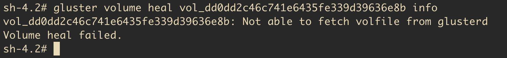
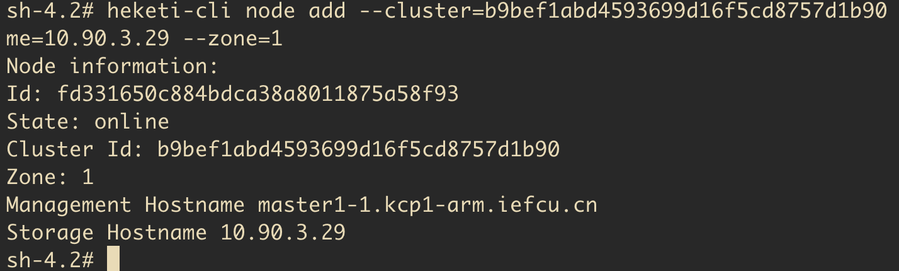

# 安装heketi+glusterfs存储类

首先要解压glusterfs.tgz压缩包，所有的yaml配置文件都在里面

注意事项，修改image，修改成可以拉到的镜像

#### 1. glusterfs宿主机开启内核模块

```bash
sudo modprobe dm_thin_pool
```

#### 2. 部署GlusterFS DaemonSet

注意配置文件里面的image, 确保能够拉到

registry.kcp.local:5000/kcp/gluster-containers:latest
(原来是 hub.iefcu.cn/xiaoyun/gluster-containers:latest)

```bash
oc create -f glusterfs-daemonset.json
oc get pods
# oc label node <...node...> storagenode=glusterfs 
```

#### 3. 部署配置heketi bootstrap容器

注意配置文件里面的image, 确保能够拉到

registry.kcp.local:5000/kcp/heketi:9
(原来是 hub.iefcu.cn/xiaoyun/heketi:9)

```
# 权限配置等准备
oc create -f heketi-service-account.json
oc create clusterrolebinding heketi-gluster-admin --clusterrole=edit --serviceaccount=default:heketi-service-account
oc create secret generic heketi-config-secret --from-file=./heketi.json

oc create -f heketi-bootstrap.json
```

#### 4. 配置heketi管理glusterfs集群

首先配置topology-sample.json配置文件, 配置管理的几个glusterfs实例，主机名, ip和磁盘存储

然后导入配置到heketi容器里面去运行
```
# 找到heketi容器名称
oc cp topology-sample.json deploy-heketi-5fc68f6bc-tjspw:/topology-sample.json

oc rsh deploy-heketi-5fc68f6bc-tjspw
heketi-cli topology load --json=topology-sample.json

heketi-cli setup-openshift-heketi-storage
# 单机(小于3个glusterfs主机)需要加参数--durability=none
# heketi-cli setup-openshift-heketi-storage --durability=none
# 集群就不需要加--durability=none
# heketi-cli setup-openshift-heketi-storage

# 然后将生成的heketi-storage.json拷贝出去
oc cp deploy-heketi-5fc68f6bc-tjspw:/heketi-storage.json ./heketi-storage.json
```

#### 5. 复制heketi配置到新存储中去，然后删除临时bootstrap heketi，启动正式heketi 

修改heketi-storage.json配置文件，修改image为:
registry.kcp.local:5000/kcp/heketi:9
(原来是 hub.iefcu.cn/xiaoyun/heketi:9)

注意这里使用的是kubectl命令
```
kubectl create -f heketi-storage.json

# 检查jobs是否完成, 然后就可以删除临时heketi了
kubectl get jobs
kubectl delete all,service,jobs,deployment,secret --selector="deploy-heketi"

# 部署正式heketi
oc create -f heketi-deployment.json
```

### 6. 创建存储类

修改slow-sc.yaml中的ip地址，使用heketi svc的ip地址
(TODO: 确认一下是否可以使用heketi svc的内部域名?)

是否可以扩展卷?
https://kubernetes.io/docs/concepts/storage/persistent-volumes/
allowVolumeExpansion: true

```
oc create -f slow-sc.yaml
# 以及配置存储类为默认存储类
kubectl patch storageclass slow -p '{"metadata": {"annotations":{"storageclass.kubernetes.io/is-default-class":"true"}}}'
```

## 修改glusterfs节点ip

```bash
# 获取集群列表
heketi-cli cluster list

# 列举集群节点
heketi-cli node list

# 新增节点
heketi-cli node add --cluster=b9bef1abd4593699d16f5cd8757d1b90 \
  --management-host-name=master1-1.kcp4-arm.iefcu.cn \
  --storage-host-name=10.90.3.29 --zone=1

# 需要手动清理旧数据，lvremove, vgremove, pvremove
# 新增节点磁盘, 节点的manage-host-name输入错入，导致问题。
heketi-cli device add --name=/dev/vdb --destroy-existing-data \
  --node=fd331650c884bdca38a8011875a58f93
Error: Setup of device /dev/vdb failed (already initialized or contains data?): Unable to find a GlusterFS pod on host master1-1.kcp1-arm.iefcu.cn with a label key glusterfs-node

# 新增节点磁盘， 自动清理数据还是有问题啊。自动清理仅仅是wipefs。。。
heketi-cli device add --name=/dev/vdb --destroy-existing-data \
  --node=cf4d8dd2902a2050ef4746992e3a29fd
Error: Setup of device /dev/vdb failed (already initialized or contains data?): wipefs: error: /dev/vdb: probing initialization failed: Device or resource busy

# 删除旧的节点和磁盘设备数据
heketi-cli node delete abaae7250bce1ca4cec98d34138c9824
heketi-cli node disable abaae7250bce1ca4cec98d34138c9824
heketi-cli node remove abaae7250bce1ca4cec98d34138c9824
Error: Failed to remove device, error: Unable to get heal info of volume : vol_dd0dd2c46c741e6435fe339d39636e8b
# 不行，需要先删除上面的device
heketi-cli device disable c3aac82f962174690a8ae545d130a28f
```

```
[heketi] ERROR 2022/03/17 07:14:38 heketi/apps/glusterfs/device_entry.go:493:glusterfs.(*DeviceEntry).removeBricksFromDevice: Failed to remove device, error: Unable to get heal info of volume : vol_dd0dd2c46c741e6435fe339d39636e8b
```





还有其他方法
```bash
heketi-cli db dump
# 可以导出当前的数据库的json格式，修改以后
```

## 其他

参考https://github.com/lwolf/docker-multiarch, 做出了heketi多架构镜像


# 参考资料

参考: https://github.com/heketi/heketi
参考: ./docs/design/kubernetes-integration.md
中文参考: https://jimmysong.io/kubernetes-handbook/practice/using-heketi-gluster-for-persistent-storage.html
