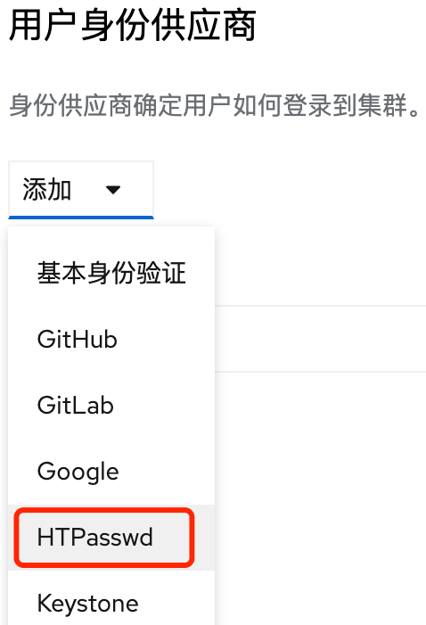
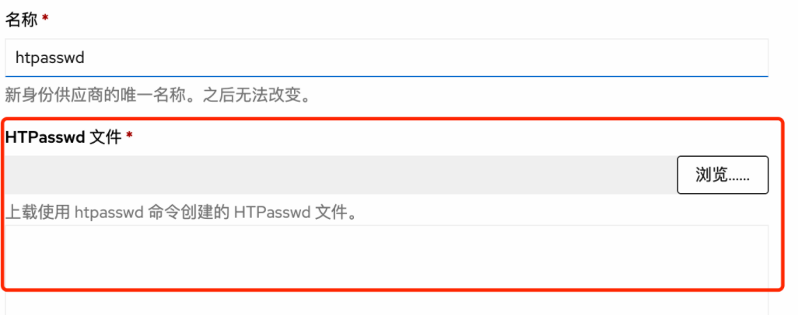

# 配置基本用户登录

## 1. 配置htpasswd用户

安装htpasswd工具
```
# debian系列
sudo apt install apache2-utils
# centos系列
sudo yum install -y httpd-tools
```

新增admin超级管理员用户
```bash
htpasswd -c -B -b users.htpasswd admin xxx
# 输入内容如下:
admin:$2y$05$oANlQ7bXuJQqbytIFkA7OO5Mf5pROsxoIgVU1UYdQrMTkrl2CNVi6
```

赋予admin用户集群管理员权限
```bash
oc adm policy add-cluster-role-to-user cluster-admin admin
```

删除默认kubeadmin用户
```bash
oc -n kube-system delete secrets kubeadmin
```

新增kylin-monitor用户
```bash
htpasswd -c -B -b users.htpasswd kylin-monitor jit@2021
kylin-monitor:$2y$05$IzGbG9RbAEX577z7RKeVEOl3V0AgfeIoCNq8yDiO9GZ8rnYly5Tlu

oc adm policy add-cluster-role-to-user cluster-monitoring-view kylin-monitor
```

## 2. 在webui上新增这个用户

到管理员，管理，集群设置，配置，OAuth，添加，HTPasswd认证


**新增monitor用户时，注意名称改为kylin-monitor**



#### 3. 给这个kylin-monitor用户查看监控的权限

```bash
oc adm policy add-cluster-role-to-user cluster-monitoring-view kylin-monitor
```

## 通过命令行新增用户

#### 创建htpasswd secret

```
oc create secret generic htpass-secret --from-file=htpasswd=users.htpasswd -n openshift-config 
```

或者这种方法
```
apiVersion: v1
kind: Secret
metadata:
  name: htpass-secret
  namespace: openshift-config
type: Opaque
data:
  htpasswd: <base64_encoded_htpasswd_file_contents>
```

#### 创建provider

通过oc edit oauth cluster, 修改新增
```
apiVersion: config.openshift.io/v1
kind: OAuth
metadata:
  name: cluster
spec:
  identityProviders:
  - name: htpasswd
    mappingMethod: claim 
    type: HTPasswd
    htpasswd:
      fileData:
        name: htpass-secret 
```

通过oc patch修改oauth资源配置
```
oc patch oauths cluster  --type merge --patch \
  '{"spec":{"identityProviders":[{ "name":"htpasswd", "mappingMethod":"claim", "type":"HTPasswd", "htpasswd":{"fileData":{"name":"htpass-secret"}} }]}}'
```

#### htpasswd密码文件修改

1.新增用户
```
$ htpasswd -bB users.htpasswd <username> <password>
```

2.删除用户
```
$ htpasswd -D users.htpasswd <username>
```

#### 更新用户密码

获取现有密码文件
```
oc get secret htpass-secret -ojsonpath={.data.htpasswd} -n openshift-config | base64 --decode > users.htpasswd
```

更新密码文件信息之后更新
```
oc create secret generic htpass-secret --from-file=htpasswd=users.htpasswd --dry-run=client -o yaml -n openshift-config | oc replace -f -
```

注意: 删除用户之后, 还需要清理

## 参考资料

* [Configuring an HTPasswd identity provider](https://docs.openshift.com/container-platform/4.9/authentication/identity_providers/configuring-htpasswd-identity-provider.html)
