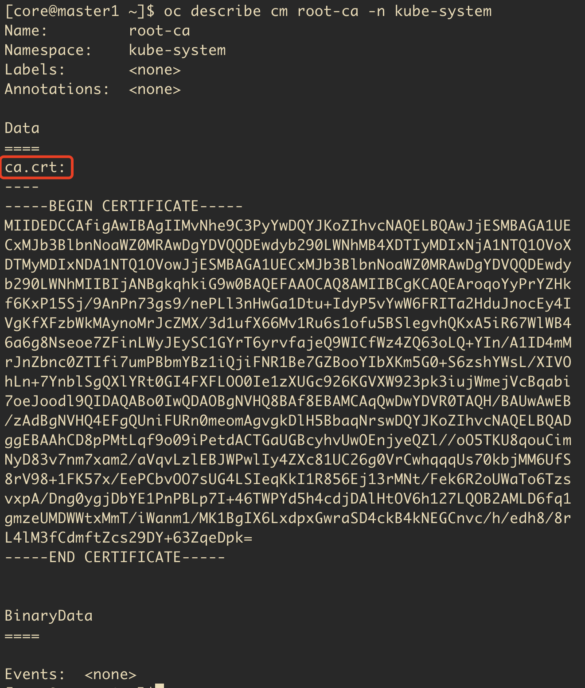

# 额外新增节点

集群运行一段时间后，需要额外新增worker等节点的方法。
基本上跟最开始安装的时候一样，就是需要简单的处理一下证书。

## 操作步骤

#### 首先更新dns,haproxy配置

* dns的更新, 跟初始安装的一样
* haproxy配置，如果新节点需要承载ingress功能，就需要配置

#### 然后安装新节点

* 1.获取ca证书

```bash
oc describe cm root-ca -n kube-system
```



也可以通过openssl来获取证书? 参考: https://www.linkedin.com/pulse/how-add-new-worker-node-existing-openshift-4-cluster-ibm-miranda
```bash
openssl s_client -connect api-int.<cluster_name>.<domain>:22623 -showcerts

MCS="api-int.<cluster_name>.<domain>:22623"
NEWBASE64CERT=$(echo "q" | openssl s_client -connect $MCS  -showcerts 2>/dev/null | awk '/-----BEGIN CERTIFICATE-----/,/-----END CERTIFICATE-----/' | base64 --wrap=0) && sed --regexp-extended --in-place=.backup "s%base64,[^,]+%base64,$NEWBASE64CERT\"%" /<path_to_worker.ign>/worker.ign
```

* 2.base64处理证书

```bash
cat ca.crt|base64 -w0 > ca.crt.base64
```

* 3.构建点火文件
  参考刚开始安装的点火文件，master和worker的点火文件都比较简单

```json
{"ignition":{"config":{"merge":[{"source":"https://api-int.kcp4-arm.iefcu.cn:22623/config/worker"}]},"security":{"tls":{"certificateAuthorities":[{"source":"data:text/plain;charset=utf-8;base64,<base64decodedcrt>"}]}},"version":"3.1.0″}}
```

发现一个更好的方法, 关键字《openshift add new worker node after 24 hour》
https://www.reddit.com/r/openshift/comments/ishmmk/adding_new_worker_node_on_existing_bare_metal/
=> 尼玛发现就是ca证书，有效期10年，基本不用担心。
```bash
oc extract -n openshift-machine-api secret/master-user-data   --keys=userData --to=- > master.ign

oc extract -n openshift-machine-api secret/worker-user-data   --keys=userData --to=- > worker.ign
```

* 4.安装新的节点，指定上述点火文件

* 5.通过新节点的证书请求

这个csr通过之后, 生成了kubelet-client-current.pem证书
```
[core@master1 ~]$ oc get csr
NAME        AGE   SIGNERNAME                                    REQUESTOR                                                                   REQUESTEDDURATION   CONDITION
csr-6zgx6   10m   kubernetes.io/kube-apiserver-client-kubelet   system:serviceaccount:openshift-machine-config-operator:node-bootstrapper   <none>              Pending
```

这个证书通过之后，生成了kubelet-server-current.pem证书
```
[core@master1 ~]$ oc get csr
NAME        AGE   SIGNERNAME                                    REQUESTOR                                                                   REQUESTEDDURATION   CONDITION
csr-cjvlw   45s   kubernetes.io/kubelet-serving                 system:node:worker1.kcp1-arm.iefcu.cn                                       <none>              Pending
```

通过所有证书
```bash
oc get csr | grep pending -i | awk '{print $1}' | sed 's/^/kubectl certificate approve /' | bash

# 或者使用oc命令approve证书
oc get csr | grep pending -i | awk '{print $1}' | sed 's/^/oc adm certificate approve /' | bash
```

## 参考文档

* [Rebuilding Master Node](https://myopenshiftblog.com/rebuilding-master-node/)
* [OpenShift 4 - 安装 OpenShift 集群后如何删除节点或增加新节点](https://blog.csdn.net/weixin_43902588/article/details/116941174)
