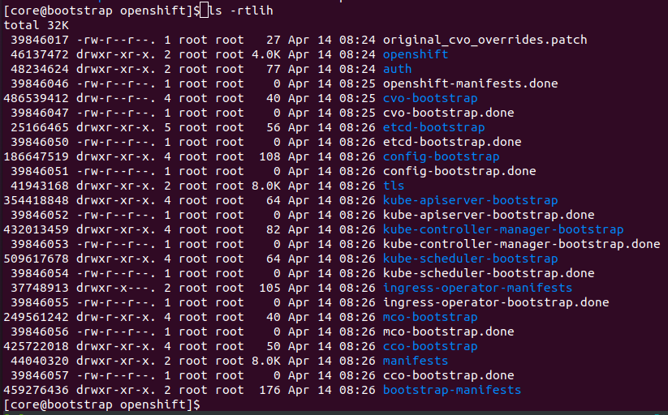

# bootkube.sh逻辑源码分析

长远目标:
* x86_64 bootstrap安装arm64集群?
* bootstrap怎么知道几个master节点组成集群的，代码逻辑在哪里处理的？

问题:
* 监控到master节点上线，然后给master节点安装etcd的逻辑代码在哪里？
  关键字《openshift cluster-bootstrap 调试》 => 没啥信息, 有一些收集安装失败日志的方法
  关键字《bootstrap 节点 watch 到 node的注册》=> 没啥信息
  关键字《cluster-bootstrap 逻辑分析》 => 没啥信息

思路:
* 先禁用bootkube这个服务，然后手动运行执行这个脚本，详细调试模式验证逻辑
  => 尝试的不是很好!
* 尝试修改bootkube.sh，或者cluster-bootstrap镜像，做成一个新的release来验证!
  这样就可以调试cluster-bootstrap逻辑了？
  关键字《cluster-bootstrap调试》
* 会不会cluster-bootstrap容器的作用就是启动一个临时控制平面，以及等待pod ready， 没有做其他什么事情?
  例如：会不会是etcd-operator来做etcd bootstrap这个操作的？
* 尝试bootkube成功之后，删除到xxx.done，然后再手动运行bootkube.sh
  这样会有错误，但是刚好可以调试!
  => 不错

#### 调试bootkube方法:

* rm xxx.done => 有很多残留数据，很难删除干净
* 修改ign文件，先修改禁用掉bootkube.sh服务 => 好方法!
  把bootkube.sh服务改成enable=false
  然后就可以手动运行调试脚本了
  cd /opt/openshift && bash -x /usr/local/bin/bootkube.sh


临时目录: /opt/openshift
脚本源码: /usr/local/bin/bootkube.sh

```bash
$ systemctl cat bootkube.service

# /etc/systemd/system/bootkube.service
[Unit]
Description=Bootstrap a Kubernetes cluster
Requires=crio-configure.service
Wants=kubelet.service
After=kubelet.service crio-configure.service
ConditionPathExists=!/opt/openshift/.bootkube.done

[Service]
WorkingDirectory=/opt/openshift
ExecStart=/usr/local/bin/bootkube.sh

Restart=on-failure
RestartSec=5s
```

6443 临时api服务启动后，目录内容如下:
* 08:24 original_cvo_overrides.patch
* 08:24 openshift
* 08:24 auth
* 08:25 openshift-manifests.done
* 08:25 cvo-bootstrap
* 08:25 cvo-bootstrap.done
* 08:26 etcd-bootstrap
* 08:26 etcd-bootstrap.done
* 08:26 config-bootstrap
* 08:26 config-bootstrap.done
* 08:26 tls
* 08:26 kube-apiserver-bootstrap
* 08:26 kube-apiserver-bootstrap.done
* 08:26 kube-controller-manager-bootstrap
* 08:26 kube-controller-manager-bootstrap.done
* 08:26 kube-scheduler-bootstrap
* 08:26 kube-scheduler-bootstrap.done
* 08:26 ingress-operator-manifests
* 08:26 ingress-operator-bootstrap.done
* 08:26 mco-bootstrap
* 08:26 mco-bootstrap.done
* 08:26 cco-bootstrap
* 08:26 manifests
* 08:26 cco-bootstrap.done
* 08:26 bootstrap-manifests
最后安装完成的done
=> 09:34 cb-bootstrap.done  => run_cluster_bootstrap => 要么20分钟超时，要么成功？

master节点拉取镜像开始启动服务(这个应该是第一次启动留下的镜像, master节点还是靠kubelet处理)
[core@master1 ~]$ sudo podman images
REPOSITORY                                  TAG         IMAGE ID      CREATED       SIZE
hub.iefcu.cn/xiaoyun/openshift4-arm-4.9.15  <none>      624d559a13d6  4 months ago  524 MB
hub.iefcu.cn/xiaoyun/openshift4-arm-4.9.15  <none>      22671a514688  4 months ago  600 MB

bootstrap检测到master节点上线
[root@localhost ~]# oc get nodes
NAME                        STATUS     ROLES    AGE     VERSION
master1.kcp3-arm.iefcu.cn   NotReady   master   6m39s   v1.22.3+e790d7f

然后bootstrap开始给master赋予pods等
[root@localhost ~]# oc get pods -A
NAMESPACE                                          NAME                                                        READY   STATUS              RESTARTS            AGE
openshift-apiserver-operator                       openshift-apiserver-operator-6c9d95d44d-wpscz               1/1     Running             0                   2m17s
openshift-authentication-operator                  authentication-operator-b5fb66d74-l6v66                     1/1     Running             0                   2m17s
openshift-cloud-controller-manager-operator        cluster-cloud-controller-manager-operator-5d6659f56-t9smx   2/2     Running             0                   2m17s
openshift-cloud-credential-operator                cloud-credential-operator-5d4bfb44-qqz6g                    2/2     Running             0                   2m17s
...

bootstrap节点的cluster-bootstrap容器的这个阶段的日志如下: => 然后就boot complete了!
```
        Pod Status:openshift-cluster-version/cluster-version-operator   Pending
        Pod Status:openshift-kube-apiserver/kube-apiserver      DoesNotExist
        Pod Status:openshift-kube-scheduler/openshift-kube-scheduler    DoesNotExist
        Pod Status:openshift-kube-controller-manager/kube-controller-manager    DoesNotExist
        Pod Status:openshift-kube-apiserver/kube-apiserver      DoesNotExist
        Pod Status:openshift-kube-scheduler/openshift-kube-scheduler    Pending
        Pod Status:openshift-kube-controller-manager/kube-controller-manager    DoesNotExist
        Pod Status:openshift-cluster-version/cluster-version-operator   Pending
        Pod Status:openshift-kube-apiserver/kube-apiserver      DoesNotExist
        Pod Status:openshift-kube-scheduler/openshift-kube-scheduler    RunningNotReady
        Pod Status:openshift-kube-controller-manager/kube-controller-manager    DoesNotExist
        Pod Status:openshift-cluster-version/cluster-version-operator   Pending
        Pod Status:openshift-kube-apiserver/kube-apiserver      DoesNotExist
        Pod Status:openshift-kube-scheduler/openshift-kube-scheduler    RunningNotReady
        Pod Status:openshift-kube-controller-manager/kube-controller-manager    Pending
        Pod Status:openshift-cluster-version/cluster-version-operator   Pending
        Pod Status:openshift-cluster-version/cluster-version-operator   Pending
        Pod Status:openshift-kube-apiserver/kube-apiserver      DoesNotExist
        Pod Status:openshift-kube-scheduler/openshift-kube-scheduler    Pending
        Pod Status:openshift-kube-controller-manager/kube-controller-manager    Pending
        Pod Status:openshift-cluster-version/cluster-version-operator   Ready
        Pod Status:openshift-kube-apiserver/kube-apiserver      DoesNotExist
        Pod Status:openshift-kube-scheduler/openshift-kube-scheduler    Pending
        Pod Status:openshift-kube-controller-manager/kube-controller-manager    RunningNotReady
        Pod Status:openshift-kube-apiserver/kube-apiserver      DoesNotExist
        Pod Status:openshift-kube-scheduler/openshift-kube-scheduler    RunningNotReady
        Pod Status:openshift-kube-controller-manager/kube-controller-manager    RunningNotReady
        Pod Status:openshift-cluster-version/cluster-version-operator   Ready
        Pod Status:openshift-kube-scheduler/openshift-kube-scheduler    RunningNotReady
        Pod Status:openshift-kube-controller-manager/kube-controller-manager    Pending
        Pod Status:openshift-cluster-version/cluster-version-operator   Ready
        Pod Status:openshift-kube-apiserver/kube-apiserver      DoesNotExist
        Pod Status:openshift-kube-controller-manager/kube-controller-manager    RunningNotReady
        Pod Status:openshift-cluster-version/cluster-version-operator   Ready
        Pod Status:openshift-kube-apiserver/kube-apiserver      DoesNotExist
        Pod Status:openshift-kube-scheduler/openshift-kube-scheduler    RunningNotReady
        Pod Status:openshift-kube-apiserver/kube-apiserver      DoesNotExist
        Pod Status:openshift-kube-scheduler/openshift-kube-scheduler    Ready
        Pod Status:openshift-kube-controller-manager/kube-controller-manager    RunningNotReady
        Pod Status:openshift-cluster-version/cluster-version-operator   Ready
        Pod Status:openshift-kube-apiserver/kube-apiserver      DoesNotExist
        Pod Status:openshift-kube-scheduler/openshift-kube-scheduler    Ready
        Pod Status:openshift-kube-controller-manager/kube-controller-manager    Ready
        Pod Status:openshift-cluster-version/cluster-version-operator   Ready
        Pod Status:openshift-kube-controller-manager/kube-controller-manager    Ready
        Pod Status:openshift-cluster-version/cluster-version-operator   Ready
        Pod Status:openshift-kube-apiserver/kube-apiserver      Ready
        Pod Status:openshift-kube-scheduler/openshift-kube-scheduler    Ready
All self-hosted control plane components successfully started
Sending bootstrap-success event.Waiting for remaining assets to be created.
```

重要的安装步骤: install-n-master的pod
```bash
[root@localhost ~]# oc get pods -A | grep installer
openshift-etcd                                     installer-2-master1.kcp3-arm.iefcu.cn                       0/1     Completed          0               11m
openshift-kube-apiserver                           installer-3-master1.kcp3-arm.iefcu.cn                       0/1     Completed          0               10m
openshift-kube-apiserver                           installer-4-master1.kcp3-arm.iefcu.cn                       0/1     Completed          0               10m
openshift-kube-apiserver                           installer-5-master1.kcp3-arm.iefcu.cn                       0/1     Completed          0               8m23s
openshift-kube-apiserver                           installer-6-master1.kcp3-arm.iefcu.cn                       0/1     Completed          0               7m4s
openshift-kube-controller-manager                  installer-4-master1.kcp3-arm.iefcu.cn                       0/1     Completed          0               11m
openshift-kube-controller-manager                  installer-6-master1.kcp3-arm.iefcu.cn                       0/1     Completed          0               8m27s
openshift-kube-controller-manager                  installer-7-master1.kcp3-arm.iefcu.cn                       0/1     Completed          0               7m14s
openshift-kube-controller-manager                  installer-8-master1.kcp3-arm.iefcu.cn                       0/1     Completed          0               3m34s
openshift-kube-scheduler                           installer-6-master1.kcp3-arm.iefcu.cn                       0/1     Completed          0               12m
openshift-kube-scheduler                           installer-8-master1.kcp3-arm.iefcu.cn                       0/1     Completed          0               8m27s
openshift-kube-scheduler                           installer-9-master1.kcp3-arm.iefcu.cn                       0/1     Completed          0               7m18s
```


=> 09:35 cvo-overrides.done

-> 步骤有记录的！
/var/log/openshift/bootkube.json
```json
  {
    "timestamp": "2022-04-14T09:27:29Z",
    "stage": "wait-for-etcd",
    "phase": "stage start"
  },
  {
    "timestamp": "2022-04-14T09:27:30Z",
    "stage": "wait-for-etcd",
    "phase": "stage end",
    "result": "success"
  },
  {
    "timestamp": "2022-04-14T09:27:30Z",
    "stage": "cb-bootstrap",
    "phase": "stage start"
  },
  {
    "timestamp": "2022-04-14T09:34:52Z",
    "stage": "cb-bootstrap",
    "phase": "stage end",
    "result": "success"
  },
  {
    "timestamp": "2022-04-14T09:34:53Z",
    "stage": "cvo-overrides",
    "phase": "stage start"
  },
  {
    "timestamp": "2022-04-14T09:35:11Z",
    "stage": "cvo-overrides",
    "phase": "stage end",
    "result": "success"
  },
  {
    "timestamp": "2022-04-14T09:35:11Z",
    "stage": "wait-for-ceo",
    "phase": "stage start"
  },
  {
    "timestamp": "2022-04-14T09:35:21Z",
    "stage": "wait-for-ceo",
    "phase": "stage end",
    "result": "success"
  },
  {
    "timestamp": "2022-04-14T09:35:21Z",
    "phase": "service end",
    "result": "success"
  }
```




参考cco-bootstrap.done的逻辑代码:
就是拷贝镜像中的manifests文件出来？
```bash
if [ ! -f cco-bootstrap.done ]
then
    record_service_stage_start "cco-bootstrap"
    echo "Rendering CCO manifests..."

    rm --recursive --force cco-bootstrap

    # shellcheck disable=SC2154
    bootkube_podman_run \
        --name cco-render \
        --quiet \
        --user 0 \
        --volume "$PWD:/assets:z" \
        ${CLOUD_CREDENTIAL_OPERATOR_IMAGE} \
        render \
            --dest-dir=/assets/cco-bootstrap \
            --manifests-dir=/assets/manifests \
            --cloud-credential-operator-image=${CLOUD_CREDENTIAL_OPERATOR_IMAGE}

    cp cco-bootstrap/manifests/* manifests/
    # skip copy if static pod manifest does not exist (ie CCO has been disabled)
    if [ -f cco-bootstrap/bootstrap-manifests/cloud-credential-operator-pod.yaml ]; then
        cp cco-bootstrap/bootstrap-manifests/* bootstrap-manifests/
    fi

    touch cco-bootstrap.done
    record_service_stage_success
fi
```

等待会超时，bootkube.sh又会重新启动运行


etcd不正常，就会一直等etcd正常!
```bash
wait_for_etcd_cluster() {                                                                                                                                                                                      until bootkube_podman_run \
        --rm \
        --name etcdctl \
        --env ETCDCTL_API=3 \
        --volume /opt/openshift/tls:/opt/openshift/tls:ro,z \
        --entrypoint etcdctl \
        "${MACHINE_CONFIG_ETCD_IMAGE}" \
        --dial-timeout=10m \
        --cacert=/opt/openshift/tls/etcd-ca-bundle.crt \
        --cert=/opt/openshift/tls/etcd-client.crt \
        --key=/opt/openshift/tls/etcd-client.key \
        --endpoints="${ETCD_ENDPOINTS}" \
        endpoint health
    do
        echo "etcdctl failed. Retrying in 5 seconds..."
        sleep 5
    done
}
```

这里不停报错: (因为我手动停止bootkube.sh，然后启动过导致的？)
Starting cluster-bootstrap...
Starting temporary bootstrap control plane... => 非常重要!!! 这个日志是哪里打印出来的，脚本们都没找到？ cluster-bootstrap容器里面打印出来的？

Error: open /etc/kubernetes/manifests/kube-controller-manager-pod.yaml: file exists

=> 确实可以拉起6443端口这个apiserver服务

Tearing down temporary bootstrap control plane => 最后就成功了

最后的日志
```
Apr 14 09:34:52 bootstrap.kcp5-arm.iefcu.cn bootkube.sh[103487]: Tearing down temporary bootstrap control plane...
Apr 14 09:34:53 bootstrap.kcp5-arm.iefcu.cn bootkube.sh[103487]: Sending bootstrap-finished event.Restoring CVO overrides
Apr 14 09:35:11 bootstrap.kcp5-arm.iefcu.cn bootkube.sh[103487]: clusterversion.config.openshift.io/version patched
Apr 14 09:35:11 bootstrap.kcp5-arm.iefcu.cn bootkube.sh[103487]: Waiting for CEO to finish...
Apr 14 09:35:20 bootstrap.kcp5-arm.iefcu.cn bootkube.sh[103487]: I0414 09:35:20.996991       1 waitforceo.go:64] Cluster etcd operator bootstrapped successfully
Apr 14 09:35:21 bootstrap.kcp5-arm.iefcu.cn bootkube.sh[103487]: I0414 09:35:21.008635       1 waitforceo.go:58] cluster-etcd-operator bootstrap etcd
Apr 14 09:35:21 bootstrap.kcp5-arm.iefcu.cn bootkube.sh[103487]: bootkube.service complete
Apr 14 09:35:21 bootstrap.kcp5-arm.iefcu.cn systemd[1]: bootkube.service: Succeeded.
```

4 minutes ago       Running             cluster-version-operator
4 minutes ago       Running             kube-apiserver-insecure-re
4 minutes ago       Running             kube-apiserver
4 minutes ago       Running             cluster-policy-controller
4 minutes ago       Running             kube-controller-manager
4 minutes ago       Running             cloud-credential-operator
4 minutes ago       Running             kube-scheduler
只有etcd和machine-config-server是先启动的，上述的临时控制平面都是cluster-bootstrap容器拉起来的！
48 minutes ago      Running             machine-config-server
49 minutes ago      Running             etcd


发现一个approve csr的服务，bootstrap未完成之前，都会approve csr的!
approve-csr.service

master的日志显示这个，说明master节点还没有加入集群吧？
journalctl -f -u kubelet.service
Apr 15 08:12:04 master1.kcp3-arm.iefcu.cn hyperkube[1979]: E0415 08:12:04.880054    1979 kubelet.go:2435] "Error getting node" err="node \"master1.kcp3-arm.iefcu.cn\" not found"

发现把最后一步cvo-overrides.done先禁用掉，照样可以安装好，只不过，etcd还是两个? => 有问题，正常安装完成之后，只有一个了! (有日志可以看: the member has been permanently removed from the cluster)
```bash
sh-4.4# etcdctl member list
fb9e313b4b69772, started, etcd-bootstrap, https://192.168.100.93:2380, https://192.168.100.93:2379, false
1c98a571b3c605ca, started, master1.kcp3-arm.iefcu.cn, https://192.168.100.13:2380, https://192.168.100.13:2379, false
```


## 官方安装步骤

bootstrapp 集群涉及以下步骤：

* 1.bootstrap 机器启动并开始托管 control plane 机器引导所需的远程资源。（如果自己配置基础架构，则需要人工干预）
* 2. bootstrap 机器启动单节点 etcd 集群和一个临时 Kubernetes control plane。
* 3. control plane 机器从 bootstrap 机器获取远程资源并完成启动。（如果自己配置基础架构，则需要人工干预）
* => 4. 临时 control plane 将生产环境的 control plane 调度到生产环境 control plane 机器。
* 5. Cluster Version Operator（CVO）在线并安装 etcd Operator。etcd Operator 在所有 control plane 节点上扩展 etcd。
* 6. 临时 control plane 关机，并将控制权交给生产环境 control plane。
* 7. bootstrap 机器将 OpenShift Container Platform 组件注入生产环境 control plane。
* 8. 安装程序关闭 bootstrap 机器。（如果自己配置基础架构，则需要人工干预）
* 9. control plane 设置计算节点。
* 10. control plane 以一组 Operator 的形式安装其他服务。


## 参考文档
* [OPENSHIFT CONTAINER PLATFORM 安装概述](https://access.redhat.com/documentation/zh-cn/openshift_container_platform/4.9/html/installing/ocp-installation-overview#installation-process_ocp-installation-overview)
