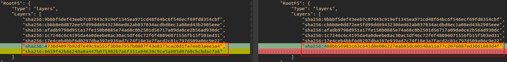

# openshift 安装定制调研

## openshift新版本制作定制调研

分析得到的一些原理：
* release-manifests的yaml配置文件，就是从console-operator等镜像中提取出来的！
* 直接修改release-manifests里面的yaml配置，是可以安装(或升级)生效的

#### 定制新版本 - 直接修改release镜像的yaml配置文件

这种方法临时测试使用，最好还是通过其他方法（例如CI）生成release版本

首先提取出旧的release镜像的release-manifests的配置文件，然后进行修改，
```diff
diff --git a/release-manifests/0000_50_console-operator_01-operator-config.yaml b/release-manifests/0000_50_console-operator_01-operator-config.yaml
index 7b147a0..5c2a2bd 100644
--- a/release-manifests/0000_50_console-operator_01-operator-config.yaml
+++ b/release-manifests/0000_50_console-operator_01-operator-config.yaml
@@ -10,4 +10,7 @@ metadata:
 spec:
   managementState: Managed
+   customization:
+     customProductName: KylinSec Cloud Console
```

新建Dockerfile内容如下：
```dockerfile
FROM hub.iefcu.cn/xiaoyun/openshift4-arm-4.9.15:4.9.15-arm64

# 使用hub.iefcu.cn
#RUN sed -i -e "s#quay.io/openshift-release-dev/ocp-v4.0-art-dev@sha256:#hub.iefcu.cn/xiaoyun/openshift4-arm-4.9.15@sha256:#g" /release-manifests/*

# 覆盖原来的release
ADD ./release-manifests /release-manifests
```

最后构建临时release镜像版本
```bash
docker build -t hub.iefcu.cn/xiaoyun/kcp-release:0411-tmp-test-4.9.15-arm64 .
docker push hub.iefcu.cn/xiaoyun/kcp-release:0411-tmp-test-4.9.15-arm64
```

安装测试发现console标题修改成功了!

#### 定制新版本 - 通过修改console-operator镜像的yaml配置

提取出旧的console-operator的yaml配置文件，然后进行修改
```diff
diff --git a/01-operator-config.yaml b/01-operator-config.yaml
index c7131eb..5c2a2bd 100644
--- a/01-operator-config.yaml
+++ b/01-operator-config.yaml
@@ -9,3 +9,8 @@ metadata:
     release.openshift.io/create-only: "true"
 spec:
   managementState: Managed
+  customization:
+    customLogoFile:
+      key: Kylin_logo.png
+      name: kylinlogo
+    customProductName: KylinSec Cloud Console
diff --git a/05-config.yaml b/05-config.yaml
index f70e8b3..1db7f9a 100644
--- a/05-config.yaml
+++ b/05-config.yaml
@@ -1,5 +1,45 @@
 apiVersion: v1
 kind: ConfigMap
+metadata:
+  name: kylinlogo
+  namespace: openshift-config
+  annotations:
+    include.release.openshift.io/ibm-cloud-managed: "true"
+    include.release.openshift.io/self-managed-high-availability: "true"
+    include.release.openshift.io/single-node-developer: "true"
+    release.openshift.io/create-only: "true"
+binaryData:
+  Kylin_logo.png: xxx...xxx
+---
+apiVersion: v1
+kind: ConfigMap
+metadata:
+  name: kylinlogo
+  namespace: openshift-console-operator
+  annotations:
+    include.release.openshift.io/ibm-cloud-managed: "true"
+    include.release.openshift.io/self-managed-high-availability: "true"
+    include.release.openshift.io/single-node-developer: "true"
+    release.openshift.io/create-only: "true"
+binaryData:
+  Kylin_logo.png: xxx...xxx
+---
+apiVersion: v1
+kind: Secret
+metadata:
+  name: kylin-login-template
+  namespace: openshift-config
+  annotations:
+    include.release.openshift.io/ibm-cloud-managed: "true"
+    include.release.openshift.io/self-managed-high-availability: "true"
+    include.release.openshift.io/single-node-developer: "true"
+    release.openshift.io/create-only: "true"
+type: Opaque
+data:
+  login.html: xxx...xxx
+---
+apiVersion: v1
+kind: ConfigMap
 metadata:
   namespace: openshift-console-operator
   name: console-operator-config
```

**这个修改，发现新增额外的k8s资源，需要添加如下声明参数，否则不会创建，验证了好多次才猜测出来！！**
```yaml
metadata:
  annotations:
    include.release.openshift.io/ibm-cloud-managed: "true"
    include.release.openshift.io/self-managed-high-availability: "true"
    include.release.openshift.io/single-node-developer: "true"
    release.openshift.io/create-only: "true"
```

然后创建Dockerfile内容如下
```dockerfile
from hub.iefcu.cn/xiaoyun/openshift4-aarch64:4.9.0-rc.6-arm64-console-operator

# oc image extract -a ~/tmp/pull-secret.json --path /:/home/adam/tmp/4.9.0-rc6-arm64-console-operator-rootfs hub.iefcu.cn/xiaoyun/openshift4-aarch64:4.9.0-rc.6-arm64-console-operator

# 替换operator-config.yaml文件内容
COPY ./01-operator-config.yaml /manifests/01-operator-config.yaml
COPY ./05-config.yaml /manifests/05-config.yaml
```

最后编写adam.sh编译构建生成新的release镜像!
```bash
console_image=hub.iefcu.cn/xiaoyun/tmp
console_tag=0413-4.9.0-rc.6-arm64-console-operator

docker build -t ${console_image}:${console_tag} .
docker push ${console_image}:${console_tag}
console_image_sha256="${console_image}@`skopeo inspect --format "{{ .Digest }}" "docker://$console_image:$console_tag"`"

origin_release=hub.iefcu.cn/xiaoyun/kcp-release:4.9.0-rc.6-arm64-hub.iefcu.cn
new_image=hub.iefcu.cn/xiaoyun/kcp-release
new_tag=0413-console-operator-test
oc adm release new -a ~/tmp/pull-secret.json -n origin \
  --from-release=$origin_release \
  --to-image=$new_image:$new_tag \
  console-operator=${console_image_sha256}

# 还是需要使用sha256去更新!
echo "oc adm upgrade --force --to-image $new_image@`skopeo inspect --format "{{ .Digest }}" "docker://$new_image:$new_tag"` --allow-explicit-upgrade"
```

安装这个release版本，kylinlogo这个自定义配置就在安装完成时配置好了!

#### TODO:

* 从console-operator中入手，研究console的定制! => 也失败，console config成功，但是额外的configmap一直都没有！

* 关键字《openshift安装新增configmap?》 => 无更多信息
  《openshift install customize》=> 找到openshift-install的定制更多资料

* 尝试修改release-manifest的console-operator的标题配置，用来自定义安装验证。 => ok

* okd安装？ https://github.com/openshift/okd/releases
  quay.io/openshift/okd:4.9.0-0.okd-2022-02-12-140851

* cluster-version-operator原理了解!

* release-manifests是怎么生成的，能搜索到相关文档吗？ => 大致看完了manifest内容
  先大致看玩所有的yaml文件内容吧!

  oc get ConsoleQuickStart explore-pipelines
  这个yaml有icon图片

* 关键字《openshift cluster version 制作》? => 没啥资料

关键字《openshift release-manifest制作》 =》 没啥信息
《openshift release-manifest 版本》同上 
《openshift cluster version制作》 => 都是升级版本的内容
《openshift离线更新集群?》
《OKD release 定制》=> 没啥信息

### 列举目前可能需要定制的点

* kylinlogo定制修改了
* operaterhub catalog定制
* sample 编译镜像定制
* 尝试新增yaml配置文件，来定制安装ocp集群! 例如安装好metallb!
  以及修改一些监控告警啥的，禁用掉。
  grafana面板也可以改掉。。。

### 问题:
* 在0000_50_console-operator_01-operator-config.yaml配置中，新增加一个kylinlogo的configmap，发现居然没有生效，为什么？
猜测： 1.参考其他openshift-config命名空间的congfigmap
2.可能是openshift-config-operator创建管理这些configmap?
3.可能openshift-config命名空间还没有创建！


TODO: 禁用自动升级检测机制。
unamanged可以不被cvo管理，不自动还原!。

## 其他

https://access.redhat.com/documentation/zh-cn/openshift_container_platform/4.5/pdf/updating_clusters/openshift_container_platform-4.5-updating_clusters-zh-cn.pdf
```bash
oc get clusterversion -o json|jq ".items[0].spec"
获取更新频道, 例如: stable-4.8

{
  "channel": "stable-4.8",
  "clusterID": "711b9e46-6ffd-4662-9bab-c61dfc9d6cc6"
}
```

=> 是不是可选的？
[10.5. 创建镜像签名配置映射](https://access.redhat.com/documentation/zh-cn/openshift_container_platform/4.9/html/updating_clusters/updating-restricted-network-image-signature-configmap)
在更新集群前，需要手动创建包含您使用的发行版本镜像签名的配置映射。此签名允许 Cluster Version Operator（CVO）通过比较预期的及实际镜像签名来验证发行的镜像没有被修改。

如果要从 4.4.8 或更高版本升级,您可以使用 oc CLI 创建配置映射。如果您是从更早的版本升级，则必须使用手动方法。

签名获取地址:
https://mirror.openshift.com/pub/openshift-v4/signatures/openshift/release/sha256%3D3346753e84ce5dfb7b36b5926072d417263321aafb061e8b7d7ba9f32651682f/


[Cluster Version Operator (CVO) overrides](https://docs.openshift.com/container-platform/4.9/architecture/architecture-installation.html)


检查release镜像，应该是需要从release-manifest入手，其他基础层次镜像没啥关系
但是也可能是operator代码写死了一些配置？ 例如说promethues的url配置

oc adm release info hub.iefcu.cn/xiaoyun/kcp-release:4.9.0-rc6-arm64-jit-0304-console
可以看到release的样子?

clusterserviceversion 管理决定这个内置operator的配置，数量等！
clusterversion

```bash
oc get clusterversion -A
NAME      VERSION   AVAILABLE   PROGRESSING   SINCE   STATUS
version   4.8.9     True        False         103d    Error while reconciling 4.8.9: the cluster operator insights is degraded
```

oc edit console.operator.openshift.io/cluster
修改console cluster的配置

```bash
apiVersion: operator.openshift.io/v1
kind: Console
metadata:
  annotations:
    include.release.openshift.io/ibm-cloud-managed: "true"
    include.release.openshift.io/self-managed-high-availability: "true"
    include.release.openshift.io/single-node-developer: "true"
    release.openshift.io/create-only: "true"
  name: cluster
spec:
  customization:
    customLogoFile:
      key: Kylin_logo.png
      name: kylinlogo
    customProductName: KylinSec Cloud Console
  logLevel: Normal
  managementState: Managed
  operatorLogLevel: Normal
```


#### 临时做一个新的release-manifest版本来测试

```bash
podman create --name 4.9.15-arm64 hub.iefcu.cn/xiaoyun/openshift4-arm-4.9.15:4.9.15-arm64-hub.iefcu.cn

podman cp 4.9.15-arm64:/release-manifests ./
# 然后修改release-manifests里面的yaml配置

# TODO: 使用这个解压? 解压出来就是release-manifests的yaml配置文件
#oc adm release extract --registry-config=./pull_secret.txt --from=quay.io/openshift-release-dev/ocp-release:4.1.15 --to=/tmp/mystuff

oc adm release extract --from=hub.iefcu.cn/xiaoyun/kcp-release:4.9.0-rc.6-arm64-hub.iefcu.cn --to=/home/adam/tmp/mystuff
```

修改内容如下:
```diff
diff --git a/release-manifests/0000_50_console-operator_01-operator-config.yaml b/release-manifests/0000_50_console-operator_01-operator-config.yaml
index c7131eb..7b147a0 100644
--- a/release-manifests/0000_50_console-operator_01-operator-config.yaml
+++ b/release-manifests/0000_50_console-operator_01-operator-config.yaml
@@ -9,3 +9,5 @@ metadata:
     release.openshift.io/create-only: "true"
 spec:
   managementState: Managed
+  customization:
+    customProductName: KylinSec Cloud Console
```
后续将kylinlog这个configmap放到这个配置文件中，以及新建yaml配置文件0000_50_console-operator_03-configmap.yaml
均无法创建成功kyklinlog这个configmap

最后构建新的dockerfile进行测试
```dockerfile
FROM hub.iefcu.cn/xiaoyun/openshift4-arm-4.9.15:4.9.15-arm64

# 使用hub.iefcu.cn
#RUN sed -i -e "s#quay.io/openshift-release-dev/ocp-v4.0-art-dev@sha256:#hub.iefcu.cn/xiaoyun/openshift4-arm-4.9.15@sha256:#g" /release-manifests/*

# 覆盖原来的release
ADD ./release-manifests /release-manifests
```

```bash
docker build -t hub.iefcu.cn/xiaoyun/kcp-release:0411-tmp-test-4.9.15-arm64 .
docker push hub.iefcu.cn/xiaoyun/kcp-release:0411-tmp-test-4.9.15-arm64
```

#### 制作新版本

TODO:
关键字《openshift create new release from image stream》

oc adm release new 创建一个新的release版本？

https://docs.openshift.com/container-platform/4.8/cli_reference/openshift_cli/administrator-cli-commands.html#oc-adm-release-new

```bash
# Create a release from the latest origin images and push to a DockerHub repo
oc adm release new --from-image-stream=4.1 -n origin --to-image docker.io/mycompany/myrepo:latest

# Create a new release with updated metadata from a previous release
oc adm release new --from-release registry.svc.ci.openshift.org/origin/release:v4.1 --name 4.1.1 \
--previous 4.1.0 --metadata ... --to-image docker.io/mycompany/myrepo:latest

# Create a new release and override a single image
oc adm release new --from-release registry.svc.ci.openshift.org/origin/release:v4.1 \
cli=docker.io/mycompany/cli:latest --to-image docker.io/mycompany/myrepo:latest

# Run a verification pass to ensure the release can be reproduced
oc adm release new --from-release registry.svc.ci.openshift.org/origin/release:v4.1
```


[Dump OpenShift release information](https://openshift.tips/oc/)

```
oc adm release info quay.io/openshift-release-dev/ocp-release:<version>

# 获取所有的release-manifests yaml配置文件
oc adm release info --contents quay.io/openshift-release-dev/ocp-release:<version>

# 获取所有镜像的源码，commit id
oc adm release info --commits quay.io/openshift-release-dev/ocp-release:<version>
```


#### 使用RHCOS的extensions扩展系统工具

[修改镜像，制作新版本！](https://pradiptabanerjee.medium.com/working-with-red-hat-enterprise-linux-coreos-extensions-1cbb31bbaa30)

需求场景
> Add a new RHCOS extension — qemu-img to be deployed via OpenShift Machine Config Operator (MCO)
At a high level adding and deploying a new RHCOS extension consists of the following steps:
* 1.Create new machine-os-content by adding the (extension) package and its dependencies.
* 2.Create a new machine config operator (MCO) image with changes to add support for the new extension.
* 3.Create an OpenShift release image with the new machine-os-content and MCO.
* 4.Deploy/Upgrade OpenShift cluster using the new image.
* 5.Create a machineconfig object to deploy the extension.
* 6.Verify the extension.

##### Creating new machine-os-content

先解压旧的machine-os-content内容，查看里面的信息
```bash
oc image extract -a ~/tmp/pull-secret.json --path /:/home/adam/tmp/extracted-oscontent quay.io/openshift-release-dev/ocp-v4.0-art-dev@sha256:ecfac365596289b8474e6a0f0bffea996e04b0bdd1379e8fb4776b8e3ef2af1b
```

##### 制作新版本镜像

问题：
* 这里做新版本的时候，没有指定新版本号，以及兼容升级版本？

```bash
# 版本 4.9.0-rc6-arm64 替换console镜像, 4.9.0-rc.6-arm64-0304-zhouming-console
oc adm -a ~/tmp/pull-secret.json release new -n origin \
  --from-release=hub.iefcu.cn/xiaoyun/kcp-release:4.9.0-rc.6-arm64-hub.iefcu.cn \
  --to-image=hub.iefcu.cn/xiaoyun/kcp-release:0412-test_4.9.0-rc.6-arm64-hub.iefcu.cn \
  console=hub.iefcu.cn/xiaoyun/openshift4-aarch64:4.9.0-rc.6-arm64-0304-zhouming-console
```
发现跟手动改release-manifests里面的配置文件，效果是差不多的。就是多改了一些metadata配置。

就是release-manifests这一层镜像变化!


```diff
diff --git a/0000_50_console-operator_07-operator-ibm-cloud-managed.yaml b/0000_50_console-operator_07-operator-ibm-cloud-managed.yaml
index ff57cc3..519c5a0 100644
--- a/0000_50_console-operator_07-operator-ibm-cloud-managed.yaml
+++ b/0000_50_console-operator_07-operator-ibm-cloud-managed.yaml
@@ -28,7 +28,7 @@ spec:
         - operator
         env:
         - name: CONSOLE_IMAGE
-          value: hub.iefcu.cn/xiaoyun/openshift4-aarch64@sha256:000b6a5917376b934aa623e585b943c47a5db32e7ceb6613e0d02de7aa003305
+          value: hub.iefcu.cn/xiaoyun/openshift4-aarch64:4.9.0-rc.6-arm64-0304-zhouming-console
         - name: DOWNLOADS_IMAGE
           value: hub.iefcu.cn/xiaoyun/openshift4-aarch64@sha256:106f385f7b4b6f26d594c70692783bb0d7d2356d6aec53dc402568ff6e953d40
         - name: RELEASE_VERSION
diff --git a/0000_50_console-operator_07-operator.yaml b/0000_50_console-operator_07-operator.yaml
index 0f0e90c..60e50f2 100644
--- a/0000_50_console-operator_07-operator.yaml
+++ b/0000_50_console-operator_07-operator.yaml
@@ -56,7 +56,7 @@ spec:
           name: serving-cert
         env:
         - name: CONSOLE_IMAGE
-          value: hub.iefcu.cn/xiaoyun/openshift4-aarch64@sha256:000b6a5917376b934aa623e585b943c47a5db32e7ceb6613e0d02de7aa003305
+          value: hub.iefcu.cn/xiaoyun/openshift4-aarch64:4.9.0-rc.6-arm64-0304-zhouming-console
         - name: DOWNLOADS_IMAGE
           value: hub.iefcu.cn/xiaoyun/openshift4-aarch64@sha256:106f385f7b4b6f26d594c70692783bb0d7d2356d6aec53dc402568ff6e953d40
         - name: RELEASE_VERSION
diff --git a/image-references b/image-references
index c8f1a05..638159f 100644
--- a/image-references
+++ b/image-references
@@ -3,10 +3,10 @@
   "apiVersion": "image.openshift.io/v1",
   "metadata": {
     "name": "4.9.0-rc.6",
-    "creationTimestamp": "2021-10-08T10:02:15Z",
+    "creationTimestamp": "2022-04-12T07:23:53Z",
     "annotations": {
       "release.openshift.io/from-image-stream": "ocp-arm64/4.9-art-latest-arm64-2021-10-07-192248",
-      "release.openshift.io/from-release": "registry.ci.openshift.org/ocp-arm64/release-arm64:4.9.0-0.nightly-arm64-2021-10-07-192248"
+      "release.openshift.io/from-release": "hub.iefcu.cn/xiaoyun/kcp-release:4.9.0-rc.6-arm64-hub.iefcu.cn"
     }
   },
   "spec": {
@@ -782,13 +782,14 @@
       {
         "name": "console",
         "annotations": {
-          "io.openshift.build.commit.id": "1bd4607153c8031262f6db5d6a61b20fe4292ce3",
+          "io.openshift.build.commit.id": "",
           "io.openshift.build.commit.ref": "",
-          "io.openshift.build.source-location": "https://github.com/openshift/console"
+          "io.openshift.build.source-location": "",
+          "io.openshift.release.override": "true"
         },
         "from": {
           "kind": "DockerImage",
-          "name": "hub.iefcu.cn/xiaoyun/openshift4-aarch64@sha256:000b6a5917376b934aa623e585b943c47a5db32e7ceb6613e0d02de7aa003305"
+          "name": "hub.iefcu.cn/xiaoyun/openshift4-aarch64:4.9.0-rc.6-arm64-0304-zhouming-console"
         },
         "generation": 1,
         "importPolicy": {},
```

发现没有权限提交镜像，需要认证！ 加上认证密钥参数即可: -a ~/tmp/pull-secret.json

##### 升级新版本

```bash
oc adm upgrade --force --to-image hub.iefcu.cn/xiaoyun/kcp-release:0412-test_4.9.0-rc.6-arm64-hub.iefcu.cn --allow-explicit-upgrade

oc adm upgrade --force --to-image hub.iefcu.cn/xiaoyun/kcp-release:0413-console-operator-test --allow-explicit-upgrade
```

```bash
[core@master1 ~]$ oc adm upgrade --force --to-image hub.iefcu.cn/xiaoyun/kcp-release:0412-test_4.9.0-rc.6-arm64-hub.iefcu.cn --allow-explicit-upgrade                                                      
warning: Using by-tag pull specs is dangerous, and while we still allow it in combination with --force for backward compatibility, it would be much safer to pass a by-digest pull spec instead
warning: The requested upgrade image is not one of the available updates.  You have used --allow-explicit-upgrade to the update to proceed anyway
warning: --force overrides cluster verification of your supplied release image and waives any update precondition failures.
Updating to release image hub.iefcu.cn/xiaoyun/kcp-release:0412-test_4.9.0-rc.6-arm64-hub.iefcu.cn

# 这里会在openshift-cluster-version生成一个job，拉取manifest?
NAME      VERSION      AVAILABLE   PROGRESSING   SINCE   STATUS
version   4.9.0-rc.6   True        True          10s     Working towards hub.iefcu.cn/xiaoyun/kcp-release:0412-test_4.9.0-rc.6-arm64-hub.iefcu.cn: downloading update
# mv /manifests /etc/cvo/updatepayloads/ZoHiFro12dO1Wim2_hjtag/manifests
# mv /release-manifests /etc/cvo/updatepayloads/ZoHiFro12dO1Wim2_hjtag/release-manifests

NAME      VERSION      AVAILABLE   PROGRESSING   SINCE   STATUS
version   4.9.0-rc.6   True        True          46s     Working towards 4.9.0-rc.6: 240 of 735 done (32% complete)

NAME      VERSION      AVAILABLE   PROGRESSING   SINCE   STATUS
version   4.9.0-rc.6   True        True          2m8s    Working towards 4.9.0-rc.6: 577 of 735 done (78% complete)

NAME      VERSION      AVAILABLE   PROGRESSING   SINCE   STATUS
version   4.9.0-rc.6   True        True          7m4s    Working towards 4.9.0-rc.6: 578 of 735 done (78% complete), waiting up to 40 minutes on insights
# 查看openshift-cluster-version下pod的日志，发现是应用insight operator失败导致的！

E0413 02:04:40.580383       1 task.go:112] error running apply for clusteroperator "insights" (522 of 735): Cluster operator insights is degraded

# 最终升级失败!
NAME      VERSION      AVAILABLE   PROGRESSING   SINCE   STATUS
version   4.9.0-rc.6   True        True          43m     Unable to apply 4.9.0-rc.6: wait has exceeded 40 minutes for these operators: insights

# 参考《Restoring a degraded Insights Operator》
https://docs.openshift.com/container-platform/4.9/post_installation_configuration/connected-to-disconnected.html#connected-to-disconnected-restore-insights_connected-to-disconnected
=> 就是修改pull-secret， 去除掉 cloud.openshift.com 配置

解决了insight operator degrade的问题，最终升级成功了！！！
```

注意：版本不支持降级! 而且做的新版本是tag的形式，后续还是需要改成sha256的形式!

[cluster-version升级流程](https://github.com/openshift/enhancements/blob/master/dev-guide/cluster-version-operator/user/update-workflow.md)

The Cluster Version Operator (CVO) runs in every cluster. CVO is in charge of performing updates to the cluster. It does this primarily by updating the manifests for all of the Second-Level Operators.

The Cluster Version Operator, like all operators, is driven by its corresponding Operator custom resources.
This custom resource (i.e. clusterversion object) reports the next available updates considered by the CVO.
CVO gets the next available update information from policy engine of OpenShift update service (OSUS).
OSUS is part of the cluster version object.
This allows the cluster updates to be driven both by the console, OC command line interface and by modifying the clusterversion object manually.
Also clusterversion object can modified to direct the CVO to the policy engine API endpoint provided by any OSUS instance.


The series of steps that the Cluster Version Operator follows is detailed below:

1. CVO sleeps for a set duration of time plus some jitter.
2. CVO checks in to the upstream Policy Engine, downloading the latest update graph for the channel to which it’s subscribed.
3. CVO determines the next update(s) in the graph and writes them to the "available updates" field in its Operator custom resource.
    1. If there are no updates available, CVO goes back to step 1.
4. If automatic updates are enabled, CVO writes the newest update into the "desired update" field in its Operator custom resource.
5. CVO waits for the "desired update" field in its Operator custom resource to be set to something other than its current version.
6. CVO instructs the local container runtime to download the image specified in the "desired update" field.
7. CVO validates the digest in the downloaded image and verifies that it was signed by the private half of one of its hard coded keys.
    1. If the image is invalid, it is removed from the local system and CVO goes back to step 1.
8. CVO validates that the downloaded image can be applied to the currently running version by inspecting `release-metadata`.
    1. If the image cannot be applied, it is removed from the local system and CVO goes back to step 1.
9. CVO applies the deployment for itself, triggering Kubernetes to replace CVO with a newer version.
10. CVO applies the remainder of the deployments from the downloaded image, in order, triggering the SLOs to begin updating.
11. CVO waits for all of the SLOs to report that they are in a done state.
12. CVO goes back to step 1.


## 其他资料，待研究

[openshift-install cluster customiszation](https://github.com/openshift/installer/blob/master/docs/user/customization.md)

## 参考文档

* [修改镜像，制作新版本！](https://pradiptabanerjee.medium.com/working-with-red-hat-enterprise-linux-coreos-extensions-1cbb31bbaa30)
* [openshift tips - oc命令使用](https://openshift.tips/oc/)
* [okd 4.8 gitbook doc](https://www.bookstack.cn/read/okd-4.8-en/95df180372eb5567.md)
* [okd faq - 很多问题不错](https://www.okd.io/faq/)
