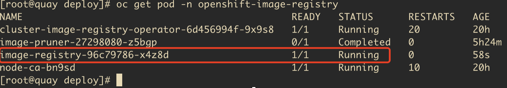

# 内部registry镜像仓库配置使用

## 启用内部registry镜像仓库

前提条件，需要有存储

#### 1. 使用oc客户端，确认没有registry容器运行

```bash
oc get pod -n openshift-image-registry
```

#### 2. 然后修改registry配置, 配置pvc使用，启用registry

```
oc edit configs.imageregistry.operator.openshift.io
```

修改镜像存储为自动申请一个pvc (claim的值留空即可)
```
storage:
  pvc:
    claim:
```

修改 managementState: Removed 为 managementState: Managed

patch命令搞定
```
oc patch configs.imageregistry.operator.openshift.io cluster --type merge --patch '{"spec":{"managementState":"Managed"}}'
oc patch configs.imageregistry.operator.openshift.io cluster --type merge --patch '{"spec":{"storage":{"pvc":{"claim":""}}}}'
```

将镜像 registry 存储设置为空目录 (非生产集群使用)
```
oc patch configs.imageregistry.operator.openshift.io cluster --type merge --patch '{"spec":{"storage":{"emptyDir":{}}}}'
```

#### 4. 确认registry容器启动最终效果：

```bash
oc -n openshift-image-registry get pods
```



## 使用内部镜像仓库

需要配置信任证书, 而且必须匹配namespaces，有权限限制

关键就是 image-registry.openshift-image-registry.svc:5000

#### 访问镜像仓库  

需要使用token登录
```bash
oc login --token=sha256~zjtunSwZ6R9GnQm72QkgsMjJXz9-gIfNljIpiA3BNQw --server=https://api.kcp2-arm.iefcu.cn:6443

podman login -u kubeadmin -p $(oc whoami -t) image-registry.openshift-image-registry.svc:5000
```

## 暴露内部registry给外面使用

创建默认路由
```bash
oc patch configs.imageregistry.operator.openshift.io/cluster --patch '{"spec":{"defaultRoute":true}}' --type=merge
```

获取证书
```bash
oc get secret -n openshift-ingress  router-certs-default -o go-template='{{index .data "tls.crt"}}' | base64 -d | sudo tee /etc/pki/ca-trust/source/anchors/${HOST}.crt  > /dev/null
# 更新证书信任
sudo update-ca-trust enable
```

```
podman login -u kubeadmin -p $(oc whoami -t) $HOST
```

### 使用自定义路由公开registry

#### 1. 使用路由的 TLS 密钥创建一个 secret

```
oc create secret tls public-route-tls \
    -n openshift-image-registry \
    --cert=ssl.cert \
    --key=ssl.key
```

#### 2. 在 Registry Operator 中

```
spec:
  routes:
    - name: public-routes
      hostname: quay.iefcu.cn
      secretName: public-route-tls
```

一行命令处理
```
oc patch configs.imageregistry.operator.openshift.io cluster --type merge --patch '{"spec":{"routes":[{"name":"public-routes","hostname":"quay.iefcu.cn","secretName":"public-route-tls"}]}}'
```

## 参考文档

* [访问内部镜像仓库](https://docs.openshift.com/container-platform/4.6/registry/accessing-the-registry.html)
* [私有镜像仓库配置](https://docs.openshift.com/container-platform/4.8/registry/configuring_registry_storage/configuring-registry-storage-baremetal.html)
* [暴露私有镜像仓库](https://docs.openshift.com/container-platform/4.8/registry/securing-exposing-registry.html)
