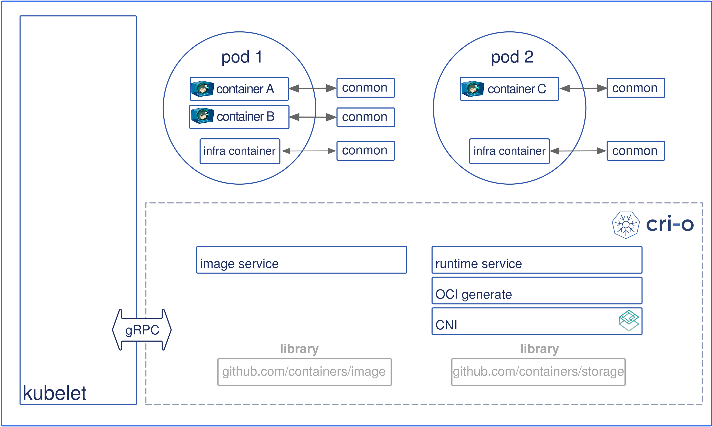
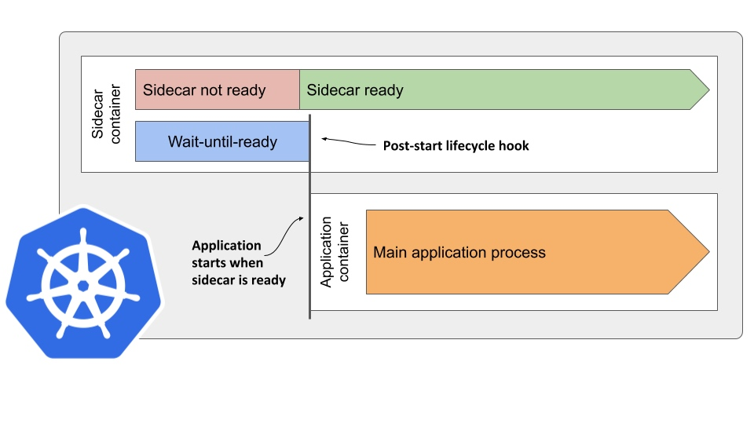

# openshift kubelet启动流程调研

TODO:
* 关键字《openshift 节点启动顺序
  => 没啥信息
* 关键字《kubelet启动顺序》《kubelet启动逻辑》
  => kubelet如何启动那么多pods的，除了静态pods?
* kubelet是通过sync pods来启动pods的吗，看别人的分析逻辑
  => SyncLoop ADD, kubelet开始调用crio启动容器
* 加大kubelet日志级别，观察pods启动顺序
  => 先启动static-pods, 然后api调用启动其他pods
* 查看调试kubelet代码，添加日志？
  => OK，看到了更多的日志

## master节点服务启动顺序分析

首先获取点火文件，就可以得到openshift节点的相关服务？
* crio
  => 基础容器服务, 没啥好说的把? 看看有啥配置
* kubelet
  => **依赖crio服务, openshift核心服务**
* machine-config-daemon-firstboot等相关服务
  => 只会在第一次配置中使用
* openvswitch.service等相关服务
  => 基础网络组件, 不用管
* 其他...

#### crio大致分析

就是等kubelet调用，启动容器吧!
验证，禁用kubelet服务，节点crio还会启动容器么？
=> crio服务指明需要在kubelet服务之前启动，如果禁用kubelet服务，那么crio也会自动禁用？
=> 如果此时启动crio服务，则会清空之前的容器sandbox相关数据，不好。

有节点ip地址配置
```
systemctl cat crio

# /etc/systemd/system/crio.service.d/20-nodenet.conf
[Service]
Environment="CONTAINER_STREAM_ADDRESS=192.168.100.15"
```

有其他配置/etc/crio/crio.conf
```
cat /etc/crio/crio.conf | grep -v "#"  | sed '/^$/d' |grep -i pids_limit
pids_limit = 1024
```

#### kubelet分析

重要static pods启动日志
```
kubelet.go:2076] "SyncLoop ADD" source="file" pods=[openshift-kube-scheduler/openshift-kube-scheduler-master1.kcp5-arm.iefcu.cn openshift-etcd/etcd-master1.kcp5-arm.iefcu.cn openshift-kube-apiserver/kube-apiserver-master1.kcp5-arm.iefcu.cn openshift-kube-controller-manager/kube-controller-manager-master1.kcp5-arm.iefcu.cn]
```

启动服务相关参数
(确认它访问的是位于“/var/run/crio/crio.sock”的基于CRI-O的“container-runtime-endpoint”。)
```
ExecStart=/usr/bin/hyperkube \
    kubelet \
      --config=/etc/kubernetes/kubelet.conf \
      --bootstrap-kubeconfig=/etc/kubernetes/kubeconfig \
      --kubeconfig=/var/lib/kubelet/kubeconfig \
      --container-runtime=remote \
      --container-runtime-endpoint=/var/run/crio/crio.sock \
      --runtime-cgroups=/system.slice/crio.service \
      --node-labels=node-role.kubernetes.io/master,node.openshift.io/os_id=${ID} \
      --node-ip=${KUBELET_NODE_IP} \
      --minimum-container-ttl-duration=6m0s \
      --cloud-provider= \
      --volume-plugin-dir=/etc/kubernetes/kubelet-plugins/volume/exec \
       \
      --hostname-override=${KUBELET_NODE_NAME} \
      --register-with-taints=node-role.kubernetes.io/master=:NoSchedule \
      --pod-infra-container-image=hub.iefcu.cn/xiaoyun/openshift4-aarch64@sha256:3c20534a631d355ae736f0e1425b791f911ee555d6f64c3b89af87cd30caa>
      --system-reserved=cpu=${SYSTEM_RESERVED_CPU},memory=${SYSTEM_RESERVED_MEMORY} \
      --v=${KUBELET_LOG_LEVEL}
```

kubelet配置文件: /etc/kubernetes/kubelet.conf
```yaml
kind: KubeletConfiguration
apiVersion: kubelet.config.k8s.io/v1beta1
authentication:
  x509:
    clientCAFile: /etc/kubernetes/kubelet-ca.crt
  anonymous:
    enabled: false
cgroupDriver: systemd
cgroupRoot: /
clusterDNS:
  - 172.30.0.10
clusterDomain: cluster.local
containerLogMaxSize: 50Mi
maxPods: 250
kubeAPIQPS: 50
kubeAPIBurst: 100
rotateCertificates: true
serializeImagePulls: false
staticPodPath: /etc/kubernetes/manifests
systemCgroups: /system.slice
systemReserved:
  ephemeral-storage: 1Gi
...
```

#### kubelet 启动流程分析

[kubelet源码解析-启动流程与POD处理(上)](https://itech.red/2020/12/kubelet%E6%BA%90%E7%A0%81%E8%A7%A3%E6%9E%90-%E5%90%AF%E5%8A%A8%E6%B5%81%E7%A8%8B%E4%B8%8Epod%E5%A4%84%E7%90%86%E4%B8%8A/)
* 节点管理：节点注册、节点状态更新(定期心跳)
* **pod管理：接受来自apiserver、file、http等PodSpec，并确保这些 PodSpec 中描述的容器处于运行状态且运行状况良好**
* 容器健康检查：通过ReadinessProbe、LivenessProbe两种探针检查容器健康状态
* 资源监控：通过 cAdvisor 获取其所在节点及容器的监控数据


参考: https://zhuanlan.zhihu.com/p/111240749

run
run 方法中主要是为 kubelet 的启动做一些基本的配置及检查工作，主要逻辑为：

1、为 kubelet 设置默认的 FeatureGates，kubelet 所有的 FeatureGates 可以通过命令参数查看，k8s 中处于 Alpha 状态的 FeatureGates 在组件启动时默认关闭，处于 Beta 和 GA 状态的默认开启；
2、校验 kubelet 的参数；
3、尝试获取 kubelet 的 lock file，需要在 kubelet 启动时指定 --exit-on-lock-contention 和 --lock-file，该功能处于 Alpha 版本默认为关闭状态；
4、将当前的配置文件注册到 http server /configz URL 中；
5、检查 kubelet 启动模式是否为 standalone 模式，此模式下不会和 apiserver 交互，主要用于 kubelet 的调试；
  => bootstrap节点就是这种kubelet吧?
6、初始化 kubeDeps，kubeDeps 中包含 kubelet 的一些依赖，主要有 KubeClient、EventClient、HeartbeatClient、Auth、cadvisor、ContainerManager；
7、检查是否以 root 用户启动；
8、为进程设置 oom 分数，默认为 -999，分数范围为 [-1000, 1000]，越小越不容易被 kill 掉；
9、调用 RunKubelet 方法；
10、检查 kubelet 是否启动了动态配置功能；
11、启动 Healthz http server；
12、如果使用 systemd 启动，通知 systemd kubelet 已经启动；

Run
Run 方法是启动 kubelet 的核心方法，其中会启动 kubelet 的依赖模块以及主循环逻辑，该方法的主要逻辑为：

1、注册 logServer；
2、判断是否需要启动 cloud provider sync manager；
3、调用 kl.initializeModules 首先启动不依赖 container runtime 的一些模块；
4、启动 volume manager；
5、执行 kl.syncNodeStatus 定时同步 Node 状态；
6、调用 kl.fastStatusUpdateOnce 更新容器运行时启动时间以及执行首次状态同步；
7、判断是否启用 NodeLease 机制；
8、执行 kl.updateRuntimeUp 定时更新 Runtime 状态；
9、执行 kl.syncNetworkUtil 定时同步 iptables 规则；
10、执行 kl.podKiller 定时清理异常 pod，当 pod 没有被 podworker 正确处理的时候，启动一个goroutine 负责 kill 掉 pod；
11、启动 statusManager；
12、启动 probeManager；
13、启动 runtimeClassManager；
14、启动 pleg；
15、调用 kl.syncLoop 监听 pod 变化；
  => kubelet获取到node节点的pods，然后跟crio对比，然后启动容器吧？


总结
本文主要介绍了 kubelet 的启动流程，可以看到 kubelet 启动流程中的环节非常多，kubelet 中也包含了非常多的模块，后续在分享 kubelet 源码的文章中会先以 Run 方法中启动的所有模块为主，各个击破。


[kubelet启动流程](https://www.cnblogs.com/qinghe123/p/13345919.html)

kubelet 主要功能：　

pod 管理：kubelet 定期从所监听的数据源获取节点上 pod/container 的期望状态（运行什么容器、运行的副本数量、网络或者存储如何配置等等），并调用对应的容器平台接口达到这个状态。

容器健康检查：kubelet 创建了容器之后还要查看容器是否正常运行，如果容器运行出错，就要根据 pod 设置的重启策略进行处理。

容器监控：kubelet 会监控所在节点的资源使用情况，并定时向 master 报告，资源使用数据都是通过 cAdvisor 获取的。知道整个集群所有节点的资源情况，对于 pod 的调度和正常运行至关重要


#### kubelet日志修改，查看详细启动过程日志

先直接修改文件吧
```bash
systemctl cat kubelet

cat /etc/systemd/system/kubelet.service.d/20-logging.conf
[Service]
Environment="KUBELET_LOG_LEVEL=2"
```

获取目前的kubelet配置
```bash
oc get machineconfig

oc describe machineconfig 01-master-kubelet | grep '\--config'
      --config=/etc/kubernetes/kubelet.conf \
```

创建修改节点的Kubelet配置
```bash
cat << EOF | oc apply -f -
apiVersion: machineconfiguration.openshift.io/v1
kind: KubeletConfig
metadata:
  name: set-max-pods
spec:
  machineConfigPoolSelector:
    matchLabels:
      custom-kubelet: large-pods
  kubeletConfig:
    maxPods: 500
    logLevel: 10
EOF
```

配置mc-pool使用上述kubelet配置
(节点会重启生效)
```bash
oc get machineconfigpool master --show-labels

oc label machineconfigpool master custom-kubelet=large-pods
```

#### kubelet启动容器顺序

* 1.通过文件配置，启动静态pods(/etc/kubernetes/manifests/)
```
kubelet.go:2076] "SyncLoop ADD" source="file" pods=[openshift-kube-scheduler/openshift-kube-scheduler-master1.kcp5-arm.iefcu.cn openshift-etcd/etcd-master1.kcp5-arm.iefcu.cn openshift-kube-apiserver/kube-apiserver-master1.kcp5-arm.iefcu.cn openshift-kube-controller-manager/kube-controller-manager-master1.kcp5-arm.iefcu.cn]
```

* 2.通过api，启动其他pods
```
Jan 24 18:58:51 master1.kcp5-arm.iefcu.cn hyperkube[2278]: I0124 18:58:51.919337    2278 kubelet.go:2076] "SyncLoop ADD" source="api" pods=[openshift-etcd/installer-2-master1.kcp5-arm.iefcu.cn openshift-network-operator/network-operator-84db74549-6f2lb openshift-image-registry/image-pruner-27380160--1-46q8k openshift-machine-config-operator/machine-config-daemon-9phxv openshift-machine-config-operator/machine-config-server-rb
...
```

## OpenShift节点运行容器过程

OpenShift 4的集群节点使用了基于CRI-O的容器运行环境。每个节点的kubelet通过gRPC调用CRI-O，而CRI-O运行符合OCI规范的容器。

1. Kubernetes联系kubelet来启动一个pod。
2. kubelet将请求通过CRI（Container runtime interface，容器运行时接口）转发给CRI-O守护进程，然后来启动新的POD。
3. CRI-O使用从容器注册表中拉取Image。
4. 下载的Image会被解压到容器的根文件系统中。
5. 在为容器创建了根文件系统后，CRI-O会生成一个OCI运行时规范json文件，描述如何使用OCI生成工具运行容器。
6. 然后，CRI-O 使用该规范启动 OCI 兼容运行时以运行容器进程。默认的 OCI Runtime 是 runc。
7. 每个容器由一个单独的conmon（container monitor）进程监控。它处理容器的日志，并记录容器进程的退出代码。
8. pod的网络是通过使用CNI来设置的，所以任何CNI插件都可以和CRI-O一起使用。



## Kubernetes 上如何控制容器的启动顺序？

lifecycle.postStart: 这个webhook没有返回，kubelet就不会拉起pod里面的下一个容器



## 参考资料

* [OpenShift 4 - 节点是如何通过CRI-O运行容器的](https://blog.csdn.net/weixin_43902588/article/details/108484490)
* [Kubernetes 上如何控制容器的启动顺序？](https://atbug.com/k8s-1.18-container-start-sequence-control/)
* [openshift 调试RHCOS节点的实现分析](https://blog.csdn.net/weixin_31162865/article/details/113090208)
* [OpenShift 4 - 用KubeletConfig和ContainerRuntimeConfig分别修改集群节点的Kubelet和cri-o的配置](https://blog.csdn.net/weixin_43902588/article/details/108423700)
