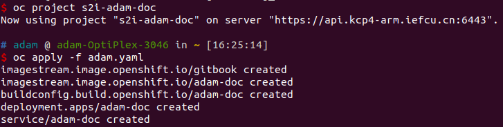

# k8s原理与使用简介分享ppt

分享目标:
* 了解k8s架构
* 简单入门使用k8s
* 为什么要用k8s?
  * k8s部署容器应用的目的
* 为什么要了解k8s的架构
  * 了解原理,设计实现,参考k8s的逻辑,可以编写自己的逻辑
* 可以这样做,以及为什么要这样做?

TODO: 加一个pod亲和性?

关键字[k8s介绍]
=> 这篇文章非常好, 可以提取一些内容出来讲!
[Kubernetes 介绍篇：是什么？为什么要用？](https://xie.infoq.cn/article/406b2d6d573d727425ac8fa73)
亮点 1： Kubernetes以“一切以服务（Service）为中心，一切围绕服务运转”作为指导思想的创新型产品。它在功能和架构设计上始终遵循着这一指导思想，构建在Kubernetes上的系统不仅可以独立运行在物理机、虚拟机集群或企业私有云上，也可以被托管在公有云上。


亮点 2： Kubernetes是一个开放的开发平台。与 J2EE 不同，它不局限于任何一种语言，没有限定任何编程接口，所以不论是用 Java、Go、C++还是 Python 编写的程序，都可以被映射为Kubernetes的 Service，并通过标准的 TCP 通讯协议进行交互。此外，Kubernetes平台对现有的编程语言、编程框架、中间件没有任何侵入性，做到了零侵入，因此现有的系统也很容易改造升级并迁移到Kubernetes平台之上。


亮点 3： Kubernetes的另一个亮点是自动化。在Kubernetes的解决方案中，一个可以自我扩展、自我诊断，并且容易升级，在收到服务扩容的请求后，Kubernetes会触发调度流程，最终在选定的目标节点上启动相应数据的服务实例副本，这些服务实例副本在启动成功后会自动加入负载均衡器中并生效，整个过程无须额外的人工操作。另外，Kubernetes会定时巡查每个服务的所有实例的可用性，确保服务实例的数量始终保持为预期的数量，当它发现某个实例不可用时，会自动重启该实例或者其他节点上重新调度、运行一个新实例，这样一个复杂的过程无须人工干预即可全部自动完成。


亮点 4： Kubernetes是一个完备的分布式系统支撑平台。具备完备的集群管理能力，包括多层次的安全防护和准入机制、多租户应用支撑能力、透明的服务注册和服务发现机制、内建的智能负载均衡器、强大的故障发现和自我修复能力、服务滚动升级和在线扩容能力、可扩展的资源自动调度机制，以及多粒度的资源配额管理能力。同时，Kubernetes提供了完善的管理工具，这些涵盖了包括开发、部署测试、运维监控在内的各个环节。因此，Kubernetes是一个全新的基于容器技术的分布式架构解决方案，并且是一个一站式的完备的分布式系统开发和支持平台。


随着容器化部署环境限制、语言差异、容器数量的庞大、负载均衡、故障检测、故障修复等问题，倘若将过多的精力、时间放在这些地方，其工作量将会多大，将会让很多企业、产品对容器望而止步。在容器化的时代，Kubernetes足以免去上述面临的问题，让容器化使用变得的更加容易、轻松，只需花费更多的时间去完成业务功能的开发。


分享＜k8s原理与使用简介＞大纲:
* k8s基本概念: pod, deployment, statefull介绍
* k8s kubelet拉起容器原理
* k8s组件架构介绍: etcd, apiserver, controller manager
* 构建容器介绍, 示例: adam-doc容器构建, adam-ubuntu容器
* 再查一些资料: 多架构容器编译, 常用应用部署(git, registry, ...)
* TODO: nexus代理介绍, pod选择节点运行(亲和性, 反亲和性介绍)
目标: 参考k8s, 编写自己的逻辑;
直接使用k8s部署应用; => 演示k8s的pod的高可用

statefulSet pod启动顺序依赖控制
readinessProbe
livenessProbe
```
  readinessProbe:
	exec:
	  command:
		- sh
		- '-c'
		- /health/ping_sentinel.sh 5
	initialDelaySeconds: 20
	timeoutSeconds: 1
	periodSeconds: 5
	successThreshold: 1
	failureThreshold: 5

  livenessProbe:
	exec:
	  command:
		- sh
		- '-c'
		- /health/ping_sentinel.sh 5
	initialDelaySeconds: 20
	timeoutSeconds: 5
	periodSeconds: 5
	successThreshold: 1
	failureThreshold: 5
```

/opt/bitnami/scripts/start-scripts/start-sentinel.sh

复杂问题:
* 传统复杂应用如何上云
* 块存储使用

## k8s介绍

#### k8s介绍

* k8s全称kubernets, 是google 2014年开源的容器管理框架;

#### k8s架构

https://jimmysong.io/kubernetes-handbook/concepts/

总结  
从 Kubernetes 的系统架构、技术概念和设计理念，我们可以看到 Kubernetes 系统最核心的两个设计理念：一个是 容错性，一个是 易扩展性。容错性实际是保证 Kubernetes 系统稳定性和安全性的基础，易扩展性是保证 Kubernetes 对变更友好，可以快速迭代增加新功能的基础。


Kubernetes 主要由以下几个核心组件组成：
* etcd 保存了整个集群的状态；
* apiserver 提供了资源操作的唯一入口，并提供认证、授权、访问控制、API 注册和发现等机制；
* controller manager 负责维护集群的状态，比如故障检测、自动扩展、滚动更新等；
* scheduler 负责资源的调度，按照预定的调度策略将 Pod 调度到相应的机器上；
* kubelet 负责维护容器的生命周期，同时也负责 Volume（CSI）和网络（CNI）的管理；
* Container runtime 负责镜像管理以及 Pod 和容器的真正运行（CRI）；
* kube-proxy 负责为 Service 提供 cluster 内部的服务发现和负载均衡；

#### k8s概念

**副本控制器（Replication Controller，RC）**  
RC 是 Kubernetes 集群中最早的保证 Pod 高可用的 API 对象。通过监控运行中的 Pod 来保证集群中运行指定数目的 Pod 副本。指定的数目可以是多个也可以是 1 个；少于指定数目，RC 就会启动运行新的 Pod 副本；多于指定数目，RC 就会杀死多余的 Pod 副本。即使在指定数目为 1 的情况下，通过 RC 运行 Pod 也比直接运行 Pod 更明智，因为 RC 也可以发挥它高可用的能力，保证永远有 1 个 Pod 在运行。RC 是 Kubernetes 较早期的技术概念，只适用于长期伺服型的业务类型，比如控制小机器人提供高可用的 Web 服务。

#### Kubernetes 中的资源对象

以下列举的内容都是 Kubernetes 中的对象（Object），这些对象都可以在 YAML 文件中作为一种 API 类型来配置。
* 资源对象
  * Pod
  * ReplicaSet
  * ReplicationController
  * Deployment
  * StatefulSet
  * DaemonSet
  * Job
  * CronJob
  * HorizontalPodAutoscaling
  * Node
  * Namespace
  * Service
  * Ingress
  * Label
  * CustomResourceDefinition
* 存储对象
  * Volume、PersistentVolume、Secret、ConfigMap
* 策略对象
  * SecurityContext、ResourceQuota、LimitRange
* 身份对象
  * ServiceAccount、Role、ClusterRole

**描述 Kubernetes 对象**  
当创建 Kubernetes 对象时，必须提供对象的 spec，用来描述该对象的期望状态，以及关于对象的一些基本信息（例如，名称）。当使用 Kubernetes API 创建对象时（或者直接创建，或者基于kubectl），API 请求必须在请求体中包含 JSON 格式的信息。更常用的是，需要在 .yaml 文件中为 kubectl 提供这些信息。 kubectl 在执行 API 请求时，将这些信息转换成 JSON 格式。

这里有一个 .yaml 示例文件，展示了 Kubernetes Deployment 的必需字段和对象 spec：

```yaml
apiVersion: apps/v1beta1
kind: Deployment
metadata:
  name: nginx-deployment
spec:
  replicas: 3
  template:
    metadata:
      labels:
        app: nginx
    spec:
      containers:
      - name: nginx
        image: nginx:1.7.9
        ports:
        - containerPort: 80
```

一种创建 Deployment 的方式，类似上面使用 .yaml 文件，是使用 kubectl 命令行接口（CLI）中的 kubectl create 命令，传递 .yaml 作为参数。下面是一个示例：

```
$ kubectl create -f docs/user-guide/nginx-deployment.yaml --record
输出类似如下这样：

deployment "nginx-deployment" created
```

## pod状态和生命周期管理

#### Pod 概览

Pod 是 kubernetes 中你可以创建和部署的最小也是最简的单位。Pod 代表着集群中运行的进程。

#### Pod 的生命周期

Pod 的生命周期
本文讲解的是 Kubernetes 中 Pod 的生命周期，包括生命周期的不同阶段、存活和就绪探针、重启策略等。

Pod phase
Pod 的 status 字段是一个 PodStatus 对象，PodStatus中有一个 phase 字段。

Pod 的相位（phase）是 Pod 在其生命周期中的简单宏观概述。该字段并不是对容器或 Pod 的综合汇总，也不是为了做为综合状态机。

Pod 相位的数量和含义是严格指定的。除了本文档中列举的状态外，不应该再假定 Pod 有其他的 phase 值。

下面是 phase 可能的值：

* 挂起（Pending）：Pod 已被 Kubernetes 系统接受，但有一个或者多个容器镜像尚未创建。等待时间包括调度 Pod 的时间和通过网络下载镜像的时间，这可能需要花点时间。
* 运行中（Running）：该 Pod 已经绑定到了一个节点上，Pod 中所有的容器都已被创建。至少有一个容器正在运行，或者正处于启动或重启状态。
* 成功（Succeeded）：Pod 中的所有容器都被成功终止，并且不会再重启。
* 失败（Failed）：Pod 中的所有容器都已终止了，并且至少有一个容器是因为失败终止。也就是说，容器以非0状态退出或者被系统终止。
* 未知（Unknown）：因为某些原因无法取得 Pod 的状态，通常是因为与 Pod 所在主机通信失败。
下图是Pod的生命周期示意图，从图中可以看到Pod状态的变化。


## 服务发现与路由

ingress, service概念讲解

service的概念种类:
* NodePort
* LoadBanlancer
* cluster only

TODO: 高可用集群vip访问容器应用介绍...
四层负载均衡

port-forward访问pod里面的服务
```
kubectl port-forward --namespace metallb-system svc/redis-master --address 0.0.0.0 6379:6379
```

## kubelet拉起容器原理分享

* kubelet向apiserver注册
* kubelet拉起静态pods
* kubelet向apiserver获取到需要运行的pods

```
journalctl -f -u kubelet

尝试注册成功
I0802 07:59:42.563365    1761 kubelet_node_status.go:73] "Attempting to register node" node="worker1.kcp2-arm.iefcu.cn"
I0802 07:59:42.613548    1761 manager.go:311] Recovery completed
I0802 07:59:42.632054    1761 kubelet_node_status.go:111] "Node was previously registered" node="worker1.kcp2-arm.iefcu.cn"
I0802 07:59:42.632297    1761 kubelet_node_status.go:76] "Successfully registered node" node="worker1.kcp2-arm.iefcu.cn"

同步pod
I0724 03:06:40.248762    2204 kubelet.go:430] "Attempting to sync node with API server"
I0724 03:06:40.298598    2204 kubelet.go:291] "Adding static pod path" path="/etc/kubernetes/manifests"
I0724 03:06:40.298663    2204 file.go:69] "Watching path" path="/etc/kubernetes/manifests"
I0724 03:06:40.298703    2204 kubelet.go:302] "Adding apiserver pod source"
I0724 03:06:40.298723    2204 apiserver.go:42] "Waiting for node sync before watching apiserver pods"
```

## 部署应用

有不同的部署应用的方式:
* yaml部署
* template部署
* operator部署
* helm部署

何为一个应用:
* 一个http服务
* 暴露4000端口
* xxx

#### 部署几个简单的应用演示

* adam-doc应用部署
* redis helm部署
* redis operator部署
* redis template部署
* redis yaml部署
=> redis集群外部访问的网络问题!

部署adam-doc应用
* 首先,通过源码构建容器镜像
  `docker build -t hub.iefcu.cn/xiaoyun/adam-doc .`
* 然后部署容器应用
  `oc new-app hub.iefcu.cn/xiaoyun/adam-doc`

通过源码构建adam-doc应用
```bash
# 可以看到新建应用都做了些什么事情
# oc new-app http://192.168.120.13/xiaoyun/adam-doc.git -o yaml > adam.yaml
# 新建项目，部署应用到这个项目中去
oc new-project s2i-adam-doc
oc new-app http://192.168.120.13/xiaoyun/adam-doc.git
# 创建route, 暴露service
oc expose service adam-doc
```


部署redis helm应用
```
# 先离线下载redis charts目录
# git clone http://192.168.120.13/xiaoyun/bitnami-redis-charts redis
oc new-project redis-sentinel
oc adm policy add-scc-to-user anyuid -n redis-sentinel -z redis
./helm install redis redis
```
除此之外还有secret,configmap,serviceaccount等对象配置
```
[core@master1 ~]$ oc get all
NAME               READY   STATUS    RESTARTS   AGE
pod/redis-node-0   2/2     Running   0          6d7h
pod/redis-node-1   2/2     Running   2          6d7h
pod/redis-node-2   2/2     Running   0          6d4h

NAME                                                             TYPE        CLUSTER-IP      EXTERNAL-IP   PORT(S)              AGE
service/glusterfs-dynamic-2c7e1a81-e61e-486e-bbd5-4515029ab5a7   ClusterIP   172.30.87.216   <none>        1/TCP                6d7h
service/glusterfs-dynamic-62459741-87ad-489c-a28d-17ef3ed15882   ClusterIP   172.30.121.74   <none>        1/TCP                6d7h
service/glusterfs-dynamic-eae8a942-e5c2-4673-bd3e-125f0b64e980   ClusterIP   172.30.54.18    <none>        1/TCP                6d7h
service/redis                                                    ClusterIP   172.30.3.232    <none>        6379/TCP,26379/TCP   6d7h
service/redis-headless                                           ClusterIP   None            <none>        6379/TCP,26379/TCP   6d7h

NAME                          READY   AGE
statefulset.apps/redis-node   3/3     6d7h
```


部署redis operator来部署redis应用  
* 首先安装redis operator
* 然后通过CR来安装redis

```yaml
apiVersion: redis.redis.opstreelabs.in/v1beta1
kind: Redis
metadata:
  name: redis-standalone
spec:
  kubernetesConfig:
    #image: 'quay.io/opstree/redis:v6.2.5'
    #image: 'hub.iefcu.cn/public/redis:6.2.6'
    image: 'hub.iefcu.cn/public/redis:arm64-6.2.5'
    imagePullPolicy: IfNotPresent
    resources:
      requests:
        cpu: 101m
        memory: 128Mi
      limits:
        cpu: 101m
        memory: 128Mi
    serviceType: ClusterIP
  storage:
    volumeClaimTemplate:
      spec:
        accessModes:
          - ReadWriteOnce
        resources:
          requests:
            storage: 1Gi
  redisExporter:
    enabled: false
    #image: 'quay.io/opstree/redis-exporter:1.0'
    image: 'hub.iefcu.cn/public/redis-exporter:1.0-arm64'
```

#### 基本使用(CLI)

```bash
# 查看pods列表
oc get pods -o wide
# 获取pods的详细yaml配置
oc get pod xxx -o yaml
# 获取service列表
oc get svc
# 查看pod详情(可以查看任何资源对象的详情)
oc descirbe pod xxx
# 获取事件,-w等待新的事件
oc get event -w

# 直接简单创建运行pod测试
kubectl run --namespace default adam-redis-client --rm --tty -i --restart='Never' \
    --labels="redis-client=true" \
    --image hub.iefcu.cn/public/redis:adam-redis6.2 -- bash
```


## 参考文档

* [jimmysong - Kubernetes 中文指南/云原生应用架构实战手册](https://jimmysong.io/kubernetes-handbook/)
* [OpenShift / RHEL / DevSecOps 汇总目录](https://blog.csdn.net/weixin_43902588/article/details/105060359)
