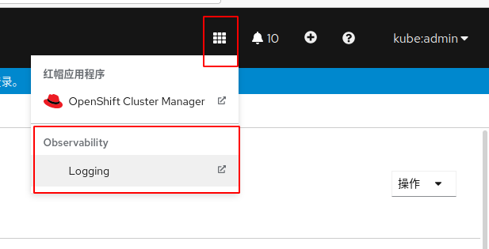

# 日志收集监控调研

关键字《EFK原理》

EFK 架构，参考： https://ithelp.ithome.com.tw/articles/10223004


[一文彻底搞定 EFK 日志收集系统](https://cloud.tencent.com/developer/article/1645047)


[理解OpenShift（6）：集中式日志处理](https://www.cnblogs.com/sammyliu/p/10141242.html)


全新搭建的openshift x86 4.8.9环境，安装efk

遇到问题没有gp2这个存储类
```
0s          Warning   ProvisioningFailed     persistentvolumeclaim/elasticsearch-elasticsearch-cdm-6wri3xgj-1   storageclass.storage.k8s.io "gp2" not found
0s          Warning   ProvisioningFailed     persistentvolumeclaim/elasticsearch-elasticsearch-cdm-6wri3xgj-2   storageclass.storage.k8s.io "gp2" not found
0s          Warning   ProvisioningFailed     persistentvolumeclaim/elasticsearch-elasticsearch-cdm-6wri3xgj-3   storageclass.storage.k8s.io "gp2" not found
0s          Warning   FailedScheduling       pod/elasticsearch-cdm-6wri3xgj-2-654f4dfd57-fsn5l                  0/1 nodes are available: 1 pod has unbound immediate PersistentVolumeClaims.
0s          Warning   FailedScheduling       pod/elasticsearch-cdm-6wri3xgj-1-55bd577d9b-c2pgn                  0/1 nodes are available: 1 pod has unbound immediate PersistentVolumeClaims.
0s          Warning   FailedScheduling       pod/elasticsearch-cdm-6wri3xgj-3-54f47c94bb-k968r                  0/1 nodes are available: 1 pod has unbound immediate PersistentVolumeClaims.
```

还有这几个pvc要求的容量都是200G，一共需要600G
先配置改为100G*3吧


还有内存限制，暂时需要配置小内存运行。2000M cpu, 1G 内存，限制1G存储


过了一段时间，最终部署成功。


这里新增加了一个日志观察链接



问题：没有fluentd这个pod，怎么回事？

4.2.2. 查看日志记录收集器 Pod
您可以查看 Fluentd 日志记录收集器 Pod 以及它们正在运行的对应节点。Fluentd 日志记录收集器 Pod 仅在 openshift-logging 项目中运行。

最后把master节点的内存cpu加大到32u 64G可以了？但是还是没有fluentd的pods？

最后在kibana上配置出效果了，能够看日志？
主要是要配置索引!!!
