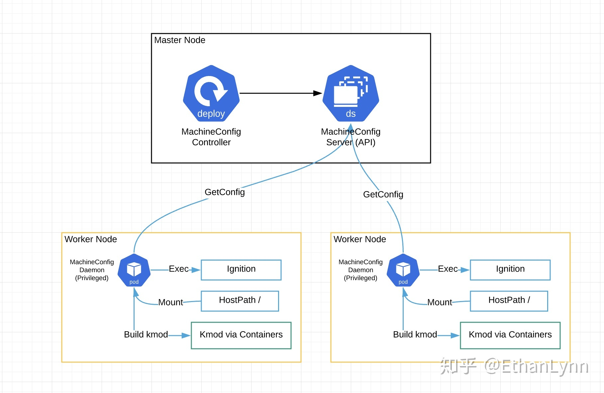
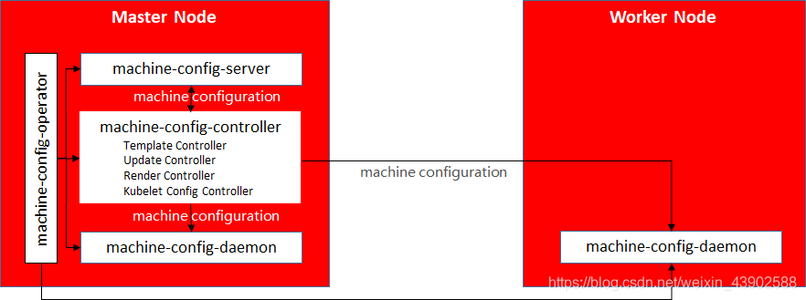
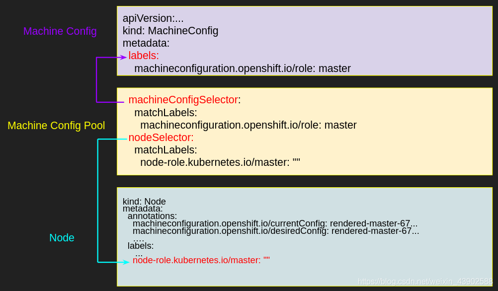

# machine config配置节点使用以及原理

## TODO: 疑问，待验证

* registry.conf配置了，那imagemirrorsource怎么融合呢？
* 配置冲突的场景(手动修改了) => 添加insecure镜像仓库配置
* 禁止配置更新重启功能，有必要开启这个功能吗？ => 未成功
* 安装时就禁用selinux? => 可以, 成功

## machine config原理架构





主要组件
* MC-operator: 管理MC相关组件
* MC-Server: master节点上的daemonset, 提供ign给新节点使用
* MC-Controller: deployment, 只有一个副本，有Template, Render, Update, Kubelet等控制器
* MC-Daemon: 每个节点都有，处理MC升级重启等操作



相关MC配置对象
* MC-Pool: 连接一类配置与一类节点
* MC-config: 一个个小配置
* Node: 节点, 有不同的角色等

## Machine Config 资源类型
通过MachineConfig的定义看看他能干嘛

```go
type MachineConfigSpec struct {
    // Config is a Ignition Config object.
    Config ign.Config `json:"config"`
    KernelArguments []string `json:"kernelArguments"`
    Fips bool `json:"fips"`
    KernelType string `json:"kernelType"`
}
```

* Config配置项能够配置想要在节点上添加的文件及内容
* KernelArguments配置项能够修改GRUB并在kernel项后添加优化配置，例如cpu隔离，hugepage配置等等。
* Fips是美国政府的一个安全选项
* KernelType可以配置节点的内核类型，例如realtime内核等。

(还可以改更多内容, 见官方文档: https://docs.openshift.com/container-platform/4.6/post_installation_configuration/machine-configuration-tasks.html)

通过两个MachineConfig的样例来更熟悉一下，第一个例子往worker节点插入一个配置文件，第二个例子给master节点配置。多个MachineConfig会汇聚成一个MachineConfigPool，例如master类型的会汇聚成一个大的定义，worker类型的也会相应的汇聚成一个大的定义。当Node上面的节点配置的时候，取得是汇聚之后的pool一次性执行的。

```yaml
# This example MachineConfig replaces /etc/chrony.conf
apiVersion: machineconfiguration.openshift.io/v1
kind: MachineConfig
metadata:
  labels:
    machineconfiguration.openshift.io/role: worker
  name: 50-examplecorp-chrony
spec:
  config:
    ignition:
      version: 2.2.0
    storage:
      files:
 - contents:
          source: data:text/plain;charset=utf-8;base64,c2VydmVyIGZvby5leGFtcGxlLm5ldCBtYXhkZWxheSAwLjQgb2ZmbGluZQpzZXJ2ZXIgYmFyLmV4YW1wbGUubmV0IG1heGRlbGF5IDAuNCBvZmZsaW5lCnNlcnZlciBiYXouZXhhbXBsZS5uZXQgbWF4ZGVsYXkgMC40IG9mZmxpbmUK
        filesystem: root
        mode: 0644
        path: /etc/chrony.conf
```

```yaml
# Example MachineConfig to change kernel log level
apiVersion: machineconfiguration.openshift.io/v1
kind: MachineConfig
metadata:
  labels:
    machineconfiguration.openshift.io/role: "master"
  name: 99-master-kargs-hugepage
spec:
  kernelArguments:
 - default_hugepagesz=1G
 - hugepagesz=1G
 - hugepages=32
```

## MachineConfig Operator的工作原理

工作原理很简单，通过一个daemonset，在每个节点都跑一个MachinConfig Daemon Pod，这个Daemon跑在了特权模式，而且把host的根目录挂载到Daemon pod里面，那基本就是想对host干嘛就干嘛了，非常的简单粗暴。

Daemon里面有几个东西是挺有意思的，一个是CoreOS Ignition，负责host文件的插入，目前看应该是只支持redhat系的操作系统，收了CoreOS之后真是一点没浪费。另一个是kmod via containers，这个能够在container里面编译内核模块并自动挂载到内核里面，而且每当系统升级之后，它也会自动的根据当前内核编译一遍内核模块并挂载，对于DPDK等需要动态挂载内核模块的组件是福音。

## Operator的局限
最近在设计我们的产品，顺便看了看友商架构参考参考。Operator本身固然很强大，但是还是要结合自身的实际来用。

首先Operator需要依附在kubernetes里面，也就是说你先得有一个kubernetes集群，这就为什么Openshift是在装好k8s之后再配置优化系统，而不是配置优化好了之后再安装kubernetes。
=> **这里就是需要bootstrap节点的原因么, 有一个临时k8s控制平面做事情了!**？

其次，Operator默认的作用域其实局限于当前的k8s集群，也就是说对于跨k8s集群来说，做起来不容易，对在k8s之外的资源管理并不一定很方便。

第三，operator会跟k8s强绑定，以后如果k8s不流行了，那你的架构是不是都得推倒重来呢，还是说以后部署产品的时候先来一套k8s在上我的产品？

架构不易，实用最重要。

## 可以修改的配置项目

* crio配置
* kubelet配置
* ssh key
* 修改内核参数，禁用selinux

## 其他技巧

#### 禁止配置更新重启

在OpenShift中，节点配置是放在MachineConfig对象中，当MachineConfigPool发现MachineConfig就会将新的配置实施于对应节点上，随后重启节点使其生效。OpenShift的MachineConfigPool自动发现更新并重启的特性是缺省的，不过我们可以关闭其重启节点的特性，以允许在自定义时间窗口任工手动重启节点来生效配置的变更。

先获取到所有的mcp
```bash
 oc get machineconfigpool
NAME     CONFIG                                             UPDATED   UPDATING   DEGRADED   MACHINECOUNT   READYMACHINECOUNT   UPDATEDMACHINECOUNT   DEGRADEDMACHINECOUNT   AGE
master   rendered-master-9fdc47376528cf0bc9a62cb0ace3ca02   True      False      False      3              3                   3                     0                      5d1h
worker   rendered-worker-c5c84aa7ee855b4fc508fc82527efbf5   True      False      False      2              2                   2                     0                      5d1h
```

然后禁用自动重启的功能
=> 禁用之后，machine config不处理了(release-4.9)?
```
oc patch --type=merge --patch='{"spec":{"paused":true}}' machineconfigpool/master
oc patch --type=merge --patch='{"spec":{"paused":true}}' machineconfigpool/worker
```

#### 禁用selinux

(selinux在点火文件中，还是machineconfig配置)
```
cat << EOF > 05-worker-kernelarg-selinuxoff.yaml
apiVersion: machineconfiguration.openshift.io/v1
kind: MachineConfig
metadata:
  labels:
    machineconfiguration.openshift.io/role: worker
  name: 05-worker-kernelarg-selinuxoff
spec:
  config:
    ignition:
      version: 3.2.0
  kernelArguments:
    - selinux=0
EOF
```

启用实时核
```
cat << EOF > 99-worker-realtime.yaml
apiVersion: machineconfiguration.openshift.io/v1
kind: MachineConfig
metadata:
  labels:
    machineconfiguration.openshift.io/role: "worker"
  name: 99-worker-realtime
spec:
  kernelType: realtime
EOF
```

#### 修改镜像mirror策略

```yaml
ImageContentSourcePolicy
apiVersion: operator.openshift.io/v1alpha1
kind: ImageContentSourcePolicy
metadata:
  name: tmp
spec:
  repositoryDigestMirrors:
    - mirrors:
        - hub.iefcu.cn/xiaoyun/test
      source: quay.io/xiaoyun/test
```

## machine config 日志逻辑分析

#### 下发一个配置chronyd配置文件

大致步骤：
* 检查新旧配置差异
* 更新文件, 系统服务, ssh密钥等
* 重启系统

源码路径: [update.go](https://github.com/openshift/machine-config-operator/blob/master/pkg/daemon/update.go)
调用逻辑:
dn.triggerUpdateWithMachineConfig() -> dn.update()
暂没有更详细的日志，如果要再分析下去，需要调试分析了

machine-config-daemon的日志
```
I0422 05:50:51.551317    7963 update.go:1896] Adding SIGTERM protection
I0422 05:50:51.551470    7963 update.go:546] Checking Reconcilable for config rendered-master-cc55519a4d68e501af154fb4c78f003c to rendered-master-191690042c528337c8f37530eb4cb6be
I0422 05:50:51.604887    7963 update.go:1874] Starting update from rendered-master-cc55519a4d68e501af154fb4c78f003c to rendered-master-191690042c528337c8f37530eb4cb6be: &{osUpdate:false kargs:false fips:false passwd:false files:true units:false kernelType:false extensions:false}
I0422 05:50:51.652023    7963 update.go:458] File diff: /etc/chrony.conf was added
I0422 05:50:51.662346    7963 update.go:1874] Node has been successfully cordoned
I0422 05:50:51.665859    7963 update.go:1874] Drain not required, skipping
I0422 05:50:51.668567    7963 update.go:1173] Updating files
I0422 05:50:51.698514    7963 update.go:1570] Writing file "/etc/NetworkManager/conf.d/99-keyfiles.conf"
...
I0422 05:50:51.822013    7963 update.go:1570] Writing file "/etc/chrony.conf"
I0422 05:50:51.824749    7963 update.go:1463] Dropin for 10-mco-default-env.conf has no content, skipping write
I0422 05:50:51.824778    7963 update.go:1470] Removing "/etc/systemd/system/crio.service.d/10-mco-default-env.conf", updated file has zero length
I0422 05:50:51.824819    7963 update.go:1477] Writing systemd unit dropin "10-mco-profile-unix-socket.conf"
...
I0422 05:50:55.482061    7963 update.go:1477] Writing systemd unit dropin "10-ovsdb-restart.conf"
I0422 05:50:55.484233    7963 update.go:1463] Dropin for 10-mco-default-env.conf has no content, skipping write
I0422 05:50:55.484268    7963 update.go:1470] Removing "/etc/systemd/system/pivot.service.d/10-mco-default-env.conf", updated file has zero length
I0422 05:50:55.499283    7963 update.go:1548] Could not reset unit preset for pivot.service, skipping. (Error msg: error running preset on unit: Failed to preset unit: Unit file pivot.service does not exist.
)
I0422 05:50:55.499316    7963 update.go:1477] Writing systemd unit dropin "mco-controlplane-nice.conf"
I0422 05:50:56.769461    7963 update.go:1450] Preset systemd unit rpm-ostreed.service
I0422 05:50:56.769496    7963 update.go:1477] Writing systemd unit dropin "mco-disabled.conf"
I0422 05:50:57.988454    7963 update.go:1450] Preset systemd unit zincati.service
I0422 05:50:59.205302    7963 update.go:1428] Enabled systemd units: [kubelet-auto-node-size.service kubelet.service machine-config-daemon-firstboot.service machine-config-daemon-pull.service etc-NetworkManager-systemConnectionsMerged.mount node-valid-hostname.service nodeip-configuration.service openvswitch.service ovs-configuration.service ovsdb-server.service]
I0422 05:50:59.205351    7963 update.go:1246] Deleting stale data
I0422 05:50:59.227912    7963 update.go:1689] Writing SSHKeys at "/home/core/.ssh/authorized_keys"
I0422 05:50:59.260773    7963 update.go:1874] Rebooting node
I0422 05:50:59.263390    7963 update.go:1904] Removing SIGTERM protection
I0422 05:50:59.263421    7963 update.go:1874] initiating reboot: Node will reboot into config rendered-master-191690042c528337c8f37530eb4cb6be
```

#### 修改内核参数日志

```
I0422 08:45:13.148366   17986 update.go:1896] Adding SIGTERM protection
I0422 08:45:13.150601   17986 update.go:546] Checking Reconcilable for config rendered-master-cc55519a4d68e501af154fb4c78f003c to rendered-master-7f71199d9ac9f3034ba94285b351a534
I0422 08:45:13.201084   17986 update.go:1874] Starting update from rendered-master-cc55519a4d68e501af154fb4c78f003c to rendered-master-7f71199d9ac9f3034ba94285b351a534: &{osUpdate:false kargs:true fips:false passwd:false files:false units:false kernelType:false extensions:false}
I0422 08:45:13.235344   17986 update.go:1874] Node has been successfully cordoned
I0422 08:45:13.239930   17986 update.go:1874] Drain not required, skipping
I0422 08:45:13.247661   17986 update.go:1173] Updating files
I0422 08:45:13.271840   17986 update.go:1570] Writing file "/etc/NetworkManager/conf.d/99-keyfiles.conf"
...
I0422 08:45:13.359523   17986 update.go:1570] Writing file "/etc/kubernetes/kubelet.conf"
I0422 08:45:13.360999   17986 update.go:1463] Dropin for 10-mco-default-env.conf has no content, skipping write
I0422 08:45:13.361028   17986 update.go:1477] Writing systemd unit dropin "10-mco-profile-unix-socket.conf"
...
I0422 08:45:17.792232   17986 update.go:1477] Writing systemd unit dropin "mco-disabled.conf"
I0422 08:45:18.831741   17986 update.go:1450] Preset systemd unit zincati.service
I0422 08:45:20.022346   17986 update.go:1428] Enabled systemd units: [kubelet-auto-node-size.service kubelet.service machine-config-daemon-firstboot.service machine-config-daemon-pull.service etc-NetworkManager-systemConnectionsMerged.mount node-valid-hostname.service nodeip-configuration.service openvswitch.service ovs-configuration.service ovsdb-server.service]
I0422 08:45:20.022388   17986 update.go:1246] Deleting stale data
I0422 08:45:20.044064   17986 update.go:1689] Writing SSHKeys at "/home/core/.ssh/authorized_keys"
I0422 08:45:20.071480   17986 update.go:1874] Running rpm-ostree [kargs --delete=selinux=0]
I0422 08:45:20.074144   17986 update.go:1859] Running: rpm-ostree kargs --delete=selinux=0
Staging deployment...done
Kernel arguments updated.
Run "systemctl reboot" to start a reboot
I0422 08:45:32.985230   17986 update.go:1874] Rebooting node
I0422 08:45:32.987762   17986 update.go:1904] Removing SIGTERM protection
I0422 08:45:32.987805   17986 update.go:1874] initiating reboot: Node will reboot into config rendered-master-7f71199d9ac9f3034ba94285b351a534
```

kylin coreos把selinux=0去除之后，系统又死了
=> 考虑修改coreos repo，把这个selinux问题解决掉?
```
[    6.997053] systemd[1]: Set hostname to <master1.kcp3-arm.iefcu.cn>.
[    6.997683] audit: type=1400 audit(1650617205.956:4): avc:  denied  { write } for  pid=1 comm="systemd" name="machine-id" dev="vda4" ino=323032962 scontext=system_u:system_r:init_t:s0 tcontext=system_u:object_r:unlabeled_t:s0 tclass=file permissive=0
[    7.014629] audit: type=1400 audit(1650617205.972:5): avc:  denied  { read } for  pid=1 comm="systemd" name="localtime" dev="vda4" ino=322961642 scontext=system_u:system_r:init_t:s0 tcontext=system_u:object_r:unlabeled_t:s0 tclass=lnk_file permissive=0
[    7.014630] systemd[1]: Failed to create timezone change event source: Permission denied
[    7.026496] systemd[1]: Failed to allocate manager object: Permission denied
[!!!!!!] Failed to allocate manager object, freezing.
[    7.028519] systemd[1]: Freezing execution.
```

## 参考文档

* [OpenShift 4 - 如何用Machine Config Operator修改集群节点CoreOS的配置](https://blog.csdn.net/weixin_43902588/article/details/108309209)
* [OpenShift 4 - 定制 RHCOS Linux的Kernal参数](https://blog.csdn.net/weixin_43902588/article/details/117198142)
* [OpenShift 4 - 设置集群节点和Pod容器的时间和时区](https://blog.csdn.net/weixin_43902588/article/details/108298517)

* [(好)OpenShift都在用k8s Operator干点啥？](https://zhuanlan.zhihu.com/p/121754283)
