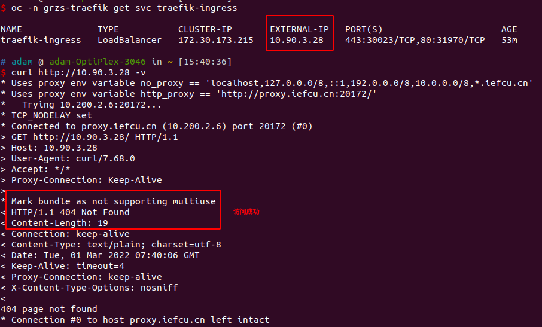

# MetalLB安装以及使用方法

## metallb 重做支持arm64页面安装

mkdir -p /tmp/metallb-test/metallb-bundle-rootfs
oc image extract --confirm \
  --path /:/tmp/metallb-test/metallb-bundle-rootfs \
  hub.iefcu.cn/kcp/metallb-operator-bundle@sha256:549947c734afbb4fa16aa09293a92f30191270db67c3248847c58adcd7d54549

根据里面的dockerfile, 创建新的镜像, 注意修改支持arm64即可
hub.iefcu.cn/kcp/metallb-operator-bundle:v4.9

然后再做一个新的operator index镜像

可以在x86下制作arm64的operator index 镜像
```
opm index add \
    --bundles hub.iefcu.cn/kcp/metallb-operator-bundle@sha256:74da72dd402e5a85b2ece72695c6772dd56d771fc4e482719a9ffefe9fed89bc \
    --tag hub.iefcu.cn/kcp/kylin-operator-index:v4.9 \
    --binary-image hub.iefcu.cn/public/redhat-operator-index:v4.9@sha256:fd45ebb5619656628b84266793ddf24ef6a393cd3a85bc1b5315d5500c0bf067

    --bundles hub.iefcu.cn/kcp/metallb-operator-bundle:v4.9 \
```

使用镜像构建
```
docker run -it --privileged --rm hub.iefcu.cn/xiaoyun/podman-opm:amd64
```

或者使用docker构建, 需要下载opm二进制包

## 问题

#### 如何查看一个operator index有多少operator镜像(bundle)?

1.通过安装operator index之后再查看?
2.提取operator index的sqlite数据库文件查看? => 最准确, 核心就是整理
```bash
oc image extract --confirm \
  --path /database/index.db:/tmp \
  hub.iefcu.cn/public/redhat-operator-index:v4.9

sqlite3 ./index.db 'select * from main.related_image;' | grep pipelines | grep bundle
```
3.运行operator, 使用grpcurl查看

* hub.iefcu.cn/kcp/kylin-operator-index:v4.9
  openshift-jenkins-operator
* hub.iefcu.cn/kcp

#### 如何查看bundle镜像的related image?

#### 如何通过operator index的镜像?

oc adm catalog

## 简明安装部署步骤

#### 1. 同步镜像

TODO: 重要!!!
* xx
* xx


需要同步的镜像列表
* catalogsource镜像 => 很小
* bundle镜像 => 小
* operator相关镜像 => 大,重要

#### 2. 创建catalogSource

注意: 使用容器云平台能够拉取到的镜像仓库地址(因为这个镜像会频繁拉取更新的!)
例如: registry.kcp.local:5000

TODO: 可以直接通过页面的方式创建, 简单
进入 管理->自定义资源定义: 搜索catalogsource:
创建 CatalogSource:
* CatalogSource 名称: kylin
* 镜像: hub.iefcu.cn/kcp/kylin-operator-index:v4.9


```bash
cat << EOF | oc apply -f -
apiVersion: operators.coreos.com/v1alpha1
kind: CatalogSource
metadata:
  name: adam
  namespace: openshift-marketplace
spec:
  displayName: adam
  #image: 'hub.iefcu.cn/public/redhat-operator-index:v4.9'
  #image: 'hub.iefcu.cn/kcp/adam-operatorhub:20220224'
  image: 'registry.kcp.local:5000/kcp/redhat-operator-index:v4.9'
  publisher: adam
  sourceType: grpc
EOF
```

#### 3. 安装operator

通过页面安装, 不同的operator安装方法略有差别

## 安装方法

web控制台安装暂时还没弄好, 先用CLI安装

### CLI命令行安装

#### 1. 首先基于catalogSource镜像，创建catalogSource

```bash
cat << EOF | oc apply -f -
apiVersion: operators.coreos.com/v1alpha1
kind: CatalogSource
metadata:
  name: adam
  namespace: openshift-marketplace
spec:
  displayName: adam
  #image: 'hub.iefcu.cn/public/redhat-operator-index:v4.9'
  #image: 'hub.iefcu.cn/kcp/adam-operatorhub:20220224'
  image: 'registry.kcp.local:5000/kcp/redhat-operator-index:v4.9'
  publisher: adam
  sourceType: grpc
EOF
```

检查安装情况
```bash
oc -n openshift-marketplace get pod
oc -n openshift-marketplace get CatalogSource adam
```

#### 2. 然后创建镜像mirror策略

```bash
cat <<EOM | oc apply -f -
apiVersion: operator.openshift.io/v1alpha1
kind: ImageContentSourcePolicy
metadata:
  name: redhat-openshift4
spec:
  repositoryDigestMirrors:
  - mirrors:
    - hub.iefcu.cn/kcp
    - registry.kcp.local:5000/kcp
    source: registry.redhat.io/openshift4
EOM

cat <<EOM | oc apply -f -
apiVersion: operator.openshift.io/v1alpha1
kind: ImageContentSourcePolicy
metadata:
  name: hub-iefcu-cn-kcp
spec:
  repositoryDigestMirrors:
  - mirrors:
    - registry.kcp.local:5000/kcp
    source: hub.iefcu.cn/kcp
EOM
```

检查/etc/containers/registries.conf
是否有相应mirror配置

#### 3. 确认 MetalLB Operator 可用：

```
oc get packagemanifests -n openshift-marketplace metallb-operator
```

输出示例
```
NAME               CATALOG                AGE
metallb-operator   adam                   9h
```

#### 4. 创建 metallb-system 命名空间：

```
cat << EOF | oc apply -f -
apiVersion: v1
kind: Namespace
metadata:
  name: metallb-system
EOF
```

或者直接使用oc project命令创建
```
oc new-project metallb-system
```

#### 5. 在命名空间中创建一个 Operator 组自定义资源：

因为metallb operator必须要安装到一个指定的namespace中去。

```bash
cat << EOF | oc apply -f -
apiVersion: operators.coreos.com/v1
kind: OperatorGroup
metadata:
  name: metallb-operator
  namespace: metallb-system
spec:
  targetNamespaces:
  - metallb-system
EOF
```

#### 确认 Operator 组已安装在命名空间中：

```
oc get operatorgroup -n metallb-system
```

#### 订阅 MetalLB Operator。

```
cat << EOF| oc apply -f -
apiVersion: operators.coreos.com/v1alpha1
kind: Subscription
metadata:
  name: metallb-operator-sub
  namespace: metallb-system
spec:
  channel: stable
  name: metallb-operator
  source: adam
  sourceNamespace: openshift-marketplace
EOF
```

#### 确认安装计划位于命名空间中

```
oc get installplan -n metallb-system
```

如果没有出现installplane，就要查查olm operator的日志？

例如订阅到空的operator的日志
```
oc -n openshift-operator-lifecycle-manager logs -f catalog-operator-6565788966-rfzp7

I0403 03:32:33.072628       1 event.go:282] Event(v1.ObjectReference{Kind:"Namespace", Namespace:"", Name:"openshift-operators-redhat", UID:"5a
de5ab6-4a91-4372-acc4-19e99432c051", APIVersion:"v1", ResourceVersion:"129988", FieldPath:""}): type: 'Warning' reason: 'ResolutionFailed' cons
traints not satisfiable: no operators found from catalog redhat-operators in namespace openshift-marketplace referenced by subscription elastic
search-operator, subscription elasticsearch-operator exists
```

#### 要验证是否已安装 Operator，请输入以下命令：

```
oc get clusterserviceversion -n metallb-system \
  -o custom-columns=Name:.metadata.name,Phase:.status.phase
```

如果没有就，则看installplan的状态
可能是bundle任务失败，就会一直卡着。
oc -n openshift-marketplace get jobs d5d6cba0f745806d76d87f36482c281b250abd2eff473959d55d606b40d231a -o yaml
删除这个jobs是否可行？=> 确实可行!!!

## 在集群中启动 METALLB

#### 1. 创建 MetalLB 自定义资源的单一实例

**注意在metallb-system项目下运行此命令? 否则会没有作用！！！**
```bash
cat << EOF | oc apply -f -
apiVersion: metallb.io/v1beta1
kind: MetalLB
metadata:
  name: metallb
  namespace: metallb-system
EOF
```

#### 2. 检查控制器的部署是否正在运行：

```
oc get deployment -n metallb-system controller
```

#### 3. 检查 speaker 的守护进程集是否正在运行：

```
oc get daemonset -n metallb-system speaker
```

## 使用方法

#### 1. 首先配置地址池

```bash
cat << EOF | oc apply -f -
apiVersion: metallb.io/v1alpha1
kind: AddressPool
metadata:
  namespace: metallb-system
  name: doc-example
spec:
  protocol: layer2
  addresses:
  - 10.90.3.27-10.90.3.29
EOF
```

#### 2. 然后在service中使用这个地址池

```bash
cat << EOF | oc apply -f -
apiVersion: v1
kind: Service
metadata:
  name: traefik-ingress
  namespace: grzs-traefik
  labels:
    app: traefik
  annotations:
    metallb.universe.tf/address-pool: doc-example
spec:
  ports:
  - name: https
    protocol: TCP
    port: 443
    targetPort: 443
  - name: http
    protocol: TCP
    port: 80
    targetPort: 80
  type: LoadBalancer
  selector:
    app: traefik
EOF
```

可以分配固定ip地址
```
loadBalancerIP: 10.90.3.38
```

#### 3. 最后查看svc自动分配的ip地址，以及访问

```bash
oc -n grzs-traefik get svc traefik-ingress
```



## FAQ

#### 修改地址池的ip地址,svc不生效

修改地址池的ip地址从A改为B，结果svc重新创建, 地址还是A
重启controller, 地址分配为B，但是实际访问不生效
重启speaker, 地址B能够在外部访问了!

#### 虚IP在重启metallb后mac地址就会变

113这个虚IP在每次重启metallb后mac地址就会变，随机的飘到集群中的某台机器上，终端却还在查找以前的mac地址，造成有的终端能访问，有的终端不能访问，我用arp -d命令清楚缓存后，又都能用了，这种情况不行，达不到负载均衡的目的
=> 问题就在于，为什么要频繁重启metallb呢?

解决思路:
* 1.让旧的节点继续可以通过这个ｉｐ访问十几分钟，等缓存刷新 => 不行
* 2.看keepalived也没有虚拟一个ｍａｃ地址出来，固定的方案不可行吧 => VMAC验证失败
* 3.使用keepalived实现 => 同上
* 终端二层网络隔离 => 搞路由麻烦

验证keepalived进入backup模式, 是否能处理请求? => 不能, vip地址会清除掉

https://www.guaosi.com/2020/01/25/keepalived-principle-and-LVS-case/

当PC想发送报文到外网时，需要先经过网关，若Master无法正常工作，此时VIP会主动漂浮到Backup。但是由于之前使用的是Master作为网关，此时各个客户端(PC)里arp缓存表里记录的是Master的Mac地址，此时依旧会将报文发往Master。

所以需要在客户端(PC)与网关之间引入一个软件，来使用VMAC。VMAC来自行进行选择真实可用的网关Mac。

KeepAlived
功能简介
* 服务器服务的故障转移
* 通常用于对负载均衡器做高可用

当Master故障时，会主动将VIP浮动到Backup上，此时Backup会发送广播包，通知所有客户端（gratuitous arp），更新此时VIP对应的Mac地址为Backup。

VIP作为子网卡漂浮在真实网卡上

https://www.cnblogs.com/rexcheny/p/10778567.html
keepalived配置vmac文件
```
# 使用哪个虚拟MAC地址
use_vmac XX:XX:XX:XX:XX
```

这里有个问题，VRRP提供一个VIP，它可以来设定那个路由器是活动节点，然后出现故障进行切换，VIP也随之对应到新的路由器上，但是内网是用过MAC地址来寻址的，虽然VIP对应到了新的路由器上，可是MAC变了，客户端的ARP表也没有更新，所以还是用不了，为了解决这个问题VRRP不但提供VIP还提供VMAC地址，这个VMAC地址是VRRP单独申请的，大家都可以正常使用。

故障切换的时候虽然改变了后端路由器，但是由于客户端使用的是VIP和VMAC地址，这样就不会有任何影响了。


https://cloud.tencent.com/developer/article/1445076
虚拟 IP 地址：虚拟路由器的 IP 地址。一个虚拟路由器可以拥有一个或多个IP 地址。

IP 地址拥有者：接口 IP 地址与虚拟 IP 地址相同的路由器被称为 IP 地址拥有者。

虚拟 MAC 地址：一个虚拟路由器拥有一个虚拟 MAC 地址。虚拟 MAC 地址的格式为 00-00-5E-00-01-{VRID}。通常情况下，虚拟路由器回应 ARP 请求使用的是虚拟 MAC 地址，只有虚拟路由器做特殊配置的时候，才回应接口的真实 MAC 地址。

```
# Use VRRP Virtual MAC.
use_vmac [<VMAC_INTERFACE>]

# Send/Recv VRRP messages from base interface instead of
# VMAC interface
vmac_xmit_base
```

虚拟MAC地址
组成方式是00-00-5E-00-01-{VRID}，前三个字节00-00-5E是IANA组织分配的，接下来的两个字节00-01是为VRRP协议指定的，最后的VRID是虚拟路由器标识，取值范围[1，255]。

=> 配置了，但是验证有问题
```
2: eth0: <BROADCAST,MULTICAST,UP,LOWER_UP> mtu 1500 qdisc pfifo_fast state UP group default qlen 1000
    link/ether 52:54:84:00:0a:df brd ff:ff:ff:ff:ff:ff
    inet 10.90.2.250/24 brd 10.90.2.255 scope global noprefixroute eth0
       valid_lft forever preferred_lft forever
    inet6 fe80::1450:e939:55d7:73bf/64 scope link noprefixroute
       valid_lft forever preferred_lft forever
6: vrrp.100@eth0: <BROADCAST,MULTICAST,UP,LOWER_UP> mtu 1500 qdisc noqueue state UNKNOWN group default qlen 1000
    link/ether 00:00:5e:00:01:64 brd ff:ff:ff:ff:ff:ff
    inet 10.90.3.67/32 scope global vrrp.100
       valid_lft forever preferred_lft forever
    inet6 fe80::200:5eff:fe00:164/64 scope link
       valid_lft forever preferred_lft forever
7: vrrp.101@eth0: <BROADCAST,MULTICAST,UP,LOWER_UP> mtu 1500 qdisc noqueue state UNKNOWN group default qlen 1000
    link/ether 00:00:5e:00:01:65 brd ff:ff:ff:ff:ff:ff
    inet 10.90.3.68/32 scope global vrrp.101
       valid_lft forever preferred_lft forever
    inet6 fe80::200:5eff:fe00:165/64 scope link
       valid_lft forever preferred_lft forever
```

https://github.com/acassen/keepalived/blob/master/doc/NOTE_vrrp_vmac.txt

https://keepalived-doc.readthedocs.io/zh_CN/latest/%E8%BD%AF%E4%BB%B6%E8%AE%BE%E8%AE%A1.html
此外，我们会提到VRRP VMAC仅适用于包含以下补丁的内核：

http://git.kernel.org/?p=linux/kernel/git/torvalds/linux.git;a=commitdiff;h=729e72a10930ef765c11a5a35031ba47f18221c4

默认情况下，macvlan接口处于 VEPA 模式，会过滤掉源MAC地址与macvlan接口匹配的数据包。设置为私有模式后macvlan接口就不会基于源MAC地址进行过滤了。

或者，您可以指定 vmac_xmit_base，这将导致VRRP消息在底层接口上传输和接收，而 ARP 将在VMAC接口上发生。

#### metallb layer2和BGP的区别理解

[三款开源 Kubernetes 负载均衡器大比拼 (MetalLB vs PureLB vs OpenELB)](https://www.51cto.com/article/707574.html)

L2 Mode
在 MetalLB 中，有两个关键组件共同作用，将地址添加到单个节点上。第一个是使用成员列表的节点选举。这是一个简单的选举方案，使用服务名称来确保每个节点选择相同的赢家，即一个分配的 ip 地址将被回答的单一节点。

我使用了回答这个词，因为在 "L2 " 中，发言人进程实现了 ARP 和 ND。Kube-proxy 已经添加了必要的配置，将流量转发到目标 POD，ARP/ND 响应仍然是启动通信的必要条件。(ARM是ipv4,NDP是ipv6的)

Metallb 不知道节点使用的地址范围，ARP/ND 过程会回答 ConfigMap 中配置的任何网络地址。这可能导致在 L2 模式下分配的地址无法到达。当节点网络跨越多个主机子网时，尤其需要注意，不能保证添加的地址会位于具有本地连接的节点上。


BGP Mode
MetalLB 也在 BGP 模式下运行。BGP 提供了一种机制，将前缀（addr/mask）公布给邻近的路由器。使用路由的机制是利用 Linux 的第三层转发与路由协议相结合来提供目的地信息。

关键字`metallb layer2 ip mac address`

[(好)METALLB IN LAYER 2 MODE(MetalLB v0.13.7)](https://metallb.universe.tf/concepts/layer2/)
In layer 2 mode, one node assumes the responsibility of advertising a service to the local network. From the network’s perspective, it simply looks like that machine has multiple IP addresses assigned to its network interface.
The major advantage of the layer 2 mode is its universality: it will work on any Ethernet network, with no special hardware required, not even fancy routers.

If the leader node fails for some reason, failover is automatic: the failed node is detected using memberlist, at which point new nodes take over ownership of the IP addresses from the failed node.

Layer 2 mode has two main limitations you should be aware of: single-node bottlenecking, and potentially slow failover.

In the current implementation, failover between nodes depends on cooperation from the clients. When a failover occurs, MetalLB sends a number of gratuitous layer 2 packets (a bit of a misnomer - it should really be called “unsolicited layer 2 packets”) to notify clients that the MAC address associated with the service IP has changed.

layer2模式，用的mac地址就是对应节点的mac地址
```
? (10.90.3.34) at 52:54:84:00:04:30 [ether] on eth0
? (10.90.3.35) at 52:54:84:00:04:30 [ether] on eth0
```

keepalived vip会发特殊的arp包, 让client更新arp缓存
```
Oct 26 11:05:06 localhost.localdomain Keepalived_vrrp[1148]: VRRP_Instance(VI_1) Sending/queueing gratuitous ARPs on eth0 for 10.90.3.67
Oct 26 11:05:06 localhost.localdomain Keepalived_vrrp[1148]: Sending gratuitous ARP on eth0 for 10.90.3.67
...
# 抓包会发现有这种arp包
03:27:35.754256 ARP, Request who-has 10.90.3.67 (Broadcast) tell 10.90.3.67, length 28
```


keepalived备机也会移除掉这个ip地址, 此时如果client访问旧的vip的机器,也会失败
```
Keepalived_vrrp[1253]: VRRP_Instance(VI_2) Received advert with higher priority 100, ours 90
Keepalived_vrrp[1253]: VRRP_Instance(VI_2) Entering BACKUP STATE
Keepalived_vrrp[1253]: VRRP_Instance(VI_2) removing protocol VIPs.

$ip a s eth0 # 此时没有vip了
2: eth0: <BROADCAST,MULTICAST,UP,LOWER_UP> mtu 1500 qdisc pfifo_fast state UP group default qlen 1000
    link/ether 52:54:84:00:0a:df brd ff:ff:ff:ff:ff:ff
    inet 10.90.2.250/24 brd 10.90.2.255 scope global noprefixroute eth0
       valid_lft forever preferred_lft forever
```

metallb查看抓包,　显示也是有arp发包出来, 应该能够访问吧
```
09:57:12.014248 ARP, Request who-has 192.168.100.100 (Broadcast) tell 192.168.100.100, length 46
09:57:12.014505 ARP, Reply 192.168.100.100 is-at 52:54:84:00:08:f1, length 46
...
09:58:01.916754 ARP, Request who-has 192.168.100.100 (Broadcast) tell 192.168.100.100, length 46
09:58:01.916871 ARP, Reply 192.168.100.100 is-at 52:54:84:00:06:c9, length 46
...
```

## 参考资料

[openshift官方文档 - 配置 METALLB 地址池](https://access.redhat.com/documentation/zh-cn/openshift_container_platform/4.9/html/networking/metallb-configure-address-pools)
