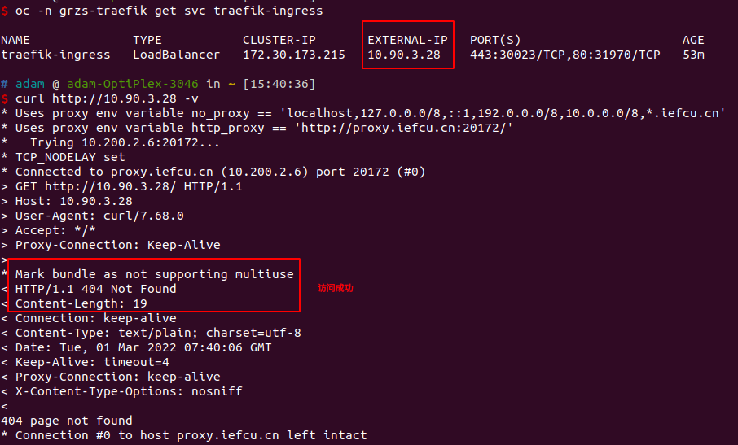

# MetalLB安装以及使用方法

## 安装方法

web控制台安装暂时还没弄好, 先用CLI安装

### CLI命令行安装

#### 1. 首先基于catalogSource镜像，创建catalogSource

```bash
cat << EOF | oc apply -f -
apiVersion: operators.coreos.com/v1alpha1
kind: CatalogSource
metadata:
  name: adam
  namespace: openshift-marketplace
spec:
  displayName: adam
  #image: 'hub.iefcu.cn/public/redhat-operator-index:v4.9'
  #image: 'hub.iefcu.cn/kcp/adam-operatorhub:20220224'
  image: 'registry.kcp.local:5000/kcp/redhat-operator-index:v4.9'
  publisher: adam
  sourceType: grpc
EOF
```

检查安装情况
```bash
oc -n openshift-marketplace get pod
oc -n openshift-marketplace get CatalogSource adam
```

#### 2. 然后创建镜像mirror策略

```bash
cat <<EOM | oc apply -f -
apiVersion: operator.openshift.io/v1alpha1
kind: ImageContentSourcePolicy
metadata:
  name: redhat-openshift4
spec:
  repositoryDigestMirrors:
  - mirrors:
    - hub.iefcu.cn/kcp
    - registry.kcp.local:5000/kcp
    source: registry.redhat.io/openshift4
EOM
```

检查/etc/containers/registries.conf
是否有相应mirror配置

#### 3. 确认 MetalLB Operator 可用：

```
oc get packagemanifests -n openshift-marketplace metallb-operator
```

输出示例
```
NAME               CATALOG                AGE
metallb-operator   adam                   9h
```

#### 4. 创建 metallb-system 命名空间：

```
cat << EOF | oc apply -f -
apiVersion: v1
kind: Namespace
metadata:
  name: metallb-system
EOF
```

或者直接使用oc project命令创建
```
oc new-project metallb-system
```

#### 5. 在命名空间中创建一个 Operator 组自定义资源：

因为metallb operator必须要安装到一个指定的namespace中去。

```bash
cat << EOF | oc apply -f -
apiVersion: operators.coreos.com/v1
kind: OperatorGroup
metadata:
  name: metallb-operator
  namespace: metallb-system
spec:
  targetNamespaces:
  - metallb-system
EOF
```

#### 确认 Operator 组已安装在命名空间中：

```
oc get operatorgroup -n metallb-system
```

#### 订阅 MetalLB Operator。

```
cat << EOF| oc apply -f -
apiVersion: operators.coreos.com/v1alpha1
kind: Subscription
metadata:
  name: metallb-operator-sub
  namespace: metallb-system
spec:
  channel: stable
  name: metallb-operator
  source: adam
  sourceNamespace: openshift-marketplace
EOF
```

#### 确认安装计划位于命名空间中

```
oc get installplan -n metallb-system
```

#### 要验证是否已安装 Operator，请输入以下命令：

```
oc get clusterserviceversion -n metallb-system \
  -o custom-columns=Name:.metadata.name,Phase:.status.phase
```

## 在集群中启动 METALLB

#### 1. 创建 MetalLB 自定义资源的单一实例

**注意在metallb-system项目下运行此命令? 否则会没有作用！！！**
```bash
cat << EOF | oc apply -f -
apiVersion: metallb.io/v1beta1
kind: MetalLB
metadata:
  name: metallb
  namespace: metallb-system
EOF
```

#### 2. 检查控制器的部署是否正在运行：

```
oc get deployment -n metallb-system controller
```

#### 3. 检查 speaker 的守护进程集是否正在运行：

```
oc get daemonset -n metallb-system speaker
```

## 使用方法

#### 1. 首先配置地址池

```bash
cat << EOF | oc apply -f -
apiVersion: metallb.io/v1alpha1
kind: AddressPool
metadata:
  namespace: metallb-system
  name: doc-example
spec:
  protocol: layer2
  addresses:
  - 10.90.3.27-10.90.3.29
EOF
```

#### 2. 然后在service中使用这个地址池

```bash
cat << EOF | oc apply -f -
apiVersion: v1
kind: Service
metadata:
  name: traefik-ingress
  namespace: grzs-traefik
  labels:
    app: traefik
  annotations:
    metallb.universe.tf/address-pool: doc-example
spec:
  ports:
  - name: https
    protocol: TCP
    port: 443
    targetPort: 443
  - name: http
    protocol: TCP
    port: 80
    targetPort: 80
  type: LoadBalancer
  selector:
    app: traefik
EOF
```

#### 3. 最后查看svc自动分配的ip地址，以及访问

```bash
oc -n grzs-traefik get svc traefik-ingress
```




## 参考资料

[openshift官方文档 - 配置 METALLB 地址池](https://access.redhat.com/documentation/zh-cn/openshift_container_platform/4.9/html/networking/metallb-configure-address-pools)
