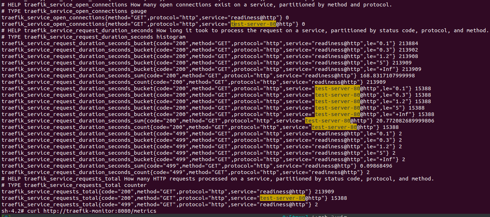

# grafana安装使用

我们知道，在OpenShift 4 中已经内置了Prometheus和Grafana，可以在控制台的“仪表盘”中直接使用，它们的相关资源都运行在openshift-monitoring项目中。但是为了能保持监控环境始终可以正常运行，OpenShift只为内置的Grafana提供了只读（下图的Viewer）权限，即便使用OpenShift集群管理员也不能修改集群内置的Grafana配置，例如导入定制的Dashboard。

为了能够对Dashboard进行定制，我们需要安装使用项目级定制的Grafana环境。本文档通过Operator部署项目级的Grafana，并将OpenShift集群预制的Prometheus作为数据源（其实也可在同一项目中安装项目级Prometheus，并作为其数据源）显示数据。

## 同步grafana相关镜像

参考 [operatorhub离线安装](../operatorhub-offline.html)

```bash
podman pull registry.redhat.io/redhat/community-operator-index:v4.9
# 我已经同步到本地了

# 裁剪只保留 grafana operator
opm index prune -f hub.iefcu.cn/public/community-operator-index:v4.9 \
    -p grafana-operator \
    -t hub.iefcu.cn/kcp/grafana-operator-index:v4.9
podman push hub.iefcu.cn/kcp/grafana-operator-index:v4.9

# 同步grafana相关镜像到本地文件
mkdir mirror-grafana && cd mirror-grafana
oc adm catalog mirror \
    hub.iefcu.cn/kcp/grafana-operator-index:v4.9 \
    file:///local/index

info: Mirroring completed in 1m45.84s (4.408MB/s)
wrote mirroring manifests to manifests-grafana-operator-index-1647941600

To upload local images to a registry, run:

        oc adm catalog mirror file://local/index/kcp/grafana-operator-index:v4.9 REGISTRY/REPOSITORY

# 同步镜像到私有镜像仓库
oc adm catalog mirror \
  file://local/index/kcp/grafana-operator-index:v4.9 \
  192.168.120.44/kcp/
  -a /tmp/pull-secret.json \
  --insecure
```

## 安装grafana operator

#### 1. 首先基于catalogSource镜像，创建catalogSource

```bash
cat << EOF | oc apply -f -
apiVersion: operators.coreos.com/v1alpha1
kind: CatalogSource
metadata:
  name: community
  namespace: openshift-marketplace
spec:
  displayName: community
  image: 'hub.iefcu.cn/public/community-operator-index:v4.9'
  #image: 'registry.kcp.local:5000/kcp/community-operator-index:v4.9'
  publisher: community
  sourceType: grpc
EOF
```

检查安装情况
```bash
oc -n openshift-marketplace get pod
oc -n openshift-marketplace get CatalogSource community
```

删除catalog
```bash
oc -n openshift-marketplace delete CatalogSource community
```

#### 2. 然后创建镜像mirror策略

```bash
# quay.io/openshift-community-operators/grafana-operator

# quay.io/grafana-operator/grafana-operator
# gcr.io/kubebuilder/kube-rbac-proxy

# 搞错了这个镜像不是sha256的引用，用这个有问题!!! repositoryDigestMirrors
cat <<EOM | oc apply -f -
apiVersion: operator.openshift.io/v1alpha1
kind: ImageContentSourcePolicy
metadata:
  name: grafana-operator
spec:
  repositoryDigestMirrors:
  - mirrors:
    - hub.iefcu.cn/kcp/grafana-operator-index-openshift-community-operators-grafana-operator
    - registry.kcp.local:5000/kcp/grafana-operator-index-openshift-community-operators-grafana-operator
    source: quay.io/openshift-community-operators/grafana-operator
  - mirrors:
    - hub.iefcu.cn/kcp/grafana-operator-index-grafana-operator-grafana-operator
    - registry.kcp.local:5000/kcp/grafana-operator-index-grafana-operator-grafana-operator
    source: quay.io/grafana-operator/grafana-operator
  - mirrors:
    - hub.iefcu.cn/kcp/grafana-operator-index-kubebuilder-kube-rbac-proxy
    - registry.kcp.local:5000/kcp/grafana-operator-index-kubebuilder-kube-rbac-proxy
    source: gcr.io/kubebuilder/kube-rbac-proxy
EOM
```

#### 3. 确认 grafana Operator 可用：

```
oc get packagemanifests -n openshift-marketplace grafana-operator
```

输出示例
```
NAME               CATALOG     AGE
grafana-operator   community   110s
```

检查grafana安装模式，不支持安装到all namespace
```bash
oc get packagemanifests -n openshift-marketplace grafana-operator -o yaml

      displayName: Grafana Operator
      installModes:
      - supported: true
        type: OwnNamespace
      - supported: true
        type: SingleNamespace
      - supported: false
        type: MultiNamespace
      - supported: false
        type: AllNamespaces
```

#### 4. 创建 grafana-system 命名空间：

```
cat << EOF | oc apply -f -
apiVersion: v1
kind: Namespace
metadata:
  name: grafana-system
EOF
```

或者直接使用oc project命令创建
```
oc new-project grafana-system
```

#### 5. 在命名空间中创建一个 Operator 组自定义资源：

因为 grafana operator必须要安装到一个指定的namespace中去。

```bash
cat << EOF | oc apply -f -
apiVersion: operators.coreos.com/v1
kind: OperatorGroup
metadata:
  name: grafana-operatorquay.io/grafana-operator/grafana-operator:v4.2.0
  namespace: grafana-system
spec:
  targetNamespaces:
  - grafana-system
EOF
```

#### 确认 Operator 组已安装在命名空间中：

```
oc get operatorgroup -n grafana-system
```


#### 订阅

```bash
cat << EOF| oc apply -f -
apiVersion: operators.coreos.com/v1alpha1
kind: Subscription
metadata:
  name: grafana-operator-sub
  namespace: grafana-system
  #namespace: openshift-operators # 不能安装到 all namespace
spec:
  channel: v4
  name: grafana-operator
  source: community
  sourceNamespace: openshift-marketplace
EOF
```

删除订阅
```bash
oc -n grafana-system delete Subscription grafana-operator-sub
# 注意installplan, clusterserviceversion的删除
```

查看安装计划
```bash
oc get installplan -n grafana-system

NAME            CSV                       APPROVAL    APPROVED
install-lgw86   grafana-operator.v4.2.0   Automatic   true
```

#### 重新构建镜像mirror策略

构建mirror镜像文件
/etc/containers/registries.conf.d/grafana-mirror.conf
```conf
[[registry]]
  prefix = ""
  location = "quay.io/openshift-community-operators/grafana-operator"
  #mirror-by-digest-only = false

  [[registry.mirror]]
    location = "hub.iefcu.cn/kcp/grafana-operator-index-openshift-community-operators-grafana-operator"

[[registry]]
  prefix = ""
  location = "quay.io/grafana-operator/grafana-operator"
  #mirror-by-digest-only = false

  [[registry.mirror]]
    location = "hub.iefcu.cn/kcp/grafana-operator-index-grafana-operator-grafana-operator"

[[registry]]
  prefix = ""
  location = "gcr.io/kubebuilder/kube-rbac-proxy"
  #mirror-by-digest-only = false

  [[registry.mirror]]
    location = "hub.iefcu.cn/kcp/grafana-operator-index-kubebuilder-kube-rbac-proxy"

[[registry]]
  prefix = ""
  location = "quay.io/grafana-operator/grafana_plugins_init"
  #mirror-by-digest-only = false

  [[registry.mirror]]
    location = "hub.iefcu.cn/kcp/grafana_plugins_init"

[[registry]]
  prefix = ""
  location = "docker.io/grafana/grafana"
  #mirror-by-digest-only = false

  [[registry.mirror]]
    location = "hub.iefcu.cn/kcp/grafana"
```

最后发现安装成功了

```bash
oc get clusterserviceversion

NAME                      DISPLAY            VERSION   REPLACES                  PHASE
grafana-operator.v4.2.0   Grafana Operator   4.2.0     grafana-operator.v4.1.1   Succeeded
```

## 创建grafana实例

```yaml
apiVersion: integreatly.org/v1alpha1
kind: Grafana
metadata:
  name: grafana-system
  namespace: grafana-system
spec:
  config:
    auth:
      disable_signout_menu: true
    auth.anonymous:
      enabled: true
    log:
      level: warn
      mode: console
    security:
      admin_password: mypassword
      admin_user: root
  ingress:
    enabled: true
  dashboardLabelSelector:
    - matchExpressions:
        - key: app
          operator: In
          values:
            - grafana
```

居然还是少镜像了！！！
* quay.io/grafana-operator/grafana_plugins_init:0.0.5
* docker.io/grafana/grafana:7.5.15

=> 尼马安装镜像太多了。

## 导入导出面板dashboard

关键字《grafana 导入面板》

参考： https://grafana.com/docs/grafana/latest/dashboards/export-import/

#### 1. 导出面板

面板可以导出为json格式，包含面板的任何信息：布局，变量，风格，数据源，查询等。


#### 2. 导入面板


#### 3. 更多面板在Grafana.com

发现更多服务应用的面板， [Grafana.com/dashboards](https://grafana.com/dashboards).


## grafana变量配置使用

https://www.jianshu.com/p/fe8bab704716

Type为变量的类型，总共有六种类型：Interval（时间间隔类），Query（查询类），Datasource（数据源类型），Custom（自定义类），Constant（常量类），Ad hoc filters（我也不知道啥玩意，未知类）

#### 新建变量

手动建了一个service自定义变量


新建查询变量，参考 https://segmentfault.com/a/1190000039678098
```bash
label_values(traefik_service_requests_total{exported_service=~".*"},exported_service)
```


traefik mesh监控服务的变量如下：
```bash
label_values(traefik_service_requests_total{exported_service=~".*"},exported_service)
```


## grafana面板定制

通过新建，以及复制的方式

#### 首先创建一个面板


#### 然后复制粘贴一个面板

复制一个面板（需要注意的是，openshift内置面板不能复制panel，但是能导出）


然后粘贴一个面板


## grafana配置说明

editable: 是否可以编辑

#### 更多资料

* [(好)教你一分钟内导出 Grafana 所有的 Dashboard](https://cloud.tencent.com/developer/article/1766285)
  => 有各种骚操作

## TODO:

* 1.了解一下面板json配置文件的含义
* 2.怎么分类traefik service监控？

新搭建的grafana可以查询到我搭建的测试应用的信息。

traefik_service_request_duration_seconds_sum




计划通过这种下拉列表的方式，筛选不同service的api调用耗时？


## FAQ

* 1.订阅之后没有反映！发现channel不对，从stable改为v4
* 2.只能安装到指定namespace
* 3.订阅安装失败，查看installplan得到原因

* 4.导入的traefik mesh的监控面板没有数据
  通过修改面板的数据源解决问题!

  修改数据源，最后应用就可以了


## 参考资料

* [OpenShift 4 - 使用定制的Grafana和Dashboard](https://blog.csdn.net/weixin_43902588/article/details/108763230)
* [Grafana 教程 - 构建你的第一个仪表盘](https://kalacloud.com/blog/grafana-with-prometheus-tutorial/)
  使用docker简单构建验证grafana仪表盘
