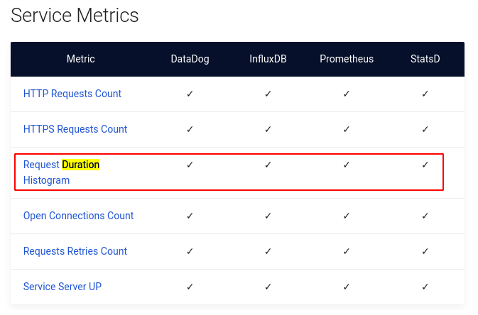
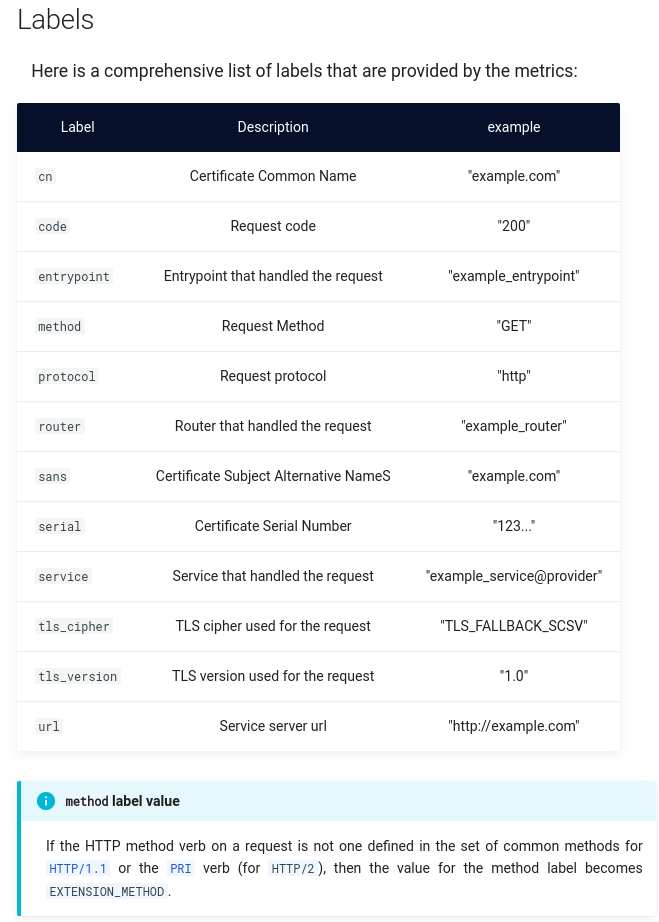
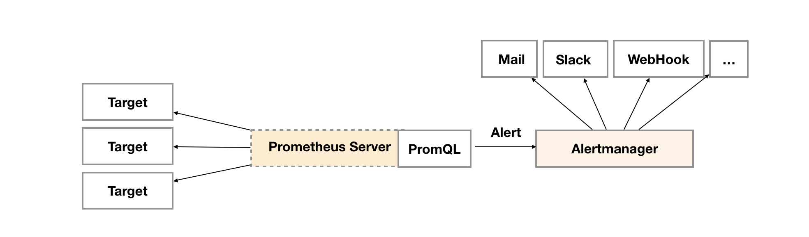
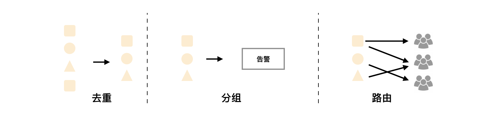
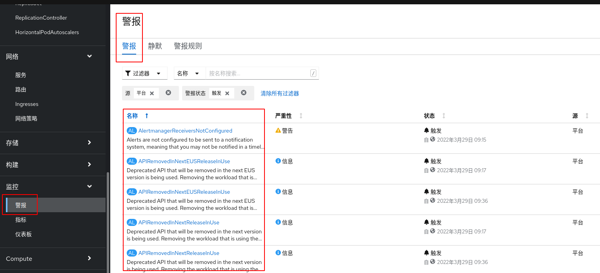

# promethues使用入门

关键字《promethues监控api耗时》

[使用 Prometheus 监控服务器性能](https://cjting.me/2017/03/12/use-prometheus-to-monitor-server/)

## Prometheus简介

像 QPS 和响应时间这些数据，外部工具是没办法直接拿到的，必须要服务器以某种方式将数据暴露出来。最常见的做法是写日志。比如 Nginx，每一条请求对应一个日志，日志中有响应时间这个字段。通过对日志分析，我们就可以得到 QPS，最大响应时间，平均响应时间等，再通过可视化工具即可绘制我们想要的 Dashboard。

日志这个方法固然是可行的，但是还有更好的方法。这个方法就是 时序数据库 (Time Series Database)。时序数据库简单来说就是存储随时间变化的数据的数据库。什么是随时间变化的数据呢？举个简单的例子，比如，CPU 使用率，典型的随时间变化的量，这一秒是 50%，下一秒也许就是 80% 了。或者是温度，今天是 20 度，明天可能就是 18 度了。

Prometheus 就是一个用 Go 编写的时序数据库，官网对其的优点介绍的很清楚，这里就不再赘述了。总之，使用简单，功能强大。

#### 格式

```bash
# HELP go_gc_duration_seconds A summary of the GC invocation durations.
# TYPE go_gc_duration_seconds summary
http_request_count{endpoint="/a"} 10
http_request_count{endpoint="/b"} 200
http_request_count(endpoint="/c") 3
```

#### 数据类型

参考 [（好）腾讯云Promethues自定义监控](https://cloud.tencent.com/document/product/1416/56027)

* Counter
  计数类型，数据是单调递增的指标，服务重启之后会重置。可以用 Counter 来监控请求数/异常数/用户登录数/订单数等。
* Gauge
  当前值，监控打点的时候可对其做加减。可以用 Gauge 来监控当前内存使用率 /CPU 使用率/当前线程数/队列个数等。
* Histogram
  直方图，Prometheus 会根据配置的 Bucket 来计算样本的分布情况，后期可以再加工，一般多用于耗时的监控，通过 Histogram 可以计算出 P99/P95/P50等耗时，同时也可以监控处理的个数，如果用上 Histogram 就不需要再用 Counter 统计个数。**可以用 Histogram 来监控接口响应时间/数据库访问耗时等。**

  Histogram 和 Summary 的使用方式类似，可以直接参考 Summary 的使用方式。

* Summary
  摘要，和 Histogram 有一点类似，也是计算样本的分布情况，区别是 Summary 会在客户端计算出分布情况(P99/P95/Sum/Count)，因此也会更占客户端资源，后期不可再聚合计算处理，同样可以用 Summary 来监控接口响应时间/数据库访问耗时等。

  如何通过 Summary 来监控订单处理耗时：

httpRequestDuration 是一个 Summary 类型的指标，比简单的 Counter 要复杂，会生成三个数据项。
分别是 
* http_request_duration_sum 表示响应时间加在一起的总和，
* http_request_duration_count 表示响应时间的总个数，
* http_request_duration 表示响应时间的分布情况，
  这个数据项会使用 quantile 标签对响应时间进行分组。
  quantile=0.5 值为 50，表示 50% 的请求响应时间都在 50ms 以下
  quantile=0.9 的值为 54，表示 90% 的请求响应时间都在 54ms 以下。但是，quantile=0.99 的值为 103，表示 99% 的请求响应时间在 103ms 以下。
  **这就说明了一个问题，那就是极个别的请求耗费了大量时间。**


## PromQL

#### 查询数据示例

* 通过使用表达式 http_request_duration_sum / http_request_duration_count 我们可以得到平均响应时间

* 输入 http_request_count{endpoint="/a"} 就可以查询路径为 /a 的 API Point 到目前为止的总请求数

* rate(http_request_count[10s]) 表示以 10s 作为时间单元来统计 QPS

* rate(rpc_invoke_time_h_sum{job="Center"}[1m]) / rate(rpc_invoke_time_h_count{job="Center"}[1m])
  如果我们想统计Center各方法的接口耗时，使用如下Query语句即可
  参考 https://cloud.tencent.com/developer/article/1397758

```bash
# 平均耗时？
traefik_service_request_duration_seconds_sum / traefik_service_request_duration_seconds_count

# 接口耗时？
# 1分钟内请求总时间除以总次数得到api响应时间均值
rate(traefik_service_request_duration_seconds_sum{exported_service="test-server-80@http"}[1m]) / rate(traefik_service_request_duration_seconds_count{exported_service="test-server-80@http"}[1m])

# 使用变量统计不同的service的接口平均耗时
rate(traefik_service_request_duration_seconds_sum{exported_service="$service"}[1m]) / rate(traefik_service_request_duration_seconds_count{exported_service="$service"}[1m])

# TODO: p99, p95, p50耗时？
# https://github.com/hellorocky/blog/blob/master/prometheus/2.使用Prometheus监控接口的响应时间.md
istogram_quantile(0.95, sum(rate(http_request_duration_seconds_bucket[1m])) by (le, api))
# sum 分组显示?
# 这时候可以结合sum() by的语法来更加友好地显示我们想看的图, 只有sum的时候, 会把HISTOGRAM和SUMMARY打出来的数据全部加在一起了, 这时候可以使用by来各种分组显示.
# 根据不同的主机来查看. sum by instance
# Summary的percentile的计算都是在于客户端上, 而Histogram的计算是在server端来计算的, 所以出于最小化的影响业务, 建议使用Histogram来计算percentile.


# (好) https://www.jianshu.com/p/1f5e160e1c03
sum, topk, count等使用
```

* xxx

https://blog.dev4eos.com/2020/06/16/grafana-with-prometheus-feishu-monitor/
发现慢接口?


#### 分析一下traefik实际的数据上报点

参考文档: https://doc.traefik.io/traefik/observability/metrics/prometheus/



* traefik_service_requests_total
  The total count of HTTP requests processed on a service.
* traefik_service_request_duration_seconds
  Request processing duration histogram on a service.

以及这个数据上报的label列表



```bash
# HELP traefik_service_open_connections How many open connections exist on a service, partitioned by method and protocol.
# TYPE traefik_service_open_connections gauge
traefik_service_open_connections{method="GET",protocol="http",service="readiness@http"} 0
traefik_service_open_connections{method="GET",protocol="http",service="test-server-80@http"} 0
# HELP traefik_service_request_duration_seconds How long it took to process the request on a service, partitioned by status code, protocol, and method.
# TYPE traefik_service_request_duration_seconds histogram
traefik_service_request_duration_seconds_bucket{code="200",method="GET",protocol="http",service="readiness@http",le="0.1"} 300126
traefik_service_request_duration_seconds_bucket{code="200",method="GET",protocol="http",service="readiness@http",le="0.3"} 300153
traefik_service_request_duration_seconds_bucket{code="200",method="GET",protocol="http",service="readiness@http",le="1.2"} 300161
traefik_service_request_duration_seconds_bucket{code="200",method="GET",protocol="http",service="readiness@http",le="5"} 300162
traefik_service_request_duration_seconds_bucket{code="200",method="GET",protocol="http",service="readiness@http",le="+Inf"} 300162
traefik_service_request_duration_seconds_sum{code="200",method="GET",protocol="http",service="readiness@http"} 234.8720828799954
traefik_service_request_duration_seconds_count{code="200",method="GET",protocol="http",service="readiness@http"} 300162
traefik_service_request_duration_seconds_bucket{code="200",method="GET",protocol="http",service="test-server-80@http",le="0.1"} 34310
traefik_service_request_duration_seconds_bucket{code="200",method="GET",protocol="http",service="test-server-80@http",le="0.3"} 34311
traefik_service_request_duration_seconds_bucket{code="200",method="GET",protocol="http",service="test-server-80@http",le="1.2"} 34311
traefik_service_request_duration_seconds_bucket{code="200",method="GET",protocol="http",service="test-server-80@http",le="5"} 34311
traefik_service_request_duration_seconds_bucket{code="200",method="GET",protocol="http",service="test-server-80@http",le="+Inf"} 34311
traefik_service_request_duration_seconds_sum{code="200",method="GET",protocol="http",service="test-server-80@http"} 46.706151840000175
traefik_service_request_duration_seconds_count{code="200",method="GET",protocol="http",service="test-server-80@http"} 34311
traefik_service_request_duration_seconds_bucket{code="499",method="GET",protocol="http",service="readiness@http",le="0.1"} 3
traefik_service_request_duration_seconds_bucket{code="499",method="GET",protocol="http",service="readiness@http",le="0.3"} 3
traefik_service_request_duration_seconds_bucket{code="499",method="GET",protocol="http",service="readiness@http",le="1.2"} 3
traefik_service_request_duration_seconds_bucket{code="499",method="GET",protocol="http",service="readiness@http",le="5"} 3
traefik_service_request_duration_seconds_bucket{code="499",method="GET",protocol="http",service="readiness@http",le="+Inf"} 3
traefik_service_request_duration_seconds_sum{code="499",method="GET",protocol="http",service="readiness@http"} 0.09873777
traefik_service_request_duration_seconds_count{code="499",method="GET",protocol="http",service="readiness@http"} 3
# HELP traefik_service_requests_total How many HTTP requests processed on a service, partitioned by status code, protocol, and method.
# TYPE traefik_service_requests_total counter
traefik_service_requests_total{code="200",method="GET",protocol="http",service="readiness@http"} 300162
traefik_service_requests_total{code="200",method="GET",protocol="http",service="test-server-80@http"} 34311
traefik_service_requests_total{code="499",method="GET",protocol="http",service="readiness@http"} 3
```

## p99延迟

99%的最慢的请求的延迟时间

我们考察一个服务器的性能，除了QPS数据外，还会考察响应时间，当服务器负载增高时，往往会伴随着响应时间的增长，但是这个值该如何度量，以精准的表现服务器当前之负载呢？


#### p99是如何计算的

Latency （延迟）是我们在监控线上的组件运行情况的一个非常重要的指标，它可以告诉我们请求在多少时间内完成。监控 Latency 是一个很微妙的事情，比如，假如一分钟有 1亿次请求，你就有了 1亿个数字。如何从这些数字中反映出用户的真实体验呢？

之前的公司用平均值来反应所有有关延迟的数据，这样的好处是计算量小，实施简单。只需要记录所有请求的一个时间总和，以及请求次数，两个数字，就可以计算出平均耗时。但问题是，平均耗时非常容易掩盖真实的问题。比如现在有 1% 的请求非常慢，但是其余的请求很快，那么这 1% 的请求耗时会被其他的 99% 给拉平，将真正的问题掩盖。

Prometheus 是假设每一个桶内的数据都是线性分布的，比如说现在 300-500 的桶里面一共有 100 个请求，小于300个桶里面一共有 9850 个请求。所有的桶一共有 1万个请求。那么我们要找的 P99 其实是第 10000 * 0.99 = 9900 个请求。第 9900 个请求在 300-500 的桶里面是第 9900 – 9850 = 50 个请求。根据桶里面都是线性分布的假设，第50个请求在这个桶里面的耗时是 (500 – 300) * (50/100) = 400ms, 即 P99 就是 400ms.

可以注意到因为是基于线性分布的假设，不是准确的数据。比如假设 300-500 的桶中耗时最高的请求也只有 310ms, 得到的计算结果也会是 400ms. 桶的区间越大，越不准确，桶的区间越小，越准确。

## promethues的api

关键字《prometheus 接口》

[Prometheus查询及接口服务](https://blog.csdn.net/liangcha007/article/details/88558389)

```java
    public static void main(String[] args) throws Exception
    {
        String query = URLEncoder.encode("{label=\"2.1.2\"} [5m]","utf-8");
        String url = "http://localhost:9090/api/v1/query?query="+query;
        String ret = HttpKit.get(url);
        System.out.println(ret);
    }
```

输出结果如下：
```json
{
	"status": "success",
	"data": {
		"resultType": "matrix",
		"result": [{
			"metric": {
				"__name__": "online_accse_host_1_a",
				"instance": "sp1-exp",
				"job": "bis-sp1",
				"label": "2.1.2",
				"prov": "yunnan"
			},
			"values": [
				[1552558929.044, "3903089"],
				[1552559214.044, "3903089"]
			]
		}]
	}
}
```

这是一个标准的JSON串。一般情况下，我们在使用Prometheus的时候，都会配套的使Grafana等其他数据展示的工具，但其实，我们也可以自己开发自定义的panel。通过访问Prometheus的接口服务，来获取对应的数据。

[(好)promethues官方api文档](https://prometheus.io/docs/prometheus/latest/querying/api/)

* Instant queries
* Range queries
* ...


[Prometheus 二次开发之 API 接口](https://cloud.tencent.com/developer/article/1824993)
统计Prometheus全局配置 target?监控点
```bash
curl http://localhost:9090/api/v1/targets
```

查询规则
该接口返回告警并记录当前配置生效的规则列表，此外，还返回当前活动的告警实例；
```bash
curl http://localhost:9090/api/v1/rules
```

查询告警
返回所有活动警报的列表。
```bash
curl http://localhost:9090/api/v1/alerts
```


#### promethues api python客户端

[官方Prometheus Python Client](https://github.com/prometheus/client_python)
=> 额，这个应该是python promethues上报的sdk吧

```bash
pip3 install prometheus-client
```

#### 使用curl访问promethues接口

创建服务帐号，以及赋予权限
```bash
oc project default
oc create sa grafana-serviceaccount
oc adm policy add-cluster-role-to-user cluster-monitoring-view -z grafana-serviceaccount
TOKEN=$(oc serviceaccounts get-token grafana-serviceaccount)
```

```bash
# curl $APISERVER/api/v1/services --header "Authorization: Bearer $TOKEN"
curl -ks -H "Authorization: Bearer $TOKEN" \
  https://thanos-querier-openshift-monitoring.apps.kcp5.iefcu.cn/api/v1/query?query=http_requests_total
```

```bash
curl -ks -H "Authorization: Bearer $TOKEN" \
  https://alertmanager-main-openshift-monitoring.apps.kcp5.iefcu.cn/api/v2/alerts
```

## promethues告警调研

[Prometheus告警简介](https://yunlzheng.gitbook.io/prometheus-book/parti-prometheus-ji-chu/alert/prometheus-alert-manager-overview)

告警能力在Prometheus的架构中被划分成两个独立的部分。如下所示，通过在Prometheus中定义AlertRule（告警规则），Prometheus会周期性的对告警规则进行计算，如果满足告警触发条件就会向Alertmanager发送告警信息。



在Prometheus中一条告警规则主要由以下几部分组成：

* 告警名称：用户需要为告警规则命名，当然对于命名而言，需要能够直接表达出该告警的主要内容
* 告警规则：告警规则实际上主要由PromQL进行定义，其实际意义是当表达式（PromQL）查询结果持续多长时间（During）后出发告警

在Prometheus中，还可以通过Group（告警组）对一组相关的告警进行统一定义。当然这些定义都是通过YAML文件来统一管理的。

Alertmanager作为一个独立的组件，负责接收并处理来自Prometheus Server(也可以是其它的客户端程序)的告警信息。Alertmanager可以对这些告警信息进行进一步的处理，比如当接收到大量重复告警时能够消除重复的告警信息，同时对告警信息进行分组并且路由到正确的通知方，Prometheus内置了对邮件，Slack等多种通知方式的支持，同时还支持与Webhook的集成，以支持更多定制化的场景。例如，目前Alertmanager还不支持钉钉，那用户完全可以通过Webhook与钉钉机器人进行集成，从而通过钉钉接收告警信息。同时AlertManager还提供了静默和告警抑制机制来对告警通知行为进行优化。

Alertmanager特性

Alertmanager除了提供基本的告警通知能力以外，还主要提供了如：分组、抑制以及静默等告警特性：



关键字《openshift 告警通知配置》

[将通知发送到外部系统](https://access.redhat.com/documentation/zh-cn/openshift_container_platform/4.7/html/monitoring/sending-notifications-to-external-systems_managing-alerts)

[安装后配置 - 配置警报通知](https://access.redhat.com/documentation/zh-cn/openshift_container_platform/4.7/html/post-installation_configuration/configuring-alert-notifications)

[理解OpenShift（7）：基于 Prometheus 的集群监控](https://www.cnblogs.com/sammyliu/p/10155442.html)

## altermanager api接口

[AlertManager的API](https://pshizhsysu.gitbook.io/prometheus/ff08-san-ff09-prometheus-gao-jing-chu-li/kuo-zhan-yue-du/alertmanagerde-api)

获取alert接口
```bash
curl -ks -H "Authorization: Bearer $TOKEN" https://alertmanager-main-openshift-monitoring.apps.kcp5.iefcu.cn/api/v2/alerts
```


## 为用户定义的项目创建警报规则

参考[openshift监控 - 为用户定义的项目创建警报规则](https://access.redhat.com/documentation/zh-cn/openshift_container_platform/4.7/html/monitoring/creating-alerting-rules-for-user-defined-projects_managing-alerts)

```yaml
apiVersion: monitoring.coreos.com/v1
kind: PrometheusRule
metadata:
  name: example-alert
  namespace: ns1
spec:
  groups:
  - name: example
    rules:
    - alert: VersionAlert
      expr: version{job="prometheus-example-app"} == 0
```

此配置会创建一个名为 example-alert 的警报规则。当示例服务公开的 version 指标变为 0 时，警报规则会触发警报。

> 重要
用户定义的警报规则可以包含其自身项目的指标和集群指标。您不能包含其他用户定义的项目的指标。
例如，用户定义的项目 ns1 的警报规则可以包含来自 ns1 的指标和集群指标，如 CPU 和内存指标。但是，该规则无法包含来自 ns2 的指标。
另外，您无法为 openshift-* 核心 OpenShift 项目创建警报规则。OpenShift Container Platform 监控默认为这些项目提供一组警报规则。

## 参考资料

* [使用 Prometheus 监控服务器性能](https://cjting.me/2017/03/12/use-prometheus-to-monitor-server/)

* [P99是如何计算的](https://www.kawabangga.com/posts/4284)

* [Promethues 中文文档 - 存储](https://prometheus.fuckcloudnative.io/di-san-zhang-prometheus/storage)