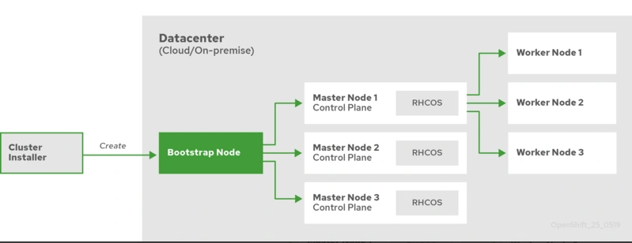
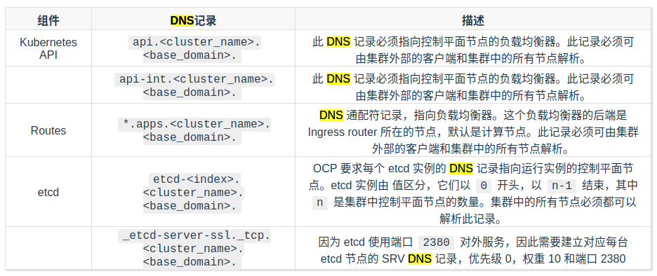
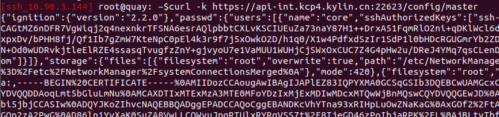
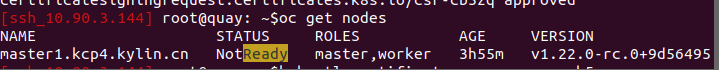
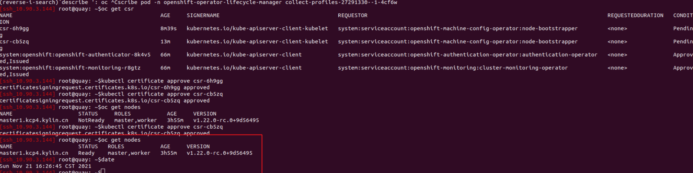

# 离线安装部署kcp文档

## 原理介绍

### ocp安装流程

先看这个官方的图，从图来讲流程


它的安装是先在一台机器（bastion）上准备 pxe 和相关的安装集群描述信息需要的文件（Ignition）以及 dns，负载均衡，然后引导主机（Bootstrap）通过 dhcp 或者 人为挂载 rhcos 的 iso 在安装界面手写 boot cmdline 从 bastion 指定获取 bootstrap.ign和 os.raw.gz 文件完成安装， 随后 master 节点启动会获取master.ign文件并且从 bootstrap 节点获取 machine-config 信息，随后 node 同理。

在安装过程中 bootstrap 的 ign文件里证书是24小时过期的，因为官方这种涉及理念是 bootstrap 作用于引导集群的，安装完后会将控制平面移交到 master上，所以我们要配置负载均衡（以及代理后续集群里的 ingress controller）

* 先在一台机器（bastion）上准备pxe和相关的安装集群描述信息需要的文件（Ignition）以及 dns，负载均衡，也就是图里的 Cluster Installer
* bastion上手写一个集群安装的 yaml ，然后使用 oc 命令把 yaml 转换成集群部署清单和 Ignition 文件
* 在引导主机启动前准备好 DNS，负载均衡，镜像仓库
* 引导主机（Bootstrap）通过 dhcp 或者挂载 rhcos 的 iso 启动后在安装界面手写boot cmdline（包含网络配置，nameserver，install_dev,image_url,ignition_url），安装完系统后重启后，bootstrap 机器会执行 bootkube.sh 脚本，内部是 crio 和 podman 启动容器和 pod 来启动控制平面，并等待 master 加入
* Master 节点如果像我没有dhcp就手动配置boot cmdline 安装后会从引导主机远程获取资源并完成引导，会作为 node 注册。
* bootstrap 节点 watch 到 node的注册后，会在集群里部署 operator 执行 一些 install-n-master的 pod，例如引导主机会让 master 节点构建 Etcd 集群。
* 引导主机使用新的 Etcd 集群启动临时 Kubernetes 控制平面。
* 临时控制平面在 Master 节点启动生成控制平面。
* 临时控制平面关闭并将控制权传递给生产控制平面。
* 引导主机将 OCP 组件注入生成控制平面。
* 整个过程主要是 bootstrap 上的 bootkube.sh 执行，最后执行完后会在集群里添加一个 -n kube-system configmap/bootstrap 作为保存状态。
* 引导安装过程完成以后，OCP 集群部署完毕。然后集群开始下载并配置日常操作所需的其余组件，包括创建计算节点、通过 Operator 安装其他服务等。

## 准备工作
需要准备硬件，软件，ip等

#### 服务器规划

服务器规划如下：

* 三个控制平面节点，安装 Etcd、控制平面组件。
* 一个计算节点，运行实际负载。
* 一个引导主机，执行安装任务，集群部署完成后当作 worker 使用。
* 一个基础节点，用于准备上离线资源，同时用来部署 私有镜像仓库quay，DNS 和负载均衡（负载machine-config、ocp 的 kube-apiserver 和 集群里的 ingress controller）。

| 主机 | OS | vCPU | RAM | Storage | IP | FQND | 描述 |
| :---- | ----:| :- | :- | :- | :-- | :-- | :-- | :-- |
| bastion  | kylinos 344 |  8   | 8G | 100G | 10.90.3.38 | bastion.kcp4.iefcu.cn  |堡垒机: dns,haproxy<br>quay,http |
| bootstrap  | kylin coreos |  8   | 4G | 120G | 10.90.3.30 | bootstrap.kcp4.iefcu.cn  | 引导节点 |
| master1  | kylin coreos |  8   | 16G | 120G | 10.90.3.31 | master1.kcp4.iefcu.cn  |控制节点 |
| master2  | kylin coreos |  8   | 16G | 120G | 10.90.3.32 | master2.kcp4.iefcu.cn  |控制节点 |
| master3  | kylin coreos |  8   | 16G | 120G | 10.90.3.33 | master3.kcp4.iefcu.cn  |控制节点 |
| worker1  | kylin coreos |  8   | 16G | 120G | 10.90.3.34 | worker1.kcp4.iefcu.cn  |计算节点 |

* kcp4 是集群名，iefcu.cn是 basedomain
* ocp内部的 kubernetes api、router、etcd通信都是使用域名，所以这里我们也给主机规定下FQDN，所有节点主机名都要采用三级域名格式，如 master1.aa.bb.com。**后面会在 dns server里写入记录**


#### 硬件准备
单节点环境部署，至少需要三台机器：
一台x86机器，另外两台arm机器
x86机器作为负载均衡和dns等，cpu和内存需要4u8g
arm机器作为master等，cpu和内存至少需要8u16g
bootstrap的arm机器可以4u4g

#### 软件数据准备
kylin coreos系统iso
haproxy负载均衡
dns 服务
quay镜像仓库
kcp-install和oc 
（以上软件数据全部在容器云ftp服务器上）

#### ip准备
至少准备三个ip（其中有1个临时ip，可以释放）
bootstrap => x.x.x.0 (临时)
master1 => x.x.x.1
haproxy => x.x.x.99

#### 域名准备
准备*.ocp4.iefcu.cn，可自定义，例如
bootstrap.ocp4.iefcu.cn
master1.ocp4.iefcu.cn
etcd1.ocp4.iefcu.cn

## 安装步骤

### 1. 初始化配置bastion堡垒机

x86机器，可以是虚拟机。
安装系统，例如unikylin3.3-6A，最小安装即可，创建管理员adam/ksvd2020，配置网络
安装docker，docker-compose，然后把我准备好的软件放上去，然后处理，有如下文件:
* quay.tgz => 私有镜像仓库
* docker-images.tar => 基础服务docker镜像
* oc, kubectl等

```bash
mkdir -p /data/kcp-install && cd /data/kcp-install
# XXX: 把上述文件放到这里 ...
# 解压私有镜像仓库，特别注意，需要保持里面部分文件的权限，用-p等参数
sudo tar --numeric-owner -xpzf quay.tgz
# 导入docker镜像
docker image load -i docker-images.tar

# XXX: 最后，禁用selinxu和防火墙
```

### 2. 部署配置镜像仓库

我已经在使用docker部署配置好了，启动即可。
(管理员用户密码为kylin/kylinsec)

```bash
cd /data/kcp-install/quay && docker-compose up -d
```

* 注意修改config/config.yaml，修改SERVER_HOSTNAME字段，示例内容为 quay.iefcu.cn:9443，意思就是私有镜像仓库服务为quay.iefcu.cn，端口为9443
* 以及修改config/ssl.key, config/ssl.cert为正确有效的https证书和密钥(注意权限为1001)
* 最后验证一下能够拉取私有镜像仓库的镜像
```bash
podman pull quay.iefcu.cn:9443/kcp/ocp-build@sha256:8b52838119f1d090ca486ad6ecbbc1b4316642e467b988afaa859b0878bb061e
podman pull quay.iefcu.cn:9443/kcp/ocp-build:4.9.0-rc.6-arm64-0125 
# 注意，后续版本可能更新，验证拉取的镜像的可能会变化。
```

#### 再次同步一下原始release版本中的镜像，以确保万无一失

一般来说我准备的quay私有镜像仓库，已经同步过了，但是再确认一下更好!
目前我使用[image-syncer](https://github.com/AliyunContainerService/image-syncer)这个工具来同步镜像
```bash
cat > image-sync.json << EOF
{
    "quay.iefcu.cn:9443": {
        "username": "kylin",
        "password": "kylinsec"
    }
}
EOF

cat > image-sync-list.json << EOF
{
"hub.iefcu.cn/xiaoyun/openshift4-aarch64": "quay.iefcu.cn:9443/kcp/openshift4-aarch64"
}
EOF

image-syncer --proc=6 --auth=./image-sync.json --images=./image-sync-list.json \
  --namespace=public --registry=hub.iefcu.cn --retries=3
```

### 3. 配置dnsmasq服务

目前我使用dnsmasq容器提供dns服务，创建dns目录，以下操作都在dns目录下执行

**dns配置要求如下：**

按照官方文档，使用 UPI 基础架构的 OCP 集群需要以下的 DNS 记录。在每条记录中，<cluster_name> 是集群名称，<base_domain> 是在 install-config.yaml 文件中指定的集群基本域，如下表所示：



#### a. 创建当前dns配置内容示例如下：

```conf
# 泛域名解析apps
address=/apps.kcp4.iefcu.cn/10.90.3.38
address=/api.kcp4.iefcu.cn/10.90.3.38
address=/api-int.kcp4.iefcu.cn/10.90.3.38

# 这里默认etcd是部署在master节点上
address=/etcd-0.kcp4.iefcu.cn/10.90.3.31
address=/etcd-1.kcp4.iefcu.cn/10.90.3.32
address=/etcd-2.kcp4.iefcu.cn/10.90.3.33

# 加密的etcd域名SRV记录
srv-host=_etcd-server-ssl._tcp.kcp4.iefcu.cn,etcd-0.kcp4.iefcu.cn,2380,10
srv-host=_etcd-server-ssl._tcp.kcp4.iefcu.cn,etcd-1.kcp4.iefcu.cn,2380,10
srv-host=_etcd-server-ssl._tcp.kcp4.iefcu.cn,etcd-2.kcp4.iefcu.cn,2380,10

# 除此之外再添加各节点主机名记录
address=/bootstrap.kcp4.iefcu.cn/10.90.3.30
address=/master1.kcp4.iefcu.cn/10.90.3.31
address=/master2.kcp4.iefcu.cn/10.90.3.32
address=/master3.kcp4.iefcu.cn/10.90.3.33
address=/worker1.kcp4.iefcu.cn/10.90.3.33

# 临时私有镜像仓库
address=/quay.iefcu.cn/10.90.3.38

# 使用上游dns 8.8.8.8
server=8.8.8.8
no-resolv
```

举例说明，
* api.kcp4.iefcu.cn这个域名配置的ip地址是堡垒机bastion的ip地址
* quay.iefcu.cn这个私有镜像仓库的域名配置的ip地址也是bastion的ip地址
  (因为私有镜像仓库也在堡垒机上)

#### b. 创建*docker-compose.yml*配置文件，内容如下：
```yaml
version: '3.4'
services:
  dnsmasq:
    image: hub.iefcu.cn/public/dnsmasq:latest
    container_name: dns
    restart: always
    network_mode: host
    privileged: true
    volumes:
      - ./dnsmasq.conf:/etc/dnsmasq.conf
    environment:
      - HTTP_USER=kylin
      - HTTP_PASS=test123...
    logging:
      driver: json-file
      options:
        max-file: '3'
        max-size: 10m
```

#### c. 启动dns容器服务

```bash
docker-compose up -d # 启动dns容器
docker ps -a | grep dns # 检查dns容器运行状态
docker logs -f dns # 检查dns日志
```

#### d. 检查dns服务条目

```bash
dig +short api.kcp4.iefcu.cn @127.0.0.1
dig +short -t SRV _etcd-server-ssl._tcp.kcp4.iefcu.cn @127.0.0.1
```

### 4. 配置运行haproxy

创建目录haproxy，以下所有命令都是在haproxy目录中执行的。

#### a. 创建docker-compose.yml文件内容如下
```yaml
version: '3.2'
services:
  haproxy:
    image: hub.iefcu.cn/public/haproxy:lts
    container_name: haproxy
    restart: always
    user: root
    network_mode: host
    volumes:
      - ./config/:/etc/haproxy/
      - /etc/localtime:/etc/localtime:ro
    cap_add:
      - ALL
    privileged: true
    command: ["-f", "/etc/haproxy/haproxy.cfg"]
    logging:
      driver: json-file
      options:
        max-file: '3'
        max-size: 100m
```

#### b. 创建haproxy配置文件*config/haproxy.cfg*，内容如下

**注意： 对应后端boostrap和master的ip地址需要修正**

配置文件config/haproxy.cfg
```conf
global
  maxconn  2000
  ulimit-n  16384
  log  127.0.0.1 local0 err

defaults
  log global
  mode  http
  option  httplog
  timeout connect 5000
  timeout client  50000
  timeout server  50000
  timeout http-request 15s
  timeout http-keep-alive 15s

listen stats
    bind         :9000
    mode         http
    stats        enable
    stats        uri /
    stats        refresh   30s
    stats        auth      admin:password #web页面登录
    monitor-uri  /healthz

frontend openshift-api-server
    bind :6443
    default_backend openshift-api-server
    mode tcp
    option tcplog

backend openshift-api-server
    balance roundrobin
    mode tcp
    option httpchk GET /healthz
    http-check expect string ok
    default-server inter 10s downinter 5s rise 2 fall 2 slowstart 60s maxconn 250 maxqueue 256 weight 100
    server bootstrap 10.90.3.30:6443 check check-ssl verify none #安装结束后删掉此行
    server master1 10.90.3.31:6443 check check-ssl verify none
    server master2 10.90.3.32:6443 check check-ssl verify none
    server master3 10.90.3.33:6443 check check-ssl verify none

frontend machine-config-server
    bind :22623
    default_backend machine-config-server
    mode tcp
    option tcplog

backend machine-config-server
    balance roundrobin
    mode tcp
    server bootstrap 10.90.3.30:22623 check #安装结束后删掉此行
    server master1 10.90.3.31:22623 check
    server master2 10.90.3.32:22623 check
    server master3 10.90.3.33:22623 check

frontend ingress-http
    bind :80
    default_backend ingress-http
    mode tcp
    option tcplog

backend ingress-http
    balance roundrobin
    mode tcp
    server master1 10.90.3.31:80 check
    server master2 10.90.3.32:80 check
    server master3 10.90.3.33:80 check

frontend ingress-https
    bind :443
    default_backend ingress-https
    mode tcp
    option tcplog

backend ingress-https
    balance roundrobin
    mode tcp
    server master1 10.90.3.31:443 check
    server master2 10.90.3.32:443 check
    server master3 10.90.3.33:443 check
```

#### c. 运行haproxy容器

```bash
docker-compose up -d # 启动haproxy容器
docker ps -a | grep haproxy # 检查haproxy容器运行状态
docker logs -f haproxy # 检查haproxy日志
```

### 5. 部署http服务，提供点火文件下载服务

首次安装kylin coreos的时候，需要点火文件，以http文件的形式提供。
创建目录install-nginx, 以下操作都是在这个目录中执行的。

#### 1. 创建docker-compose.yml文件，内容如下

```yaml
version: '3.4'
services:
  nginx:
    image: hub.iefcu.cn/public/nginx:alpine
    container_name: install-nginx
    restart: always
    ports:
      - "9090:80/tcp"
    volumes:
      - ./install:/usr/share/nginx/html:ro
    logging:
      driver: json-file
      options:
        max-file: '3'
        max-size: 10m
```

#### 2. 运行nginx http服务

```bash
mkdir -p ./install
docker-compose up -d
curl -v -o /dev/null http://127.0.0.1:9090 # 检查http服务是否正常
```

### 5. 生成点火文件

创建目录gen-ignition, 在这个目录中生成点火文件

#### a. 首先从release镜像中，提取openshift-install二进制文件

从0125这个发布版本中提取openshift-install安装客户端
```bash
GODEBUG=x509ignoreCN=0 oc adm release extract \
  --command=openshift-install \
  hub.iefcu.cn/xiaoyun/openshift4-aarch64:4.9.0-rc.6-arm64-0125

# 最新测试镜像为zhouming的更新console的发布版本，正在测试中。
hub.iefcu.cn/xiaoyun/openshift4-aarch64:4.9.0-rc.6-arm64-0304-zhouming-console
```

#### b. 然后配置点火文件，示例内容如下

创建配置文件install-config.yaml
```yaml
apiVersion: v1
baseDomain: iefcu.cn
compute:
- hyperthreading: Enabled
  name: worker
  replicas: 0
controlPlane:
  hyperthreading: Enabled
  name: master
  replicas: 1
metadata:
  name: kcp2-arm
networking:
  clusterNetwork:
  - cidr: 10.128.0.0/14
    hostPrefix: 23
  networkType: OpenShiftSDN
  serviceNetwork:
  - 172.30.0.0/16
platform:
  none: {}
fips: false
pullSecret: '{ "auths": { "quay.iefcu.cn:9443": { "auth": "a3lsaW46a3lsaW5zZWM=", "email": "kylinsec@kylinsec.com.cn" } } } '
sshKey: 'ssh-rsa AAAAB3NzaC1yc2EAAAADAQABAAACAQCaQ9Zpb5/nyiZEw9sR1mqpdpXgRi7WMnSeDyF2R7g7ZH3kUWZhY/Kkf/LoHWeNR82Wb1gq7s5YvEzSAy9R0VnCAGtMZ6nDFR7VgWiqj2q4nexnkrTFSNA6esrAQlpbbtCXLvKSCIUEuZa73naY87H1++DrxA51FqmRlO2ni+qDKlWcl6d/Jr+0Z+JqfWAdKmGmLDtU/L3qol4VIUolMaL1g7I8O07gbQJovXGTVypkoijLdEZ/mYnL6/3ODuPRBQZfw/A7rG39BiBJ3AxU2UYv8Mfh1Cai3CTqyX/k2wxpxDv/bPHH8fj/Qf1Ib7gZmW7KteNpC0pEl4k3r9f7j5xOwkO2D/h1q0/X1w4PdfxdSzIr1SdP1l0bHDcRGUGmrYb2ZDy9M2U14D0JBT9QWWL36CNOKHNYtrE3nu+g7f7nIUHPijc6MkUZ/h1rYsREWdOSwrTSIkmDS2ajH5CLfX+FsXuExiIor1jyhaPzk8r6M2QxgGJwUZxpEdqa5N+Od0wUDRvkjtleElRZE4ssasqTvugfzZnY+gjvyoU7e1VaMUU1WUHjCjSWxOxCUC7Z4G4pHw2u/DReJ4YMq7qsCLenDE3GvcywZXTN3XA0L+69cWFe5eOC7kG5ggAsVOtXyCFk3+DgBA6vmd415RSQeafyfoitHpPpCr3aeYsOlljyDw== root@bastion.openshift4.kylin.com'
imageContentSources:
additionalTrustBundle: |
  -----BEGIN CERTIFICATE-----
  注意这里要前面空个两格用于yaml对齐
  -----END CERTIFICATE-----
- mirrors:
  - quay.iefcu.cn:9443/kcp/openshift4-aarch64
  source: hub.iefcu.cn/xiaoyun/openshift4-aarch64
```

点火文件配置内容说明

* additionalTrustBundle : 私有镜像仓库的信任证书, 如果不是私有证书，就无需配置

* 配置镜像仓库的mirror
  离线情况下，节点拉取镜像都是从私有镜像仓库quay.iefcu.cn拉取的
  目前搭建的私有镜像仓库域名为quay.iefcu.cn，端口为9443, 镜像目录为kcp/openshift4-aarch64(文档可能更新不及时，可能不一样，得确认一下！)
  **注意私有镜像仓库的地址要根据实际配置修改**

* 目前最终镜像是 hub.iefcu.cn/xiaoyun/openshift4-aarch64
  rhcos之前是quay.io/openshift-release-dev/ocp-v4.0-art-dev
  （TODO: 名称需要改掉，改成 hub.iefcu.cn/kylinsec/kcp-aarch64）
* 如果用户现场搭建的私有镜像仓库也是hub.iefcu.cn/xiaoyun/openshift4-aarch64，那就不用配置，否则就需要配置

配置示例如下：
```yaml
imageContentSources:
- mirrors:
  - quay.iefcu.cn:9443/kcp/openshift4-aarch64
  source: hub.iefcu.cn/xiaoyun/openshift4-aarch64
- mirrors:
  - quay.iefcu.cn:9443/kcp/ocp-build
  source: hub.iefcu.cn/xiaoyun/ocp-build
```

#### c. 执行openshift-install命令，生成ignition点火文件

```bash
./openshift-install create manifests
./openshift-install create ignition-configs

# TODO: 记得手动把点火文件放到install-nginx目录中去
# cp -f *.ign ../install-nginx/install/
# chmod 644 ../install-nginx/install/*.ign
```

### 安装kylin coreos


按F7（也可能是F11）选择cdrom启动，**在livecd的grub配置中增加内核参数selinux=0**
livecd网络准备工作
准备工作，配置可以ssh到服务器上去执行命令

```bash
# TODO: 更复杂的网络配置，例如bond口等
# 使用nmcli配置ip地址, 注意enp3s0这个名称需要适配修改
sudo nmcli c add con-name enp3s0 type ethernet ifname enp3s0
sudo nmcli c mod enp3s0 ipv4.addresses 10.90.3.84/24 ipv4.gateway 10.90.3.1 ipv4.method manual
sudo nmcli c mod enp3s0 ipv4.dns 10.90.3.38
sudo nmcli c mod enp3s0 ipv6.method disabled
sudo nmcli c mod enp3s0 ipv4.dhcp-hostname bootstrap.kcp4-arm.iefcu.cn
# confirm /etc/NetworkManager/system-connections/enp3s0.nmconnection
sudo nmcli c up enp3s0

# 或者简单临时配置一下ip和网关
sudo systemctl stop NetworkManager
sudo ifconfig enp3s0 10.90.3.35/24
sudo route add default gw 10.90.3.1

# 可选，这些ssh配置以及密码配置是为了能够ssh登录复制粘贴命令的。
# 修改core用户的密码为password
echo password | sudo passwd --stdin core
```

准备工作，校准服务器硬件时间，**特别注意vmware的虚拟机的时间**
```bash
# 这里livecd一般是utc时区，我们设置时间要减去8个小时
date -s '2022-01-22 10:00:00'
# 将系统时间写入硬件
hwclock -w
```

**TODO:（有额外的dhcp服务器，需要处理，可能会遇到安装失败的问题）**


#### 手动安装bootstrap

注意修改如下参数, 部分参数可以在livecd中使用相关命令查看:
	a. 系统安装到哪个磁盘上，例如 /dev/vda
	b. 配置系统的网卡网络信息，例如 enp3s0
	c. 静态ip地址，例如 ip=10.90.3.82::10.90.3.1:255.255.255.0
	d. 主机名，例如 bootstrap.kcp3-arm.iefcu.cn
	e. dns信息, 例如 nameserver=10.90.3.38
	f. 点火文件地址, 例如 http://10.90.3.38:9090/bootstrap.ign

```bash
sudo coreos-installer install /dev/vda \
    --append-karg ip=10.90.3.82::10.90.3.1:255.255.255.0:bootstrap.kcp3-arm.iefcu.cn:enp3s0:none \
    --append-karg nameserver=10.90.3.38 \
    --append-karg selinux=0 \
    --insecure-ignition \
    --ignition-url http://10.90.3.38:9090/bootstrap.ign
```

安装完成后，重启选择硬盘启动
然后过一会等系统起来后，就可以检查boostrap安装是否成功了。

使用密钥登录系统，检查镜像下载镜像
ssh -i ~/.ssh/new_rsa core@10.90.3.82

journalctl -b -f -u release-image.service -u bootkube.service # 检查服务是否正常
sudo podman images # 检查是否有很多镜像，大概十几个
sudo netstat -lntp | grep 6443\|2379 # 检查etcd，apiserver服务是否起来

检查bootstrap是否安装好（这个一般不用检查，特殊查问题的时候才检查）

```
curl -k https://api-int.kcp3-arm.iefcu.cn:22623/config/master
```

需要得到数据


#### 手动安装master

基本上同bootstrap，少量参数不一样
1. 主机名， 例如 master1.kcp3-arm.iefcu.cn
2. 点火文件，例如 http://10.90.3.38:9090/master.ign
3. 网卡名，例如 enp12s0f1

```bash
sudo coreos-installer install /dev/sdb \
    --append-karg ip=10.90.3.83::10.90.3.1:255.255.255.0:master1.kcp3-arm.iefcu.cn:enp12s0f1:none \
    --append-karg nameserver=10.90.3.38 \
    --insecure-ignition \
    --ignition-url http://10.90.3.38:9090/master.ign
```

##### 第一次额外配置
reboot, 选择硬盘启动, 修改grub配置，**添加内核参数selinux=0 autorelabel=1**

##### 第二次额外配置
等重启完成后，过几次会出现两个grub参数，此时再需要修改grub配置，**添加内核参数enforcing=0 autorelabel=1**

#### kylin-login修改

```bash
cd /data/kcp-install/others/kylin-logo && bash ./run.sh
```

#### 配置heketi+glusterfs存储

TODO:

#### 启用内部registry

TODO:

#### 新增htpasswd用户认证

```bash
htpasswd -c -B -b users.htpasswd admin ksvd2020
# 输入内容如下:
admin:$2y$05$oANlQ7bXuJQqbytIFkA7OO5Mf5pROsxoIgVU1UYdQrMTkrl2CNVi6
```

赋予admin用户集群管理员权限
```bash
oc adm policy add-cluster-role-to-user cluster-admin admin
```

删除默认kubeadmin用户
```bash
oc -n kube-system delete secrets kubeadmin
```

新增kylin-monitor用户
```bash
htpasswd -c -B -b users.htpasswd kylin-monitor jit@2021
kylin-monitor:$2y$05$IzGbG9RbAEX577z7RKeVEOl3V0AgfeIoCNq8yDiO9GZ8rnYly5Tlu

oc adm policy add-cluster-role-to-user cluster-monitoring-view kylin-monitor
```

## FAQ

TODO:各种配置出错，可以到这里找原因和解决方法

1. notReady
node NotReady, 最后等了很久，发现有csr了，通过之后节点Ready了



```bash
oc get csr | grep pending -i | awk '{print $1}' | sed 's/^/kubectl certificate approve /' | bash
```

## 版本变更列表

* v1.7 20220303
计划： 参考ocp-4.5-install这篇文档，更新原理，
尤其是dns，和haproxy，点火文件的部分。

* v1.6 20220215

v1.6计划：
使用nmcli配置修改网络，主机名
selinux=0在安装阶段处理一下。
dns配置文档更新。

## 参考文档

[openshift 4.5.9 离线安装](https://zhangguanzhang.github.io/2020/09/18/ocp-4.5-install/)

[coreos安装参数参考文档 - redhat官方文档](https://access.redhat.com/documentation/zh-cn/openshift_container_platform/4.6/html/installing_on_ibm_power/creating-machines-ibm-power-restricted-network)

[私有镜像仓库配置](https://docs.openshift.com/container-platform/4.8/registry/configuring_registry_storage/configuring-registry-storage-baremetal.html)

[暴露私有镜像仓库](https://docs.openshift.com/container-platform/4.8/registry/securing-exposing-registry.html)

[配置默认存储类](https://kubernetes.io/zh/docs/tasks/administer-cluster/change-default-storage-class/)

[oc命令行参考 - redhat官方文档](https://access.redhat.com/documentation/en-us/openshift_container_platform/4.1/html/cli_reference/cli-developer-commands)
