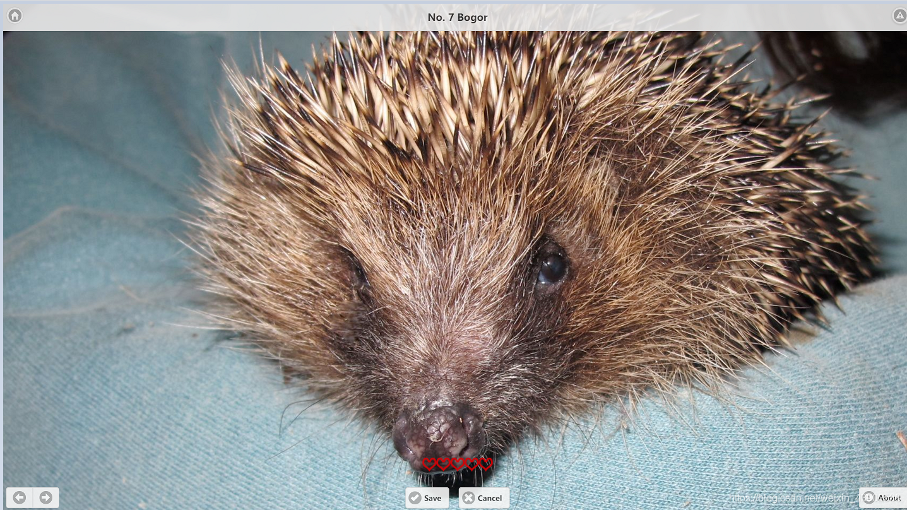

# openshift pipeline安装使用


## 安装jenkins template

参考: [OpenShift 4 Hands-on Lab (7) - 用Jenkins Pipeline实现在不同运行环境中升迁部署应用](https://blog.csdn.net/weixin_43902588/article/details/104285933)

openshift x86 4.8.9有jenkins模板, 而且有jenkins镜像
4.8.9-x86_64-jenkins

openshift arm64 4.9.0-rc6也有jenkins镜像
4.9.0-rc.6-arm64-jenkins

由sample operaotr处理的!
`oc -n openshift-cluster-samples-operator get pods`

(说明：本文已经在OpenShift 4.9环境中验证)

在DevOps过程中CI/CD是最主要的工具，通过它的Pipeline可以驱动整个开发、测试、交付和部署过程。在OpenShift 4.x中自带两个CI/CD引擎：Jenkins和Tekton。其中Jenkins是目前最为常用的CI/CD工具，而Tekton是是直接运行在Kubernetes上的原生CI/CD。我们在本章节介绍如何部署运行一套Jenkins的环境，进而利用Pipeline将应用在开发、测试和生产环境中进行升迁部署。


#### 获取x86上的is, template过来

```bash
oc -n openshift get is jenkins -o yaml > is-jenkins.yaml
# 同步下来后主要修改一下docker镜像地址

# TODO: 还有几个is, 手动做的话, 好难弄
jenkins-agent-base
jenkins-agent-maven
jenkins-agent-nodejs

oc -n openshift get Template jenkins-ephemeral -o yaml > jenkins-1.yaml

# TODO: 还有几个模板, 暂时不手动弄
oc get Template -A | grep jenkins
openshift   jenkins-ephemeral                               Jenkins service, without persistent storage....
openshift   jenkins-ephemeral-monitored                     Jenkins service, without persistent storage. ...
openshift   jenkins-persistent                              Jenkins service, with persistent storage....
openshift   jenkins-persistent-monitored                    Jenkins service, with persistent storage. ...
```

然后改一改里面的内容，到arm64上去运行验证一下啊

#### 手动安装ubi8/php74 构建镜像

```bash
oc -n openshift get is php -o yaml > php.yaml
```
重点修改里面的镜像

注意同步这个最新的镜像, 这样才有多架构镜像，否则就是只有x86_64版本的!
registry.redhat.io/ubi8/php-74:latest

然后同步页面创建s2i构建, 看能够使用这个构建器么!
`http://192.168.120.13/xiaoyun/cotd.git`

也可以通过命令行创建
```bash
oc new-app --name=myapp openshift/php:latest~http://192.168.120.13/xiaoyun/cotd.git \
  --as-deployment-config -n ${USER_ID}-pipeline-dev
```

报错？原来我的多个环境，都没有配置启用内部registry
```
[core@master1 jenkins-test]$ oc status
In project adam-pipeline-dev on server https://api.kcp1-arm.iefcu.cn:6443

svc/myapp - 172.30.51.128 ports 8080, 8443
  dc/myapp deploys istag/myapp:latest <-
    bc/myapp source builds http://192.168.120.13/xiaoyun/cotd.git on openshift/php:latest
      build #1 new for about a minute (can't push to image)
    deployment #1 waiting on image or update

Errors:
  * bc/myapp is pushing to istag/myapp:latest, but the administrator has not configured the integrated container image registry.

1 error, 2 infos identified, use 'oc status --suggest' to see details.
```

先简单快速测试开启内部registry, 构建就可以开始了
```bash
oc patch configs.imageregistry.operator.openshift.io cluster --type merge --patch '{"spec":{"storage":{"emptyDir":{}}}}'
oc patch configs.imageregistry.operator.openshift.io cluster --type merge --patch '{"spec":{"managementState":"Managed"}}'
```

尼玛构建出错，发现php镜像是x86_64架构的，得找一个合适的才行了!

执行命令，禁止自动deployment。
```
oc get dc myapp -o yaml -n ${USER_ID}-pipeline-dev | sed 's/automatic: true/automatic: false/g' | oc replace -f -
```

通过jenkins构建成功


1. 执行以下命令创建相关项目。其中一个项目用来运行Jenkins的Pipeline，其它项目用来模拟3个阶段的应用环境。
```bash
export USER_ID=adam
oc new-project ${USER_ID}-pipeline-jenkins
oc new-project ${USER_ID}-pipeline-dev
oc new-project ${USER_ID}-pipeline-test
oc new-project ${USER_ID}-pipeline-prod
```

2. 执行以下命令，在USER-ID-cicd项目中根据OpenShift预制的模板创建Jenkins运行环境。
```bash
oc new-app jenkins-ephemeral -n ${USER_ID}-pipeline-jenkins
```
(注意: 这里我手动创建了jenkins的template，这样才能部署jenkins应用)

3. 执行执行命令，查看cicd 的pod创建进度是否问running。
```bash
$ oc get pod -w -n ${USER_ID}-pipeline-jenkins 
NAME               READY   STATUS      RESTARTS   AGE
jenkins-1-deploy   0/1     Completed   0          8h
jenkins-1-tpwtq    1/1     Running     0          8h
```

4. 查看Jenkins的访问route，然后用浏览器访问它。
```
$ oc get route jenkins -o template --template '{{.spec.host}}' -n ${USER_ID}-pipeline-jenkins
```

5. 执行以下命令，允许USER-ID-pipeline-jenkines项目的Jenkins系统账号可以访问其它项目，同时允许USER-ID-pipeline-test和USER-ID-pipeline-prod系统账号从USER-ID-pipeline-dev项目中拉取镜像。
```bash
$ oc policy add-role-to-user edit system:serviceaccount:${USER_ID}-pipeline-jenkins:jenkins -n ${USER_ID}-pipeline-dev
$ oc policy add-role-to-user edit system:serviceaccount:${USER_ID}-pipeline-jenkins:jenkins -n ${USER_ID}-pipeline-test
$ oc policy add-role-to-user edit system:serviceaccount:${USER_ID}-pipeline-jenkins:jenkins -n ${USER_ID}-pipeline-prod
$ oc policy add-role-to-group system:image-puller system:serviceaccounts:${USER_ID}-pipeline-test -n ${USER_ID}-pipeline-dev
$ oc policy add-role-to-group system:image-puller system:serviceaccounts:${USER_ID}-pipeline-prod -n ${USER_ID}-pipeline-dev
```

6. 将https://github.com/liuxiaoyu-git/cotd.git复制一份到自己的github账号。
例如内网环境: http://192.168.120.13/xiaoyun/cotd.git

7. 执行以下命令，在USER-ID-pipeline-dev项目中创建myapp测试应用，然后可通过route验证应用可访问。
```bash
$ oc new-app --name=myapp openshift/php:latest~http://192.168.120.13/xiaoyun/cotd.git --as-deployment-config -n ${USER_ID}-pipeline-dev
```
(注意：我手动创建php构建器)

8. 查看pod状态，当运行myapp的pod为Running状态后在创建route，最后用浏览器访问route。
```bash
$ oc get pod -w -n ${USER_ID}-pipeline-dev
NAME             READY   STATUS      RESTARTS   AGE
myapp-1-build    0/1     Completed   0          2m45s
myapp-1-deploy   0/1     Completed   0          36s
myapp-1-fgh9v    1/1     Running     0          27s
$ oc expose service myapp -n ${USER_ID}-pipeline-dev
$ oc get route myapp -o template --template '{{.spec.host}}' -n ${USER_ID}-pipeline-dev
```

9. 页面会随机显示一个动物照片


10. 执行命令，禁止自动deployment。
```bash
$ oc get dc myapp -o yaml -n ${USER_ID}-pipeline-dev | sed 's/automatic: true/automatic: false/g' | oc replace -f -
deploymentconfig.apps.openshift.io/myapp replaced
```

11. 下载https://raw.githubusercontent.com/liuxiaoyu-git/OpenShift-HOL/master/jenkins-pipeline-demo1.yaml文件。
```bash
$ curl -LO https://raw.githubusercontent.com/liuxiaoyu-git/OpenShift-HOL/master/jenkins-pipeline-demo1.yaml
```

12. 将jenkins-pipeline-demo1.yaml文件中的“USERID变量内容改为自己的用户名。另外还可确认这个Pipeline中包括2个stage，一个用来做build操作，一个用来做deploy操作。

13. 然后执行以下命令，在USER-ID-pipeline-jenkins项目中创建BuildConfig，然后启动基于Pipeline的构建。
```bash
$ oc create -f jenkins-pipeline-demo1.yaml -n ${USER_ID}-pipeline-jenkins
start-build jenkins-pipeline-dembuildconfig.build.openshift.io/jenkins-pipeline-demo created
$ oc start-build jenkins-pipeline-demo -n ${USER_ID}-pipeline-jenkins
build.build.openshift.io/jenkins-pipeline-demo-1 started
```

14. 在OpenShift控制台上进入“开发者”视图的“构建”菜单，然后切换到“user1-pipeline-jenkins”项目，进入名为“jenkins-pipeline-demo”的BuildConfig，再进入到“构建”标签，最后再进入“jenkins-pipeline-demo-1”的构建。此时会显示Pipeline的构建进度。


15. 点击上图的“View logs”链接会进入Jenkins（首次需要用OpenShift的用户登录，然后选择赋权访问），查看Pipeline的运行日志。


16. 在构建完后在浏览器中刷新应用页面，点击右上方的灰色图标

17. 用浏览器访问cotd代码，修改打开item.php页面的显示文字信息, 然后提交代码

18. 然后再次执行（12）中的start-build命令，在Jenkins Pipeline运行成功后可刷新并查看页面是否发生变化。

19. 查看USER-ID-pipeline-test和USER-ID-pipeline-prod项目，确认没有任何对象。这是因为上面操作我们是通过手动部署的。
```bash
$ oc get all -n ${USER_ID}-pipeline-test
No resources found in pipeline-test namespace.
$ oc get all -n ${USER_ID}-pipeline-prod
No resources found in pipeline-prod namespace.
```

20. 要将myapp部署运行到USER-ID-pipeline-test和USER-ID-pipeline-prod项目，还要执行以下命令，将名为“myapp:latest”的ImageStream新打两个标签“myapp:testready”和“myapp:prodready”。

```bash
$ oc tag myapp:latest myapp:testready myapp:prodready -n ${USER_ID}-pipeline-dev
Tag myapp:testready set to myapp@sha256:566ee55311f0cd0a80291c2345e7a1b72ca3eb84455a032433e2e3d11f39efbb.
Tag myapp:prodready set to myapp@sha256:566ee55311f0cd0a80291c2345e7a1b72ca3eb84455a032433e2e3d11f39efbb.
$ oc get is -n ${USER_ID}-pipeline-dev
NAME    IMAGE REPOSITORY                                                                             TAGS                         UPDATED
myapp   default-route-openshift-image-registry.apps.cluster.example.opentlc.com/pipeline-dev/myapp   prodready,testready,latest   9 seconds ago
```

21. 执行以下命令，使用（19）的两个新ImageStreamTag在在USER-ID-pipeline-test和USER-ID-pipeline-prod项目中创建应用。
```bash
$ oc new-app ${USER_ID}-pipeline-dev/myapp:testready --name=myapp --as-deployment-config -n ${USER_ID}-pipeline-test
$ oc new-app ${USER_ID}-pipeline-dev/myapp:prodready --name=myapp --as-deployment-config -n ${USER_ID}-pipeline-prod
$ oc expose service myapp -n ${USER_ID}-pipeline-test
$ oc expose service myapp -n ${USER_ID}-pipeline-prod
$ oc get dc myapp -o yaml -n ${USER_ID}-pipeline-test | sed 's/automatic: true/automatic: false/g' | oc replace -f -
$ oc get dc myapp -o yaml -n ${USER_ID}-pipeline-prod | sed 's/automatic: true/automatic: false/g' | oc replace -f -
```

22. 下载https://raw.githubusercontent.com/liuxiaoyu-git/OpenShift-HOL/master/jenkins-pipeline-demo2.yaml文件。此文件在jenkins-pipeline-demo1.yaml的基础让增加了将myapp部署到test和prod环境的步骤。

```bash
$ curl -LO https://raw.githubusercontent.com/liuxiaoyu-git/OpenShift-HOL/master/jenkins-pipeline-demo2.yaml
```

23. 同样将jenkins-pipeline-demo2.yaml文件中的“USERID”变量内容改为自己的用户编号。

24. 然后执行以下命令，在USER-ID-pipeline-jenkins项目中替换已有的BuildConfig，然后启动Pipeline构建。
```bash
$ oc replace -f jenkins-pipeline-demo2.yaml -n ${USER_ID}-pipeline-jenkins
$ oc start-build jenkins-pipeline-demo -n ${USER_ID}-pipeline-jenkins
```

25. 在OpenShift控制台上查看名为“jenkins-pipeline-demo-2”的构建执行情况。当出现 “Input Required”，点击该链接进入Jenkins。


26. 在Jenkins中点击左侧的Console Output，在右侧找到下图位置，然后点击“Promote”链接，Pipeline继续得以运行直到显示“Finished: SUCCESS”。


27. 执行以下命令，访问3个环境的应用。
```bash
$ oc get route myapp -n ${USER_ID}-pipeline-dev -o template --template '{{.spec.host}}'
$ oc get route myapp -n ${USER_ID}-pipeline-test -o template --template '{{.spec.host}}'
$ oc get route myapp -n ${USER_ID}-pipeline-prod -o template --template '{{.spec.host}}'
```

28. 根据（17）的说明修改程序中的Version，然后再次执行（17）中的start-build命令运行Pipeline。在Jenkins Pipeline运行成功后可刷新并查看三个环境的应用页面是否发生变化。

## 首先裁剪镜像，同步镜像

```bash
opm index prune -f hub.iefcu.cn/public/redhat-operator-index:v4.9 \
    --binary-image hub.iefcu.cn/public/redhat-operator-index:v4.9 \
    -p openshift-pipelines-operator-rh,openshift-gitops-operator \
    -t hub.iefcu.cn/kcp/pipeline-operator-index:v4.9

podman push hub.iefcu.cn/kcp/pipeline-operator-index:v4.9
```

## 同步镜像到私有registry

```bash
# 同步grafana相关镜像到本地文件
mkdir mirror-pipeline && cd mirror-pipeline
oc adm catalog mirror \
    hub.iefcu.cn/kcp/pipeline-operator-index:v4.9 \
    -a /tmp/pull-secret.json \
    file:///local/index \

--index-filter-by-os="linux/amd64'" \

info: Mirroring completed in 1m45.84s (4.408MB/s)
wrote mirroring manifests to manifests-grafana-operator-index-1647941600

To upload local images to a registry, run:

        oc adm catalog mirror file://local/index/kcp/redhat-operator-index:v4.9 REGISTRY/REPOSITORY

# 同步镜像到私有镜像仓库
oc adm catalog mirror \
  file://local/index/kcp/pipeline-operator-index:v4.9 \
  192.168.120.44/kcp/pipeline-operator-index:v4.9 \
  -a /tmp/pull-secret.json \
  --insecure
```


## 创建自定义catalogSource

```bash
cat << EOF | oc apply -f -
apiVersion: operators.coreos.com/v1alpha1
kind: CatalogSource
metadata:
  name: pipeline
  namespace: openshift-marketplace
spec:
  displayName: pipeline
  image: 'hub.iefcu.cn/kcp/pipeline-operator-index:v4.9'
  #image: 'hub.iefcu.cn/kcp/pipeline-operator-index-local-index-kcp-pipeline-operator-index:v4.9'
  publisher: adam
  sourceType: grpc
EOF
```

临时测试一个catalogSource
```bash
cat << EOF | oc apply -f -
apiVersion: operators.coreos.com/v1alpha1
kind: CatalogSource
metadata:
  name: tmp
  namespace: openshift-marketplace
spec:
  displayName: tmp
  image: 'hub.iefcu.cn/xiaoyun/tmp-operator-index:v4.9'
  publisher: adam
  sourceType: grpc
EOF
```

## 安装pipeline operator

### CLI安装pipeline operator

#### 订阅 Operator

```
cat << EOF| oc apply -f -
apiVersion: operators.coreos.com/v1alpha1
kind: Subscription
metadata:
  name: pipelines-operator-sub
  namespace: openshift-operators
spec:
  channel: stable
  name: openshift-pipelines-operator-rh
  source: pipeline
  sourceNamespace: openshift-marketplace
EOF
```

得到bundle镜像并同步下来计划修改: registry.redhat.io/openshift-pipelines/pipelines-operator-bundle@sha256:33579b992c33350232af2f2c4d370dda769a7f1e1a498ad1c697199f13f5e9a4

## 简单修改一下bundle镜像

同步为 hub.iefcu.cn/kcp/pipelines-operator-bundle

```bash
oc image extract \
  --path /:/root/workspaces/tmp/pipelines-operator-bundle-rootfs \
  hub.iefcu.cn/kcp/pipelines-operator-bundle@sha256:33579b992c33350232af2f2c4d370dda769a7f1e1a498ad1c697199f13f5e9a4

  #-a ~/tmp/pull-secret.json \
  # registry.redhat.io/openshift-pipelines/pipelines-operator-bundle@sha256:33579b992c33350232af2f2c4d370dda769a7f1e1a498ad1c697199f13f5e9a4
```

简单做了一个bundle镜像: hub.iefcu.cn/kcp/pipelines-operator-bundle:v4.9

## 根据bundle镜像制作catalogSource镜像

#### 获取bundle镜像

registry.redhat.io/openshift-pipelines/pipelines-operator-bundle@sha256:33579b992c33350232af2f2c4d370dda769a7f1e1a498ad1c697199f13f5e9a4

获取方法: 从官方redhat-operator-index中提取出bundle镜像
```bash
oc image extract --confirm \
  --path /database/index.db:/tmp \
  hub.iefcu.cn/public/redhat-operator-index:v4.9

sqlite3 ./index.db 'select * from main.related_image;' | grep pipelines | grep bundle

可以得到不同版本的pipelines的bundle镜像地址
registry.redhat.io/openshift-pipelines/pipelines-operator-bundle@sha256:4a8a4f4dc20909ad47a0e357f22a8d50763afd515c1c2c607a3df90f1dac0d34|redhat-openshift-pipelines.v1.4.0
registry.redhat.io/openshift-pipelines/pipelines-operator-bundle@sha256:3449a2d9c146801c9a3c1444e9764f74d4abcc5392d5c1e58d925a122a0e59e6|redhat-openshift-pipelines.v1.5.2
registry.redhat.io/openshift-pipelines/pipelines-operator-bundle@sha256:b5c6c1a3f937f507d832cde83c1581535f9fa3abbbaf833ffcc9aec0e061a9c2|openshift-pipelines-operator-rh.v1.6.1
=> registry.redhat.io/openshift-pipelines/pipelines-operator-bundle@sha256:33579b992c33350232af2f2c4d370dda769a7f1e1a498ad1c697199f13f5e9a4|openshift-pipelines-operator-rh.v1.6.2

> .tables
> select * from related_image;
> select * from operatorbundle;
```

#### 修改制作bundle镜像

主要是配置支持arm64架构

先同步bundle镜像到私有镜像仓库: hub.iefcu.cn/kcp/pipelines-operator-bundle

```bash
mkdir -p /tmp/pipelines-operator-bundle-rootfs
oc image extract \
  --path /:/tmp/pipelines-operator-bundle-rootfs \
  hub.iefcu.cn/kcp/pipelines-operator-bundle@sha256:33579b992c33350232af2f2c4d370dda769a7f1e1a498ad1c697199f13f5e9a4

# 可选, 加上拉取密钥: -a /tmp/pull-secret.json
```

简单做了一个bundle镜像(在x86下): hub.iefcu.cn/kcp/pipelines-operator-bundle:v4.9

#### 制作catalog镜像

在arm64下做出了一点问题, 计划在x86下面做?
```bash
opm index add \
    --bundles hub.iefcu.cn/kcp/pipelines-operator-bundle:v4.9 \
    --tag hub.iefcu.cn/kcp/pipeline-operator-index:v4.9 \
    --binary-image hub.iefcu.cn/public/redhat-operator-index:v4.9@sha256:fd45ebb5619656628b84266793ddf24ef6a393cd3a85bc1b5315d5500c0bf067
    #--binary-image hub.iefcu.cn/public/redhat-operator-index:v4.9

docker push hub.iefcu.cn/kcp/pipeline-operator-index:v4.9
```
=> 制作catalog镜像遇到错误!!!

```
INFO[0002] loading bundle file                           dir=bundle_tmp900815751/manifests file=tekton-operator_v1_service.yaml load=bundle
ERRO[0002] permissive mode disabled                      bundles="[hub.iefcu.cn/kcp/pipelines-operator-bundle:v4.9]" error="Invalid bundle openshift-pipelines-operator-rh.v1.6.2, replaces nonexistent bundle redhat-openshift-pipelines.v1.5.2"
Error: Invalid bundle openshift-pipelines-operator-rh.v1.6.2, replaces nonexistent bundle redhat-openshift-pipelines.v1.5.2
```

TODO: 分析一下错误的原因?
修改脚本, 使用其他elasticseach-operator-index基础镜像，也不行。。。
```
opm index add \
    --bundles hub.iefcu.cn/kcp/elasticsearch-operator-bundle:v4.9 \
    --bundles hub.iefcu.cn/kcp/logging-operator-bundle:20220406 \
    --bundles hub.iefcu.cn/kcp/pipelines-operator-bundle:v4.9 \
    --tag hub.iefcu.cn/xiaoyun/tmp-operator-index:v4.9 \
    --binary-image hub.iefcu.cn/kcp/elasticsearch-operator-index:v4.9
```

就算加上--permissive运行构建生成catalog镜像，里面也是没有operator镜像的!
```bash
opm index add \
    --bundles hub.iefcu.cn/kcp/pipelines-operator-bundle:v4.9 \
    --tag hub.iefcu.cn/xiaoyun/tmp-operator-index:v4.9 \
    --permissive \
    --binary-image hub.iefcu.cn/kcp/elasticsearch-operator-index:v4.9
```

其实就是更新index.db数据库文件，校验一下数据库文件

查看相关镜像，发现为空
```bash
sqlite3 ./index.db 'select * from related_image;'
```

将所有的pipelines的bundle镜像拿来，创建catalog镜像
```bash
opm index add \
    --bundles hub.iefcu.cn/kcp/pipelines-operator-bundle:v4.9 \
	--bundles hub.iefcu.cn/kcp/pipelines-operator-bundle@sha256:4a8a4f4dc20909ad47a0e357f22a8d50763afd515c1c2c607a3df90f1dac0d34 \
	--bundles hub.iefcu.cn/kcp/pipelines-operator-bundle@sha256:3449a2d9c146801c9a3c1444e9764f74d4abcc5392d5c1e58d925a122a0e59e6 \
	--bundles hub.iefcu.cn/kcp/pipelines-operator-bundle@sha256:b5c6c1a3f937f507d832cde83c1581535f9fa3abbbaf833ffcc9aec0e061a9c2 \
    --tag hub.iefcu.cn/xiaoyun/tmp-operator-index:v4.9 \
    --binary-image hub.iefcu.cn/kcp/elasticsearch-operator-index:v4.9

opm index add \
    --bundles hub.iefcu.cn/kcp/pipelines-operator-bundle:v4.9 \
	--generate
```

最后猜测是bundle镜像有依赖redhat-openshift-pipelines.v1.5.2的问题，grep了一下，发现是的
然后去除依赖，重新做了一个bundle镜像，可以了!

最后通过web界面可以安装pipeline operator，但是由于镜像不支持，需要编译镜像!

## 编译pipeline镜像

获取源码：
https://catalog.redhat.com/software/containers/openshift-pipelines/pipelines-operator-bundle/6051bcfb7d4bcfc15f1793bf?container-tabs=gti&gti-tabs=get-the-source


#### 1. pipelines-rhel8-operator

原始信息:
* registry.redhat.io/openshift-pipelines/pipelines-rhel8-operator@sha256:2119dc053cd36f28d654bad37db851d034c1848b3f4166577a713ec5a0b38731
  原始bundle镜像
* hub.iefcu.cn/kcp/pipeline-operator-index-openshift-pipelines-pipelines-rhel8-operator@sha256:2119dc053cd36f28d654bad37db851d034c1848b3f4166577a713ec5a0b38731
  mirror镜像
* xxx
  源码


#### 2. pipelines-operator-webhook-rhel8

registry.redhat.io/openshift-pipelines/pipelines-operator-webhook-rhel8@sha256:f026d4fc9e83519a335e00e563ab9610879b8244a3b3319b19efcb977e02d3d5

## 安装jenkins operator

#### 获取jenkins bundle镜像
```bash
sqlite3 ./index.db 'select * from main.related_image;' | grep jenkins | grep bundle

registry.redhat.io/ocp-tools-4-tech-preview/jenkins-operator-bundle@sha256:359b40e1b6f964d53f2a39181bdb3332537fbc44af7678ba8743376214dd9edc|jenkins-operator.v0.7.2
registry.redhat.io/ocp-tools-4-tech-preview/jenkins-operator-bundle@sha256:59c857c03f39d682c10fd5947cca1bf4229eec68bd42e6067593704614676857|jenkins-operator.v0.7.3
```

同步bundle镜像
* registry.redhat.io/ocp-tools-4-tech-preview/jenkins-operator-bundle@sha256:59c857c03f39d682c10fd5947cca1bf4229eec68bd42e6067593704614676857
  => hub.iefcu.cn/kcp/jenkins-operator-bundle@sha256:59c857c03f39d682c10fd5947cca1bf4229eec68bd42e6067593704614676857

#### 简单修改bundle镜像

```bash
mkdir -p /tmp/jenkins-operator-bundle-rootfs
oc image extract \
  --path /:/tmp/jenkins-operator-bundle-rootfs \
  hub.iefcu.cn/kcp/jenkins-operator-bundle@sha256:59c857c03f39d682c10fd5947cca1bf4229eec68bd42e6067593704614676857
```

删除replace低版本字段，这个bundle镜像就能独立使用
```diff
diff --git a/manifests/jenkins-operator.clusterserviceversion.yaml b/manifests/jenkins-operator.clusterserviceversion.yaml
index b958241..bf9071b 100644
--- a/manifests/jenkins-operator.clusterserviceversion.yaml
+++ b/manifests/jenkins-operator.clusterserviceversion.yaml
@@ -328,7 +328,6 @@ spec:
   provider:
     name: Red Hat
   version: 0.7.3
-  replaces: jenkins-operator.v0.7.2
   relatedImages:
```

做成镜像 hub.iefcu.cn/kcp/jenkins-operator-bundle:v4.9

#### 创建新的catalog镜像

(注意: 必须先加v0.7.2,然后再加v0.7.3版本)
```bash
#--bundles hub.iefcu.cn/kcp/jenkins-operator-bundle@sha256:359b40e1b6f964d53f2a39181bdb3332537fbc44af7678ba8743376214dd9edc \
#--bundles hub.iefcu.cn/kcp/jenkins-operator-bundle@sha256:59c857c03f39d682c10fd5947cca1bf4229eec68bd42e6067593704614676857 \

opm index add \
    --bundles hub.iefcu.cn/kcp/jenkins-operator-bundle:v4.9 \
    --tag hub.iefcu.cn/kcp/kylin-operator-index:v4.9 \
    --binary-image hub.iefcu.cn/public/redhat-operator-index:v4.9@sha256:fd45ebb5619656628b84266793ddf24ef6a393cd3a85bc1b5315d5500c0bf067
```

#### 同步catalog镜像的镜像资源

可以先获取需要同步的镜像列表
```
oc image extract --confirm   --path /database/index.db:/tmp   hub.iefcu.cn/kcp/kylin-operator-index:v4.9
sqlite3 /tmp/index.db 'select * from related_image;'

quay.io/redhat-developer/openshift-jenkins-image-builder@sha256:6f491f7ee7ad18b85589ea22820dbb337544903380e78615737639ab5c8e3f66|jenkins-operator.v0.7.3
quay.io/redhat-developer/jenkins-kubernetes-sidecar@sha256:c9a638a0b706c8461173114adb82da45c15029cdc8dd35891491df7e84cc0bb1|jenkins-operator.v0.7.3
registry.redhat.io/ubi8/ubi-minimal@sha256:fdfb0770bff33e0f97d78583efd68b546a19d0a4b0ac23eef25ef261bca3e975|jenkins-operator.v0.7.3
hub.iefcu.cn/kcp/jenkins-operator-bundle:v4.9|jenkins-operator.v0.7.3
registry.redhat.io/ocp-tools-4-tech-preview/jenkins-rhel8-operator@sha256:b67946775d489defdfc0fae7d5950ca2ea055ec13169337fef9d95dd1115be35|jenkins-operator.v0.7.3
registry.redhat.io/openshift4/ose-jenkins@sha256:2bb575a192329b356edf6f30932e2daee26b5a5ebaa228df9f66699d0e530158|jenkins-operator.v0.7.3
```

使用oc工具自动同步相关镜像(验证ok，不错)
```
# 验证ok
mkdir mirror-kylin && cd mirror-kylin
oc adm catalog mirror \
    hub.iefcu.cn/kcp/kylin-operator-index:v4.9 \
    -a /tmp/pull-secret.json \
    192.168.120.44/kcp/kylin \
    --insecure

# 通过这个参数就可以生成imageContentSourcePolicy !
# --dry-run
oc adm catalog mirror \
    hub.iefcu.cn/kcp/kylin-operator-index:v4.9 \
    -a /tmp/pull-secret.json \
    hub.iefcu.cn/kcp/kylin \
    --insecure --dry-run
```

## 最后就可以使用安装这个operator了

#### 创建自定义catalogSource

```bash
cat << EOF | oc apply -f -
apiVersion: operators.coreos.com/v1alpha1
kind: CatalogSource
metadata:
  name: kylin
  namespace: openshift-marketplace
spec:
  displayName: kylin
  image: 'hub.iefcu.cn/kcp/kylin-operator-index:v4.9'
  publisher: adam
  sourceType: grpc
EOF
```

关键字《openshift 4 jenkins operator》
从operatorhub中找到，发现jenkins operator只支持到k8s 1.21, 而openshift 4.9是1.22不支持了!

计划用这个啰!
operatorhub上的 Tektoncd Operator
Tekton Pipelines is a Kubernetes-Native CI/CD solution for building CI/CD pipelines.

argocd-operator

关键字《argocd vs Tektoncd》

[Tekton+Argocd实现自动化流水线](https://www.cnblogs.com/z-gh/p/15459260.html)

什么是tekton
Tekton 是一个功能强大且灵活的Kubernetes 原生开源框架，用于云上持续集成和交付（CI/CD）系统，通过Operator的方式集成到k8集群中，并以容器作为驱动，完成流水线模版定义的任务，社区也提供了很多任务模版来方便使用。


Tekton提供的CRD
Task： 任务模版，你可以在里面定义相应的steps来表示需要执行的步骤，每个step代表一个pod。
TaskRun：任务模版的执行实例，通过传入任务模版定义的参数来创建。
Pipeline：流水线模版，包含一系列任务并且定义各个任务之间的先后顺序。
PipelineRun：流水线模版实例，关联到流水线并传入所有的任务参数来执行

JenkinsFile干嘛用的？ => 之前构建镜像好像提到这个关键字

[Migrating from Jenkins to Tekton](https://docs.openshift.com/container-platform/4.8/cicd/jenkins-tekton/migrating-from-jenkins-to-tekton.html)


[OpenShift 4 Hands-on Lab (7) - 用Jenkins Pipeline实现在不同运行环境中升迁部署应用](https://blog.csdn.net/weixin_43902588/article/details/104285933)

通过模板部署jenkins，然后构建镜像？
