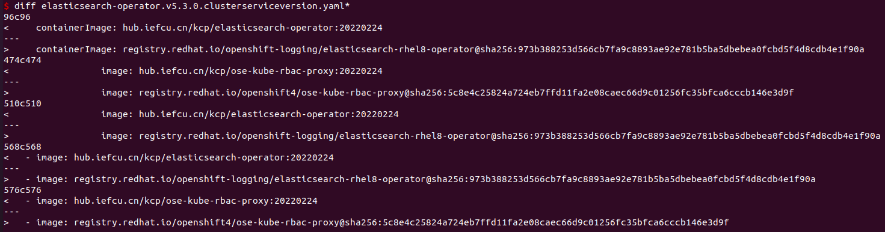
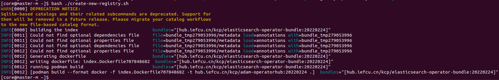
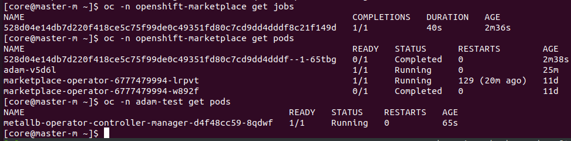

# openshift operatorhub离线搭建使用

目前就是同步redhat构建的operatorhub，直接拿过来离线实现，
以及构建一些arm64的镜像来使用。

## catalog镜像原理分析

#### 查看catalog镜像里的operator

```bash
podman run -p50051:50051 -it hub.iefcu.cn/public/redhat-operator-index:v4.9
grpcurl -plaintext localhost:50051 api.Registry/ListPackages
```

#### catalog镜像分析

程序入口(目前是sqlite数据库文件)
```bash
opm registry serve --database /database/index.db
```

提取出数据库文件，自己验证
```bash
oc image extract --confirm \
  --path /database/index.db:/tmp \
  hub.iefcu.cn/public/redhat-operator-index:v4.9
```

## 同步catalogSource镜像

* registry.redhat.io/redhat/redhat-operator-index:v4.9
* registry.redhat.io/redhat/certified-operator-index:v4.9
* registry.redhat.io/redhat/community-operator-index:v4.9

* registry.redhat.io/redhat/redhat-marketplace-index:v4.9
(这个比较特殊，需要license)

需要使用帐号认证才能下载这些镜像

同步为私有仓库的镜像hub.iefcu.cn/public/redhat-operator-index:v4.9

目前我使用[image-syncer](https://github.com/AliyunContainerService/image-syncer)这个工具来同步镜像
```bash
cat > image-sync.json << EOF
{
    "hub.iefcu.cn": {
        "username": "xiaoyun",
        "password": "TODO:passwd"
    }
    , "registry.access.redhat.com": {
        "username": "tobote7373@enamelme.com",
        "password": "tobote7373@enamelme.com"
    }
}
EOF

cat > image-sync-list.json << EOF
{
"registry.redhat.io/redhat/redhat-operator-index:v4.9":
  "hub.iefcu.cn/public/redhat-operator-index:v4.9"
,"registry.redhat.io/redhat/community-operator-index:v4.9":
  "hub.iefcu.cn/public/community-operator-index:v4.9"
,"registry.redhat.io/redhat/certified-operator-index:v4.9":
  "hub.iefcu.cn/public/certified-operator-index:v4.9"
,"registry.redhat.io/redhat/redhat-marketplace-index:v4.9":
  "hub.iefcu.cn/public/redhat-marketplace-index:v4.9"
}
EOF

image-syncer --proc=6 --auth=./image-sync.json --images=./image-sync-list.json \
  --namespace=public --registry=hub.iefcu.cn --retries=3
```

#### 定制为私有catalogSource镜像

裁剪镜像，注意架构问题，arm64的镜像需要在arm64机器上操作，不然会裁剪出x86的镜像，**exec format error**

前提条件：

安装[opm](https://mirror.openshift.com/pub/openshift-v4/arm64/clients/ocp/4.9.15/opm-linux-4.9.15.tar.gz)

安装[grpcurl](https://github.com/fullstorydev/grpcurl/releases/download/v1.8.6/grpcurl_1.8.6_linux_arm64.tar.gz)

安装podman，oc（ocp节点上都有）

我通过一个[dockerfile](./operator-install/asserts/Dockerfile.opm)，构建好了arm64镜像: hub.iefcu.cn/xiaoyun/podman-opm
使用方法: `docker run -it --privileged -v $PWD:/data -w /data hub.iefcu.cn/xiaoyun/podman-opm`

参考: [openshift 4.8 - 修剪索引镜像](https://access.redhat.com/documentation/zh-cn/openshift_container_platform/4.8/html/operators/olm-pruning-index-image_olm-restricted-networks)

获取catalog镜像的operator列表，有elasticsearch-operator，metallb-operator 等等
```bash
podman run -p50051:50051 -it hub.iefcu.cn/public/redhat-operator-index:v4.9
grpcurl -plaintext localhost:50051 api.Registry/ListPackages > packages.out
```

裁剪catalog镜像，只留存指定的operator列表

（注意：目前裁剪仅支持x86架构）
```bash
# 只保留logging，elasticserach operator
opm index prune -f registry.redhat.io/redhat/redhat-operator-index:v4.9 \
    -p cluster-logging,elasticsearch-operator \
    -t hub.iefcu.cn/kcp/redhat-operator-index:v4.9

# 只保留metallb operator
opm index prune -f hub.iefcu.cn/public/redhat-operator-index:v4.9 \
    -p metallb-operator \
    -t hub.iefcu.cn/kcp/metallb-operator-index:v4.9

# 并上传裁剪过后的hub镜像
podman push hub.iefcu.cn/kcp/redhat-operator-index:v4.9
```

还可以根据bundle镜像创建catalogSource镜像，

目的就是修改operator bundle镜像中的内容，使用自己编译的operator等相关镜像，为以后自己制作opertor做准备

（x86下可以基于arm64基础镜像制作出来，arm64也可以使用，因为仅仅改动了数据文件）

参考TODO:

```bash
opm index add \
    --bundles hub.iefcu.cn/kcp/elasticsearch-operator-bundle:20220224 \
    --tag hub.iefcu.cn/kcp/adam-operatorhub:20220224 \
    --binary-image hub.iefcu.cn/public/redhat-operator-index:v4.9

opm index add \
    --bundles hub.iefcu.cn/kcp/elasticsearch-operator-bundle:20220224 \
    --tag hub.iefcu.cn/kcp/metallb-operatorhub \
    --binary-image hub.iefcu.cn/public/redhat-operator-index:v4.9
```

其中budle镜像，是基于原有的bundle镜像修改的

registry.redhat.io/openshift-logging/elasticsearch-operator-bundle@sha256:6a47a04e73b02fa27176b5508f78289a0bca9ed8328a52aea8c88e0c5720dc6c

修改clusterserviceversion.yaml配置文件, 然后制作镜像

```dockerfile
#from registry.redhat.io/openshift-logging/elasticsearch-operator-bundle@sha256:6a47a04e73b02fa27176b5508f78289a0bca9ed8328a52aea8c88e0c5720dc6c
from hub.iefcu.cn/kcp/elasticsearch-operator-bundle@sha256:6a47a04e73b02fa27176b5508f78289a0bca9ed8328a52aea8c88e0c5720dc6c

COPY ./elasticsearch-operator.v5.3.0.clusterserviceversion.yaml /manifests/elasticsearch-operator.v5.3.0.clusterserviceversion.yaml
```





##### bundle镜像文件获取

catalog镜像的数据库文件index.db是sqlite3数据库文件，可以查看

```bash
# ubuntu 安装sqlite3
apt install sqlite3
```

查看相关bundle信息
```bash
oc image extract --confirm \
  --path /database/index.db:/tmp \
  hub.iefcu.cn/public/redhat-operator-index:v4.9

sqlite3 ./index.db 'select * from main.related_image;' | grep pipelines | grep bundle

可以得到不同版本的pipelines的bundle镜像地址
registry.redhat.io/openshift-pipelines/pipelines-operator-bundle@sha256:4a8a4f4dc20909ad47a0e357f22a8d50763afd515c1c2c607a3df90f1dac0d34|redhat-openshift-pipelines.v1.4.0
registry.redhat.io/openshift-pipelines/pipelines-operator-bundle@sha256:3449a2d9c146801c9a3c1444e9764f74d4abcc5392d5c1e58d925a122a0e59e6|redhat-openshift-pipelines.v1.5.2
registry.redhat.io/openshift-pipelines/pipelines-operator-bundle@sha256:b5c6c1a3f937f507d832cde83c1581535f9fa3abbbaf833ffcc9aec0e061a9c2|openshift-pipelines-operator-rh.v1.6.1
=> registry.redhat.io/openshift-pipelines/pipelines-operator-bundle@sha256:33579b992c33350232af2f2c4d370dda769a7f1e1a498ad1c697199f13f5e9a4|openshift-pipelines-operator-rh.v1.6.2

> .tables
> select * from related_image;
> select * from operatorbundle;
```

目前我获取到catalogsource镜像中的bundle镜像非常粗暴：

就是先订阅安装这个operator，然后再通过oc describe pod xxx查到镜像的地址的。。。

这里整理一些bundle镜像

hub.iefcu.cn/kcp/metallb-operator-bundle@sha256:549947c734afbb4fa16aa09293a92f30191270db67c3248847c58adcd7d54549

registry.redhat.io/openshift-logging/elasticsearch-operator-bundle@sha256:6a47a04e73b02fa27176b5508f78289a0bca9ed8328a52aea8c88e0c5720dc6c


#### 创建自定义catalogSource

现在就可以基于catalogSource镜像，创建catalogSource了

TODO: 部署openshift平台时，就把这个catalogsource配置进去。

```bash
cat << EOF | oc apply -f -
apiVersion: operators.coreos.com/v1alpha1
kind: CatalogSource
metadata:
  name: adam
  namespace: openshift-marketplace
spec:
  displayName: adam
  #image: 'hub.iefcu.cn/public/redhat-operator-index:v4.9'
  #image: 'hub.iefcu.cn/kcp/adam-operatorhub:20220224'
  image: 'registry.kcp.local:5000/kcp/redhat-operator-index:v4.9'
  publisher: adam
  sourceType: grpc
EOF
```

检查安装情况
```bash
oc -n openshift-marketplace get pod
oc -n openshift-marketplace get CatalogSource adam

删除catalogsource => 可以
oc -n  openshift-marketplace delete CatalogSource adam
```

### 同步operator相关镜像到私有仓库

TODO: filter-by-os ?
oc adm catalog mirror \
    registry.okd.example.com:5000/redhat/redhat-operator-index:v4.7  \
    file:///local/index \
    --index-filter-by-os="linux/amd64'" \
    -a /root/pull-secret.json \
    --insecure

```bash
# 同步grafana相关镜像到本地文件
mkdir mirror-xxx && cd mirror-xxx
oc adm catalog mirror \
    hub.iefcu.cn/kcp/redhat-operator-index:v4.9 \
    -a /tmp/pull-secret.json \
    file:///local/index

info: Mirroring completed in 1m45.84s (4.408MB/s)
wrote mirroring manifests to manifests-grafana-operator-index-1647941600

To upload local images to a registry, run:

        oc adm catalog mirror file://local/index/kcp/redhat-operator-index:v4.9 REGISTRY/REPOSITORY

# 同步镜像到私有镜像仓库
oc adm catalog mirror \
  file://local/index/kcp/redhat-operator-index:v4.9 \
  192.168.120.44/kcp/
  -a /tmp/pull-secret.json \
  --insecure
```

#### 直接同步到私有仓库

1.先将manifest文件拉取下来

```bash
oc adm catalog mirror \
hub.iefcu.cn/zhouming/redhat-operator-index:v0426 \
hub.iefcu.cn/zhouming/es \   #镜像目标仓库
-a /run/user/0/containers/auth.json \  #podman登录镜像仓库后自动生成
--insecure \
--manifests-only=true
```

执行此命令后，目录结构如下：

```bash
[系统未激活][root@localhost mirror4]# tree 
.
└── manifests-redhat-operator-index-1651057961
    ├── catalogSource.yaml
    ├── imageContentSourcePolicy.yaml
    ├── mapping.txt
#mapping.txt即源镜像仓库到目标镜像仓库之间的映射，按照官方文档，使用oc image mirror -f mapping.txt 同步镜像也会报manifest unknow错误
```

所以我使用了skopeo工具。

```bash
yum install -y skopeo
# skopeo  login  hub.iefcu.cn
# skopeo  login  xxxxx
cat mapping.txt | while read line; do
  origin=$(echo $line | cut -d= -f1)
  target=$(echo $line | cut -d= -f2)
  if [[ "$origin" =~ "sha256" ]]; then
    tag=$(echo $origin | cut -d: -f2 | cut -c -8)
    #skopeo copy --all docker://$origin docker://$target:$tag
    skopeo copy --all docker://$origin docker://$target
  else
    skopeo copy --all docker://$origin docker://$target
  fi
done
```

如果因网络原因出现同步失败，需要再次执行。

同步ok后：

```bash
oc apply -f catalogSource.yaml
oc apply -f imageContentSourcePolicy.yaml
```

至此，可以在web console的operatorhub页面看到刚才添加的catalog source。

直接在web上安装operator。


### 通过订阅安装operator

例如，安装elasticsearch operator

#### 首先需要配置镜像mirror策略

可以一次配置多个mirrors
```bash
cat <<EOM | oc apply -f -
apiVersion: operator.openshift.io/v1alpha1
kind: ImageContentSourcePolicy
metadata:
  name: elasticsearch-operator
spec:
  repositoryDigestMirrors:
  - mirrors:
    - hub.iefcu.cn/kcp
    source: registry.redhat.io/openshift-logging
  - mirrors:
    - hub.iefcu.cn/kcp/ose-oauth-proxy
    source: registry.redhat.io/openshift4/ose-oauth-proxy
  - mirrors:
    - hub.iefcu.cn/kcp/ose-kube-rbac-proxy
    source: registry.redhat.io/openshift4/ose-kube-rbac-proxy
EOM

cat <<EOM | oc apply -f -
apiVersion: operator.openshift.io/v1alpha1
kind: ImageContentSourcePolicy
metadata:
  name: redhat-openshift4
spec:
  repositoryDigestMirrors:
  - mirrors:
    - hub.iefcu.cn/kcp
    source: registry.redhat.io/openshift4
EOM
```

检查mirror策略

oc get  ImageContentSourcePolicy elasticsearch-operator

#### 然后通过订阅安装operator

目前web控制台安装operator有一点问题，只能通过CLI安装

参考: https://docs.openshift.com/container-platform/4.8/operators/admin/olm-adding-operators-to-cluster.html#olm-installing-operator-from-operatorhub-using-cli_olm-adding-operators-to-a-cluster

1. 创建OperatorGroup(可选)

	如果安装operator到单个namespace中，就需要手动做这件事情

	例如安装metallb operator到adam-test项目中去

```bash
cat <<EOM | oc apply -f -
apiVersion: operators.coreos.com/v1
kind: OperatorGroup
metadata:
  name: adam-test
  namespace: adam-test
spec:
  targetNamespaces:
  - adam-test
EOM
```

2. 订阅安装

```bash
cat <<EOM | oc apply -f -
apiVersion: operators.coreos.com/v1alpha1
kind: Subscription
metadata:
  name: elasticsearch-operator
  namespace: openshift-operators
spec:
  channel: stable
  installPlanApproval: Automatic
  name: elasticsearch-operator
  source: adam
  sourceNamespace: openshift-marketplace
EOM
```

```bash
# 安装metallb operator到adam-test项目中去
cat <<EOM | oc apply -f -
apiVersion: operators.coreos.com/v1alpha1
kind: Subscription
metadata:
  name: metallb-operator
  #namespace: openshift-operators
  namespace: adam-test
spec:
  channel: stable
  installPlanApproval: Automatic
  name: metallb-operator
  source: adam
  sourceNamespace: openshift-marketplace
EOM
```

检查metallb-operaotr的安装情况
```bash
# 检查bundle镜像crd任务执行情况
oc -n openshift-marketplace get pods
# 检查metallb operator的pod运行情况
oc -n adam-test get pods
```




清理卸载方法：
```bash
# 删除订阅 => 可以，但是好像没有清理全，还有一个version啥的。
oc -n openshift-operators delete Subscription elasticsearch-operator
# TODO: 删除clusterserviceversion等
```


## 参考文档
3.9.3. 修剪索引镜像

https://access.redhat.com/documentation/zh-cn/openshift_container_platform/4.8/html/operators/olm-pruning-index-image_olm-restricted-networks

(好)安装离线的 OperatorHub

https://www.modb.pro/db/109806

=> 当初就是参考这个弄得x86离线opertorahub

OCP中CLI安装operator官方文档

https://docs.openshift.com/container-platform/4.8/operators/admin/olm-adding-operators-to-cluster.html

operator framework 文档

https://sdk.operatorframework.io/docs/building-operators/golang/operator-scope/
