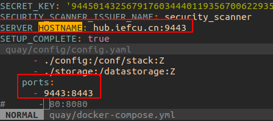
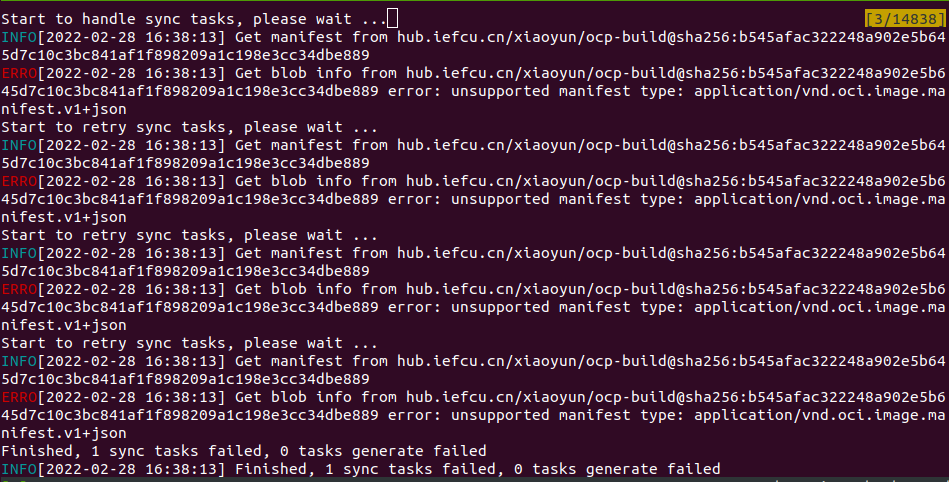

# quay私有镜像仓库镜像同步

#### 部署配置私有镜像仓库

1.配置部署quay私有镜像仓库，端口使用9443端口
提前建立组织kcp


2.或者部署配置registry私有镜像仓库，http协议，使用5000端口
```
mkdir -p /data/registry
docker run -d --name registry --restart=always \
  -p 5000:5000 \
  -v /data/registry:/var/lib/registry \
  docker.io/library/registry:2
```

或者使用docker-compose启动registry私有镜像仓库
```
version: '3.2'
services:
  registry:
    #image: docker.io/library/registry:2
    image: hub.iefcu.cn/public/registry:2
    container_name: registry
    restart: always
    environment:
      REGISTRY_HTTP_TLS_CERTIFICATE: /certs/ssl.cert
      REGISTRY_HTTP_TLS_KEY: /certs/ssl.key
      REGISTRY_HTTP_ADDR: 0.0.0.0:9443
    volumes:
      - ./registry/data/:/var/lib/registry:Z
      - ./registry/certs:/certs:Z
      #- ./registry/config.yml:/etc/docker/registry/config.yml:Z
    ports:
      - 9443:9443
    logging:
      driver: json-file
      options:
        max-file: '3'
        max-size: 10m
```

#### 待同步的私有镜像仓库的镜像

待同步的镜像列表如下：
```bash
# openshift原始镜像
hub.iefcu.cn/xiaoyun/openshift4-aarch64

# heketi + glusterfs存储
hub.iefcu.cn/xiaoyun/gluster-containers:latest
hub.iefcu.cn/xiaoyun/heketi:9

# 其他应用镜像 ...
```

#### 使用oc adm mirror同步镜像

TODO: 这个工具能精确同步安装kcp所需要的所有镜像

#### 使用image-syncer工具同步镜像

目前我使用[image-syncer](https://github.com/AliyunContainerService/image-syncer)这个工具来同步镜像

XXX: 使用skepoe sync，只同步arm64的镜像？ => 不行, skepoe同步，sha256会变化

同步镜像脚本如下：
```bash
src_hub="hub.iefcu.cn"
dst_hub="127.0.0.1:5000"

cat > image-sync.json << EOF
{
    "${src_hub}": {
        "username": "TODO:username",
        "password": "TODO:passwd"
    }
    ,"${dst_hub}": {
        "username": "TODO:username",
        "password": "TODO:passwd"
        ,"insecure": true
    }
}
EOF

cat > image-sync-list.json << EOF
{
"${src_hub}/xiaoyun/openshift4-aarch64":"${dst_hub}/kcp/openshift4-aarch64"

,"${src_hub}/xiaoyun/heketi:9":"${dst_hub}/kcp/heketi"
,"${src_hub}/xiaoyun/gluster-containers":"${dst_hub}/kcp/gluster-containers"

,"${src_hub}/kcp/kylin-operator-index:v4.9":"${dst_hub}/kcp/kylin-operator-index:v4.9"
,"${src_hub}/kcp/metallb-operator-bundle":"${dst_hub}/kcp/metallb-operator-bundle"
,"${src_hub}/kcp/metallb-rhel8-operator":"${dst_hub}/kcp/metallb-rhel8-operator"
,"${src_hub}/kcp/metallb-rhel8":"${dst_hub}/kcp/metallb-rhel8"

,"${src_hub}/xiaoyun/keepalived:latest":"${dst_hub}/kcp/keepalived"
,"${src_hub}/xiaoyun/dnsmasq:latest":"${dst_hub}/kcp/dnsmasq"
,"${src_hub}/public/haproxy:lts-alpine":"${dst_hub}/kcp/haproxy"
,"${src_hub}/public/registry:2":"${dst_hub}/kcp/registry"
}
EOF

image-syncer --proc=6 --auth=./image-sync.json --images=./image-sync-list.json --namespace=public \
--registry=hub.iefcu.cn --retries=3
```

#### 配置ImageContentSourcePolicy使用新的私有镜像仓库

虽然同步了镜像到quay私有镜像仓库中了，但各种安装工具中，以及yaml使用的都是原来的镜像地址，

最后需要配置ImageContentSourcePolicy来使用这个新的私有镜像仓库

修改install-config.yaml.bak

示例如下：

```yaml
imageContentSources:
- mirrors:
  - hub.iefcu.cn/xiaoyun/openshift4-aarch64
  - quay.iefcu.cn:9443/xiaoyun/openshift4-aarch64
  source: quay.io/openshift-release-dev/ocp-release
- mirrors:
  - quay.iefcu.cn:9443/xiaoyun/openshift4-aarch64
  - hub.iefcu.cn/xiaoyun/openshift4-aarch64
  source: quay.io/openshift-release-dev/ocp-v4.0-art-dev
- mirrors:
  - registry.kcp.local:5000/kcp/openshift4-aarch64
  - quay.iefcu.cn:9443/kcp/openshift4-aarch64
  source: hub.iefcu.cn/xiaoyun/openshift4-aarch64
- mirrors:
  - registry.kcp.local:5000/kcp/openshift4-aarch64
  source: quay.iefcu.cn:9443/xiaoyun/openshift4-aarch64
```

## 同步多个镜像

https://blog.csdn.net/chenhongloves/article/details/121019921
使用`v2/_catalog`接口获取项目下所有的镜像列表

```
# 重新拼接 url
$ url="http://172.30.3.149/service/token?service=harbor-registry&scope=registry:catalog:*"
# 获取 token
$ curl  -s --user "$U" $url
{
  "token": "xxx",
  "expires_in": 1800,
  "issued_at": "2021-10-28T10:11:37Z"
}
$ curl  -s --user "$U" $url | jq -r .token
xxx
$ T=$(curl  -s --user "$U" $url | jq -r .token)
$ echo $T
xxx 
```

访问harbor镜像仓库的示例:
```
url='/service/token?account=username&scope=repository%3Apublic%2Fbusybox%3Apull%2Cpush&service=harbor-registry'
url='/service/token?service=harbor-registry&scope=registry:catalog:*service=harbor-registry'
U=adam
curl -s --user "$U" "http://192.168.120.44$url"
```

无法访问。。。
```
{"errors":[{"code":"UNAUTHORIZED","message":"unauthorized to list catalog: unauthorized to list catalog"}]}
```

https://github.com/goharbor/harbor/issues/13573

```
adam@adam-pc:/mnt/data/registry$ curl --silent --basic -u username http://192.168.120.44/v2/_catalog
Enter host password for user 'username':
{"errors":[{"code":"UNAUTHORIZED","message":"unauthorized to list catalog: unauthorized to list catalog"}]}
```

https://stackoverflow.com/questions/64998926/for-harbor-registry-catalog-listing-is-not-working-with-bearer-token-receiving
=> 换成使用下面那个harbor的api接口就可以了。。。
```
root@harbor:~/bin# TOKEN=$(echo -n 'phanx:<phanx's password>' | base64)
root@harbor:~/bin# curl -ikL -X GET -H "Content-Type: application/json" -H "Authorization: Basic ${TOKEN}" https://<my harbor registry server>/v2/_catalog
```

验证发现使用这个接口可以
```
http://<my harbor registry server>/api/v2.0/projects/public/repositories?page_size=15&page=1
```

## 目前kcp平台用到的镜像列表

#### 0. 堡垒机dns+haproxy等镜像

* hub.iefcu.cn/public/haproxy:lts-alpine
* hub.iefcu.cn/xiaoyun/dnsmasq => 自己编译构建的
* hub.iefcu.cn/xiaoyun/keepalived:latest => 自己编译构建的
* hub.iefcu.cn/public/registry:2

原始镜像是
* docker.io/library/haproxy:lts-alpine
* docker.io/library/registry:2

#### 1. 平台基础镜像

* hub.iefcu.cn/xiaoyun/openshift4-aarch64

#### 2. heketi+glusterfs存储镜像

* hub.iefcu.cn/xiaoyun/heketi:9
* hub.iefcu.cn/xiaoyun/gluster-containers

原始镜像是

* heketi是自己构建出来的
* gluster-containers TODO:

#### 3. operatorhub

* hub.iefcu.cn/public/redhat-operator-index:v4.9

原始镜像是

* registry.redhat.io/redhat/redhat-operator-index:v4.9

#### 4. metallb operator相关镜像

* hub.iefcu.cn/kcp/metallb-operator-bundle@sha256:549947c734afbb4fa16aa09293a92f30191270db67c3248847c58adcd7d54549
* hub.iefcu.cn/kcp/metallb-rhel8-operator@sha256:13df32e318cdd380ee5780299c1411fa5580f113186063763246054cf633daf7
* hub.iefcu.cn/kcp/metallb-rhel8@sha256:b8fc94d4603fa9f649307ee6d799f42e44d110cac0e30ad1e0960eb24431b8b4

原始镜像是

* registry.redhat.io/openshift4/metallb-operator-bundle@sha256:549947c734afbb4fa16aa09293a92f30191270db67c3248847c58adcd7d54549
* registry.redhat.io/openshift4/metallb-rhel8-operator@sha256:13df32e318cdd380ee5780299c1411fa5580f113186063763246054cf633daf7
* registry.redhat.io/openshift4/metallb-rhel8@sha256:b8fc94d4603fa9f649307ee6d799f42e44d110cac0e30ad1e0960eb24431b8b4

#### 5. eck operator相关镜像

* hub.iefcu.cn/public/eck-operator:1.9.1
* hub.iefcu.cn/public/elasticsearch:7.16.3

原始镜像是

* docker.elastic.co/eck/eck-operator:1.9.1
* docker.elastic.co/elasticsearch/elasticsearch:7.16.3

## FAQ

* 1.error: unsupported manifest type: application/vnd.oci.image.manifest.v1+json
使用image-syncer同步如下镜像时报错
hub.iefcu.cn/xiaoyun/ocp-build@sha256:b545afac322248a902e5b645d7c10c3bc841af1f898209a1c198e3cc34dbe889

可能是因为镜像是v1仓库协议，后续使用新版本docker生成这个镜像，应该就没有问题了
