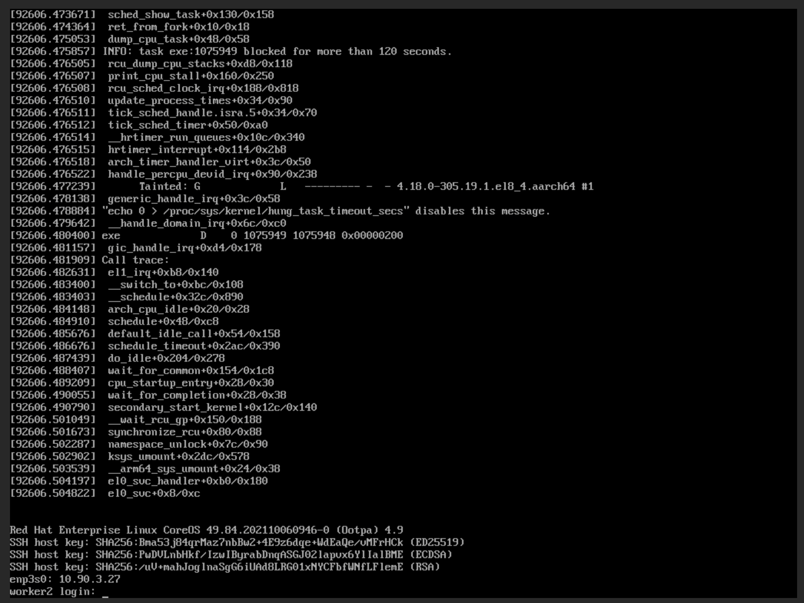
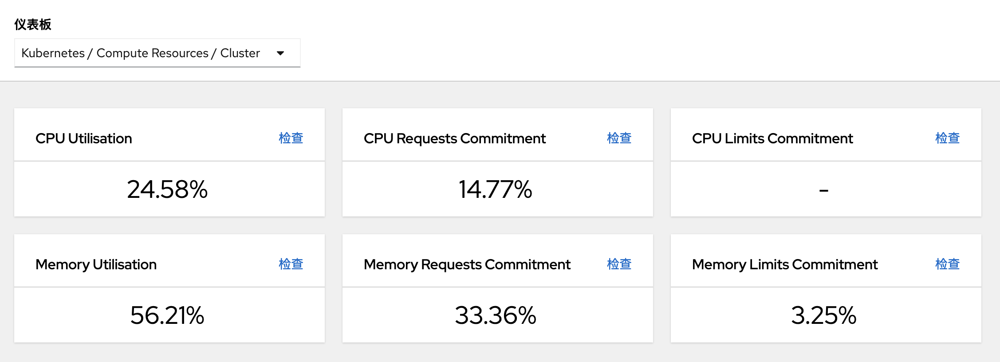

# openshift 编译arm64 Elasticsearch operator 镜像


2022 Q1绩效考核

*【日常】业绩:
  业绩良好，有新增任务且能及时高效完成任务，满足业务需求: 1
  出差解决容器云平台问题: 0.3
  任务完成质量好: 0.3

*【日常】创新
  无

*【日常】团队协作 => 0.2
  技术分享，将容器云平台技术编写成gitbook共享给团队成员分享。
  帮助新员工解答问题，总结解决问题方法等

*【日常】制度执行情况
  任务单更新等及时、规范、高质，起到模范作用：0.1

*【日常】积极性/责任心
  针对现有问题能够提出想法并主动改善：0.1


* 工作总结及不足之处：
  总是有一些需求没有get到核心点，例如网络组件calico的调研，实际上应该先理清楚客户需要calico网络的真实需求，大概率openshift自带的网络组件ovs也是满足要求的。
  需求需要多几个做技术和做产品的人多讨论一下, 以便及时纠正产品调研和技术实现的方向。
  

* 综合评价及建议：
  建议以成熟好用的工具来提升目标绩效管理，例如严格按照任务单来分配任务，查看任务进度，而不是其他口头的任务分配。任务单描述不清楚的，需要在任务单上描述清楚，依靠文档而不是口头交流。
  建议部门服务上容器云平台，从更多的角度上找到容器云平台的最迫切的需求功能点。


https://www.youtube.com/watch?v=nVzxwwkEZPo&ab_channel=TuTu%E7%94%9F%E6%B4%BB%E5%BF%97
使用openwrt搭建lede系统，安装v2ray插件，实现软路由翻墙。

旁路由 单臂路由了解

发现一个节点有问题，有可能跟虚拟机的宿主机有关吧，只能ping，不能ssh，过一会好了。



这个页面多几个数据暂时，有节点数，啥的等。
有几个宿主机，硬盘啥的。点进去能看到某一个宿主机的cpu，内存等使用率。


备份和恢复
https://access.redhat.com/documentation/zh-cn/openshift_container_platform/4.9/html-single/backup_and_restore/index

etcd备份


## oc通过证书请求
oc adm certificate approve <csr_name>


trusted ca
https://docs.openshift.com/container-platform/4.7/cicd/builds/setting-up-trusted-ca.html

目前openshift的arm64 opeatorhub中，有elasticsearch operator，
但是却没有提供arm64的镜像，所以决定自己编译构建。
（因为镜像上有github源码地址，所以可以自己构建）

## 获取Elasticserach镜像以及源码


算法实验
https://algorithm.yuanbin.me/zh-hans/faq/guidelines_for_contributing.html#
https://github.com/billryan/algorithm-exercise

markdown简单的世界
https://wizardforcel.gitbooks.io/markdown-simple-world/content/4.html

MARKDOWN语法
  => 以及markdown分类
https://kuang.netlify.app/markdown/markdown%E8%AF%AD%E6%B3%95.html

## lftp用法，放到linux命令中去

```bash
lftp 10.0.0.5
user dev2
# 下载目录
mirror xxx
```
