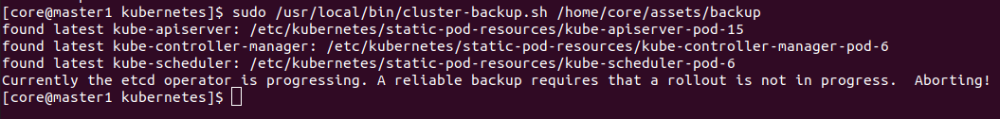

# openshift 编译arm64 Elasticsearch operator 镜像


备份和恢复
https://access.redhat.com/documentation/zh-cn/openshift_container_platform/4.9/html-single/backup_and_restore/index

etcd备份


## oc通过证书请求
oc adm certificate approve <csr_name>


trusted ca
https://docs.openshift.com/container-platform/4.7/cicd/builds/setting-up-trusted-ca.html

目前openshift的arm64 opeatorhub中，有elasticsearch operator，
但是却没有提供arm64的镜像，所以决定自己编译构建。
（因为镜像上有github源码地址，所以可以自己构建）

## 获取Elasticserach镜像以及源码


算法实验
https://algorithm.yuanbin.me/zh-hans/faq/guidelines_for_contributing.html#
https://github.com/billryan/algorithm-exercise

markdown简单的世界
https://wizardforcel.gitbooks.io/markdown-simple-world/content/4.html

MARKDOWN语法
  => 以及markdown分类
https://kuang.netlify.app/markdown/markdown%E8%AF%AD%E6%B3%95.html

## lftp用法，放到linux命令中去

```bash
lftp 10.0.0.5
user dev2
# 下载目录
mirror xxx
```
