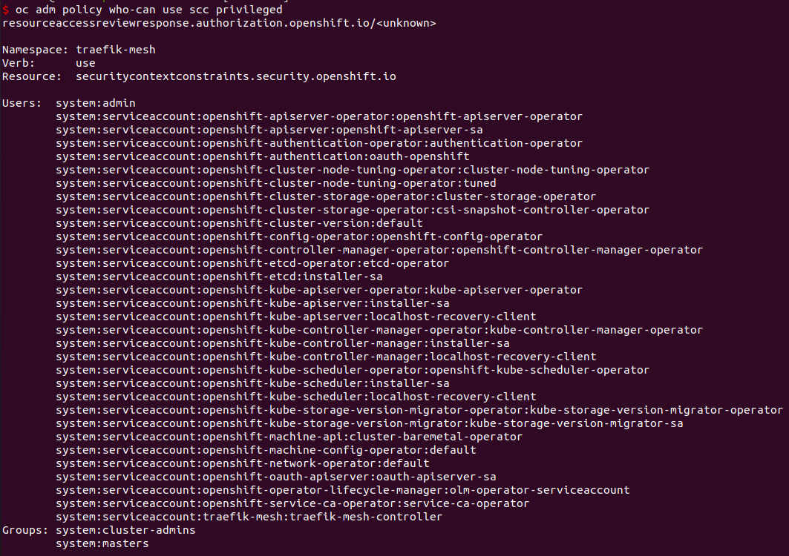
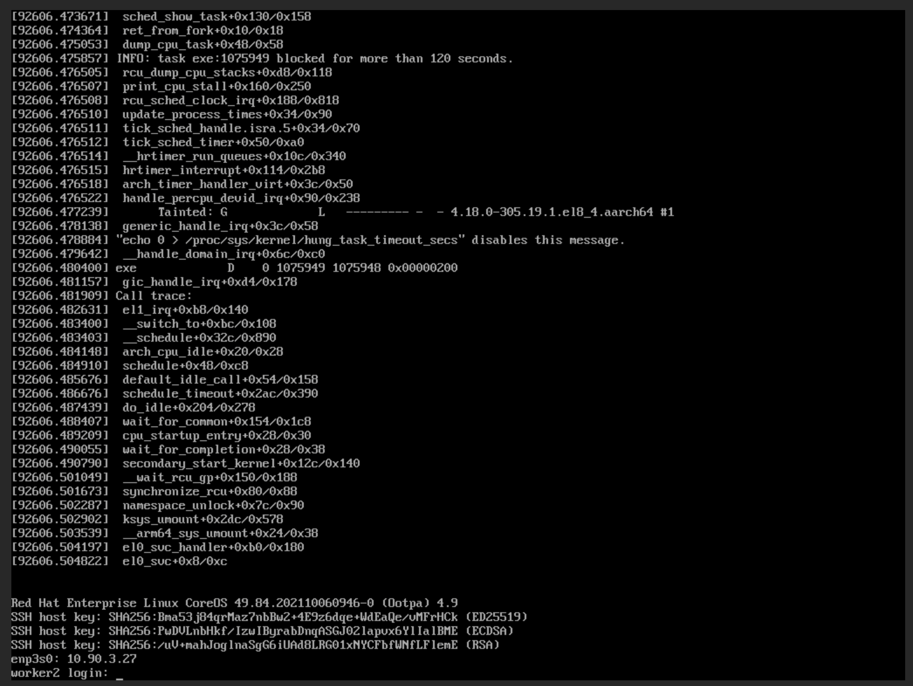
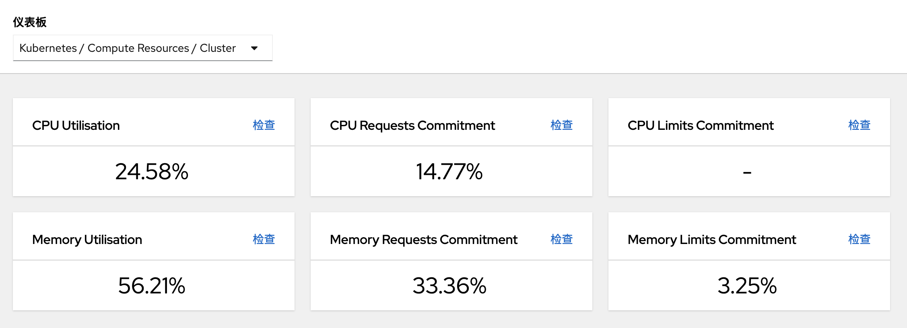
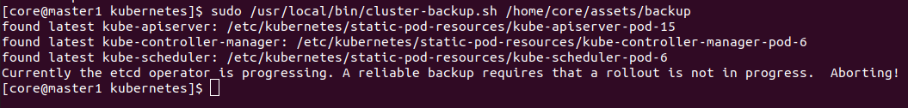

# openshift 编译arm64 Elasticsearch operator 镜像

一种基于openshift的自动化监控微服务api耗时方法？
一种基于角色的集群节点管理配置文件方法
一种基于openshift的自动监控微服务API耗时方法

专利方面考虑
自动service mesh监控服务api耗时
machine-config配置(时间同步等配置) 还有优化的地方
堡垒机器安装做成一个安装程序, 快速安装kcp平台
应用程序部署，回放配置，多平台部署?
gitops相关, CI/CD, 自动识别编译构建镜像啥的
人脸认证登录kcp系统(手机识别登录)

TODO:
* 时间同步配置验证
* 时区配置验证, 以及容器时区
* arm64盒子安装podman, libc6-dev


https://www.one-tab.com/page/YfTvjlabR9OqHV1mRY4wqA?ext=de72ce03-98b7-4210-b30f-86afdf724045

https://devopstales.github.io/home/openshift4-auth/
[Part1b: Install Opeshift 4 with calico](https://devopstales.github.io/kubernetes/openshift4-calico/)

## 容器云后续可开展工作梳理

* 做一个operator hub, 整理好离线安装部署文档
  包含metallb, redis, es等内置提供的operator

* promethues数据存储到pv中

* 集群5节点高可用部署验证
  处理禁止crio清理镜像的问题
  处理时间同步问题

* jenkins自动构建部署xxx应用
  目前他们的应用上云还是比较复杂, 需要简化

* 更多
  日志，块存储, 用户认证租户权限...


## scc深入了解

[Review SCC(Security Context Constraints) based on RBAC in OpenShift v4](https://daein.medium.com/review-scc-security-context-constraints-based-on-rbac-on-openshift-49007ff26317)

[(好)Linux Capabilities in OpenShift](https://cloud.redhat.com/blog/linux-capabilities-in-openshift)


[openshift踩坑日记](https://developer.aliyun.com/article/787121)

而创建的pod资源默认归属于**Restricted**策略。管理员用户也可以创建自己的 scc 并赋予自己的 serviceaccount:

根据错误提示，找到了问题点在于 scc 。官方的介绍如下：

OpenShift 的 安全環境限制 （Security Context Constraints）類似於 RBAC 資源控制用戶訪問的方式，管理員可以使用安全環境限制（Security Context Constraints, SCC）來控制Pod 的權限。 您可以使用 SCC 定義 Pod 運行時必須特定條件才能被系統接受。

=> traefik-ee 建立了自己的一个scc，并且绑定到sa上?


[Tutorial: Use SCCs to restrict and empower OpenShift workloads](https://developer.ibm.com/learningpaths/secure-context-constraints-openshift/scc-tutorial/)
scc tutorial


查看my-scc项目的annotations，其中“sa.scc”相关参数是当SCC策略非RunAsAny时提供默认值。

```bash
oc get project traefik-mesh -o json | jq .metadata.annotations
oc get project default -o json | jq .metadata.annotations
```

scc可以和用户，组，服务帐号进行绑定!


查询scc privileged可以被谁使用, 参考[OpenShift 4 - 安全上下文](https://blog.csdn.net/weixin_43902588/article/details/103374097)
```bash
oc adm policy who-can use scc privileged
```



## helm入门

关键字《helm原理》

#### 下图为Helm整体应用框架图：

　　helm是作为Helm Repository的客户端工具，helm默认工作时，会从本地家目录中去获取chart，只有本地没有chart时，它才会到远端的Helm Repository上去获取Chart，当然你也可以自己在本地做一个Chart，当需要应用chart到K8s上时，就需要helm去联系K8s Cluster上部署的Tiller Server，当helm将应用Chart的请求给Tiller Server时，Tiller Server接受完helm发来的charts(可以是多个chart) 和 chart对应的Config 后，它会自动联系API Server，去请求应用chart中的配置清单文件，最终这些清单文件会被实例化为Pod或其它定义的资源，而这些通过chart创建的资源，统称为release，一个chart可被实例化多次，其中的某些参数是会根据Config规则自动更改，例如Pod的名字等。


## 2022 Q1绩效考核

*【日常】业绩:
  业绩良好，有新增任务且能及时高效完成任务，满足业务需求: 1
  出差解决容器云平台问题: 0.3
  任务完成质量好: 0.3

*【日常】创新
  无

*【日常】团队协作 => 0.2
  技术分享，将容器云平台技术编写成gitbook共享给团队成员分享。
  帮助新员工解答问题，总结解决问题方法等

*【日常】制度执行情况
  任务单更新等及时、规范、高质，起到模范作用：0.1

*【日常】积极性/责任心
  针对现有问题能够提出想法并主动改善：0.1


* 工作总结及不足之处：
  总是有一些需求没有get到核心点，例如网络组件calico的调研，实际上应该先理清楚客户需要calico网络的真实需求，大概率openshift自带的网络组件ovs也是满足要求的。
  需求需要多几个做技术和做产品的人多讨论一下, 以便及时纠正产品调研和技术实现的方向。
  

* 综合评价及建议：
  建议以成熟好用的工具来提升目标绩效管理，例如严格按照任务单来分配任务，查看任务进度，而不是其他口头的任务分配。任务单描述不清楚的，需要在任务单上描述清楚，依靠文档而不是口头交流。
  建议部门服务上容器云平台，从更多的角度上找到容器云平台的最迫切的需求功能点。


旁路由 单臂路由了解



这个页面多几个数据暂时，有节点数，啥的等。
有几个宿主机，硬盘啥的。点进去能看到某一个宿主机的cpu，内存等使用率。


备份和恢复
https://access.redhat.com/documentation/zh-cn/openshift_container_platform/4.9/html-single/backup_and_restore/index

etcd备份


## 获取Elasticserach镜像以及源码


算法实验
https://algorithm.yuanbin.me/zh-hans/faq/guidelines_for_contributing.html#
https://github.com/billryan/algorithm-exercise
