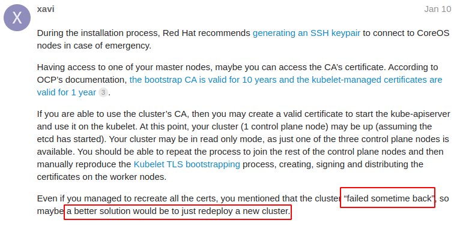

# openshift杂项


#### 重新生成openshift证书

[Renew certificates when cluster is offline](https://discuss.kubernetes.io/t/kubernetes-w-openshift-4-6-rhocp-renew-certificates-when-cluster-is-offline/18656)

重新部署？


The kubelet reads the manifests for the static pods from the filesystem, not the etcd, so failing to connect to the etcd database cannot be the cause of the kubelet not starting. I’ve been able to find this document on how the kubelet starts from the kops documentation: **kubelet start**

Kubelet starts up, starts (and restarts) all the containers in /etc/kubernetes/manifests.

It also tries to contact the API server (which the master kubelet will itself eventually start), register the node. Once a node is registered, kube-controller-manager will allocate it a PodCIDR, which is an allocation of the k8s-network IP range. kube-controller-manager updates the node, setting the PodCIDR field. Once kubelet sees this allocation, it will set up the local bridge with this CIDR, which allows docker to start. Before this happens, only pods that have hostNetwork will work - so all the “core” containers run with hostNetwork=true.

#### 列举openshift内部证书

[List all OpenShift Internal Certificates](https://openshift.ktz.cloud/troubleshooting/list-all-certs/)

下面是一个很有用的命令，可以列举openshift内部所有的证书
```bash
echo -e "NAMESPACE\tNAME\tEXPIRY" \
  && oc get secrets -A -o go-template='{{range .items}}{{if eq .type "kubernetes.io/tls"}}{{.metadata.namespace}}{{" "}}{{.metadata.name}}{{" "}}{{index .data "tls.crt"}}{{"\n"}}{{end}}{{end}}' \
  | while read namespace name cert; \
    do echo -en "$namespace\t$name\t"; \
       echo $cert | base64 -d | openssl x509 -noout -enddate; \
    done \
  | column -t
```

示例输出
```bash
NAMESPACE       NAME    EXPIRY
openshift-apiserver-operator                      openshift-apiserver-operator-serving-cert           notAfter=Aug  24  17:16:32  2022  GMT
openshift-apiserver                               serving-cert                                        notAfter=Aug  24  17:16:32  2022  GMT
openshift-authentication-operator                 serving-cert                                        notAfter=Aug  24  17:16:27  2022  GMT
openshift-authentication                          v4-0-config-system-serving-cert                     notAfter=Aug  24  17:33:18  2022  GMT
openshift-cluster-machine-approver                machine-approver-tls                                notAfter=Aug  24  17:16:27  2022  GMT
openshift-cluster-samples-operator                samples-operator-tls                                notAfter=Aug  24  17:27:10  2022  GMT
openshift-cluster-storage-operator                serving-cert                                        notAfter=Aug  24  17:16:31  2022  GMT
openshift-cluster-version                         cluster-version-operator-serving-cert               notAfter=Aug  24  17:16:30  2022  GMT
openshift-config-managed                          kube-controller-manager-client-cert-key             notAfter=Sep  23  17:16:20  2020  GMT
openshift-config-managed                          kube-scheduler-client-cert-key                      notAfter=Sep  23  17:16:20  2020  GMT
openshift-config-operator                         config-operator-serving-cert                        notAfter=Aug  24  17:16:25  2022  GMT
openshift-console-operator                        serving-cert                                        notAfter=Aug  24  17:20:37  2022  GMT
openshift-console                                 console-serving-cert                                notAfter=Aug  24  17:21:32  2022  GMT
openshift-controller-manager-operator             openshift-controller-manager-operator-serving-cert  notAfter=Aug  24  17:16:27  2022  GMT
openshift-controller-manager                      serving-cert                                        notAfter=Aug  24  17:16:26  2022  GMT
openshift-dns-operator                            metrics-tls                                         notAfter=Aug  24  17:16:26  2022  GMT
openshift-dns                                     dns-default-metrics-tls                             notAfter=Aug  24  17:17:45  2022  GMT
openshift-etcd-operator                           etcd-operator-serving-cert                          notAfter=Aug  24  17:16:30  2022  GMT
openshift-etcd                                    etcd-peer-master1                                   notAfter=Aug  24  17:16:06  2023  GMT
openshift-etcd                                    etcd-peer-master2                                   notAfter=Aug  24  17:16:07  2023  GMT
openshift-etcd                                    etcd-peer-master3                                   notAfter=Aug  24  17:16:08  2023  GMT
openshift-etcd                                    etcd-serving-master1                                notAfter=Aug  24  17:16:06  2023  GMT
openshift-etcd                                    etcd-serving-master2                                notAfter=Aug  24  17:16:07  2023  GMT
openshift-etcd                                    etcd-serving-master3                                notAfter=Aug  24  17:16:09  2023  GMT
openshift-etcd                                    etcd-serving-metrics-master1                        notAfter=Aug  24  17:16:07  2023  GMT
openshift-etcd                                    etcd-serving-metrics-master2                        notAfter=Aug  24  17:16:08  2023  GMT
openshift-etcd                                    etcd-serving-metrics-master3                        notAfter=Aug  24  17:16:10  2023  GMT
openshift-etcd                                    serving-cert                                        notAfter=Aug  24  17:16:26  2022  GMT
openshift-image-registry                          image-registry-operator-tls                         notAfter=Aug  24  17:16:28  2022  GMT
openshift-image-registry                          image-registry-tls                                  notAfter=Aug  27  14:43:57  2022  GMT
openshift-ingress-operator                        metrics-tls                                         notAfter=Aug  24  17:16:25  2022  GMT
openshift-ingress-operator                        router-ca                                           notAfter=Aug  24  17:21:33  2022  GMT
openshift-ingress                                 router-certs-default                                notAfter=Aug  24  17:21:58  2022  GMT
openshift-ingress                                 router-metrics-certs-default                        notAfter=Aug  24  17:21:59  2022  GMT
openshift-insights                                openshift-insights-serving-cert                     notAfter=Aug  24  17:16:33  2022  GMT
...
```