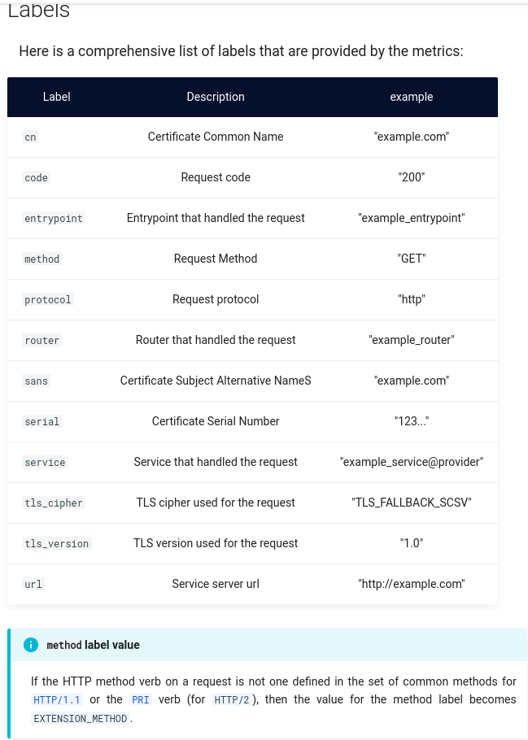

# traefik mesh安装配置使用

Traefik Mesh: Simpler Service Mesh


## 基本安装

#### 安装要求

* Kubernetes 1.11+
* CoreDNS installed as Cluster DNS Provider (versions 1.3+ supported)
* Helm v3

#### 安装使用helm

参考 https://blog.csdn.net/weixin_43902588/article/details/104585541
```bash
wget https://mirror.openshift.com/pub/openshift-v4/x86_64/clients/helm/3.7.1/helm-linux-arm64.tar.gz
```

#### 同步traefik mesh相关镜像

```bash
cat > image-sync-list.json << EOF
{
"docker.io/traefik/mesh:v1.4.5":"hub.iefcu.cn/public/traefik-mesh"
,"docker.io/library/traefik:v2.5":"hub.iefcu.cn/public/traefik"
,"docker.io/jaegertracing/all-in-one:1.18,1.32":"hub.iefcu.cn/public/jaegertracing-all-in-one"
,"docker.io/prom/prometheus:v2.11.1":"hub.iefcu.cn/public/prom-prometheus"
,"docker.io/grafana/grafana:6.2.5":"hub.iefcu.cn/public/grafana"
,"docker.io/jimmidyson/configmap-reload:v0.2.2,v0.7.1":"hub.iefcu.cn/public/configmap-reload"
,"docker.io/coredns/coredns:1.7.0":"hub.iefcu.cn/public/coredns"
}
EOF
```

#### 离线安装traefik mesh

关键字《helm install offline》


```
helm repo add traefik-mesh https://helm.traefik.io/mesh

helm pull <chart name>
helm pull traefik-mesh/maesh

# 解压并修改traefik-mesh里面的镜像名称
tar -tzf traefik-mesh-4.0.2.tgz
# 修改values.yaml里面的镜像名称

# 安装
helm install traefik-mesh traefik-mesh

# 卸载
helm uninstall traefik-mesh traefik-mesh
```


发现traefik-mesh-controller容器运行不正常


使用cricrl查看init容器日志报错如下：
```
2022/03/20 09:44:46 command prepare error: unable to find suitable DNS provider: no supported DNS service available for installing traefik mesh
```

安装traefik mesh带coredns参数
```bash
helm install traefik-mesh traefik-mesh --set kubedns=true
```

TODO: openshift和traefik mesh的dns适配，需要处理。
关键字《openshift install extra coredns》

https://docs.okd.io/4.9/networking/dns-operator.html#nw-dns-forward_dns-operator

还不能伪造这个东西。。。
```bash
oc new-project kube-system
Error from server (Forbidden): project.project.openshift.io "kube-system" is forbidden: cannot request a project starting with "kube-"

cat << EOF | oc create -f -
apiVersion: v1
kind: Namespace
metadata:
  name: kube-system
EOF

Error from server (AlreadyExists): error when creating "create-kube-system.yaml": namespaces "kube-system" already exists
```

伪造了一个coredns之后，系统服务pod都正常了。
```bash
oc -n kube-system get pods
NAME                       READY   STATUS    RESTARTS   AGE
coredns-546ddf8bd9-4kmkd   1/1     Running   0          3m47s
coredns-546ddf8bd9-d5t59   1/1     Running   0          3m47s

[core@master1 templates]$ oc get pods
NAME                                      READY   STATUS    RESTARTS        AGE
glusterfs-d9sms                           1/1     Running   0               5h11m
grafana-core-5dd97947d-z4kz7              1/1     Running   1 (4h34m ago)   4h36m
heketi-7d855c7597-qgwrs                   1/1     Running   0               5h4m
jaeger-65f69db59f-f9nzm                   1/1     Running   0               4h36m
prometheus-core-868cfc8454-7fkn4          2/2     Running   0               4h36m
traefik-mesh-controller-8d775494d-krkln   1/1     Running   0               4h36m
traefik-mesh-proxy-s2pz8                  1/1     Running   0               4h36m
```

## 使用Traefik Mesh

#### 部署server和client

server.yaml
```yaml
---
apiVersion: apps/v1
kind: Deployment
metadata:
  name: server
  namespace: test
  labels:
    app: server
spec:
  replicas: 2
  selector:
    matchLabels:
      app: server
  template:
    metadata:
      labels:
        app: server
    spec:
      containers:
        - name: server
          #image: traefik/whoami:v1.6.0
          image: hub.iefcu.cn/public/containous-whoami
          ports:
            - containerPort: 80
---
kind: Service
apiVersion: v1
metadata:
  name: server
  namespace: test
spec:
  selector:
    app: server
  ports:
    - name: web
      protocol: TCP
      port: 80
      targetPort: 80
```

client.yaml
```yaml
---
apiVersion: apps/v1
kind: Deployment
metadata:
  name: client
  namespace: test
  labels:
    app: client
spec:
  replicas: 1
  selector:
    matchLabels:
      app: client
  template:
    metadata:
      labels:
        app: client
    spec:
      containers:
        - name: client
          #image: giantswarm/tiny-tools:3.9
          image: hub.iefcu.cn/library/centos:7
          imagePullPolicy: IfNotPresent
          command:
            - "sleep"
            - "infinity"
```

#### client访问服务端

进入client的shell
```bash
oc -n test rsh client-7446fdf848-x96fq
```

普通方式访问server的服务
```bash
curl server.test.svc.cluster.local
```

使用mesh的方式访问server的服务
```bash
# XXX: 目前暂时需要将dns手动改为kube-system的coredns服务的ip地址
curl server.test.traefik.mesh
```

mesh方式输出结果有Uber-Trace-Id, X-Forwarded等字段
```bash
Hostname: server-64dc98f695-s75sr
IP: 127.0.0.1
IP: ::1
IP: 10.128.0.207
IP: fe80::50c8:31ff:fea5:29c9
RemoteAddr: 10.128.0.127:47690
GET / HTTP/1.1
Host: server.test.traefik.mesh
User-Agent: curl/7.29.0
Accept: */*
Accept-Encoding: gzip
Uber-Trace-Id: 7bd91869fe0199ef:58e90e6d14559658:7bd91869fe0199ef:1
X-Forwarded-For: 10.128.0.214
X-Forwarded-Host: server.test.traefik.mesh
X-Forwarded-Port: 80
X-Forwarded-Proto: http
X-Forwarded-Server: traefik-mesh-proxy-s2pz8
X-Real-Ip: 10.128.0.214
```

## 监控服务api耗时等信息

TODO: 难道Traefik Mesh没有实现监控用户api耗时？
[Traffic Metrics](https://doc.traefik.io/traefik-mesh/configuration/#traffic-metrics)
At the moment, Traefik Mesh does not implement the Traffic Metrics specification.

https://cloud.tencent.com/developer/article/1818300
之前在这篇文档中看到traefik mesh能够监控指标!


```yaml
kind: TrafficMetrics
# See ObjectReference v1 core for full spec
resource:
  name: foo-775b9cbd88-ntxsl
  namespace: foobar
  kind: Pod
edge:
  direction: to
  side: client
  resource:
    name: baz-577db7d977-lsk2q
    namespace: foobar
    kind: Pod
timestamp: 2019-04-08T22:25:55Z
window: 30s
metrics:
- name: p99_response_latency
  unit: seconds
  value: 10m
- name: p90_response_latency
  unit: seconds
  value: 10m
- name: p50_response_latency
  unit: seconds
  value: 10m
- name: success_count
  value: 100
- name: failure_count
  value: 100
```

## 其他

[SMI是什么](https://skyao.io/post/201906-service-mesh-interface-detail/
)
5月21号，在 kubeconf上，微软联合一众小伙伴，宣布了 Service Mesh Interface，简称SMI。SMI是一个服务网格规范，定义了通用标准，包含基本特性以满足大多数场景下的通用需求。

援引来自SMI官方网站 smi-spec.io 的介绍资料，对 Service Mesh Interface 的定位是 ：

A standard interface for service meshes on Kubernetes.

Kubernetes上的 service mesh 的标准接口

微软的 官方博客文章 这样介绍SMI：

SMI定义了一组通用可移植的API，为开发人员提供跨不同服务网格技术的互通性，包括Istio，Linkerd和Consul Connect。


而关键点在于，Google （还有同属Istio阵营的 IBM / Lyft）不在其列。而 Service Mesh 的其他玩家，几乎都参与了 SMI，甚至包括原本在 Istio 项目上和 google 一直合作的公司，耐人寻味。

## 参考文档

* [traefik-mesh](https://doc.traefik.io/traefik-mesh/)
* [Hands-on Lab (2) - 使用Helm部署OpenShift应用](https://blog.csdn.net/weixin_43902588/article/details/104585541)

* [Capture Traefik Metrics for Apps on Kubernetes with Prometheus](https://traefik.io/blog/capture-traefik-metrics-for-apps-on-kubernetes-with-prometheus/)
这个估计是能监控traefik本身的指标。

* [Integrating Consul Connect Service Mesh with Traefik 2.5](https://traefik.io/blog/integrating-consul-connect-service-mesh-with-traefik-2-5/)
使用Consul，会不会可以监控用户应用的api耗时?

* [traefik mesh youtube长视频](https://traefik.io/resources/traefik-service-mesh-kubernetes/)


* [Request Duration Histogram](https://doc.traefik.io/traefik/observability/metrics/overview/#request-duration-histogram)
Request processing duration histogram on an entrypoint.
这个可以监控到用户应用啥的吗？

Router Metrics => 是不是可以监控一个路由的api耗时？
Service Metrics =>

通过如下参数过滤，是不是就能精确到每一个应用的api耗时啦？


* [服务网格除了 Istio，其实你还可以有其它 8 种选择](https://istio.cn/t/topic/474)


* [Application Request Tracing with Traefik and Jaeger on Kubernetes](https://traefik.io/blog/application-request-tracing-with-traefik-and-jaeger-on-kubernetes/)
应用跟踪?

* [Capture Traefik Metrics for Apps on Kubernetes with Prometheus](https://traefik.io/blog/capture-traefik-metrics-for-apps-on-kubernetes-with-prometheus/)
看怎么集成openshift的promethues？

可能最终的效果图有多种？
https://traefik.io/blog/observing-kubernetes-ingress-traffic-using-metrics/


* [Traefik开启监控，日志，追踪需要的参数](https://www.1024sou.com/article/604749.html)
  traefik启动参数添加监控，日志等开关

关键字《traefik api 耗时监控》
```bash
--api.debug=true
--metrics.prometheus=true
--metrics.prometheus.addEntryPointsLabels=true
--metrics.prometheus.addrouterslabels=true
--metrics.prometheus.addServicesLabels=true
```

https://www.modb.pro/db/116312
这篇文档也可以, traefik开监控

创建一个ServiceMonitor以便于prometrics发现这个target
