# 修改节点ip地址

可以有两种方法修改：
* 1.新增ip地址，保留原有ip地址
  这种方法已经验证过，可以不重启就新增ip地址等信息
* 2.弃用旧ip地址, 配置新ip地址
  待验证，可能有问题

其他
* 没有查到官方修改ip的资料, k8s的相关修改倒是有

现在的关键点：
* 适配更新etcd证书，以及apiserver使用这个新证书

## 删除节点，再添加节点

参考openshift文档，[备份与恢复](https://access.redhat.com/documentation/zh-cn/openshift_container_platform/4.9/html-single/backup_and_restore/index#dr-recovering-expired-certs)


### 删除节点

#### 在手动删除前取消调度并排空节点

https://access.redhat.com/documentation/zh-cn/openshift_container_platform/4.9/html/nodes/nodes-nodes-working-deleting-bare-metal_nodes-nodes-working

* 1.将节点标记为不可调度。

```bash
oc adm cordon <node_name>

oc adm cordon worker2.kcp4-arm.iefcu.cn
```

* 2.排空节点上的所有 pod：

```bash
oc adm drain <node_name> --force=true

oc adm drain worker2.kcp4-arm.iefcu.cn --force=true
```

=> **报错!**
```
DEPRECATED WARNING: Aborting the drain command in a list of nodes will be deprecated in v1.23.
The new behavior will make the drain command go through all nodes even if one or more nodes failed during the drain.
For now, users can try such experience via: --ignore-errors
error: unable to drain node "worker2.kcp4-arm.iefcu.cn", aborting command...

There are pending nodes to be drained:
 worker2.kcp4-arm.iefcu.cn
error: cannot delete DaemonSet-managed Pods (use --ignore-daemonsets to ignore): adam-test/speaker-csvwg, kube-system/istio-cni-node-cjg67, openshift-cluster-node-tuning-operator/tuned-ql6tk, openshift-dns/dns-default-8j8s5, openshift-dns/node-resolver-rgf8h, openshift-image-registry/node-ca-6flhm, openshift-ingress-canary/ingress-canary-b6djk, openshift-machine-config-operator/machine-config-daemon-kbkvl, openshift-monitoring/node-exporter-6tz44, openshift-multus/multus-2956t, openshift-multus/multus-additional-cni-plugins-mknt2, openshift-multus/network-metrics-daemon-6w22l, openshift-network-diagnostics/network-check-target-5mxnc, openshift-sdn/sdn-g7t9r
```

如果节点离线或者无响应，此步骤可能会失败。即使节点没有响应，它仍然在运行写入共享存储的工作负载。为了避免数据崩溃，请在进行操作前关闭物理硬件。

* 3.从集群中删除节点：

虽然上一步排空pods失败，但是照样可以关机worker2节点，然后删除节点。

```bash
$ oc delete node <node_name>

oc delete node worker2.kcp4-arm.iefcu.cn
```

虽然节点对象现已从集群中删除，但它仍然可在重启后或 kubelet 服务重启后重新加入集群。要永久删除该节点及其所有数据，您必须弃用该节点。

* 4.如果您关闭了物理硬件，请重新打开它以便节点可以重新加入集群。


### 新增节点

尼玛worker2节点开机，就自动加入到集群中了。。。

* 1.首先修改dns域名配置，将节点的ip地址修改一下。
  可能没有啥用，之前dns配置错误了
* 2.然后修改节点的nmcli的ip
* 以及crio服务的节点ip地址?
```bash
/etc/systemd/system/crio.service.d/20-nodenet.conf
/etc/systemd/system/kubelet.service.d/20-nodenet.conf
```
* 以及修改/etc目录的ip地址信息？
  worker节点没有相应pod需要修改数据，简单
* 然后关机，然后删除这个节点，再开机这个节点。
* 最后发现节点自动加入，需要通过认证证书

```bash
oc get csr | grep pending -i | awk '{print $1}' | sed 's/^/kubectl certificate approve /' | bash

# 或者使用oc命令approve证书
oc get csr | grep pending -i | awk '{print $1}' | sed 's/^/oc adm certificate approve /' | bash
```

=> 最后发现节点成功加入进来，worker2这个节点的ip地址被成功修改了。
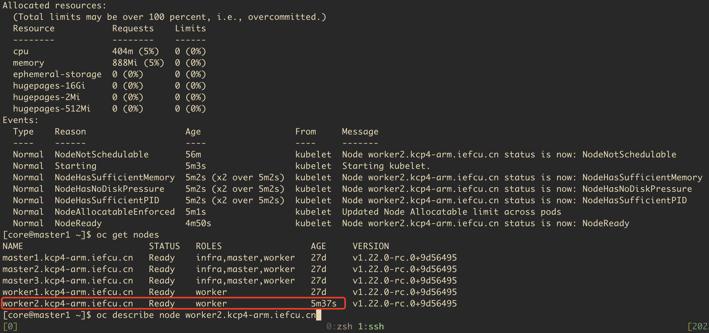

### 验证删除新增master节点！！！最终目的修改节点ip地址

* 首先驱逐删除节点，基本上跟worker节点一样
```bash
oc adm cordon master3.kcp4-arm.iefcu.cn
oc adm drain master3.kcp4-arm.iefcu.cn --force=true
```

驱逐pods同样是报错。
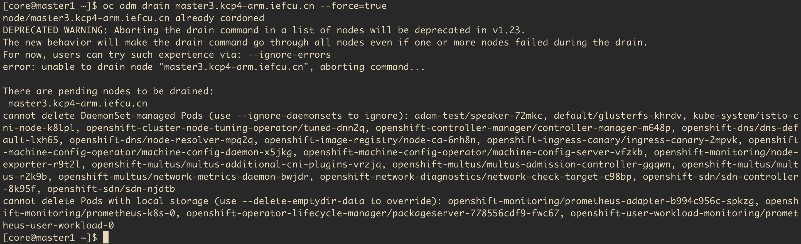

* 1.修改dns域名配置，特别是etcd
* 2.修改节点nmcli的ip地址
* 以及节点crio服务的ip配置

```bash
/etc/systemd/system/crio.service.d/20-nodenet.conf
/etc/systemd/system/kubelet.service.d/20-nodenet.conf
```

* 修改静态pods的ip地址

```bash
# static-pod-resources: etcd, apiserver
# 都在kubelet k8s相应目录 /etc/kubernetes/static-pod-resources

# TODO: 最麻烦的地方了？
sudo sed -i -e 's/10.90.3.35/10.90.2.94/g' etcd-pod.yaml
```

* 更新etcd证书ip地址啥的。
参考 4.2.4. 替换不健康的 etcd 成员

```bash
oc get pods -n openshift-etcd

oc -n openshift-etcd rsh etcd-master1.kcp4-arm.iefcu.cn

# 查看成员列表：记录不健康的 etcd 成员的 ID 和名称，因为稍后需要这些值。
etcdctl member list -w table

# 通过向 etcdctl member remove 命令提供 ID 来删除不健康的 etcd 成员 :
etcdctl member remove ae33b17c46663348

# 再次查看成员列表，并确认成员已被删除：
etcdctl member list -w table

# 删除已删除的不健康 etcd 成员的旧 secret。
oc get secrets -n openshift-etcd | grep master3.kcp4-arm.iefcu.cn
oc delete secret -n openshift-etcd etcd-peer-master3.kcp4-arm.iefcu.cn
oc delete secret -n openshift-etcd etcd-serving-master3.kcp4-arm.iefcu.cn
oc delete secret -n openshift-etcd etcd-serving-metrics-master3.kcp4-arm.iefcu.cn
```

删除并重新创建 control plane 机器。重新创建此机器后，会强制一个新修订版本并自动扩展 etcd。

如果您正在运行安装程序置备的基础架构，或者您使用 Machine API 创建机器，请按照以下步骤执行。否则，您必须使用最初创建 master 时使用的相同方法创建新的 master。

强制 etcd 重新部署。？

尼玛etcd起不来了。。。整个集群都会出问题。。。 => 修改ip回来正常，看来某个顺序不对。
原来是在master1上删除etcd出了一点小问题。 => 正好，修改master1的ip地址，重新部署etcd吧
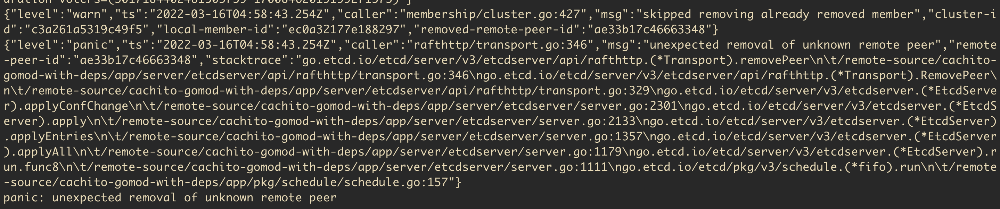

=> 新增disable kubelet服务的处理，防止静态pod启动加入集群。

新增旧master1节点，etcd还是有点问题。
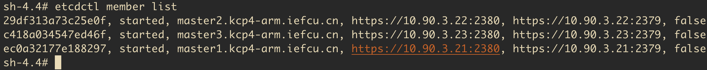

新的etcd没有成功加进来。
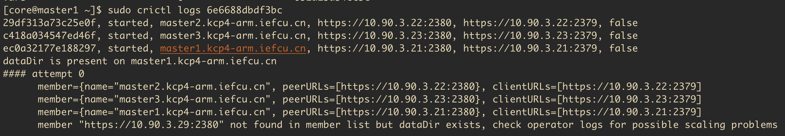

etcd operator的错误日志
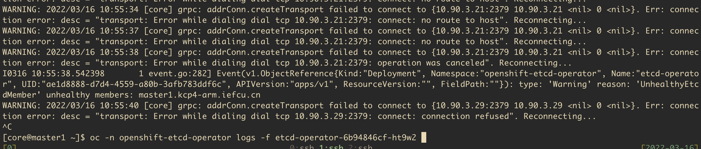

目前我暂没能力修改master节点的ip，因为etcd一直有问题。
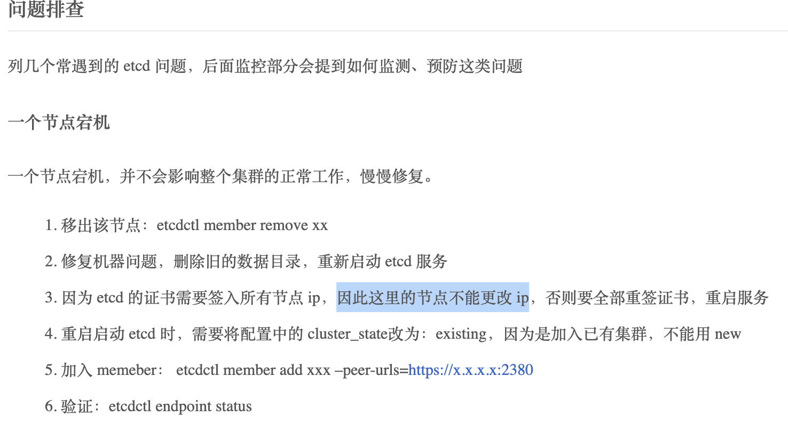

TODO:
尝试这个方法吧
https://myopenshiftblog.com/rebuilding-master-node/

## 配置接口新增ip地址

TODO: 问题
* 1.网关的修改?
* 2.xxx

#### 修改nmcli配置文件

网络配置文件是/etc/NetworkManager/system-connections/enp3s0.nmconnection
(注意名称可能是其他的)

新增ip地址配置，这样可以永久生效
```bash
address2=10.90.2.92/24
```

要想立即生效，则需要即时配置(注意网络连接可能是其他名称)
```bash
nmcli connection modify enp3s0 +ipv4.addresses 10.90.2.92/24
# 然后还要再up connection才行吧？
```

修改网关地址，可以把之前的网关取消掉，新的地址配置上网关，重启生效吧。
```
address1=10.90.3.35/24
address2=10.90.2.94/24,10.90.2.1
```

## 修改接口ip地址

修改步骤：
* 1.先保留新旧两个ip地址，先把dns给修改了验证，发现问题再修正问题。
  查看journel日志，发现部分逻辑依赖旧的ip地址，修改。
  /etc/systemd/system/crio.service.d/20-nodenet.conf
  /etc/systemd/system/kubelet.service.d/20-nodenet.conf
* 2.发现kube-apiserver容器运行失败，报错连接etcd失败
  使用crictl查看apiserver的地址得到的，还连接了旧的ip地址。
* 3.发现etcd-ensure-env-vars容器报错，还使用了旧的ip地址。
  Expected node IP to be 10.90.2.94 got 10.90.3.35
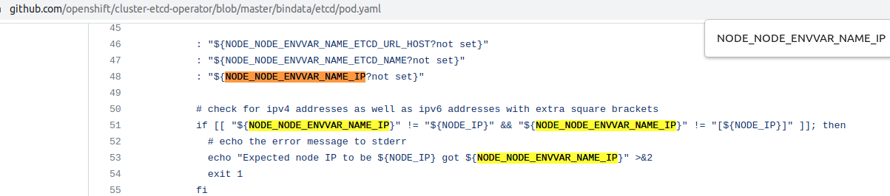
/etc/kubernetes/static-pod-resources/etcd-pod-2/etcd-pod.yaml
先修改这个文件
/etc/kubernetes/manifests/etcd-pod.yaml
* 4.修改之后重启，基本正常，etcd operator略微有一点问题。
x509: certificate is valid for 10.90.3.35, not 10.90.2.94
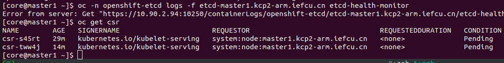
* 5.approve csr
* 6. 还是etcd有一点儿问题
sudo crictl logs etcd-health-monitor
x509: certificate is valid for ::1, 10.90.3.35, 127.0.0.1, ::1, not 10.90.2.94". Reconnecting
而且，使用curl -v -k https://10.90.2.94:2379 都失败
(原因是etcd会校验客户端的证书。)
TODO: 关键字《openshift etcd证书更新》

之前触发过etcd重新安装!!!
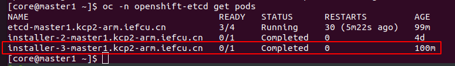

发现证书里面的ip地址还是旧的。
```bash
openssl x509 -text -in etcd-peer-master1.kcp2-arm.iefcu.cn.crt | grep DNS
        Validity           
            Not Before: Mar 10 11:31:18 2022 GMT                                                     
            Not After : Mar  9 11:31:19 2025 GMT
        DNS:localhost, DNS:10.90.3.35, IP Address:10.90.3.35
```

etcd pod crash 替换不健康的 etcd 成员
https://access.redhat.com/documentation/zh-cn/openshift_container_platform/4.9/html-single/backup_and_restore/index#_replacing-the-unhealthy-etcd-member


关键字《单k8s节点ip地址修改》，有不少文章，但不适合openshift

TODO: 目前来说，是有问题的。系统容器启动失败，报错。  

## 旧的笔记，待整理

关键字《openshift 4 change node ip address》
只搜索到了openshift虚拟化节点的ip地址修改
* 1.想到用machine config , 看了一下，可能不是针对单节点的，放弃
* 2.直接使用nmcli修改ip，发现apiserver还是shiyon
* 3.k8s修改节点ip, 据说跟新增节点逻辑一样？（这样最可靠吧？）
那单master节点怎么修改ip呢？
https://www.cnblogs.com/chenjw-note/p/11175250.html
```
k8s集群节点更换ip 或者 k8s集群添加新节点
1.需求情景：机房网络调整，突然要回收我k8s集群上一台node节点机器的ip，并调予新的ip到这台机器上，所以有了k8s集群节点更换ip一说；同时，k8s集群节点更换ip也相当于k8s集群添加新节点，他们的操作流程是一样的。
```

openshift启动顺序总结
先启动kubelet
然后apiserver等etcd控制平面
然后慢慢拉起其他容器。

CentOS7的journalctl日志查看方法
https://www.cnblogs.com/ggzhangxiaochao/p/13953887.html
例如，查看系统本次启动的日志 journalctl -b


以下是发现写了节点ip的地方，也有可能重启就可以了。
* /etc/systemd/system/crio.service.d/20-nodenet.conf
* /etc/systemd/system/kubelet.service.d/20-nodenet.conf

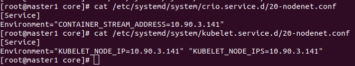

这两个文件都是运行时生成的？
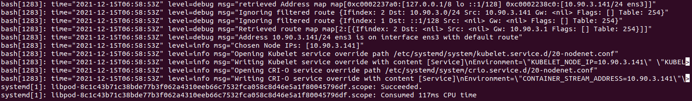

kube-apiserver也是连接旧的ip地址

我手动写一个域名
/etc/hosts
10.90.3.141 master1.kcp4.iefcu.cn

因为kubelet老是报错：node xxx not found
Dec 15 06:59:11 master1.kcp4.iefcu.cn hyperkube[1528]: E1215 06:59:11.159415    1528 kubelet.go:2303] "Error getting node" err="node \"master1.kcp4.iefcu.cn\" not found"
