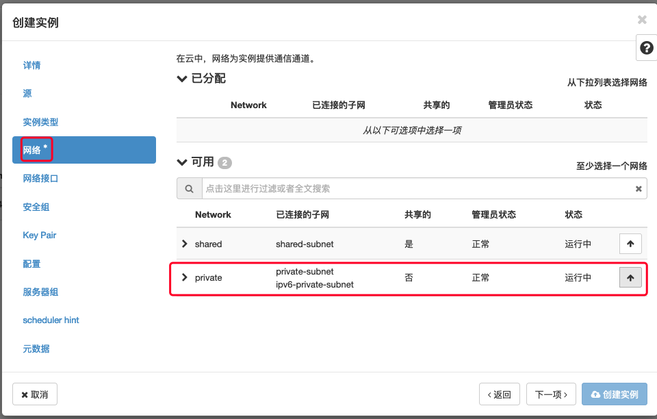
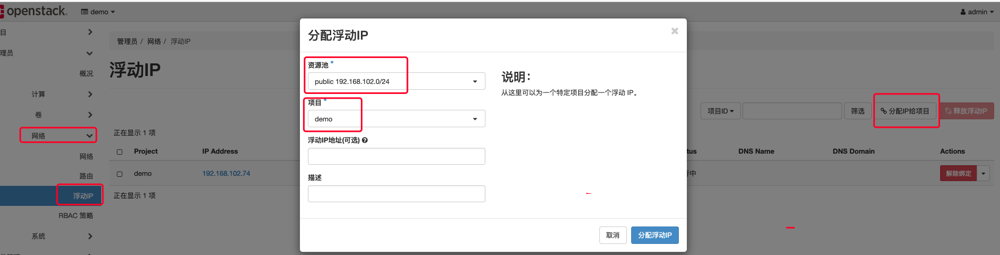
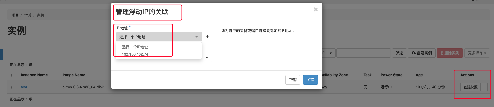

# openstack配置浮动ip测试

前提: 至少安装好单节点openstack环境, 配置好公有网络

## 操作步骤

### 创建实例，选择私有网络

很简单的创建一个虚拟机实例，选择一个私有网络:




### 管理员分配浮动ip给项目

分配浮动ip给demo项目



### 虚拟机实例绑定浮动ip

项目中有可用的浮动ip之后，就可以绑定到实例接口上去了。



## FAQ

#### 虚拟机访问外网不通

尝试tcpdump抓物理口的包，不通, 发现ens4没有up
=> 只要把物理口up即可

#### 外面ping不通虚拟机的浮动ip

默认安全组没有放开icmp协议, 放开即可

## 其他资料

## 参考资料

[api接口参数详解 - 9.2. Creating virtual networks](https://docs.virtuozzo.com/virtuozzo_hybrid_infrastructure_4_6_compute_api_reference/managing-virtual-networks/creating-virtual-networks.html)
provider:physical_network (Optional) => 对应ovs桥的映射名称?devstack建的到底是什么呢?

创建外部网络, 物理网络这个参数到底应该怎么填?
https://opensource.com/article/17/4/openstack-neutron-networks

这样, 我的devstack中没有!
```
ovs-vsctl list-ports br-ex

eth1
phy-br-ex

ovs-vsctl list-ports br-ex2

eth2
phy-br-ex2
```


[Red Hat OpenStack Platform - Chapter 9. Connect an instance to the physical network](https://access.redhat.com/documentation/en-us/red_hat_openstack_platform/8/html/networking_guide/sec-connect-instance)

3. Configure the physical networks in /etc/neutron/plugins/ml2/openvswitch_agent.ini and map the bridge to the physical network:
Note
For more information on configuring bridge_mappings, see Chapter 13, Configure Bridge Mappings.
```
bridge_mappings = physnet1:br-ex
```
