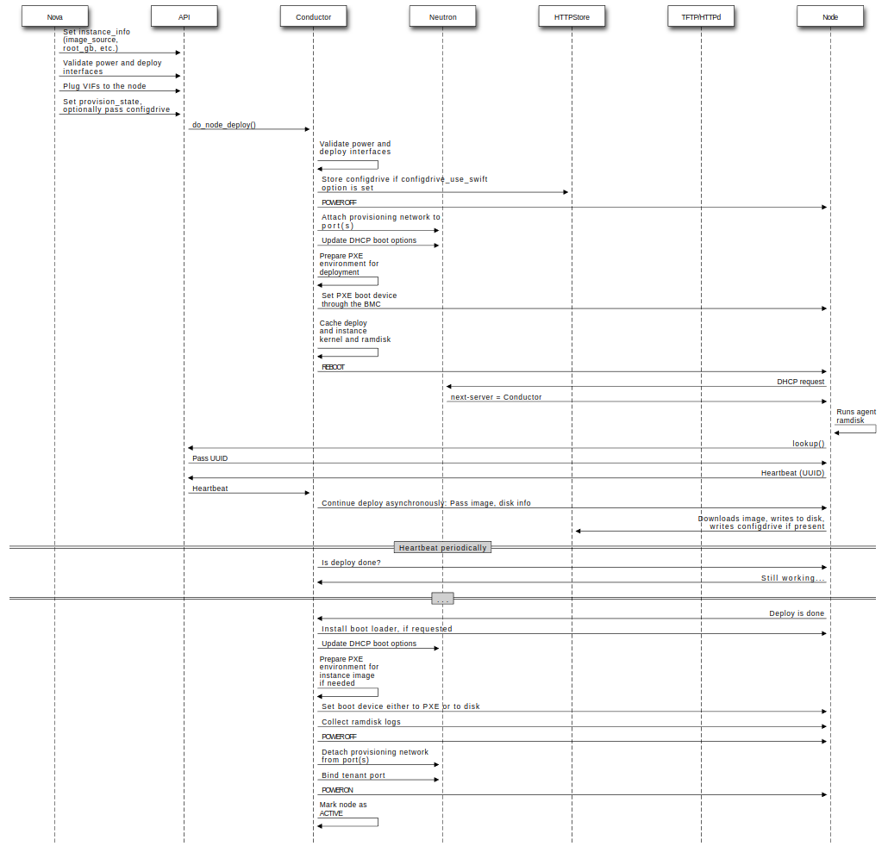
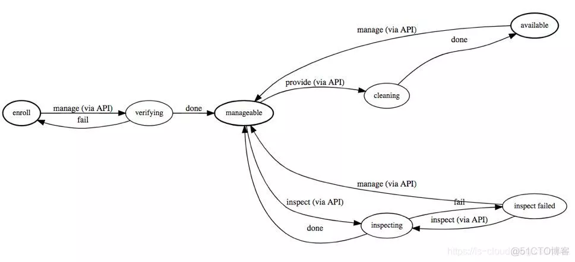

# openstack ironic裸金属管理

TODO:
- 查看ipmi驱动属性?
  ironic driver-properties pxe_ipmitool
  例如: deploy_kernel
- 裸金属机器系统的网络配置?
  => 例如配置bond口?
  => 以及是否通过
- 节点配置静态ip?

目标:
- 使用IPMI管理裸设备 => ok
  例如开机关机重启，pxe启动等
- 部署实例到裸设备上
  例如部署centos系统

关键字《openstack ironic文档》

[简书 - OpenStack - Ironic](https://www.jianshu.com/p/ab799d414158)
OpenStack Ironic就是一个进行裸机部署安装的项目。

Ironic实现的功能，就是可以很方便的对指定的一台或多台裸机，执行：
- （1）硬盘RAID、分区和格式化；
- （2）安装操作系统、驱动程序；
- （3）安装应用程序。

我们把fake驱动排除，其他的驱动可以分为两类：
- 一是以pex 或者 iscsi 为前缀的驱动采用PXE部署机制，这些驱动**将根硬盘作为iSCSI设备暴露给ironic conductor，由conductor将镜像复制到这里.**
- 二是以agent_ 为前缀的驱动采用Agent部署机制，conductor准备一个存储在swift上的镜像URL给IPA，由IPA下载镜像和完成部署的操作。

**openstack ironic 支持用虚拟模拟物理机进行测试!!!**

[Openstack Ironic standalone 方式部署](https://www.xiexianbin.cn/openstack/ironic/index.html)
ironic如果配置成standalone服务，其他服务如glance，neutron，nova，cinder等无需安装。

[Ironic 裸金属管理服务 原创](https://blog.51cto.com/u_15301988/3160308)
devstack部署ironic, 使用vm模拟裸金属服务器

#### 安装ironic

关键字《kolla-ansible enable ironic》《kolla-ansible 启用 ironic》

[(kolla官方文档)Ironic - Bare Metal provisioning](https://docs.openstack.org/kolla-ansible/latest/reference/bare-metal/ironic-guide.html)
https://docs.openstack.org/kolla-ansible/rocky/reference/ironic-guide.html

添加iron配置(基本参考官方文档)
```
enable_ironic: "yes"
ironic_dnsmasq_interface: "enp4s3"
ironic_cleaning_network: "public1"
ironic_dnsmasq_dhcp_range: "192.168.83.100,192.168.83.180,255.255.255.0"
ironic_dnsmasq_default_gateway: 192.168.83.192
ironic_dnsmasq_boot_file: pxelinux.0
ironic_inspector_kernel_cmdline_extras: ['ipa-lldp-timeout=90.0', 'ipa-collect-lldp=1']
ironic_http_port: "8089"
```

#### 系统部署流程

参考官方文档: https://docs.openstack.org/ironic/yoga/user/architecture.html

Example: PXE Boot and Direct Deploy Process¶
This process is how Direct deploy works.


=> 注意： 是通过节点的网络接口获取dhcp，配置pxe的，而不是ironic的dhcp...

#### openstack创建另外一个public物理口网络

配置 Provisioning Network

参考: https://blog.51cto.com/u_15301988/3244722

首先配置一个 Physical Network 作为 Provisioning Network，用于提供 DHCP、PXE 功能，即裸金属节点部署网络。

配置新的 Physical Network
```
编辑配置文件: /etc/kolla/neutron-server/ml2_conf.ini
dd:
```

#### 添加节点

关键字《openstack ironic create node》《openstack ironic 添加节点》

https://docs.mirantis.com/mcp/q4-18/mcp-operations-guide/openstack-operations/ironic-operations/add-baremetal-nodes.html
```
ironic node-create \
    --name <node-name> \
    --driver <driver-name> \
    --driver-info deploy_ramdisk=<glance UUID of deploy image ramdisk> \
    --driver-info deploy_kernel=<glance UUID of deploy image kernel> \
    --driver-info ipmi_address=<IPMI address of the node> \
    --driver-info ipmi_username=<username for IPMI> \
    --driver-info ipmi_password=<password for the IPMI user> \
    --property memory_mb=<RAM size of the node in MiB> \
    --property cpus=<Number of CPUs on the node> \
    --property local_gb=<size of node's disk in GiB> \
    --property cpu_arch=<architecture of node's CPU>
```

https://blog.csdn.net/OldHusband/article/details/112794051
十、注册 Enrollment Baremetal Node
```
# 首先查看用到的 IPMI 的所有 Ironic Driver
openstack baremetal driver show ipmi
# 打印出 IPMI 驱动程序的属性清单
openstack baremetal driver property list ipmi
```

创建节点
(注意: ipmi协议端口默认是623)
```
openstack baremetal node create --driver ipmi --name BM01 \
--deploy-interface iscsi \
--raid-interface agent \
--driver-info ipmi_username=ADMIN \
--driver-info ipmi_password=ADMIN \
--driver-info ipmi_address=10.30.10.3 \
--driver-info ipmi_port=623 \

Could not find the following interface in the 'ironic.hardware.interfaces.deploy' entrypoint: iscsi. Valid interfaces are ['direct']. (HTTP 400)
```

### openstack 裸金属命令使用

ironic-api提供一系列接口，详见[ironic API](https://docs.openstack.org/api-ref/baremetal/?expanded=change-node-provision-state-detail,get-console-detail,start-stop-console-detail,show-driver-logical-disk-properties-detail)。

- 节点相关（node）
  - 节点增删改查（List, Searching, Creating, Updating, and Deleting)
  - 合法性检查
  - 设置和清除维修状态
  - 设置和获取boot device
  - 获取节点当前综合信息，包括power, provision, raid, console等
  - 更改电源状态
  - 更改节点提供状态（ manage, provide, inspect, clean, active, rebuild, delete (deleted), abort）
  - 设置RAID
  - 启动、停止、获取console
  - 查看、调用厂商定制方法（passthru方法）
- 端口相关(Port)
  - 对物理端口（Port）的增删改查（Listing, Searching, Creating, Updating, and Deleting ），新建的时候就要指定端口的物理地址(一般是MAC地址)与Node进行绑定。
  - 查看与Node连接的端口
- 驱动相关（driver）
  - 列举所有驱动
 - 查看驱动的详细信息、属性
 - 查看和调用厂商的驱动

#### 安装客户端工具

```
# ubuntu
apt install -y python3-ironicclient
# 或者pip安装
pip install python-ironicclient
```

#### 准备部署内核和镜像

部署时，通过这个部署内核和内存镜像，把机器pxe启动到部署系统中，然后安装用户系统镜像到硬盘上
```
openstack image create --disk-format aki --container-format aki --public \
  --file ironic-agent.kernel deploy-vmlinuz

openstack image create --disk-format ari --container-format ari --public \
  --file ironic-agent.initramfs deploy-initrd
```

#### 创建节点

(注意: ipmi协议端口默认是623)
```
openstack baremetal node create --driver ipmi --name BM01 \
  --deploy-interface iscsi \
  --raid-interface agent \
  --driver-info ipmi_username=ADMIN \
  --driver-info ipmi_password=ADMIN \
  --driver-info ipmi_address=10.30.10.3 \
  --driver-info ipmi_port=623 \

Could not find the following interface in the 'ironic.hardware.interfaces.deploy' entrypoint: iscsi. Valid interfaces are ['direct']. (HTTP 400)
=> 去除iscsi参数即可
```

注册节点(注意: 需要提供部署内核和镜像)
```
export VMLINUZ_UUID=$(openstack image list | awk '/deploy-vmlinuz/ { print $2 }')
export INITRD_UUID=$(openstack image list | awk '/deploy-initrd/ { print $2 }')

openstack baremetal node create --driver ipmi --name VM01 \
  --driver-info ipmi_port=6230 --driver-info ipmi_username=admin \
  --driver-info ipmi_password=password \
  --driver-info ipmi_address=10.90.2.250 \
  --resource-class baremetal-resource-class \
  --property cpus=4 \
  --property memory_mb=4096 --property local_gb=100 \
  --property cpu_arch=x86_64 \
  --driver-info deploy_kernel=$VMLINUZ_UUID \
  --driver-info deploy_ramdisk=$INITRD_UUID
```

以及给节点创建网卡
```
export NODE_UUID=$(openstack baremetal node list | awk '/VM01/ {print $2}')
openstack baremetal port create 52:54:00:7d:da:b9 \
  --node $NODE_UUID \
  --physical-network physnet1
```

查看节点
```
openstack baremetal node list
+--------------------------------------+------+---------------+-------------+--------------------+-------------+
| UUID                                 | Name | Instance UUID | Power State | Provisioning State | Maintenance |
+--------------------------------------+------+---------------+-------------+--------------------+-------------+
| 831ac23b-7daa-462b-ab28-6dd2972c5000 | BM01 | None          | power on    | enroll             | False       |
+--------------------------------------+------+---------------+-------------+--------------------+-------------+

openstack baremetal node show 831ac23b-7daa-462b-ab28-6dd2972c5000
```

Change Node Power State (开机关机等?)
```
openstack baremetal node power off BM01
openstack baremetal node power on BM01
openstack baremetal node reboot BM01
```

管理并检查节点状态为可用
```
openstack baremetal node manage BM01
openstack baremetal node provide BM01
```

管理，则是检查节点的IPMI的可用状态
/var/log/kolla/ironic/ironic-conductor.log
```
Command: ipmitool -I lanplus -H 10.30.10.3 -L ADMINISTRATOR -p 6230 -U ADMIN -R 1 -N 5 -f /tmp/tmpq4atxoud power status
Exit code: 1
Stdout: ''
Stderr: 'Error: Unable to establish IPMI v2 / RMCP+ session\n': oslo_concurrency.processutils.ProcessExecutionError: Unexpected error while running command.
2023-07-11 10:36:30.999 7 WARNING ironic.drivers.modules.ipmitool [req-d0822a47-9736-484e-9baa-4c77ef82f2a6 6737de59870d4c149b842d813ff0d1f7 7096ea09f9844f87beecd990d32480e2 - default default] IPMI Error encountered, retrying "ipmitool -I lanplus -H 10.30.10.3 -L ADMINISTRATOR -p 6230 -U ADMIN -R 1 -N 5 -f /tmp/tmp31k606js power status" for node fc63d131-627a-41fc-ac18-ffe902c7e308. Error: Unexpected error while running command.
```

手动执行命令, ipmitool命令失败了? => 原来是端口搞错了，是623...
```
echo ADMIN > /tmp/tmpq4atxoud
ipmitool -I lanplus -H 10.30.10.3 -L ADMINISTRATOR -p 6230 -U ADMIN -R 1 -N 5 -f /tmp/tmpq4atxoud power status
Error: Unable to establish IPMI v2 / RMCP+ session
```

#### pxe启动失败, exec format error

xxx, 重新下载，以及构建kernel镜像?
=> 原来是我把kernel和initram搞反了。。。

#### node状态一直卡在wait call-back

猜测可能是nova给node配置image info有问题，看看相关日志，ironic部署server，需要vmlinuz和initrd的。。。以及最后的qcow2镜像?
=> 可能还没有到那一步，就出错了!

/var/log/kolla/nova/nova-compute-ironic.log
```
2023-07-11 10:48:30.350 7 ERROR oslo_messaging.rpc.server   File "/var/lib/kolla/venv/lib/python3.8/site-packages/nova/compute/manager.py", line 6384, in get_host_uptime
2023-07-11 10:48:30.350 7 ERROR oslo_messaging.rpc.server     return self.driver.get_host_uptime()
2023-07-11 10:48:30.350 7 ERROR oslo_messaging.rpc.server   File "/var/lib/kolla/venv/lib/python3.8/site-packages/nova/virt/driver.py", line 1429, in get_host_uptime
2023-07-11 10:48:30.350 7 ERROR oslo_messaging.rpc.server     raise NotImplementedError()
2023-07-11 10:48:30.350 7 ERROR oslo_messaging.rpc.server NotImplementedError

2023-07-11 10:49:13.113 7 ERROR nova.network.neutron [req-676b39ca-49c3-40a9-a730-f4b6080b8e9e 9daf4a7a49f947ae80319d05d5b58ece be87c1c91fb64486a45f446269d617ec - default default] [instance: 79b2c083-81f8-42b4-8c58-d0ae30a83321] The vnic_type of the bound port 178f21f0-b2c9-44af-b4e6-f2223c7446b9 has been changed in neutron from "normal" to "baremetal". Changing vnic_type of a bound port is not supported by Nova. To avoid breaking the connectivity of the instance please change the port vnic_type back to "normal".
```
=> TODO: 分析解决!!

openstack server list --long

查看分析port的情况?
```
openstack port list
| e9f46549-8865-4ee4-8063-b5c755709d78 |      | ac:1f:6b:12:4b:76 | ip_address='10.0.2.196', subnet_id='617d6ce1-98af-417b-af24-920989b5d99d' | ACTIVE |

=> 真的是网络配置问题，导致没有pxe启动成功? => 没能获取到dhcp ip地址呢? => kolla默认public网络默认没有开启dhcp, 开一下!
openstack port show 011a1804-36ad-4b85-b500-b75409ef143a
+-------------------------+--------------------------------------------------------------------------------------+
| Field                   | Value                                                                                |
+-------------------------+--------------------------------------------------------------------------------------+
| admin_state_up          | UP                                                                                   |
| allowed_address_pairs   |                                                                                      |
| binding_host_id         | 8fcf8fc8-28c4-4761-8c67-05f8c02b2dd1                                                 |
| binding_profile         |                                                                                      |
| binding_vif_details     | bound_drivers.0='baremetal', connectivity='legacy'                                   |
| binding_vif_type        | other                                                                                |
| binding_vnic_type       | baremetal                                                                            |
| created_at              | 2023-07-11T07:08:34Z                                                                 |
| data_plane_status       | None                                                                                 |
| description             |                                                                                      |
| device_id               | 18609a0b-fb8f-4bee-985a-f29449b6ef13                                                 |
| device_owner            | compute:nova                                                                         |
| device_profile          | None                                                                                 |
| dns_assignment          | None                                                                                 |
| dns_domain              | None                                                                                 |
| dns_name                | None                                                                                 |
| extra_dhcp_opts         | ip_version='4', opt_name='150', opt_value='10.30.2.98'                               |
|                         | ip_version='4', opt_name='tag:ipxe,67', opt_value='http://10.30.2.98:8089/boot.ipxe' |
|                         | ip_version='4', opt_name='server-ip-address', opt_value='10.30.2.98'                 |
|                         | ip_version='4', opt_name='66', opt_value='10.30.2.98'                                |
|                         | ip_version='4', opt_name='tag:!ipxe,67', opt_value='snponly.efi'                     |
| fixed_ips               | ip_address='10.0.2.198', subnet_id='617d6ce1-98af-417b-af24-920989b5d99d'            |
```

nova-conductor.log => 超时失败日志!
```
=> Failed to provision instance 79b2c083-81f8-42b4-8c58-d0ae30a83321: Timeout reached while waiting for callback for node 8fcf8fc8-28c4-4761-8c67-05f8c02b2dd1

2023-07-11 11:21:10.090 17 ERROR nova.scheduler.utils [req-717a7974-ab22-4c6f-9a5b-68266f62f141 6737de59870d4c149b842d813ff0d1f7 7096ea09f9844f87beecd990d32480e2 - default default] [instance: 79b2c083-81f8-42b4-8c58-d0ae30a83321] Error from last host: kolla-ironic (node 8fcf8fc8-28c4-4761-8c67-05f8c02b2dd1): ['Traceback (most recent call last):\n', '  File "/var/lib/kolla/venv/lib/python3.8/site-packages/nova/compute/manager.py", line 2513, in _build_and_run_instance\n    self.driver.spawn(context, instance, image_meta,\n', '  File "/var/lib/kolla/venv/lib/python3.8/site-packages/nova/virt/ironic/driver.py", line 1208, in spawn\n    LOG.error("Error deploying instance %(instance)s on "\n', '  File "/var/lib/kolla/venv/lib/python3.8/site-packages/oslo_utils/excutils.py", line 227, in __exit__\n    self.force_reraise()\n', '  File "/var/lib/kolla/venv/lib/python3.8/site-packages/oslo_utils/excutils.py", line 200, in force_reraise\n    raise self.value\n', '  File "/var/lib/kolla/venv/lib/python3.8/site-packages/nova/virt/ironic/driver.py", line 1203, in spawn\n    timer.start(interval=CONF.ironic.api_retry_interval).wait()\n', '  File "/var/lib/kolla/venv/lib/python3.8/site-packages/eventlet/event.py", line 125, in wait\n    result = hub.switch()\n', '  File "/var/lib/kolla/venv/lib/python3.8/site-packages/eventlet/hubs/hub.py", line 313, in switch\n    return self.greenlet.switch()\n', '  File "/var/lib/kolla/venv/lib/python3.8/site-packages/oslo_service/loopingcall.py", line 150, in _run_loop\n    result = func(*self.args, **self.kw)\n', '  File "/var/lib/kolla/venv/lib/python3.8/site-packages/nova/virt/ironic/driver.py", line 544, in _wait_for_active\n    raise exception.InstanceDeployFailure(msg)\n', 'nova.exception.InstanceDeployFailure: Failed to provision instance 79b2c083-81f8-42b4-8c58-d0ae30a83321: Timeout reached while waiting for callback for node 8fcf8fc8-28c4-4761-8c67-05f8c02b2dd1\n', '\nDuring handling of the above exception, another exception occurred:\n\n', 'Traceback (most recent call last):\n', '  File "/var/lib/kolla/venv/lib/python3.8/site-packages/nova/compute/manager.py", line 2336, in _do_build_and_run_instance\n    self._build_and_run_instance(context, instance, image,\n', '  File "/var/lib/kolla/venv/lib/python3.8/site-packages/nova/compute/manager.py", line 2609, in _build_and_run_instance\n    raise exception.RescheduledException(\n', 'nova.exception.RescheduledException: Build of instance 79b2c083-81f8-42b4-8c58-d0ae30a83321 was re-scheduled: Failed to provision instance 79b2c083-81f8-42b4-8c58-d0ae30a83321: Timeout reached while waiting for callback for node 8fcf8fc8-28c4-4761-8c67-05f8c02b2dd1\n']
```

会不会是这个port创建的有问题?
openstack port list

在页面上看node节点信息，发现deploy有点问题!
```
deploy 		direct 	Node 8fcf8fc8-28c4-4761-8c67-05f8c02b2dd1 failed to validate deploy image info. Some parameters were missing. Missing are: ['instance_info.image_source'] 
```

validate节点信息，也能看到上述信息
https://docs.openstack.org/ironic/wallaby/install/standalone/deploy.html
```
[ssh_10.30.2.98] root@kolla: ironic-conductor$openstack baremetal node validate 8fcf8fc8-28c4-4761-8c67-05f8c02b2dd1
+------------+--------+-----------------------------------------------------------------------------------------------------------------------------------------------------------+
| Interface  | Result | Reason                                                                                                                                                    |
+------------+--------+-----------------------------------------------------------------------------------------------------------------------------------------------------------+
| bios       | False  | Driver ipmi does not support bios (disabled or not implemented).                                                                                          |
| boot       | True   |                                                                                                                                                           |
| console    | False  | Driver ipmi does not support console (disabled or not implemented).                                                                                       |
| deploy     | False  | Node 8fcf8fc8-28c4-4761-8c67-05f8c02b2dd1 failed to validate deploy image info. Some parameters were missing. Missing are: ['instance_info.image_source'] |
| inspect    | False  | Driver ipmi does not support inspect (disabled or not implemented).                                                                                       |
| management | True   |                                                                                                                                                           |
| network    | True   |                                                                                                                                                           |
| power      | True   |                                                                                                                                                           |
| raid       | False  | Driver ipmi does not support raid (disabled or not implemented).                                                                                          |
| rescue     | False  | Driver ipmi does not support rescue (disabled or not implemented).                                                                                        |
| storage    | True   |                                                                                                                                                           |
+------------+--------+-----------------------------------------------------------------------------------------------------------------------------------------------------------+
```

TODO: 配置一下?
```
baremetal node set $NODE_UUID \
    --instance-info image_source=$IMG \
    --instance-info image_checksum=$MD5HASH
```
https://access.redhat.com/documentation/en-us/red_hat_openstack_platform/11/html/bare_metal_provisioning/sect-configure
=> 这个校验失败暂时没有问题?
Interfaces may fail validation due to missing 'ramdisk', 'kernel', and 'image_source' parameters. This result is fine, because the Compute service populates those missing parameters at the beginning of the deployment process.
=> nova部署时，会配置这些参数

驱动列表?
https://docs.openstack.org/ironic/pike/install/enrollment.html
```
[ssh_10.30.2.98] root@kolla: ironic-conductor$openstack baremetal driver list
+---------------------+----------------+
| Supported driver(s) | Active host(s) |
+---------------------+----------------+
| ipmi                | kolla          |
| redfish             | kolla          |
+---------------------+----------------+
```

驱动参数信息?
```
$ ironic driver-properties pxe_ipmitool
+----------------------+-------------------------------------------------------------------------------------------------------------+
| Property             | Description                                                                                                 |
+----------------------+-------------------------------------------------------------------------------------------------------------+
| ipmi_address         | IP address or hostname of the node. Required.                                                               |
| ipmi_password        | password. Optional.                                                                                         |
| ipmi_username        | username; default is NULL user. Optional.                                                                   |
| ...                  | ...                                                                                                         |
| deploy_kernel        | UUID (from Glance) of the deployment kernel. Required.                                                      |
| deploy_ramdisk       | UUID (from Glance) of the ramdisk that is mounted at boot time. Required.                                   |
+----------------------+-------------------------------------------------------------------------------------------------------------+
```

openstack --os-baremetal-api-version 1.31 baremetal driver show ipmi

#### 设置启动设备

例如设置为pxe启动
```
openstack baremetal node boot device set BM01 pxe
=> <device>  One of bios, cdrom, disk, pxe, safe, wanboot
openstack baremetal node boot device show BM01
+-------------+-------+
| Field       | Value |
+-------------+-------+
| boot_device | pxe   |
| persistent  | False |
+-------------+-------+
=> 重启后，配置就会变化为None
```

#### 配置端口mac地址

创建裸机端口：
```
openstack baremetal port create --node  node_uuid node_mac_address
openstack baremetal port create --node  e6423e53-740a-46f6-8c24-06fe8f21e53a  52:54:84:00:00:f7
```
- node_uuid：创建node时生成的uuid
- node_mac_address：裸机的网卡mac地址；如果裸机上有多个网卡，就输入和Ironic Pxe服务相连的网卡；（Pxe简单说用于下载镜像，可以参考我的相关文章）

### kolla安装ironic

global.yml配置
```
enable_ironic: "yes"
ronic_dnsmasq_interface: "eth1"
ironic_cleaning_network: "enp4s3"
ironic_dnsmasq_dhcp_ranges:
  - range: "192.168.83.100,192.168.83.180"
    routers: "192.168.83.192"
ironic_dnsmasq_boot_file: pxelinux.0
ironic_inspector_kernel_cmdline_extras: ['ipa-lldp-timeout=90.0', 'ipa-collect-lldp=1']
ironic_http_port: "8089"
```

kolla容器:
- ubuntu-source-ironic-neutron-agent:yoga ironic_neutron_agent
- ubuntu-source-dnsmasq:yoga              ironic_dnsmasq
- ubuntu-source-ironic-pxe:yoga           ironic_http
- ubuntu-source-ironic-pxe:yoga           ironic_tftp
- ubuntu-source-ironic-inspector:yoga     ironic_inspector
- ubuntu-source-ironic-api:yoga           ironic_api
- ubuntu-source-ironic-conductor:yoga     ironic_conductor
- ubuntu-source-nova-compute-ironic:yoga  nova_compute_ironic

### 验证qemu-img生成pc硬盘系统

- 首先进入ubuntu 20.04 livecd

- 然后安装qemu-img工具

- 然后挂载img nfs服务器

- 最后转换img到pc硬盘
```
qemu-img convert -f qcow2 -O raw debian10.img /dev/sda
```
=> 比较慢，跟img的虚拟大小有关!!!

待尝试其他镜像: win10, win7, win2012, ubuntu 20.04, centos7等

- debian 10 => ok
- win10 => ok
- ubuntu 20.04 => ok
  focal-server-cloudimg-amd64.img
  网上的这个镜像不是很好, 不能自动扩容磁盘分区，居然没有物理网卡
  用自己安装的虚拟机ubuntu-kolla感觉挺好
- zstack => ok
  zstack c76系统，可以不错
- KSVD => ok

## devstack 安装使用ironic

关键字《devstack ironic plugin》
[ironic官方文档](https://docs.openstack.org/ironic/latest/contributor/dev-quickstart.html#deploying-ironic-with-devstack)

```
# Reclone each time
RECLONE=no

# Enable Ironic plugin
enable_plugin ironic https://git.openstack.org/openstack/ironic stable/stein

# Enable Swift for the direct deploy interface.
enable_service s-proxy
enable_service s-object
enable_service s-container
enable_service s-account

# Swift temp URL's are required for the direct deploy interface
SWIFT_ENABLE_TEMPURLS=True

# Create 3 virtual machines to pose as Ironic's baremetal nodes.
IRONIC_VM_COUNT=1
IRONIC_BAREMETAL_BASIC_OPS=True
DEFAULT_INSTANCE_TYPE=baremetal

# Enable additional hardware types, if needed.
#IRONIC_ENABLED_HARDWARE_TYPES=ipmi,fake-hardware
# Don't forget that many hardware types require enabling of additional
# interfaces, most often power and management:
#IRONIC_ENABLED_MANAGEMENT_INTERFACES=ipmitool,fake
#IRONIC_ENABLED_POWER_INTERFACES=ipmitool,fake
# The 'ipmi' hardware type's default deploy interface is 'iscsi'.
# This would change the default to 'direct':
#IRONIC_DEFAULT_DEPLOY_INTERFACE=direct

# Change this to alter the default driver for nodes created by devstack.
# This driver should be in the enabled list above.
IRONIC_DEPLOY_DRIVER=ipmi

# The parameters below represent the minimum possible values to create
# functional nodes.
IRONIC_VM_SPECS_RAM=1280
IRONIC_VM_SPECS_DISK=10

# Size of the ephemeral partition in GB. Use 0 for no ephemeral partition.
IRONIC_VM_EPHEMERAL_DISK=0

# To build your own IPA ramdisk from source, set this to True
IRONIC_BUILD_DEPLOY_RAMDISK=False

VIRT_DRIVER=ironic

# Log all output to files
LOGFILE=/opt/stack/devstack.log
LOGDIR=/opt/stack/logs
IRONIC_VM_LOG_DIR=/opt/stack/ironic-bm-logs
```

#### vbmc模拟裸金属机器

kolla部署ironic的文档有相关资料:
https://brk3.github.io/post/kolla-ironic-libvirt/

安装使用, 例如把libvirt虚拟机virtual-baremetal配置作为一个裸金属机器:
```
yum install python-pip python-devel libvirt-devel gcc
pip install virtualbmc
vbmc add virtual-baremetal --port 6230 --username admin --password password --address 0.0.0.0
vbmc start --libvirt-uri=qemu:///session virtual-baremetal
```

使用ipmitool验证:
```
ipmitool -I lanplus -H <host node ip> -L ADMINISTRATOR -p 6230 \
  -U admin -R 12 -N 5 -P password power status
```

注意事项:
- vbmcd 这个命令启动vbmc程序
- $HOME/.vbmc/master.pid 这个可能要启动前需要手动删除

## 概念

### 部署方式

参考openstack ironic架构文档: https://docs.openstack.org/ironic/yoga/user/architecture.html

默认是direct部署?

Example: PXE Boot and Direct Deploy Process¶
This process is how Direct deploy works.


=> 注意： 是通过节点的网络接口获取dhcp，配置pxe的，而不是ironic的dhcp...

https://docs.openstack.org/ironic/yoga/admin/interfaces/deploy.html
还有其他部署方式:

- Ansible deploy
- Anaconda deploy
- Ramdisk deploy
- Custom agent deploy

#### 下载部署镜像

=> agent下载镜像进行安装，而不是提供iscsi设备安装

[(好)Ironic介绍](https://doodu.gitbooks.io/openstack/content/ironicji_zhu_fen_xiang.html)
我们把fake驱动排除，其他的驱动可以分为两类：

- 一是以pex 或者 iscsi 为前缀的驱动采用PXE部署机制，这些驱动将根硬盘作为iSCSI设备暴露给ironic conductor，由conductor将镜像复制到这里.
- 二是以agent_ 为前缀的驱动采用Agent部署机制，conductor准备一个存储在swift上的镜像URL给IPA，由IPA下载镜像和完成部署的操作。
从Kilo版开始，所有驱动使用agent进行部署。

#### 裸金属节点状态机

https://docs.openstack.org/ironic/latest/user/states.html

Ironic状态机：
https://blog.51cto.com/u_15301988/3160308
https://docs.openstack.org/ironic/latest/user/states.html
[(好)Ironic 裸金属管理服务 原创](https://blog.51cto.com/u_15301988/3244722)


状态变更过程:
- 注册节点, 节点状态为enroll
- 验证节点, 节点状态变为verifing, 然后manage
- 发布节点, 节点状态变为available

### 其他

#### irnoic使用的技术

=> 使用cloud-init初始化操作系统?
  => 还可以使用config driver?

[IRONIC的网络方案系列（一）](https://cloud.tencent.com/developer/news/161748)

在描述完物理服务器的组网图之后，接着简单概述下Ironic部署需要用到的技术。

- 1）：Ironic使用IPMI控制物理服务器的上下电、设置开机启动顺序（PXE启动或DISK启动）、获取电源状态、获取传感器状态、控制台重定向等。

- 2）：Ironic 使用PXE引导启动用于部署的ramdisk，且这个ramdisk内包含一个agent。它与Ironic交互，执行Ironic下发的命令。注，虽然Ironic支持iScsi和PXE等多种部署方式，本文以agent部署方式为例说明。

- 3）：cloud-init, 与虚拟机镜像一样，Ironic通过集成在镜像中的cloud-init初始化操作系统。包括创建用户、修改密码、配置网络等。

#### 裸金属服务器的生命周期

[IRONIC的网络方案系列（一）](https://cloud.tencent.com/developer/news/161748)

Ironic是OpenStack社区的子项目，专门用于提供裸机服务。它既可以独立使用也可以与nova、neutron等组件集成使用。对于被Ironic管理的物理服务器而言，主要有上架、部署、回收这三个阶段。

- 上架阶段指的是，当物理服务器完成硬件安装、网络连线等工作后。由管理员将机器的信息注册到Ironic中进行纳管。这个阶段，需要使用Ironic inspect功能以实现物理服务器硬件配置信息以及上联接入交换机信息的自动采集。

- 部署阶段指的是，当物理服务器完成上架后，处于可用状态。租（用）户根据业务需要指定镜像、网络等信息创建物理服务器实例。云平台执行资源调度、操作系统安装、网络配置等工作。有别于传统的人工部署和预先部署，租户可以在任意时刻按需选择不同的镜像、网络等信息。这个阶段，需要使用Ironic provision功能以实现配置信息的下发与自动化部署。一旦实例创建成功后，租（用）户可以使用物理服务器运行业务。

- 回收阶段指的是，当物理服务器完成使用，由租（用）户申请释放资源。这个阶段，可以使用Ironic clean功能清理物理服务器上的残留数据。

#### 裸金属终端Console

=> TODO: 验证一下?

https://blog.51cto.com/u_15301988/3160308

Ironic 支持两种 Console 类型：

- Shellinabox
- Socat

Shellinabox 可以将终端输出转换成 Ajax 实现的 http 服务，可以直接通过浏览器访问，呈现出类似 Terminal 的界面。Socat 与 Shellinabox 类似，都是充当一个管道作用，只不过 Socat 是将终端流重定向到 TCP 连接。Shellinabox 是比较早的方式，它的限制在于只能在 Ironic Conductor 节点上运行 WEB 服务，访问范围受限，所以社区又用 Socat 实现了一套。Socat 提供 TCP 连接，可以和 Nova 的 Serial Console 对接。要使用这两者，需要在 Ironic Conductor 节点安装相应的工具。Socat 在 yum 源里就可以找到，Shellinabox 不在标准源里，要从 EPEL 源里下载，它没有外部依赖，所以直接下载这个 rpm 包安装就可以了。Ironic 的驱动中，以 Socat 结尾的驱动是支持 Socat 的，比如 agent_ipmitool_socat，其它的则是 Shellinabox 方式。使用哪种终端方式，在创建节点时要确定好。这两种方式都是双向的，可以查看终端输出，也可以键盘输入。

#### 系统启动

[(好, 很长)Ironic介绍](https://doodu.gitbooks.io/openstack/content/ironicji_zhu_fen_xiang.html)
=> 还有代码分析...

- bootloader（引导程序，常见的有GRUB、LILO）
- kernel（内核）
- ramdisk（虚拟内存盘）
- initrd/initramfs （初始化内存磁盘镜像）

下面我们分别介绍每个概念：

- `引导加载程序`是系统加电后运行的第一段软件代码。PC机中的引导加载程序由BIOS(其本质就是一段固件程序)和位于硬盘MBR（主引导记录，通常位于第一块硬盘的第一个扇区）中的OS BootLoader（比如，LILO和GRUB等）一起组成。BIOS在完成硬件检测和资源分配后，硬盘MBR中的BootLoader读到系统的RAM中，然后控制权交给OS BootLoader。
- bootloader负责将kernel和ramdisk从硬盘读到内存中，然后跳转到内核的入口去运行。
- kernel是Linux的内核，包含最基本的程序。
- ramdisk是一种基于内存的虚拟文件系统，就好像你又有一个硬盘，你可以对它上面的文件添加修改删除等等操作。但是一掉电，就什么也没有了，无法保存。一般驱动程序放在这里面。
- initrd是boot loader initialized RAM disk, 顾名思义，是在系统初始化引导时候用的ramdisk。也就是由启动加载器所初始化的RamDisk设备，它的作用是完善内核的模块机制，让内核的初始化流程更具弹性；内核以及initrd，都由 bootloader在机子启动后被加载至内存的指定位置，主要功能为按需加载模块以及按需改变根文件系统。initramfs与initrd功能类似，是initrd的改进版本，改进了initrd大小不可变等等缺点。

#### IPMI接口

[剖析ironic](https://doodu.gitbooks.io/openstack-ironic/content/ironicpou_xi.html)

有一张图, 讲解pxe流程, 还行

利用IPMI可以实现以下功能
- 可以在服务器通电（没有启动操作系统）情况下，对它进行远程管理：开机，关机，重启
- 基于文本的控制台重定向，可以远程查看和修改BIOS设置，系统启动过程，登入系统等
- 可以远程通过串口IP映射(SoL)连接服务器，解决ssh服务无法访问，远程安装系统，查看系统启动故障等问题
- 可以通过系统的串行端口进行访问
- 故障日志记录和 SNMP 警报发送，访问系统事件日志 (System Event Log ,SEL) 和传感器状况

IPMI技术功能点总结：

- 远程电源控制 (on / off / cycle / status)
- 串口的IP映射 Serial over LAN (SoL)
- 支持健康关机（Graceful shutdown support）
- 机箱环境监控 (温度, 风扇转速, CPU电压等)
- 远程设备身份LED控制(Remote ID LED control)
- 系统事件日志（System event log）
- 平台事件跟踪（Platform Event Traps）
- 数据记录（Data logging）
- 虚拟KVM会话（Virtual KVM）
- 虚拟媒介（Virtual Media）

参考资料： https://en.wikipedia.org/wiki/Intelligent_Platform_Management_Interface


## FAQ

#### 部署debian10镜像没有配置好用户名密码

应该是cloud-init没有配置成功，计划弄一个自带用户名密码的镜像试试
=> 可以, debian10, 已经cloud-init初始化的密码也可以用!

#### ironic node 一直是 wait call-back 状态

=> 注意： 是通过节点的网络接口获取dhcp，配置pxe的，而不是ironic的dhcp...

## 其他资料

https://docs.openstack.org/ironic/latest/user/deploy.html
=> 官方ironic用户部署系统文档?
Deploying with a config drive => 这是啥?
See Booting a Ramdisk or an ISO for details. => ISO和Ramdisk引导?

https://docs.openstack.org/ironic/latest/admin/node-deployment.html
=> 管理员部署文档? => 官方文档，怎么都值得一看的!
Writing a Deploy Step => 自己编写部署步骤?
Deploy Templates => 编写部署模板?
Creating a deploy template via API

- [理解裸机部署过程ironic](https://www.cnblogs.com/menkeyi/p/6063557.html)

https://ironic-book.readthedocs.io/zh_CN/latest/inspector/inspector.html
4.0 Inspector 介绍
在我们注册完 ironic-node 之后，我们需要把裸机的硬件信息更新到 node 表里。如果数量比较少，我们可以手动添加，但是如果是大规模部署，显然不适合手动添加。另外还有 port 的创建，裸机网口和交换机的链接关系等，都不适合自动添加。
ironic inspector 主要是帮助我们收集裸机信息的。
=> 但是IPMI不支持?

[(好)Ironic 裸金属管理服务 原创](https://blog.51cto.com/u_15301988/3160308)
- available：用户可以对一个处于可用状态的裸金属节点发起 actice API 请求执行操作系统部署，请求的同时需要将部署的详细信息（e.g. user-image、instance metadata、网络资源分配）持久化到裸金属数据库表记录中；
- deploying：部署准备阶段，此时 Ironic 会主动 cache ramdisk 到 ironic-conductor 并执行启动动作。如果此时的裸金属节点处于开启状态则执行重启动作；
- wait callback：等待裸金属节点完成启动或重启，Ironic 根据不同 Driver 类型的策略控制裸金属节点进入操作系统引导（BootLoader）。PXE 是其默认的引导方式，在这个阶段 Ironic 会等待裸金属节点的 BootLoader 进入 ramdisk，运行在 ramdisk 中的 ironic-python-agent 会回调 Ironic，告知裸金属节点已经接收 ironic-python-agent 的控制，可以进一步执行 user-image 的注入动作，并监控进度。待 user-image 注入完成后，Ironic 会进一步控制裸金属节点从 user-image 启动，并完成控制层面的数据维护；
- active：此状态表示裸金属节点的操作系统部署完成，但并不代表操作系统已经加载完成，裸金属节点的操作系统加载仍需要一定的等待时间。
=> 确实是pxe安装系统啊?

配置 Provisioning Network
首先配置一个 Physical Network 作为 Provisioning Network，用于提供 DHCP、PXE 功能，即裸金属节点部署网络。

配置新的 Physical Network
=> 需要配置安装网络? physnet1

[(好)浅谈pxe和ipxe](https://zhuanlan.zhihu.com/p/591334237)
iPXE 对 PXE 功能进行了扩展，是先前的 PXE 实现的超集，支持更多协议。最为主要的是，iPXE 支持灵活的配置脚本。

实际上即使不使用iPXE，仅使用原生的PXE也是可以实现自动部署的，但是我们增加了返回iPXE启动固件的步骤，原因是：

- iPXE支持HTTP协议，可以通过http、ISCSI SAN、Fibre Channel SAN via FCoE AoE SAN wireless network Infiniband network等方式启动
- 开源的iPXE允许我们做适配性修改
- iPXE 支持http协议的web server启动，我们可以设置统一的http请求，在web server端实现下发不同启动模板的逻辑，并可以添加认证功能
- 适配性强，除了传统X86架构，还引进了国产ARM架构，我们只需要编译一个ARM架构的iPXE启动程序，即可快速适配新架构服务器的自动部署flat_networks = public


[pxe之linux ipxe](https://www.jianshu.com/p/e60dce231e61)
Tiny PXE Server (mistyprojects.co.uk)这个东东过于强大，这里不做描述
配置简单，操作可视，一个鼠标就搞出高大上的PXE server，老夫得此佳软，夫复何求啊！ 啊！~
=> 使用tiny core linux, 一步一步制作一个pxe服务器 => 还制作成了iso...

[IRONIC的网络方案系列（一）](https://cloud.tencent.com/developer/news/161748)
- 1）：Ironic使用IPMI控制物理服务器的上下电、设置开机启动顺序（PXE启动或DISK启动）、获取电源状态、获取传感器状态、控制台重定向等。
- 2）：Ironic 使用PXE引导启动用于部署的ramdisk，且这个ramdisk内包含一个agent。它与Ironic交互，执行Ironic下发的命令。注，虽然Ironic支持iScsi和PXE等多种部署方式，本文以agent部署方式为例说明。
- 3）：cloud-init, 与虚拟机镜像一样，Ironic通过集成在镜像中的cloud-init初始化操作系统。包括创建用户、修改密码、配置网络等。

## 其他

旧的调研单 #29923

#### 独立使用ironic?

=> 没有neutron支持，怎么pxe启动的? 自己配置?

[(好)Openstack Ironic Bare metal 实操](https://blog.csdn.net/m0_48594855/article/details/119979493)
如果把Ironic放到庞大的系统去理解，毕竟繁琐，不适合初学者；所幸的是Ironic本身是一个相对独立的模块，有模块自己的操作命令。

如果使用相关命令操作一遍，结合文档理解，清晰了然。
=> TODO: 单独操作ironic接口?

了解下面一些参数干嘛用的?
- --property  boot_mode=bios
- --deploy-interface ramdisk => 干嘛用的? 我们目前是direct
- --boot-interface ipxe

目前部署的环境只支持direct部署
```
openstack baremetal driver show ipmi | grep deploy
| default_deploy_interface      | direct              |
| enabled_deploy_interfaces     | direct              |
```

## 参考资料

- [openstack官方ironic 架构](https://docs.openstack.org/ironic/latest/user/architecture.html)

- [(好)Ironic 裸金属管理服务 原创](https://blog.51cto.com/u_15301988/3244722)

https://documentation.suse.com/soc/9/html/suse-openstack-cloud-clm-all/install-ironic-overview.html
资料挺多的...
29.3.1 Redfish Protocol Support
