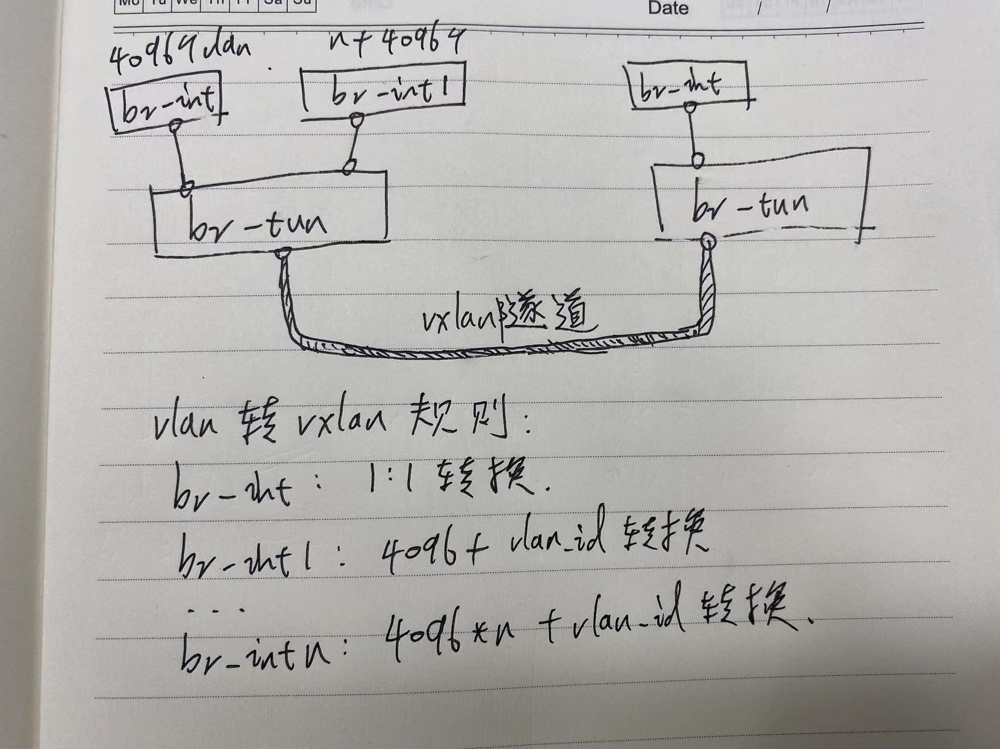
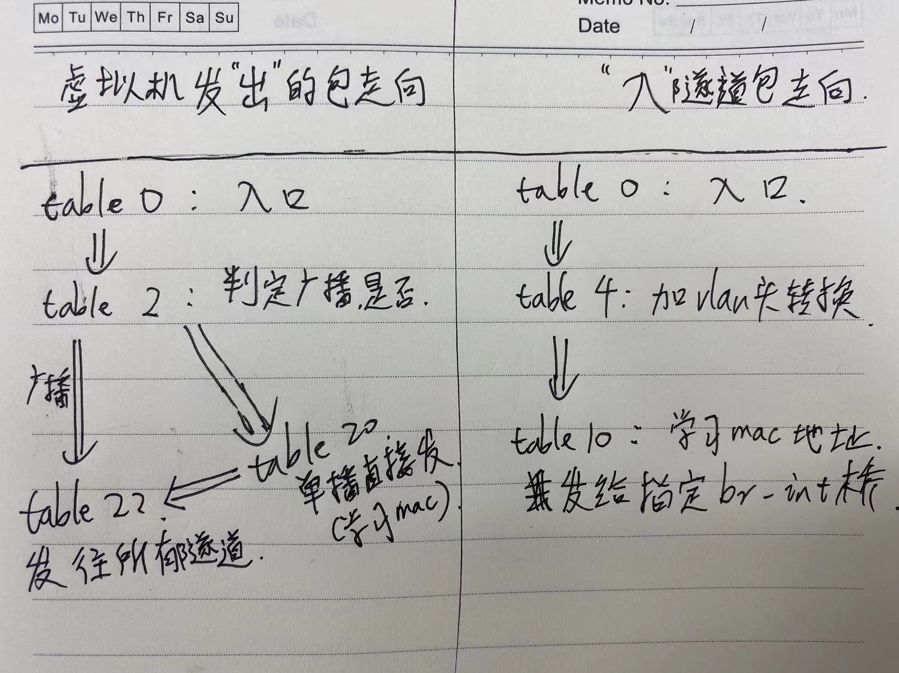

# ovs基于vxlan和vlan转换实现

## 总体架构设计



例如br-int的vlanid 100映射为vxlanid 100, br-int1映射为`4096*n + 100`
=> 或者只建立br-int接口, 记住这个主机上的映射关系 (一个主机上的虚拟机不超过4096个)

## 流表数据包走向



## 测试环境

#### 简单测试环境

测试通过

* 两个主机A, B
* 每个主机上建立桥名称为br-tun, br-int, 并连接两个桥
* 两两建立vxlan隧道接口vxlan-xxx
* 每个主机上加载流表规则
* 每个主机上分别建立伪虚拟机

#### 复杂测试环境

测试通过

* 三个主机A, B, C
* 每个主机上建立桥名称为br-tun, br-int, 并连接两个桥
* 每个主机上加载流表规则
* 每个主机上分别建立伪虚拟机

#### 更复杂的测试环境

测试通过

多个br-int桥的情况, 验证超过4096个vlan 2 vxlan限制

* 三个主机A, B, C
* 每个主机上建立桥名称为br-tun, 再建立br-int, br-int1, 并连接br-tun和其他的桥
* 每个主机上加载流表规则
* 每个主机上分别建立伪虚拟机

## 基础环境

创建全新的的ovs环境
```
# ubuntu 20.04 server类似环境都行
apt install -y openvswitch-common openvswitch-switch
```

## 验证测试

#### 创建桥

在主机A,B上执行
```bash
ovs-vsctl del-br br-int
ovs-vsctl del-br br-tun
ovs-vsctl add-br br-int
ovs-vsctl add-br br-tun -- set Bridge br-tun fail-mode=secure

ovs-vsctl add-port br-int patch-tun -- set interface patch-tun type=patch options:peer=patch-int -- add-port br-tun patch-int -- set interface patch-int type=patch options:peer=patch-tun
```

#### 创建隧道

先开启防火墙放通vxlan端口(所有主机上执行)
```
firewall-cmd --zone=public --add-port=4789/udp
```

在主机A, 31上执行
```
ovs-vsctl add-port br-tun vxlan-32 -- set interface vxlan-32 type=vxlan options:remote_ip=10.90.3.32 option:in_key=flow option:out_key=flow option:df_default="true"
```

在主机B, 212上执行
```
ovs-vsctl add-port br-tun vxlan-31 -- set interface vxlan-31 type=vxlan options:remote_ip=10.90.3.31 option:in_key=flow option:out_key=flow option:df_default="true"
```

## 配置流表

假设映射br-int桥的vlan 3到br-tun的vxlan 3

使用命令配置流表:
```
ovs-ofctl add-flows br-tun vxlan.flow
```

vxlan.flow 文件内容如下:
(其中patch-int=1, vxlan-xxx=2)
```
# 虚拟机发出来的包, patch-int, port=1
table=0,priority=1,in_port=1 actions=resubmit(,2)
# 隧道口发出来的包, vxlan-xxx, port=2
table=0,priority=1,in_port=2 actions=resubmit(,4)
table=0,priority=0 actions=drop

# 虚拟机发的单播包，扔给表 20 处理；
table=2,priority=0,dl_dst=00:00:00:00:00:00/01:00:00:00:00:00 actions=resubmit(,20)
# 多播和广播包，扔给表 22 处理。
table=2,priority=0,dl_dst=01:00:00:00:00:00/01:00:00:00:00:00 actions=resubmit(,22)

# 匹配给定的 tunnel 号，添加对应的 vlan 号，扔给表 10 去学习一下后扔到 br-int 网桥。
table=4,priority=1,tun_id=0x3 actions=mod_vlan_vid:3,resubmit(,10)
table=4,priority=0 actions=drop

# 主要作用是学习外部（从 tunnel）进来的包，往表 20 中添加对返程包的正常转发规则，并且从 patch-int 扔给 br-int。
table=10,priority=1 actions=learn(table=20,priority=1,NXM_OF_VLAN_TCI[0..11],NXM_OF_ETH_DST[]=NXM_OF_ETH_SRC[],load:0->NXM_OF_VLAN_TCI[],load:NXM_NX_TUN_ID[]->NXM_NX_TUN_ID[],output:OXM_OF_IN_PORT[]),output:1

# 根据mac地址能够学习出一个表
#  table=20,priority=1,vlan_tci=0x0001/0x0fff,dl_dst=fa:16:3e:83:95:fa actions=load:0->NXM_OF_VLAN_TCI[],load:0x3e9->NXM_NX_TUN_ID[],output:2
# 对与没有学习到mac地址的数据包, 则扔给talbe=22处理
table=20,priority=0 actions=resubmit(,22)

# 剥掉vlan=3, 打上vxlan=0x3, 扔到隧道中vxlan-xxx
table=22, priority=1,dl_vlan=3 actions=strip_vlan,load:0x3->NXM_NX_TUN_ID[],output:2
table=22, priority=0 actions=drop
```

* 每添加一个隧道接口, 就需要添加修改上述相关流表
* 每添加一个虚拟机接口，也需要添加相关流表

虚拟机发包流程: (通过br-int桥往br-tun上发送数据)
table 0 -> table 2 -> table 22 (此时会发包给隧道对端的虚拟机)
(table 2中, 单播包扔给表 20 处理, 可能匹配到学习生成的流表规则, 直接发送指定隧道)

虚拟机收包流程:
table 0 -> table 4 -> table 10 (此时就直接发送给虚拟机的桥br-int了)

总结:
* 主要有一个mac地址, vlan, vxlan等学习的流表, 可以自动生成流表规则
* xxx

#### 新增伪虚拟机接口

创建vlan=3的伪虚拟机接口

在一台主机上建立vm1
```bash
ip netns add vm1
ovs-vsctl add-port br-int vm1 -- set interface vm1 type=internal
ovs-vsctl set port vm1 tag=3
ip link set vm1 netns vm1
ip netns exec vm1 ip link set vm1 address 02:ac:10:ff:00:11
ip netns exec vm1 ip addr add 172.16.255.11/24 dev vm1
ip netns exec vm1 ip link set vm1 up
```

再在另外一台主机建立vm2, 参数类似
```
ip netns add vm2
ovs-vsctl add-port br-int vm2 -- set interface vm2 type=internal
ovs-vsctl set port vm2 tag=3
ip link set vm2 netns vm2
ip netns exec vm2 ip link set vm2 address 02:ac:10:ff:00:22
ip netns exec vm2 ip addr add 172.16.255.22/24 dev vm2
ip netns exec vm2 ip link set vm2 up
```

在vm1上尝试ping vm2
```
ip netns exec vm1 ping 172.16.255.22
```

#### 监控流表

创建脚本文件 ovs-dump.sh
```
ovs-ofctl dump-flows br-tun | awk '{print $3,$4,$7,$8}'
```

然后使用watch监控
```
watch -d -n 1 bash ovs-dump.sh
```

## 复杂场景改动点

#### 新增一个隧道

新增隧道入口流表
```
table=0,priority=1,in_port=3 actions=resubmit(,4)
```

修改隧道出口流表
```
table=22, priority=1,dl_vlan=3 actions=strip_vlan,load:0x3->NXM_NX_TUN_ID[],output:2,output:3
```

#### 新增一个虚拟机桥br-int1

新建一个br-int1桥, 与br-tun连接
```
ovs-vsctl add-br br-int1
ovs-vsctl add-port br-int1 patch-tun1 -- set interface patch-tun1 type=patch options:peer=patch-int1 -- add-port br-tun patch-int1 -- set interface patch-int1 type=patch options:peer=patch-tun1
```

新增reg5存储br-int1之前的id差别
```
# br-int1发出来的包
table=0,priority=1,in_port=2 actions=load:0x2->NXM_NX_REG5[],resubmit(,2)
```

新增br-int1的入口流标规则
```
table=0,priority=1,in_port=4 actions=resubmit(,4)
```

新增隧道id转换为vlanid的规则
```
# 这里新增存储将要发给哪一个宿主机桥
table=4,priority=1,tun_id=0x3 actions=mod_vlan_vid:3,load:0x1->NXM_NX_REG5[],resubmit(,10)
table=4,priority=1,tun_id=0x13 actions=mod_vlan_vid:3,load:0x2->NXM_NX_REG5[],resubmit(,10)
```

新增流表学习规则
```
# 新增一条table 10, 根据reg5，下发到不同的br-int1上去
table=10,priority=1,reg5=0x2 actions=learn(table=20,priority=1,NXM_OF_VLAN_TCI[0..11],NXM_OF_ETH_DST[]=NXM_OF_ETH_SRC[],load:0->NXM_OF_VLAN_TCI[],load:NXM_NX_TUN_ID[]->NXM_NX_TUN_ID[],output:OXM_OF_IN_PORT[]),output:2
```

新增vlan 2 vxlan转换规则
```
# 不同br-int桥上过来的数据包, 虽然vlan相同, 但是转换为不同的vxlanid
table=22, priority=1,dl_vlan=3,reg5=0x1 actions=strip_vlan,load:0x3->NXM_NX_TUN_ID[],output:2,output:3
```

#### 复杂场景最终流表规则

```
# 虚拟机发出来的包, patch-int, port=1
table=0,priority=1,in_port=1 actions=load:0x1->NXM_NX_REG5[],resubmit(,2)
# br-int1发出来的包
table=0,priority=1,in_port=2 actions=load:0x2->NXM_NX_REG5[],resubmit(,2)
# 隧道口发出来的包, vxlan-xxx, port=2
table=0,priority=1,in_port=3 actions=resubmit(,4)
table=0,priority=1,in_port=4 actions=resubmit(,4)
table=0,priority=0 actions=drop

# 虚拟机发的单播包，扔给表 20 处理；
table=2,priority=0,dl_dst=00:00:00:00:00:00/01:00:00:00:00:00 actions=resubmit(,20)
# 多播和广播包，扔给表 22 处理。
table=2,priority=0,dl_dst=01:00:00:00:00:00/01:00:00:00:00:00 actions=resubmit(,22)

# 匹配给定的 tunnel 号，添加对应的 vlan 号，扔给表 10 去学习一下后扔到 br-int 网桥。
# 这里新增存储将要发给哪一个宿主机桥
table=4,priority=1,tun_id=0x3 actions=mod_vlan_vid:3,load:0x1->NXM_NX_REG5[],resubmit(,10)
table=4,priority=1,tun_id=0x13 actions=mod_vlan_vid:3,load:0x2->NXM_NX_REG5[],resubmit(,10)
table=4,priority=0 actions=drop

# 主要作用是学习外部（从 tunnel）进来的包，往表 20 中添加对返程包的正常转发规则，并且从 patch-int 扔给 br-int。
table=10,priority=1,reg5=0x1 actions=learn(table=20,priority=1,NXM_OF_VLAN_TCI[0..11],NXM_OF_ETH_DST[]=NXM_OF_ETH_SRC[],load:0->NXM_OF_VLAN_TCI[],load:NXM_NX_TUN_ID[]->NXM_NX_TUN_ID[],output:OXM_OF_IN_PORT[]),output:1
# 新增一条table 10, 根据reg5，下发到不同的br-int1上去
table=10,priority=1,reg5=0x2 actions=learn(table=20,priority=1,NXM_OF_VLAN_TCI[0..11],NXM_OF_ETH_DST[]=NXM_OF_ETH_SRC[],load:0->NXM_OF_VLAN_TCI[],load:NXM_NX_TUN_ID[]->NXM_NX_TUN_ID[],output:OXM_OF_IN_PORT[]),output:2
# 根据mac地址能够学习出一个表: mac地址相同怎么办? 暂无这种情况吧???!!! 有可以再把reg5加上!!!
#  table=20,priority=1,vlan_tci=0x0003/0x0fff,dl_dst=02:ac:10:ff:00:55 actions=load:0->NXM_OF_VLAN_TCI[],load:0x3->NXM_NX_TUN_ID[],output:"vxlan-158"
#  table=20,priority=1,vlan_tci=0x0003/0x0fff,dl_dst=02:ac:10:ff:00:66 actions=load:0->NXM_OF_VLAN_TCI[],load:0x13->NXM_NX_TUN_ID[],output:"vxlan-158"
#
# 对与没有学习到mac地址的数据包, 则扔给talbe=22处理
table=20,priority=0 actions=resubmit(,22)

# 剥掉vlan=3, 打上vxlan=0x3, 扔到隧道中vxlan-xxx
# 不同br-int桥上过来的数据包, 虽然vlan相同, 但是转换为不同的vxlanid
table=22, priority=1,dl_vlan=3,reg5=0x1 actions=strip_vlan,load:0x3->NXM_NX_TUN_ID[],output:2,output:3
table=22, priority=1,dl_vlan=3,reg5=0x2 actions=strip_vlan,load:0x13->NXM_NX_TUN_ID[],output:2,output:3
table=22, priority=0 actions=drop
```

## FAQ

#### 遇到宿主机A上br-int上两个不同的虚拟机, arping居然收到两个回包

```
[ssh_10.90.2.211] root@node1: xiaoyun-vxlan-vlan-test$ip netns exec vm1 arping  -c 1 172.16.255.22
ARPING 172.16.255.22 from 172.16.255.11 vm1
Unicast reply from 172.16.255.22 [02:AC:10:FF:00:22]  0.562ms
Unicast reply from 172.16.255.22 [02:AC:10:FF:00:22]  0.661ms
Sent 1 probes (1 broadcast(s))
Received 2 response(s)
```

=> 原来是ip,mac地址冲突,B主机2.212上也有vm2, 测试环境自己弄混的

## 参考文档

* [深入理解 Neutron -- OpenStack 网络实现 - br-tun](https://cntofu.com/book/77/vxlan_mode/compute_node/br-tun.md)
