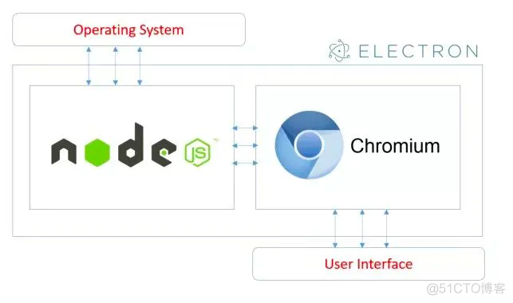

# BS转换CS架构研究

关键字《BS改为CS》

[腾讯qq是用什么架构开发的?是cs还是cs+bs?](https://ask.zol.com.cn/x/6468811.html)

腾讯qq聊天软件，主体仍然是cs架构，但是已经被改良，很多界面使用了bs结构。
最明显的设计，qq的主体程序exe已经被彻底模块化，老版本的qq主程序高达二三十MB，是标准的cs结构。当前，qq主程序变成了一个框架，只有几百KB，她调用其他模块的dll和腾讯自己研发的链接文件，这些文件就是界面了。

很多模块，因为使用了bs结构，就算程序在运行，也可以更新。说白了，一些个界面就是个浏览器
比如：查询界面，腾讯新闻，文件按钮，这些很明显都是BS网页结构。而且是腾讯自己开发的TCP/IP架构协议。其中一定集成了js，html。

=> 关键就是是BS网页结构，用得却是自己开发的TCP/IP架构协议!!!


[Electron是什么？](https://www.electronjs.org/zh/docs/latest/)
Electron是一个使用 JavaScript、HTML 和 CSS 构建桌面应用程序的框架。 嵌入 Chromium 和 Node.js 到 二进制的 Electron 允许您保持一个 JavaScript 代码代码库并创建 在Windows上运行的跨平台应用 macOS和Linux——不需要本地开发 经验。

https://github.com/electron/electron


OpenPitrix是一个web-basedopen-source系统，用于打包、部署和管理不同类型的应用程序，包括Kubernetes应用程序、微服务应用程序和无服务器应用程序到多个云环境中，如AWS、Azure、Kubernetes、青云、OpenStack、VMWare等。


[bs架构和cs架构的比对方法 cs架构嵌入BS](https://cloud.tencent.com/developer/article/2150724)

C/S架构 优点：
 
- 能充分发挥客户端PC的处理能力，很多工作可以在客户端处理后再提交给服务器，所以CS客户端响应速度快。
- 操作界面漂亮、形式多样，可以充分满足客户自身的个性化要求。  
- C/S结构的管理信息系统具有较强的事务处理能力，能实现复杂的业务流程。
- 安全性能可以很容易保证，C/S一般面向相对固定的用户群，程序更加注重流程，它可以对权限进行多层次校验，提供了更安全的存取模式，对信息安全的控制能力很强。一般高度机密的信息系统采用C/S结构适宜。

  小结：CS响应速度快，安全性强，一般应用于局域网中，但是开发维护成本高；BS可以实现跨平台，客户端零维护，但是个性化能力低，响应速度较慢。所以有些单位日常办公应用BS，在实际生产中使用CS结构。

#### nodejs开发 客户端程序

现在k8s的dashboard console程序, 很多都是由nodejs开发的，能否转为客户端程序?

关键字《nodejs开发 客户端程序》


[十年架构重构，为多端统一，QQ选用了Electron](https://cloud.tencent.com/developer/news/1064605)

关键字《nodejs web程序转electron 程序》

[2.7 万 Star！这个开源工具把网页变成本地应用程序](https://cloud.tencent.com/developer/news/841476)

Nativefier 是一个命令行工具，可以以最少的配置轻松地为任何网站创建桌面应用程序，把 Web 页面变成本地应用的命令行工具。通过 Electron + Chromium 把网站包装成本地 .app、.exe 等可执行文件，支持运行在 Windows、macOS 和 Linux 操作系统上。

=> 就是封装一个浏览器吧?


[把网页变成软件是怎么实现的？](https://www.yimenapp.com/kb-yimen/23934/)

1. 使用 Electron

Electron 是一个开源的框架，可以将 Web 应用程序转换为桌面应用程序。它使用 Chromium 渲染引擎来显示 Web 内容，并使用 Node.js 运行时环境来访问本地系统资源。使用 Electron，可以将任何基于 Web 技术的应用程序打包成可在 Windows、Mac 和 Linux 上运行的桌面应用程序。

2. 使用 NW.js

NW.js（原名 node-webkit）是一个类似 Electron 的框架，可以将 Web 应用程序转换为桌面应用程序。它也使用 Chromium 渲染引擎和 Node.js 运行时环境。使用 NW.js，可以将任何基于 Web 技术的应用程序打包成可在 Windows、Mac 和 Linux 上运行的桌面应用程序。

https://github.com/kairyou/create-desktop-app-with-nodejs
=> 9年前的代码。。。

- atom-shell
  cd atom-shell start app: ./app.sh test-app -s build app: ./app.sh test-app -b

- node-webkit
  cd node-webkit start app: ./app.sh test-app -s build app: ./app.sh test-app -b

[用node-webkit开发多平台的桌面客户端](https://www.baidufe.com/item/1fd388d6246c29c1368c.html)

三、node-webkit的基本工作原理是怎样的？
webkit提供DOM操作，包括HTML解析、CSS渲染、Javascript解释执行、DOM事件处理等。而node.js则提供一些本地化的操作、服务器端的处理等。二者的上下文完全融合，实现一个较为完美的本地应用环境。

[用JS开发跨平台桌面应用，从原理到实践](https://juejin.cn/post/6844903862302670862)
本文所有实例代码均在我的github electron-react上，结合代码阅读文章效果更佳。另外electron-react还可作为使用Electron + React + Mobx + Webpack技术栈的脚手架工程。
=> 文章挺长的!
2.3 谁在用Electron

现在市面上已经有非常多的应用在使用Electron进行开发了，包括我们熟悉的VS Code客户端、GitHub客户端、Atom客户端等等。印象很深的，去年迅雷在发布迅雷X10.1时的文案：

https://xhl.me/archives/create-desktop-app-with-nodejs/
[使用nodejs开发桌面客户端应用](https://www.kancloud.cn/a173512/node/2160978)
这里主要针对node-webkit和atom-shell, nodejs下开发桌面应用也有其他可以选择(大体都是基于Chromium + nodejs), 主要这两个相对比较流行, 源码也一直保持更新. 目前node-webkit文档/例子可能多一些, atom-shell相对少一些.

- node-webkit入口是html, atom-shell入口是JS;
- node-webkit功能相对多一些, 两者都可以把代码打包(一个是.nw,一个是.asar)放到应用里面;
- 即使自己写了几KB的代码, 但最终生成的程序都至少几十MB, node-webkit生成的应用比atom-shell相对小一些;
- 他们一些概念比较类似(可能方法不同), 熟悉一个后, 对熟悉另一个应该是有帮助的;

https://cloud.tencent.com/developer/article/1438806?from=15425
electron

### 验证nodejs使用Electron

[使用electron将html转为pc版桌面应用程序 原创](https://blog.51cto.com/u_15475233/4884181)

https://blog.csdn.net/LongtengGensSupreme/article/details/120899799
=> 这个更简单，直接使用nodejs访问在线网站...

[【Electron】使用Electron将web项目打包成桌面应用程序](https://blog.csdn.net/weixin_43853746/article/details/119731411)

[（笔记）把你的网页变成桌面程序：Electron 使用教程](https://zhuanlan.zhihu.com/p/25505451)

#### 官方入门

https://github.com/electron/electron
```
git clone https://github.com/electron/electron-quick-start
cd electron-quick-start
npm install
npm start
```

#### 下载nodejs

https://nodejs.org/en/download

在ubuntu20.04下，使用下载的最新node v18.17.0安装electron有问题，使用apt包的node可以
```
sudo apt install -y npm # nodejs版本为: v10.19.0
```

huck!!!!
```
Electron Packager requires Node >= 14.17.5.
```

#### electron 下载慢

谷歌一把

```
npm config set registry https://registry.npm.taobao.org
export ELECTRON_MIRROR=http://npm.taobao.org/mirrors/electron/
```

#### 三、html转pc桌面应用程序

3.初始化nodejs项目。
```
npm init
```

安装Electron
```
npm install --save-dev electron
```

11.再安装electron-packager。
```
npm install electron-packager --save-dev
```

64位打包指令：
```
electron-packager . 测试 --win --out 测试 --arch=x64 --app--version 1.4.0 --overwrite --ignore=node_modules
```

17.以上工作做好后，再回到命令行输入 npm run [刚刚配置的打包指令] 进行打包。
```
npm run package
```
打包成功后，可以在项目的根目录中找到打包好的应用程序。

## electron

### electron原理架构

[(好)如何利用 Electron 把网页变成桌面程序 原创](https://blog.51cto.com/wpbars/2956033)
=> 将了一点点架构原理



[Electron入门及原理浅析](https://juejin.cn/post/7029590294647537671)

[(好)从 Electron 架构出发，深究 Electron 跨端原理 | 多图详解](https://juejin.cn/post/7103337772424888356)

### 官方文档

https://www.electronjs.org/zh/docs/latest/tutorial/tutorial-first-app

### electron 开源项目

[推荐12个开源的跨平台桌面项目](https://www.51cto.com/article/719528.html)

lx-music-desktop 是一个基于 Electron 17 + Vue 3 的音乐软件。其支持在Windows、Mac OS、Linux、Android 平台上运行。
https://github.com/lyswhut/lx-music-desktop
=> TODO: 尝试编译运行

https://blog.csdn.net/qq_38463737/article/details/121513264

Electron API 演示(中文版)
感觉是纯electron的项目，没有使用第三方框架: https://github.com/demopark/electron-api-demos-Zh_CN

## FAQ

#### 链接失败

使用node14可以验证electron的示例

```
/opt/stack/electron-quick-start/node_modules/electron/dist/electron: error while loading shared libraries: libatk-1.0.so.0: cannot open shared object file: No such file or directory
sudo apt install -y libatk1.0-0
```

```
/opt/stack/electron-quick-start/node_modules/electron/dist/electron: error while loading shared libraries: libatk-bridge-2.0.so.0: cannot open shared object file: No such file or directory
sudo apt install -y libatk-bridge2.0-0
```

```
/opt/stack/electron-quick-start/node_modules/electron/dist/electron: error while loading shared libraries: libcups.so.2: cannot open shared object file: No such file or directory
sudo apt install -y libcups2
```

```
/opt/stack/electron-quick-start/node_modules/electron/dist/electron: error while loading shared libraries: libgtk-3.so.0: cannot open shared object file: No such file or directory
sudo apt install -y libgtk-3-0
```
