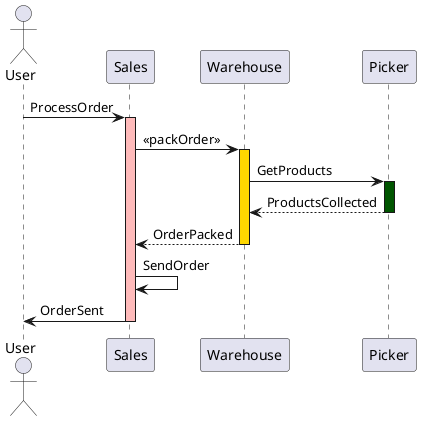

# graph画图使用

关键字:

- graphviz
- digraph
- plantuml
- draw.io
- vscode

## graphviz代码画图

目的: 画流程图

### 入门示例

关键字《graphviz online》

https://dreampuf.github.io/GraphvizOnline/
https://obren.io/tools/graphviz/
https://sketchviz.com/new

例如如下可以轻松画一个流程图
```
digraph abc {
	a -> b;
	b -> c;
	b -> d;
}
```


### graphviz api

https://quickchart.io/documentation/graphviz-api/

[graphviz的基本语法及使用](https://blog.51cto.com/mouday/3048315)

https://blog.csdn.net/mouday/article/details/80902992
基本语法
- 字符串 都要加双引号, 可以加\n换行符
- 注释 双斜杠// 或/* */
- 有向图 digraph， 节点关系: 指向->
- 无向图 graph, 节点关系: 连通 --
- 属性 node[attribute1=value1, attribute2=value2]
- 大小： size=”2,2”; 单位为英寸
- 标签： label=”显示在图上的内容”
- 边：edge [color=red,style=dotted]; 这句话之后生效
- 节点：node [color=navy]; 这句话之后生效
- 边方向：rankdir=参数值；LR（从左到右），RL，BT，TB
- 节点形状： a[shape=box]; 默认是椭圆
- 边框大小：a[width=.1,height=2.5]; 单位为英寸
- 边框颜色：a[color=red];

### VSCode预览插件

https://www.cnblogs.com/shuqin/p/11897207.html
- 在官网下载graphviz安装包
- 安装 vscode 插件 Graphviz Preview
- 在 settings.json 中添加 "graphvizPreview.dotPath": "graphviz_path\graphviz-2.38\\release\\bin\\dot.exe", graphviz_path 为所在路径，这些修改一下既可
- 新建一个 dot 文件，右上角就会有预览生成的按钮了

https://www.coonote.com/python-note/python-graphviz-instance.html
VSCode Graphviz Preview 插件

关键字《vscode graphviz markdown preview enhanced》
https://marketplace.visualstudio.com/items?itemName=geeklearningio.graphviz-markdown-preview
=> (好)就用这个!
```
ext install geeklearningio.graphviz-markdown-preview
```

https://github.com/shd101wyy/markdown-preview-enhanced/blob/master/docs/diagrams.md
=> 原来VSCode 的markdown enhanced preview支持这么多代码生成图片
Markdown Preview Enhanced supports rendering flow charts, sequence diagrams, mermaid, PlantUML, WaveDrom, GraphViz, Vega & Vega-lite, Ditaa diagrams. You can also render TikZ, Python Matplotlib, Plotly and all sorts of other graphs and diagrams by using Code Chunk.

### 其他

https://www.cnblogs.com/shuqin/p/11897207.html
- TCP IP 状态流程图
- epoll 相关数据结构及关系

[(好)Graphviz简要语法](https://leojhonsong.github.io/zh-CN/2020/03/12/Graphviz%E7%AE%80%E8%A6%81%E8%AF%AD%E6%B3%95/)
VSC的dot语言支持插件
我最喜欢的画graphviz图的工具是VSC里的Graphviz(dot)语言支持插件, 是的它只支持dot布局. 虽然也可以用graph来声明顶层图, 但绘制出来的仍然是有向图, 不过无伤大雅, 我基本只画dot布局的图.

[Graphviz 画图工具和 dot 语言](https://jeanhwea.github.io/article/drawing-graphs-with-dot.html)
https://qrsforever.github.io/2019/07/24/Tutorial/graphviz/

### 问题

- graphviz中文支持?
- graphviz不能手动布局

## plantuml代码画图

目的: 画时序图, 对象图等

https://www.freecodecamp.org/news/inserting-uml-in-markdown-using-vscode/

### 入门示例

时序图, UML sequence diagram
```
@startuml
actor User
User -> Sales: ProcessOrder
  activate Sales #FFBBBB
  Sales -> Warehouse: << packOrder >>
    activate Warehouse #gold
    Warehouse -> Picker: GetProducts
      activate Picker #005500
      Picker --> Warehouse: ProductsCollected
      deactivate Picker
    Warehouse --> Sales: OrderPacked
    deactivate Warehouse
  Sales -> Sales: SendOrder
  Sales -> User: OrderSent
  deactivate Sales
@enduml
```



## draw.io手动画图

目的: 画组件图等

SoftWare -> Component

## 旧的资料

#### 程序员画图工具

https://zhuanlan.zhihu.com/p/353333743
推荐这个软件draw.io

https://www.51cto.com/article/721130.html
有不少软件推荐

https://codeantenna.com/a/GBE0ahio6i
plantuml, graphviz等特殊工具推荐

https://www.sohu.com/a/452197561_100093134
不止VS Code：程序员高效工作的画图工具一览 

https://github.com/phodal/articles/issues/18
