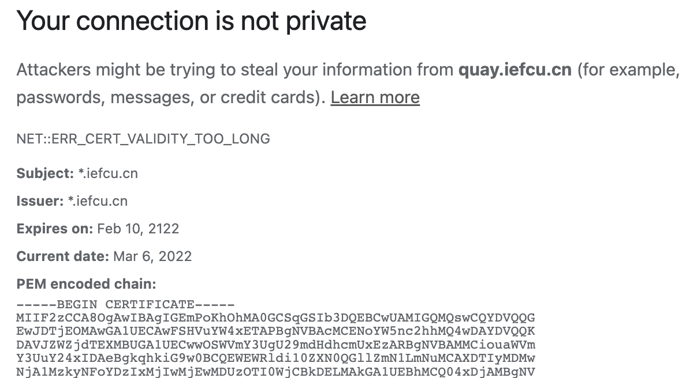

# openssl加解密

## 创建自信任证书

### gen-tlsv3-san-ca脚本一键创建自信任证书

https://github.com/ljq/gen-tlsv3-san-ca

修改证书生成配置文件
```
diff --git a/custom.cnf b/custom.cnf
index 3c6d2e5..163fe29 100644
--- a/custom.cnf
+++ b/custom.cnf
@@ -4,13 +4,13 @@

 [CNF]
 # wildcard doamin name
-DOMAIN_NAME="*.wdft.com"
+DOMAIN_NAME="*.iefcu.cn"

 # Browser security policy changes(By a date: 2021-03-11):
 # 1.Security Changes in Chrome 58: Common Name Support Dropped. Using SAN instead.
 # 2.Chrome certificates are limited to a maximum of 398 days.
 # The valid 398 days(The days range must be less than or equal to 398 days)
-VALID_DAYS=398
+VALID_DAYS=36500

 # TLS files generate default current path:
 SAN_TLS_PATH="tls-ca"
@@ -23,7 +23,7 @@ SAN_TLS_PATH="tls-ca"
 # OU => Organization Unit Name

 SUBJECT.C=CN
-SUBJECT.ST=Shanghai
-SUBJECT.L=Shanghai
-SUBJECT.O=Localhost
-SUBJECT.OU=IT-Dev-Test
+SUBJECT.ST=Hunan
+SUBJECT.L=Changsha
+SUBJECT.O=Iefcu
+SUBJECT.OU=Iefcu Software
```

创建证书
```
gen-tlsv3-san-ca.sh
```

创建好的示例证书文件结构
```
├── custom.cnf              # Script custom configuration file
├── tls-ca                  # Self-signed certificate generation directory
│ ├── vhost_wdft.com.conf   # Nginx vhost demo
│ ├── wdft.com_ca.crt       # Client root certificate (import or install,add trust)
│ ├── wdft.com.crt          # Server key pair (.crt)
│ ├── wdft.com.key          # Server key pair private key (.key)
│ └── wdft.com.pem          # Server key pair (.pem)
│
├── tls-ca-process          # Process file, used for backup and diagnosis
│ └── 2021-03-13
│ ├── ca.crt
│ ├── ca.key
│ ├── server.crt
│ ├── server.csr
│ └── server.key
│
├── gen-tlsv3-san-ca.sh      # SAN: This file is automatically generated for the first time
└── san.cnf
```

### 旧的创建方法

已经落伍，新版tlsv3认证协议会认为这种证书不安全了！

TODO: 参考xxx

```
# 生成私钥(只生成私钥的用法...)
openssl genrsa -out ssl.key 1024

# 生成证书，最好使用通配符 (生成了新的ssl.key, 以及100年证书)
openssl req \
  -newkey rsa:2048 -nodes -keyout ssl.key \
  -x509 -days 36500 -out ssl.cert -subj \
  "/C=CN/ST=Wuhan/L=Wuhan/O=WPS/OU=WPS/CN=*.openshift4.example.com"
```

部分参数解释：
* -nodes 表示不加密密钥？
* -days 36500 表示证书过期时间为100年
* -subj 表示证书subject信息

### 创建SAN自信任证书

关键字《gen self-signed san cert》
How to Create a Self-Signed SAN Certificate Using OpenSSL on Citrix ADC Appliance
https://support.citrix.com/article/CTX135602

通过关键字＜podman add self-signed certificate＞
搜索到了redhat quay的官方文档，配置ｓｓｌ证书的方法，非常不错．
https://access.redhat.com/documentation/en-us/red_hat_quay/3/html/manage_red_hat_quay/using-ssl-to-protect-quay


#### 1. Create a Certificate Authority

```bash
# 1. Generate the root CA key:
openssl genrsa -out rootCA.key 2048
# 2. Generate the root CA cert:
openssl req -x509 -new -nodes -key rootCA.key -sha256 -days 1024 -out rootCA.pem
# 3. Enter the information that will be incorporated into your certificate request, including the server hostname, for example:
Country Name (2 letter code) [XX]:IE
State or Province Name (full name) []:GALWAY
Locality Name (eg, city) [Default City]:GALWAY
Organization Name (eg, company) [Default Company Ltd]:QUAY
Organizational Unit Name (eg, section) []:DOCS
Common Name (eg, your name or your server's hostname) []:quay-server.example.com
```

#### 2. Sign a certificate

```bash
# 1. Generate the server key:
$ openssl genrsa -out ssl.key 2048
# 2. Generate a signing request:
$ openssl req -new -key ssl.key -out ssl.csr
# 3. Enter the information that will be incorporated into your certificate request, including the server hostname, for example:
Country Name (2 letter code) [XX]:IE
State or Province Name (full name) []:GALWAY
Locality Name (eg, city) [Default City]:GALWAY
Organization Name (eg, company) [Default Company Ltd]:QUAY
Organizational Unit Name (eg, section) []:DOCS
Common Name (eg, your name or your server's hostname) []:quay-server.example.com

# 4.Create a configuration file openssl.cnf, specifying the server hostname, for example:

openssl.cnf
[req]
req_extensions = v3_req
distinguished_name = req_distinguished_name
[req_distinguished_name]
[ v3_req ]
basicConstraints = CA:FALSE
keyUsage = nonRepudiation, digitalSignature, keyEncipherment
subjectAltName = @alt_names
[alt_names]
DNS.1 = quay-server.example.com
IP.1 = 192.168.1.112

# 5. Use the configuration file to generate the certificate ssl.cert:
$ openssl x509 -req -in ssl.csr -CA rootCA.pem -CAkey rootCA.key -CAcreateserial -out ssl.cert -days 356 -extensions v3_req -extfile openssl.cnf
```

额外使用其他工具创建证书
* 参考 https://github.com/ljq/gen-tlsv3-san-ca 使用脚本一键创建证书
    验证可以的！
* 发现一个新的制作证书的工具: https://github.com/FiloSottile/mkcert

## openssl查看在线网站证书

```bash
openssl s_client -showcerts -connect 10.90.2.94:2379

openssl s_client -showcerts -connect www.baidu.com:443
```

## openssl概念

不同后缀文件列表:
* ssl.key
    私钥，加密方式有RSA等
* ssl.cert
    证书文件，通常文件内容以如下内容开头:
    -----BEGIN CERTIFICATE-----
* ca.crt
    认证机构证书
* ca.pem
    认证机构证书，格式略微不一样
* *.der
    另外一种证书格式, TODO：干嘛用的
* 等等

nginx配置https需要的证书文件, *.key, *.cert


## openssl命令用法

查看证书信息，获取证书的如下信息:
* 证书subject信息，例如Country, State, Location, Common Name等
* 证书有效期 
* 证书颁发者信息
* 证书X509v3扩展信息: **SAN信息**

```bash
openssl x509 -text -in server.crt

Certificate:
    Data:
        Version: 3 (0x2)
        Serial Number: 20220305224129 (0x1263e81c31c1)
    Signature Algorithm: sha256WithRSAEncryption
        Issuer: C=CN, ST=Shanghai, L=Shanghai, O=Localhost, OU=IT-Dev-Test, CN=*.wdft.com/emailAddress=dev-test@wdft.com
        Validity
            Not Before: Mar  5 14:41:30 2022 GMT
            Not After : Apr  7 14:41:30 2023 GMT
        Subject: C=CN, ST=Shanghai, L=Shanghai, O=Localhost, OU=IT-Dev-Test, CN=*.wdft.com/emailAddress=dev-test@wdft.com
        Subject Public Key Info:
            Public Key Algorithm: rsaEncryption
                Public-Key: (4096 bit)
                ...
        X509v3 extensions:
            X509v3 Basic Constraints:
                CA:FALSE
            X509v3 Key Usage:
                Digital Signature, Non Repudiation, Key Encipherment
            X509v3 Subject Alternative Name:
                DNS:*.wdft.com, IP Address:127.0.0.1
    Signature Algorithm: sha256WithRSAEncryption
        ...
```

### 其他零碎（待整理）

#### 使用openssl进行aes256和base64加解密

参考 https://wiki.openssl.org/index.php/Enc
```
# enc
openssl enc -aes256 -base64 -in remap.config -out remap.config.enc
# dec
openssl enc -d -aes256 -base64 -in remap.config.enc -out remap.config.dec
```

参考 https://eclipsesource.com/blogs/2017/01/17/tutorial-aes-encryption-and-decryption-with-openssl/
```bash
# enc
openssl enc -aes-256-cbc -in plain.txt -base64 -md sha1
# dec
openssl enc -d -aes-256-cbc -in plain.txt.dec -base64 -md sha1

# enc only with aes (using sha1 key)
openssl enc -aes-256-cbc -in plain.txt -md sha1 -out plain.txt.enc
# dec only with aes (using sha1 key)
openssl enc -d -aes-256-cbc -in plain.txt.enc -md sha1 -out plain.txt.dec
```

#### Create a DER-encoded certificate to import into users' browsers

```bash
openssl x509 -in myCA.key -outform DER -out myCA.der
```

#### 查看PEM编码证书

```bash
openssl x509 -in cert.der -inform der -text -noout
```

#### curl信任证书

```bash
# curl-config --ca
# /etc/pki/tls/certs/ca-bundle.crt
```

### 转换证书格式

#### PEM到DER

```bash
openssl x509 -in cert.crt -outform der-out cert.der
```

#### DER到PEM

```bash
openssl x509 -in cert.crt -inform der -outform pem -out cert.pem
```

#### 签名

```
openssl list --digest-commands
openssl dgst -sha512 xxx.file
openssl dgst -md5 xxx.file
```

## 其他资料

[如何安装和信任自签名证书](https://kompost.cn/posts/install-and-trust-self-signed-cert/)
根证书存储的位置

- Debian/Ubuntu/Gentoo	/etc/ssl/certs/ca-certificates.crt
- Fedora/CentOS/RHEL 7.x	/etc/pki/ca-trust/extracted/pem/tls-ca-bundle.pem
- Fedora/CentOS/RHEL 6.x	/etc/pki/tls/certs/ca-bundle.crt
- Alpine Linux <=3.11	/etc/ssl/cert.pem
- Alpine Linux >=3.12	/etc/ssl/certs/ca-certificates.crt (/etc/ssl/cert.pem 是符号链接)
- OpenSUSE/SLES	/var/lib/ca-certificates/ca-bundle.pem /etc/ssl/ca-bundle.pem
- Java 环境有特定的可信根证书存储，不同版本也存在一些区别。但都通过 keytool 来管理。
- NodeJS 官方建议使用环境变量 NODE_EXTRA_CA_CERTS 来指定额外的根证书。
- Firefox 浏览器有自己的可信根证书列表

#### 生成rsa密钥对

关键字《openssl 使用rsa密钥加解密》

https://blog.csdn.net/qq_33417509/article/details/109641958

```
生成私钥：openssl genrsa -out rsaprivatekey.pem 1024
          openssl genrsa -out test.key 1024
生成公钥：openssl rsa -in rsaprivatekey.pem -out rsapublickey.pem -pubout
          openssl rsa -in test.key -pubout -out test_pub.key
转换格式：openssl pkcs8 -topk8 -in rsaprivatekey.pem -out pkcs8rsaprivate_key.pem -nocrypt
```

加解密
```
加密: openssl rsautl -encrypt -in hello -inkey rsaprivatekey.pem -pubin -out hello.en
      openssl rsautl -encrypt -in hello -inkey test_pub.key -pubin -out hello.en
解密: openssl rsautl -decrypt -in hello.en -inkey rsapublickey.pem -out hello.de
      openssl rsautl -decrypt -in hello.en -inkey test.key -out hello.de
```

## 问题记录

### 1. SAN证书问题

最新版tlsv3认证协议，认为不带SAN信息的证书为不安全的

```bash
podman pull quay.iefcu.cn:9443/kcp/heketi:9
# 新版本podman报错，需要忽略才行
GODEBUG=x509ignoreCN=0 podman pull quay.iefcu.cn:9443/kcp/heketi:9
```

Trying to pull quay.iefcu.cn:9443/kcp/heketi:9...

Error: initializing source docker://quay.iefcu.cn:9443/kcp/heketi:9: pinging container registry quay.iefcu.cn:9443: Get "https://quay.iefcu.cn:9443/v2/": x509: certificate relies on legacy Common Name field, use SANs or temporarily enable Common Name matching with GODEBUG=x509ignoreCN=0

### 2. 证书有效期太长？

NET::ERR_CERT_VALIDITY_TOO_LONG


This is caused by your SSL certificate having a validity period that is longer than **39 months**.

fix: Limit cert lifetime to 397 days to align with Googles new policy


### apple证书最新要求

https://support.apple.com/en-us/HT210176

* TLS server certificates and issuing CAs using RSA keys must use key sizes greater than or equal to 2048 bits. Certificates using RSA key sizes smaller than 2048 bits are no longer trusted for TLS.
* TLS server certificates and issuing CAs must use a hash algorithm from the SHA-2 family in the signature algorithm. SHA-1 signed certificates are no longer trusted for TLS.
* TLS server certificates must present the DNS name of the server in the Subject Alternative Name extension of the certificate. DNS names in the CommonName of a certificate are no longer trusted.

* TLS server certificates must contain an ExtendedKeyUsage (EKU) extension containing the id-kp-serverAuth OID.
* TLS server certificates must have a validity period of 825 days or fewer (as expressed in the NotBefore and NotAfter fields of the certificate).

### WARNING Certificate A007B9C207E0471A from additionalTrustBundle is x509 v1

原因就是创建的证书版本低了一点。
关键字《openssl 生成证书version》

https://blog.csdn.net/xiangguiwang/article/details/80333728

```
1、生成根证书及自签名证书
1.创建根证私钥
    openssl genrsa -out root-key.key 1024

2.创建根证书请求文件
    openssl req -new -out root-req.csr -key root-key.key -keyform PEM

3.自签根证书
    openssl x509 -req   -extfile /etc/pki/tls/openssl.cnf -extensions v3_req  -in root-req.csr -out root-cert.cer -signkey root-key.key -CAcreateserial -days 3650   

    重要说明： -extfile /etc/pki/tls/openssl.cnf -extensions v3_req  参数是生成 X509 V3 版本的证书的必要条件。 /etc/pki/tls/openssl.cnf  是系统自带的OpenSSL配置文件，该配置文件默认开启 X509 V3 格式。下同。
```
