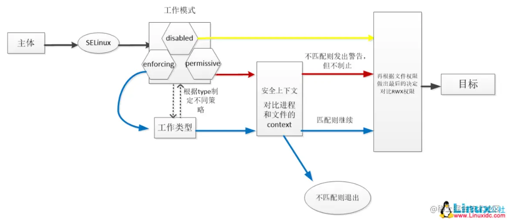
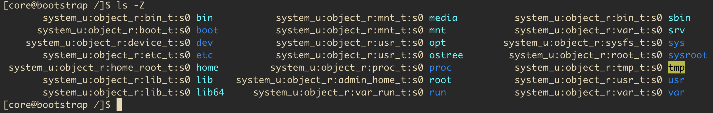
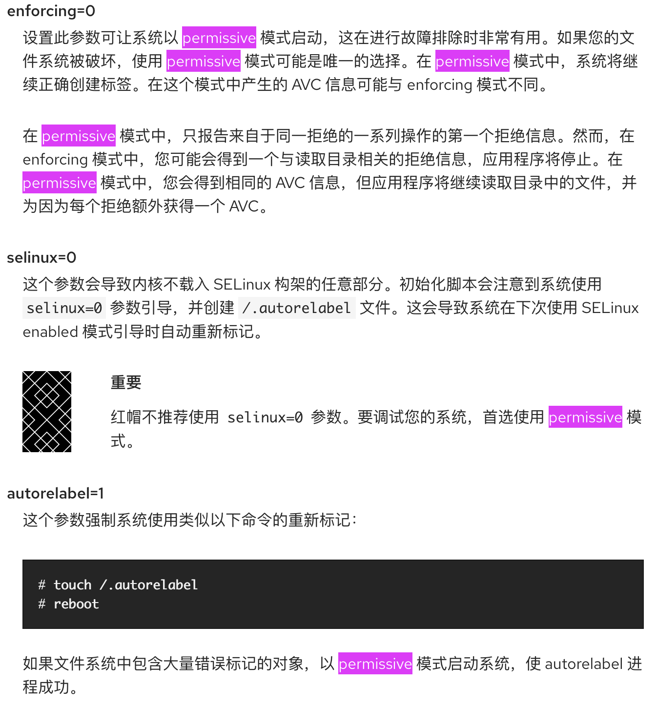
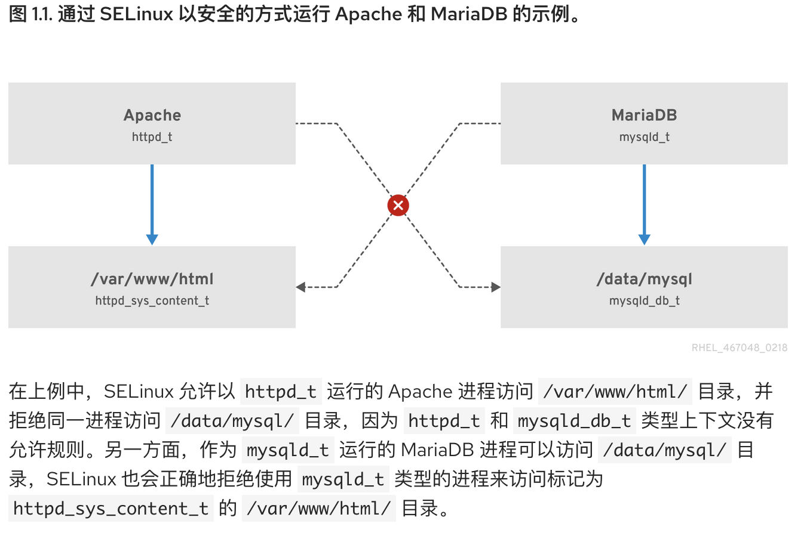
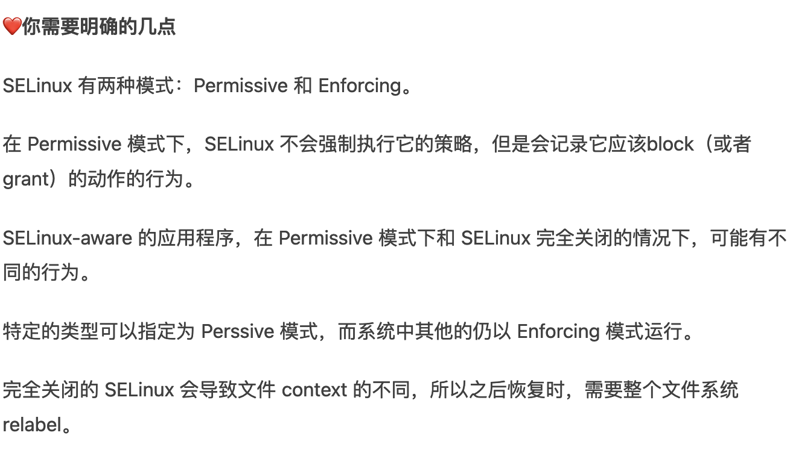

# selinux了解使用

关键字《selinux详解》

Linux SELinux详解！
https://juejin.cn/post/6999673674160668708




使用ls -Z查看文件上下文




使用id -Z查看用户上下文
使用ps -Z查看进程上下文
使用netstat -Z查看网络连接上下文

需要注意的是，如果系统已经在关闭 SELinux 的状态下运行了一段时间，在打开 SELinux 之后的第一次重启速度可能会比较慢。因为系统必须为磁盘中的文件创建安全上下文（我表示我重启了大约 10 分钟，还以为是死机了……）。

关键字《内核参数配置selinux=permissive》
redhat中selinux的用法文档（好）
https://access.redhat.com/documentation/zh-cn/red_hat_enterprise_linux/8/html/using_selinux/changing-selinux-states-and-modes_using-selinux
可以通过内核参数临时指定系统selinux配置

```
# 禁用selinux
selinux=0
# 配置permissive模式
enforcing=0
```


https://access.redhat.com/documentation/zh-cn/red_hat_enterprise_linux/8/html/using_selinux/changing-selinux-states-and-modes_using-selinux#changing-selinux-modes-at-boot-time_changing-selinux-states-and-modes



https://access.redhat.com/documentation/zh-cn/red_hat_enterprise_linux/8/html-single/using_selinux/index
使用selinux入门



https://www.jianshu.com/p/e1cbce500c20



## 参考文档

* [系统管理员的 SELinux 指南：这个大问题的 42 个答案](https://linux.cn/article-9906-1.html)
