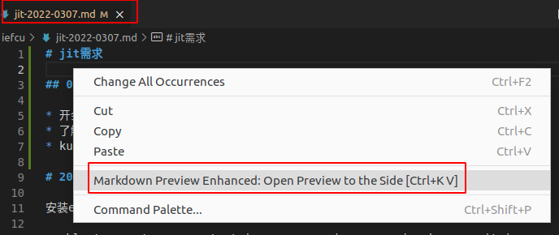
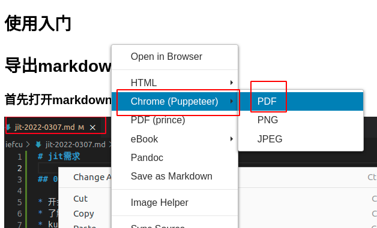

# vscode使用markdown说明

## 安装插件

* Markdown Preview Enhanced

预览mardown

* Paste Image

拷贝图片

## 使用入门

### 插入剪切板的图片

就是Paste Image这个插件实现的。
首先复制一个图片到剪切版，然后按Ctrl+Alt+v

最终这个插件就会将图片保存到当前文件的同一级目录下，并且生成markdown图片链接：
```bash

```

配置图片保存到固定目录
```
# 配置Paste Image: Path
${projectRoot}/imgs
```

### 导出markdown文档为pdf

#### 首先打开markdown预览页面

右键就可以打开预览页面


#### 然后再markdown预览页面导出为pdf

右键就可以转换为pdf文件


最后生成的pdf文件会保存到当前文件的同一级目录下

#### 安装使用plantuml

- 安装扩展: Markdown Preview Enhanced
- 然后安装: plantuml.jar
- 然后安装jre: `apt install openjdk-11-jre`, 否则会报错 ENOENT
